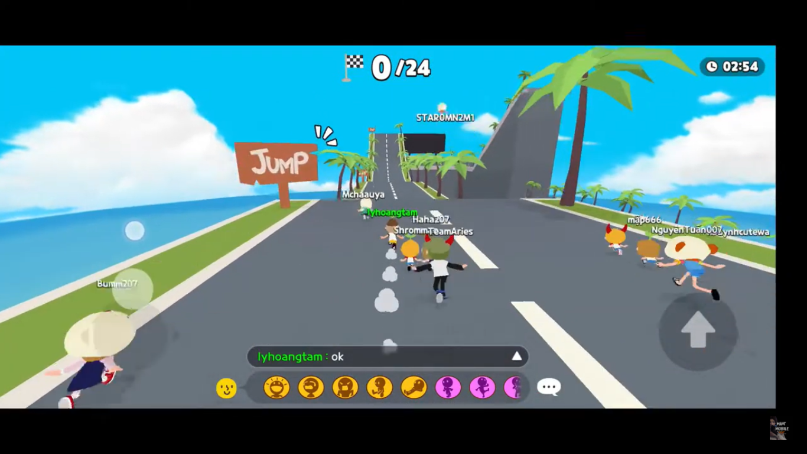
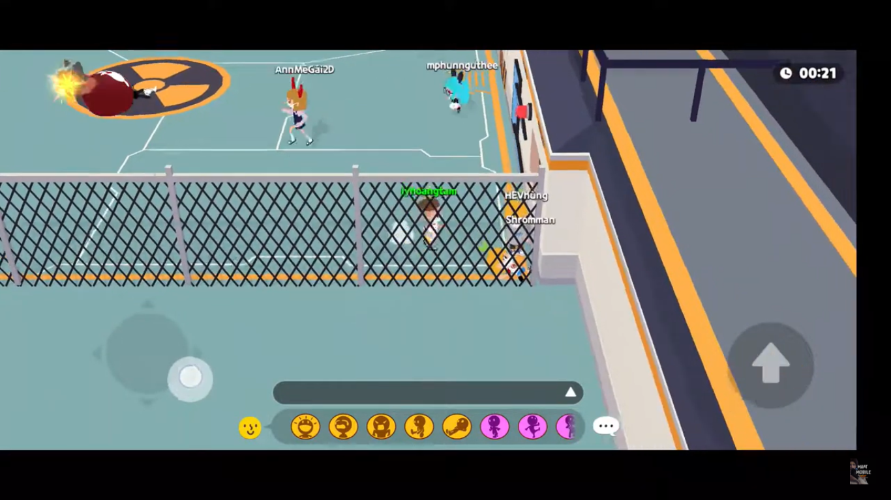
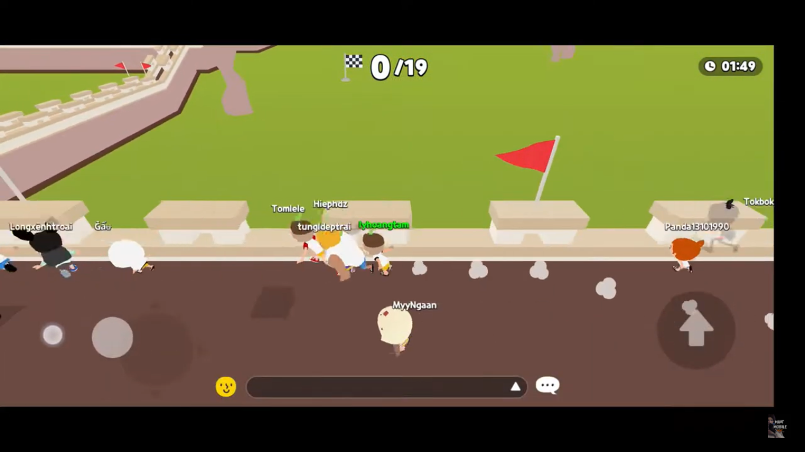
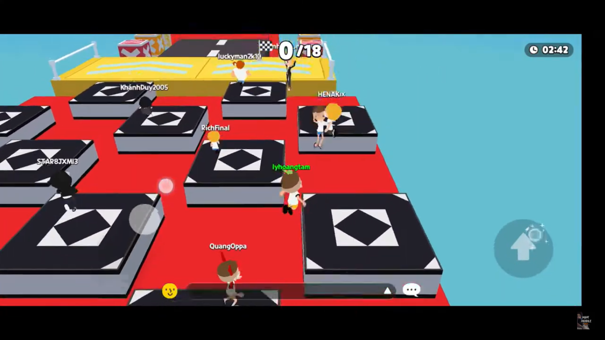
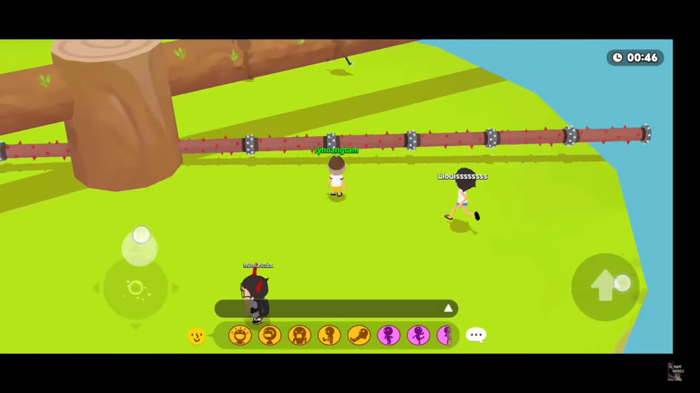
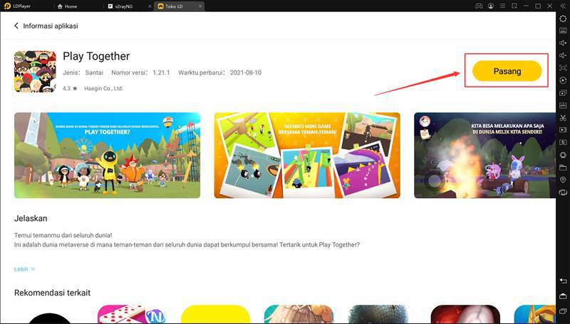

**Berkenalan dengan Game Party di Game Play Together**

Serunya bermain dengan banyak teman, tapi di pandemi begini sepertinya
cukup sulit dilakukan, ya? Eh, tapi, kamu masih bisa, *lho*, bermain
dengan banyak teman secara virtual di game Play Together, selain kamu
bercengkerama dengan banyak *player,* kamu juga bisa bersekolah,
bekerja, dan bermain. Nah, untuk bermain, developer Haegin Co., Ltd
sudah menyediakan Game Party di dalam game Play Together di mana kamu
akan bermain dengan banyak *player* lainnya. Kira-kira permainan seperti
apa yang bisa dimainkan secara beramai-ramai, ya?

Ternyata Game Party menganut sistem seperti permainan *battle royale* di
mana kamu harus berjuang menjadi yang paling lama bertahan di antara
pemain lainnya. Kalau kamu sudah pernah memainkan *Fall Guys : Ultimate
Knockout* kamu pasti sudah tidak asing lagi dengan permainan yang
disajikan di Game Party ini. Kali ini kami akan menjelaskan permainan di
Game Party dan panduannya.

**Mengenal Game Party**

Game Party merupakan *mini game tournament* di mana kamu harus menang
dari 29 pemain lainnya dan menjadi pemenang. Kamu bisa bergabung di Game
Party ini dengan cara mencari Game Center yang ada di Plaza atau bukalah
Phone milik avatar kamu dan klik Game Party.

Sebelum kamu membaca tips untuk memainkan permainan-permainan yang ada
di Game Party, sebaiknya kamu mengenali dulu permainan sekaligus
peraturan apa saja yang akan kamu hadapi nantinya bersama dengan 29
pemain lain tersebut. *Psst,* di sini kamu juga bisa dapat sedikit tips
di setiap permainannya, kok!

Tapi, apa saja yang menjadi peraturan di mini game ini, ya? Tidak
muluk-muluk, kok, peraturan dasar ini hanya patokan untuk menentukan
pemain yang bisa melanjutkan permainan dan menjadi pemenang utama. Dalam
permainan bertema racing, kamu hanya perlu mengikuti jalan dan menjadi
yang tercepat mencapai garis finish, untuk permainan dengan tema
obstacle racing, kamu hanya perlu menghindari rintangan dan menjadi yang
tercepat, terakhir tema survival mengharuskan kamu bertahan hidup sampai
waktu habis.

**1. Speed Racing**

Seperti lomba lari, kamu harus menjadi yang paling cepat untuk mencapai
garis finish. Selain kecepatan, kecekatan kamu untuk melompat di waktu
yang tepat juga dibutuhkan agar kamu terhindar dari rintangan yang bisa
membuat kamu kembali ke *checkpoint*. Permainan ini memiliki banyak
variasi seperti di gurun pasir dan awan. Jika kamu mendapat latar Speed
Racing di antara awan, kamu harus melompati awan itu agar kamu tidak
jatuh dan mengulang dari *checkpoint.*

{width="6.260416666666667in"
height="2.9166666666666665in"}

**2. Hot Potato**

Kamu pasti akan tertawa geli di permainan ini, bagaimana tidak, kamu
akan melihat 30 pemain berlari menghindari satu sama lain karena takut
mereka malah mendapat giliran menjadi pembawa bom. Kamu harus bisa
bertahan dengan cara menghindar atau mencari pemain lain secepat mungkin
ketika kamu melihat kepala avatar kamu berubah seperti bom yang ingin
meledak, kalau kamu gagal mencari pengganti pemegang bom, kamu akan
meledak dan gugur.

{width="6.260416666666667in"
height="2.9270833333333335in"}

Kalau kamu mencari tempat untuk menghindar dari pemegang bom, kamu bisa
berjalan mendekati pagar pembatas, tempat itu menjadi tempat favorit
para pemain karena jarang dijangkau oleh pemegang bom yang panik, tapi,
kamu jangan ikut panik ketika kamu terkena bom dari pemain lain, carilah
pemain yang berada di satu gerombolan, sebisa mungkin jangan mengejar
pemain yang berlari sendirian. Ketika panik pemain akan memilih untuk
berada di dalam gerombolan jadi manfaatkan, ya!

**3. Descend**

Kalau permainan lainnya melarang kamu untuk jatuh ke bawah, di pemainan
ini justru menuntut kamu untuk mencari lubang dan jatuh meninggalkan
pemain lainnya. Kamu dan pemain lainnya akan di tempatkan di sebuah
tempat seperti tower segi enam yang lantainya terpisah dengan jarak yang
kecil. Carilah lubang di antara lantai-lantai itu secepat mungkin dan
segeralah meloncat ke dalamnya ketika kamu menemukannya, kamu bisa
mengikuti segerombolan pemain agar kamu tidak ketinggalan mereka dan
kalah cepat. Lakukan hal itu berulang-ulang sampai kamu berada di lantai
paling bawah.

**4. Run the Wall**

Pernah dengar "Benteng Takeshi"? Permainan ini cukup mirip dengan
"Benteng Takeshi" tetapi lebih simple. Di sini kamu perlu berlari di
garis yang penuh dengan rintangan, usut punya usut, latar dan desain
yang ada terinspirasi dari Tembok Besar China, *lho.*

{width="6.239583333333333in"
height="2.9166666666666665in"}

Jika kamu menemukan panah merah dan panah biru kamu harus memilih dengan
seksama karena panah merah akan menambah kecepatan kamu sedangkan panah
biru akan melambatkan laju kamu. Jangan asal melompati rintangan ketika
kamu sulit melewatinya, ya!

**5. Obstacle Race 01**

Permainan yang satu ini cukup sulit untuk dilalui, jalanan yang sempit
membuat avatar kamu mudah terjatuh dan kembali ke *checkpoint*, ditambah
kamu juga berpacu dengan waktu dan kamu melihat sudah ada pemain lain
yang mencapai garis finish, tapi kamu jangan panik, santai dan tenang
menjadi kunci kamu agar bisa menaklukan rintangan ini. Kamu harus bisa
menahan keinginan untuk berlari dan kamu harus bisa memperkirakan jarak
ketika akan melompat dari *platform* satu ke yang lainnya agar kamu bisa
mencapai garis finish tepat pada waktunya.

{width="6.239583333333333in"
height="2.9270833333333335in"}

**6. Rotating Logs**

Sesuai dengan namanya, batang kayu yang berputar, kamu hanya perlu
menghindari putaran batang kayu yang ada di puncak bukit dan selamat
sampai akhir. Kamu akan menemui dua batang kayu yang berputar, kamu
harus menghindari batang kayu yang lebih kecil di bagian bawah karena
memiliki bagian yang tajam.

{width="6.239583333333333in"
height="2.9166666666666665in"}

Demi bertahan sampai akhir, kamu bisa berdiri dekat dengan batang kayu
yang besar dan mengikuti batang kayu kecil yang berduri, tenang dan
jangan terburu-buru, kamu tidak perlu berlari menghindar tapi ikutilah
arahnya.

**7. Wheel of Obstacle**

Melompat dan menghindari rintangan menjadi bagian utama di permainan
yang satu itu, kamu juga harus memastikan *platform* yang berputar itu
tidak terdapat tembok besar yang sulit dilewati karena kamu bisa
terjatuh dan gagal. Untuk bisa bertahan sampai akhir, kamu hanya perlu
berada terus di atas *platform* yang berputar, hindari rintangan yang
tidak bisa dilompati dan carilah *platform* lain yang tidak memiliki
rintangan tinggi tersebut, perlu diingat kalau setiap *platform*
memiliki arah putar yang berbeda jadi kamu harus ekstra hati-hati.

**Kesimpulan**

Setelah mengenal berbagai macam permainan yang disajikan di Game Party,
kamu jadi lebih siap untuk menjadi pemenang di mini game tersebut, kan?
Menjadi juara diperlukan pemahaman yang tinggi di setiap arena yang
dihadapi, untuk itu kamu harus mengenal dan memahami permainan yang ada
di Game Party ini. Kecepatan, kecekatan, dan juga kesabaran menjadi
kunci utama kamu untuk bisa melewati setiap tantangan yang ada. Perlu
diingat juga kalau game merupakan tempat di mana kamu bersenang-senang,
jadi jangan malah jadi stres karena tidak bisa menyelesaikan permainan
ini, ya! Selalu ada hari esok untuk mencoba jadi kamu tidak boleh
menyerah!

Kalau kamu ingin fasilitas yang memudahkan kamu untuk bermain mini game
di Play Together ini, kamu bisa pakai PC atau Laptop kamu, *lho*! Betul
sekali, kamu hanya perlu mengunduh emulator game android LDPlayer,
instalasinya juga mudah, kok, kamu bisa baca petunjuknya di halaman
berikut ini : <https://id.ldplayer.net/blog/210.html>. Di artikel itu,
kamu akan mendapat panduan lebih jauh tentang instalasi dan optimasi
game Play Together di LDPlayer. Selamat mencoba!

{width="6.5in"
height="3.704861111111111in"}
