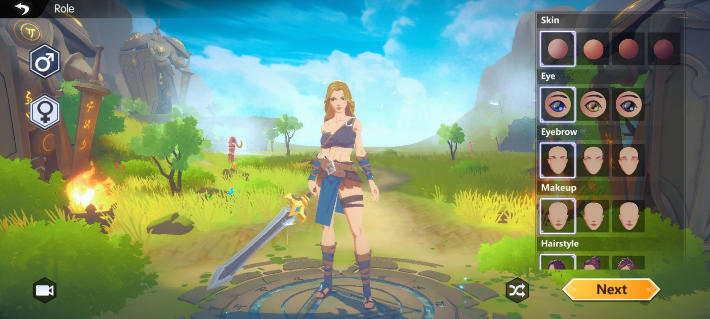
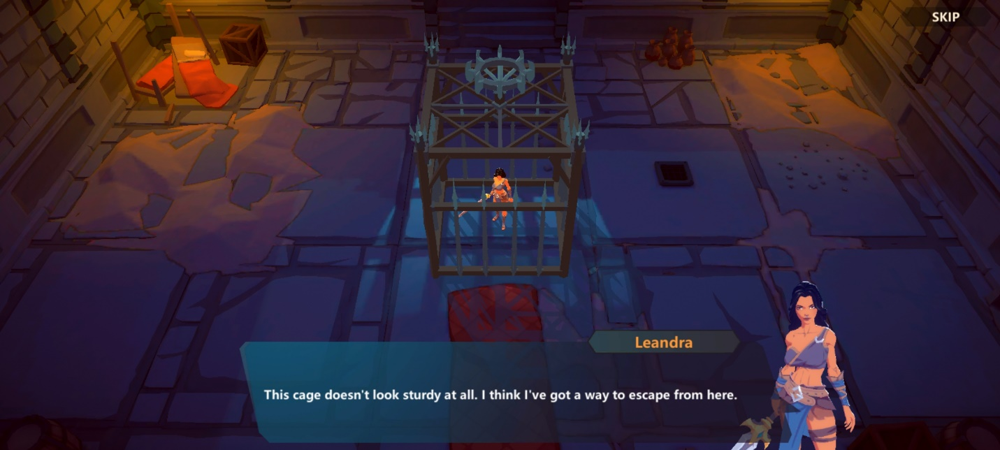
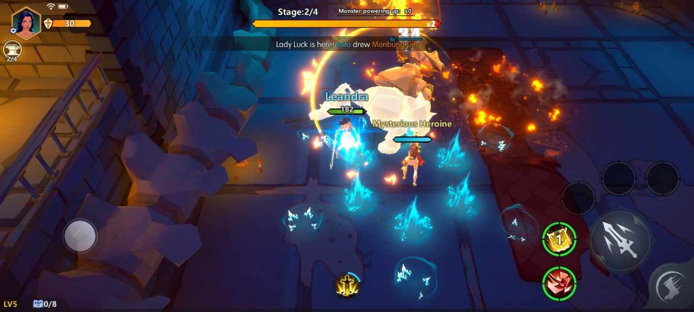
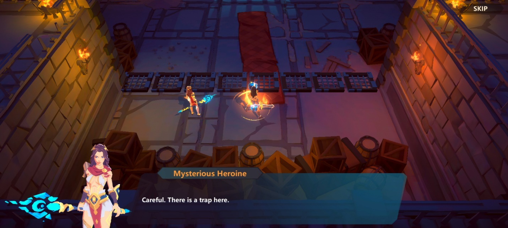
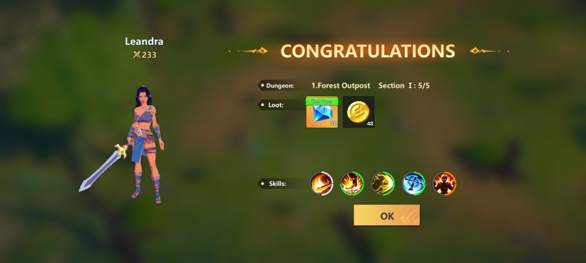
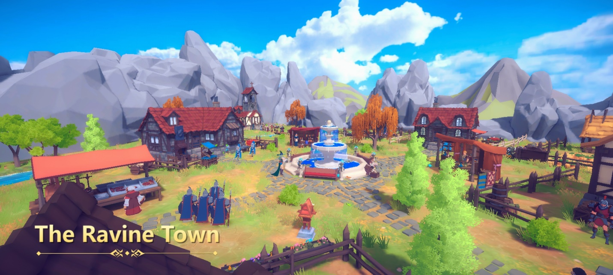
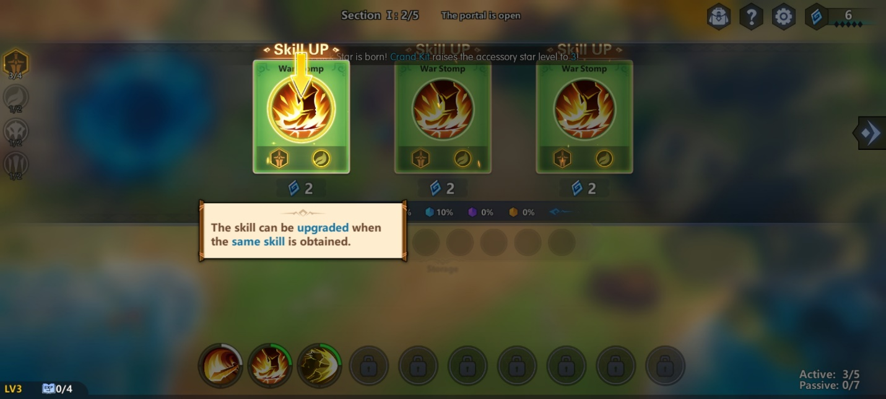
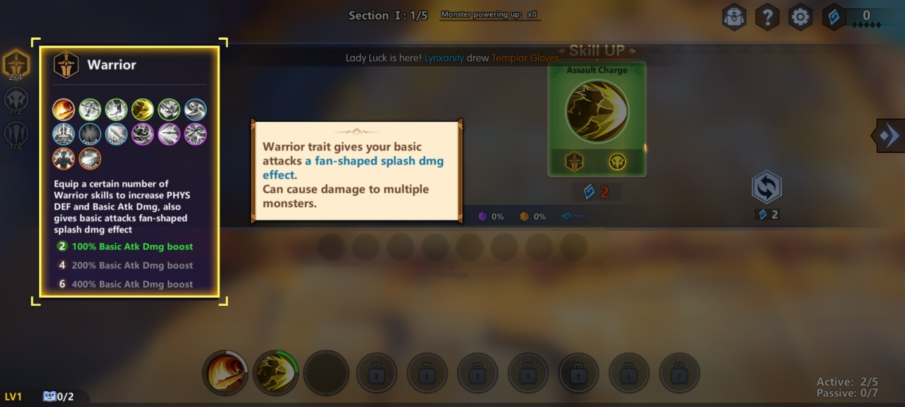
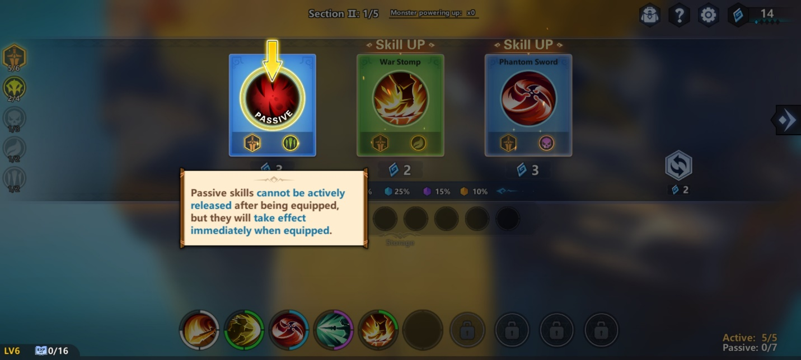

Intip Serunya Early Access Game Echoes of Magic

Halo sobat LDPlayer! Ada MMORPG seru lagi, nih. Kali ini game keren yang
bernama Echoes of Magic datang dari developer Onefun Games. Fase Early
Access game kece ini sudah dibuka sejak Februari tahun lalu, lho. Oh
iya, kamu juga bisa nih cek di Google Play Store, siapa tahu kamu masih
berkesempatan untuk mencoba Early Access tersebut.

Sesuai dengan statusnya yang masih Early Access, bisa jadi masih ada
sistem yang kurang stabil di dalam game. Meski begitu, tentu tidak ada
salahnya untuk mencari tahu isi dari game keren ini, ya kan? Iya dong.
Kalau begitu kita kulik bareng-bareng apa saja yang bisa kamu temui
nantinya di game MMORPG ini, yuk!

Kustomisasi Karakter

Pastinya pecinta MMORPG seperti kamu, sudah tidak asing lagi dengan fase
yang satu ini. Kustomisasi memang sangat menyenangkan karena kamu bisa
menuangkan sedikit kreativitas kamu ke dalam karakter tersebut.

Kustomisasi yang bisa kamu lakukan untuk karakter kamu adalah pemilihan
gender, warna kulit, warna mata, alis, makeup, gaya rambut, dan warna
rambut.

{width="6.5in"
height="2.925in"}

Nah, yang berbeda dari MMORPG lainnya, kamu tidak perlu memilih role
atau class untuk karakter kamu. Di dalam game nantinya, kamu bisa
memadukan skill-skill yang ada setiap kali kamu berhasil menghabisi
sekelompok musuh di sebuah stage.

Kisah ksatria yang terkurung

Di awal game, akan ada empat stage yang perlu kamu tuntaskan. Di stage
pertama, kamu akan mendapati karaktermu berada di dalam kurungan yang
terbuat dari kayu. Karakter kamu yang merasa kurungan tersebut mudah
dihancurkan akhirnya berhasil keluar dari kurungan tersebut. Setelah
itu, kamu akan secara otomatis mendapatkan dua skill pertama yakni,
Crystal Arrow dan Riptide Strike.

{width="6.5in"
height="2.925in"}

Setelah itu kamu diarahkan masuk ke dalam sebuah portal. Masuk ke stage
dua, karakter kamu yang baru keluar dari portal nantinya akan dikejutkan
oleh seorang hero misterius yang sedang bergulat dengan banyak musuh.
Kamu akan diberi arahan bagaimana cara menggunakan skillmu dan cara
mengalahkan monster besar yang memiliki ancang-ancang sebelum menyerang.
Hero misterius yang tadi kamu temui akan membantu kamu menyerang monster
tersebut. Kamu akan mendapatkan skill Lightning Field dan Dawn Shockwave
di stage ini.

{width="6.5in"
height="2.925in"}

Oh iya, kamu juga harus hati-hati dengan adanya jebakan-jebakan yang
tersebar di sekitar kamu di stage ke tiga, nih, tapi tenang saja, hero
misterius tadi akan mengajari kamu bagaimana caranya menghindari jebakan
tersebut. Tentunya setelah itu kamu akan berhadapan dengan musuh-musuh
yang harus kamu tumpas semuanya. Setelah selesai dengan musuh-musuh itu,
kamu akan mendapat skill baru yang bernama Meteor.

{width="6.5in"
height="2.925in"}Di stage terakhir, karakter kamu dan hero misterius
tersebut akan melawan seekor naga besar nan mengerikan. Tentunya di awal
game, naga mengerikan sekalipun tidak ada apa-apanya dibanding karakter
kamu yang super kuat. Setelah berhasil mengalahkan naga tersebut, kamu
akan mendapat banyak loot untuk bekal kamu ke depannya.

{width="6.5in"
height="2.925in"}

Gameplay super kece

Setelah ke empat stage tadi sudah kamu lewati, kamu akan langsung pindah
ke sebuah area, di sana kamu akan melawan para musuh sendirian masih
dengan bantuan sang hero misterius yang bernama Diana tersebut. Tidak
perlu khawatir, Diana akan memberi kamu tiga kristal yang bisa kamu
tukarkan dengan skill-skill keren.

Masih ingat, kan, kalau MMORPG ini sedikit berbeda? Apa bedanya? Kamu
tidak perlu susah-susah menentukan role apa yang cocok untuk karakter
kamu, kamu hanya perlu memilih skill yang kamu rasa cocok dan
memadukannya dengan skill yang lain. Setiap kali kamu menyelesaikan
sebuah stage, kamu akan diberi tiga pilihan skill yang bisa kamu tukar
dengan kristal yang kamu miliki.

Tentunya sebelum memilih skill, hal lain yang perlu kamu perhatikan
selain jumlah kristal kamu adalah kecocokannya dengan skill yang lain
dan juga gaya bermain kamu. Kalau kamu tidak menemukan skill yang cocok,
kamu bisa me-refresh dengan menggunakan dua kristal untuk mencari tipe
skill lain yang kamu rasa cocok.

Setelah kamu selesai dengan musuh-musuh di area tersebut, Diana akan
mengarahkan kamu untuk datang ke Ravine Town, setelah itu dia akan
berpamitan, meninggalkan kamu untuk berjuang melindungi desa itu dengan
tanganmu sendiri.

{width="6.5in"
height="2.925in"}

Memilih build sesuka hati

Nah, saatnya kita berkenalan dengan fitur yang membedakan Echoes of
Heroes dari MMORPG lainnya, nih. Kalau kamu pernah memainkan mini game
dari Mobile Legends yang bernama Magic Chess, tentu kamu akan merasa ada
sedikit kemiripan dari game ini dengan mini game tersebut. Kamu tidak
salah, sistem shop di Magic Chess dengan pemilihan skill di Echoes of
Heroes cukup mirip, ditambah lagi keduanya sama-sama menggunakan sistem
dua tipe kartu yang akan membentuk kartu lain yang lebih kuat.

{width="6.5in"
height="2.925in"}

Selebihnya, game ini tetap memiliki daya tariknya sendiri karena tidak
mematok kamu untuk fokus ke satu role saja. Dengan adanya pemilihan
skill, kamu bisa bebas untuk memilih role apapun yang kamu mau di setiap
stage. Build apapun yang kamu pilih juga akan tetap menguntungkan kamu
karena karakter kamu tetap menjadi yang super kuat.

{width="6.5in"
height="2.925in"}

Psst, kamu juga harus ingat bahwa nanti akan ada skill aktif dan pasif
yang masing-masing memiliki limit. Skill aktif hanya bisa kamu pick
sebanyak lima jenis dan skill pasif bisa kamu pick sampai tujuh jenis.
Jangan lupa perhatikan jumlah kristal kamu, ya! Hihihi.

{width="6.5in"
height="2.925in"}

Mainkan Echoes of Magic di PC

Bagi kamu-kamu yang mendapat kesempatan masuk ke dalam Early Access dari
game ini, bisa banget, nih, untuk mencoba memainkan game kece ini di PC
atau pun laptop kamu. Caranya gampang banget! Kamu hanya perlu
menginstall emulator game android LDPlayer ke PC atau laptop kamu, lalu
kamu tinggal download Echoes of Magic, deh! Gampang, kan? Iya, dong.
Tunggu apa lagi? Yuk, dicoba!

Kesimpulan

Kalau kamu bosan dengan MMORPG biasanya yang mengharuskan kamu memilih
salah satu dari banyak role yang tersedia, Echoes of Magic bisa menjadi
angin segar, nih, kamu tidak perlu memilih role karena kamu bisa
memadukan skill-skill yang kamu miliki. Skill tersebut juga bukan hal
yang mudah untuk didapatkan, kamu perlu bekerja keras dengan mengalahkan
banyak monster terlebih dahulu.

Dan lagi-lagi kamu diajarkan untuk tidak gegabah saat bermain MMORPG,
apalagi di game ini kamu memiliki kesempatan untuk melakukan refresh
saat memilih skill dan juga melakukan gacha. Terlepas dari itu, game ini
pastinya menjadi pengisi waktu luang yang apik. Kamu akan dimanjakan
dengan berbagai fasilitas dan hasil looting yang banyak. Seru banget,
kan? Langsung saja, deh, kamu rasakan serunya game ini dengan
player-player lain. Selamat bermain!
