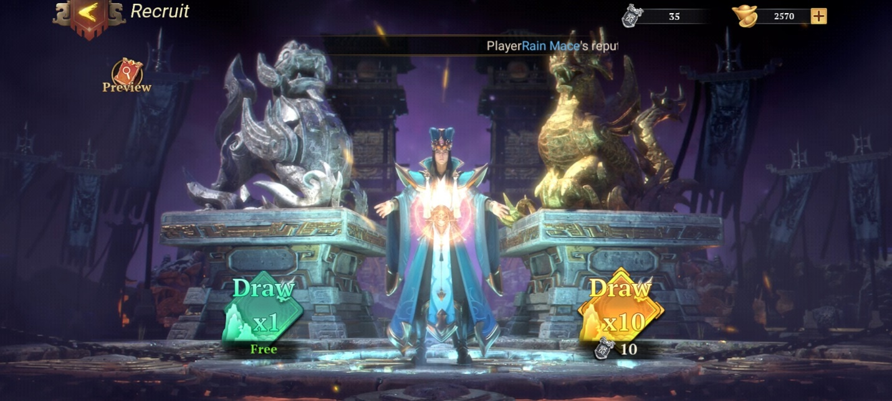

Main dan Rasakan Serunya Dynasty Origins : Conquest

Cihuy! Akhirnya game strategi seru yang sudah ditunggu-tunggu ini rilis
secara global! Kamu sudah download belum, nih? Game yang bernama Dynasty
Origins : Conquest ini telah rilis secara global pada tanggal 13
Desember kemarin dan berhasil menggaet lebih dari seratus ribu pengguna,
lho, yakin nih kamu rela ketinggalan serunya game epic ini?

Buat kamu yang pernah bermain game dari Sony Playstation 2 yang berjudul
Dynasty Warriors, tentu kamu tidak akan asing dengan namaa-nama karakter
yang ada di game ini seperti Lu Bu, Liu Bei, Cao Cao, maupun Zhao Yun.
Selain itu, gameplay dari game ini mirip dengan Lords Mobile di mana
kamu akan menyusun formasi pasukanmu sedemikian rupa untuk merebut
wilayah musuh dan memperbesar wilayah kekuasaanmu. Pastinya penasaran
fitur lain apa yang bisa kamu temukan di game keren ini, kan? Kalau
begitu langsung saja kita simak bareng-bareng tulisan di bawah ini, yuk!

Kerennya hero Dynasty Origins : Conquest

Di awal game nanti kamu akan bertemu dengan Liu Bei yang berusaha
membasmi para penghianat dan mengembalikan kekuasaan ke tangannya
dibantu beberapa pendekar lain seperti Shuijing, Zhu Rong, Huang
Yueying, dan Zhao Yun. Tentunya kamu sebagai player baru akan mendapat
starter team secara cuma-cuma yang terdiri dari Liu Bei, Shuijing, Zhu
Rong, dan Huang Yueying.

Class para hero

Sebelum terjun lebih dalam untuk mengenal para hero keren, ada baiknya
kamu pahami jenis-jenis class dari hero-hero tersebut, nih. Apa saja,
ya? Kita tengok, yuk!

1.  Paviser

Class yang satu ini mirip dengan role tank di mana statistik mereka akan
dominan berada di bagian DEF. Paviser juga memiliki shield untuk
melindungi class lain dan juga diri mereka sendiri. Hero-hero dengan
class Paviser memiliki postur badan besar dan beberapa di antara mereka
juga memiliki tameng besar sebagai pelindung.

{width="6.5in"
height="2.925in"}

2.  Infantry

Nah, kalau class ini tentunya akan mengingatkan kalian pada role
fighter, mereka akan menyerang formasi terdepan musuh untuk memudahkan
penyerangan ke formasi di belakangnya. Infantry juga akan memberi bonus
20% DMG saat mereka menyerang musuh bersamaan dengan hero berjenis melee
lainnya.

{width="6.5in"
height="2.925in"}

3.  Light Cavalry

Hero dengan pasukan berkuda ini mirip seperti role assassin, mereka akan
menyelinap ke formasi belakang musuh dan akan mendapat tambahan Crit
Rate sampai 40% saat mereka berhasil menyerang Archer atau Support.

{width="6.5in"
height="2.925in"}

4.  Heavy Cavalry

Class yang satu ini perlu kamu takuti karena Heavy Cavalry ini akan
memberi damage sebesar 400% ATK mereka saat pertama kali masuk ke dalam
arena pertempuran dan class ini akan mengabaikan DEF yang dimiliki
lawan. Sampai artikel ini dibuat, baru ada lima hero yang memiliki class
Heavy Cavalry dengan Lu Bu menjadi salah satunya dan merupakan
satu-satunya hero ber-tier SSR+.

{width="6.5in"
height="2.925in"}

5.  Archer

Mirip dengan role marksman, Archer memiliki kelebihan di mana semakin
jauh target mereka, semakin besar pula ATK yang akan mereka berikan,
setiap seratus jarak yang ada akan memberi tambahan 5% ATK dari class
yang didominasi hero perempuan ini.

{width="6.5in"
height="2.925in"}

6.  Adviser

Meskipun hanya support, Adviser ini lebih kuat dibanding role lain saat
mendapat serangan Spell dari Strategist karena Adviser akan mengurangi
damage yang didapat dari serangan tersebut hingga sebesar 30%.

{width="6.5in"
height="2.925in"}

Selain enam class di atas, ada satu jenis hero lain yang akan mengambil
andil dari luar arena pertempuran yaitu Strategist. Gaya serang mereka
akan seperti role mage di mana mereka mengandalkan serangan Spell
sepenuhnya dan bergantung pada Mana. Strategist juga punya fitur
tersendiri karena kamu hanya bisa menaikkan level dari skill-nya saja.
Oh iya, biasanya Strategist sangat cocok dipadukan dengan Archer yang
kamu miliki karena buff yang mereka berikan sangat menguntungkan class
tersebut.

{width="6.5in"
height="2.925in"}

Sistem gacha

Tentunya bagian yang tidak bisa lepas dari game RPG, apalagi kalau bukan
gacha. Di game ini, kamu akan menemui dua jenis gacha hero dan satu
jenis gacha relic. Untuk gacha hero ada standar gacha dan advance gacha,
sesuai namanya, hanya di advance gacha kamu bisa mendapati hero dengan
dua atau tiga bintang. Kalau kamu ingin melakukan sepuluh kali gacha
namun tidak memiliki bahannya, kamu bisa mengumpulkan Ingotmu sampai
berjumlah 2700 buah.

{width="6.5in"
height="2.925in"}{width="6.5in"
height="2.925in"}

Rekomendasi hero

Sebenarnya kamu tidak perlu terpaku dengan tier list, tapi jika kamu
ingin patokan untuk hero apa saja yang perlu kamu masukan ke dalam
formasi tim kamu, kamu bisa membaca daftar hero-hero kece yang bisa
menjadi carry untuk tim kamu.

1.  Lu Bu

Tentunya sebagai satu-satunya hero dengan tier SSR+, Lu Bu menjadi hero
yang sangat mengerikan bagi lawan. Apalagi Lu Bu merupakan hero dengan
class Heavy Cavalry yang tentunya membuat hero ini semakin menjadi mimpi
buruk bagi semua musuh kamu.

2.  Dian Wei

Paviser ber-tier SSR ini mampu menambahkan shield dan juga imun terhadap
serangan spell selama delapan detik. Ditambah, Dian Wei mampu melakukan
self-healing sebanyak 5% dari total HP miliknya setiap tiga detik selama
shield-nya masih ada.

3.  Zhao Yun

Sebagai prajurit terkuat dari Shu, Zhao Yun memiliki keahlian untuk
memberi damage yang besar ke banyak musuh di awal permainan, selain itu,
Zhao Yun akan memberi damage pierce kepada lawan yang terkena
serangannya tersebut. Psst, Zhao Yun bisa membasmi musuh di satu lane
yang sama hanya dengan sekali hempas, lho!

4.  Sun Shangxiang

Archer cantik yang satu ini mampu membasmi banyak musuh di setiap
serangannya. Sun Shangxiang juga akan melepaskan panah-panah berapi
selama 24 detik yang bisa menambahkan ATK dan mengurangi kecepatan
serang. Selain itu, Sun Shangxian akan mendapat damage ekstra untuk
lawan yang berada paling dekat dengannya.

Mengatur formasi di arena pertempuran

Sudah mengenal dan mengetahui cara merawat hero-hero keren kamu? Saatnya
kamu memasukkan mereka ke dalam formasi yang bisa kamu atur di dalam
Squad. Kalau kamu membuka fitur Squad tersebut, kamu bisa melihat ada 16
kolom kosong yang bisa kamu isi dengan hero-hero milik kamu. Eits, meski
ada 16, kamu hanya bisa mengisinya sampai 8 saja, lho. Kamu juga perlu
menaikkan level supaya bisa membuka setiap slot untuk hero-hero kamu.
Supaya tidak bingung, baca bahasan di bawah ini, ya!

Formasi yang direkomendasikan

Sangat direkomendasikan kamu membawa hero dengan class Paviser agar hero
kamu yang berada di baris belakang tidak cepat mendapat serangan dari
dekat apalagi hero tersebut merupakan Archer. Dari enam class, hanya
Light Cavarly dan Heavy Cavarly yang bisa bebas kamu letakkan di kolom
mana saja karena serangan mereka yang terbilang unexpected dan
universal.

{width="6.5in"
height="2.925in"}

Game ini sudah mengatur peletakkan tiap class sedemikian rupa agar kamu
tidak semena-mena seperti meletakkan Archer di bagian depan formasi dan
membiarkan mereka mati sia-sia.

Oh iya, kamu hanya bisa membawa satu Strategist ke dalam satu formasi,
jadi pilih Strategist andalan kamu untuk membantu tim kamu mengalahkan
para musuh.

Kombinasi hero

Cara kerja fitur yang satu ini mirip dengan sinergi. Jika kamu tipe
pemain yang mengandalkan buff, kamu bisa fokus dengan kombinasi hero
tertentu agar mendapat banyak buff. Di early-game, Liu Bei dan Huang
Yueying menjadi kunci dari terbukanya setiap kombinasi hero tersebut.

{width="6.5in"
height="2.925in"}

Ingot hunting

Layaknya gems di game RPG, Ingot menjadi item yang sangat penting agar
kamu bisa mendapatkan hero-hero incaran kamu di gacha. Selain itu, kamu
bisa memakai Ingot untuk membeli item-item penting seperti shard hero.
Ingot bisa kamu dapatkan saat kamu melawan player lain di fitur Arena
PvP, semakin tinggi peringkat kamu, semakin banyak Ingot yang bisa kamu
dapatkan.

Rangking player juga akan memberi kamu banyak Ingot setiap kali ada
player yang berhasil mencetak rekor di bagian tertentu dalam game. Kalau
kamu ingin yang instan, kamu bisa melakukan top-up dan melepas title F2P
player kamu.

{width="6.5in"
height="2.925in"}

Tapi, apa ada cara lain untuk mendapatkan Ingot secara cuma-cuma? Tentu
ada, kamu bisa menyelesaikan stage-stage di Main Campaign ataupun
Battle, pastinya semakin banyak yang tuntas, semakin banyak Ingot yang
datang, hihihi.

Eits, tunggu dulu, kamu masih bisa, nih, menggunakan jurus lain untuk
mendapatkan Ingot yaitu, dengan gift code! Penasaran, kan? Yuk,
cepat-cepat kamu copy dan paste kode-kode di bawah ini demi Ingot yang
berlimpah!

-   doccommunity

-   docfbcode

-   welcomedoc

-   docrelease

-   feedbackdoc

-   fbgroupdoc

-   discordcode

-   

Mainkan Dynasty Origins : Conquest di PC

Biar makin seru, kamu bisa banget, nih, install emulator game android
LDPlayer di PC atau laptop kamu, habis itu kamu download, deh, game
Dynasty Origins : Conquest yang super kece badai ini. Dijamin pengalaman
kamu dalam membasmi penghianat di dalam game makin seru dan
menyenangkan!

Kesimpulan

Game yang menganut sistem strategi ini pastinya tidak akan mudah untuk
kamu pahami tanpa mengikuti tutorial, jika asal bermain, bisa-bisa kamu
bisa terus menelan kekalahan. Untuk itu, yang namanya strategi perlu
dilakukan secara matang dan kamu perlu kesabaran ekstra dalam
melakukannya. Apalagi di game ini ada sistem gacha, kalau kamu gegabah,
kamu akan mudah kecewa karena tidak mendapatkan hasil yang diinginkan.

Secara keseluruhan, game ini sudah sangat bagus dan mampu bersaing
dengan game strategi lainnya. Kalau kamu angkatan lama yang sering main
di rental PS2, game ini tentu bisa mengangkat memori untuk bernostalgia
saat bermain Dynasty Warriors bersama teman-teman dulu. Sistem gacha
relic pun tidak mengecewakan karena kamu akan selalu mendapat relic
bagus tiap kali melakukan lima kali gacha. So, tunggu apa lagi, sob?
Langsung saja, yuk, mainkan Dynasty Origins : Conquest dan rasakan
keseruannya! Selamat bermain!
