Main dan Rasakan Serunya Game Sprite Fantasia di PC Kamu

Halo sobat LDPlayer! Kamu pecinta MMORPG pastinya sedang riang gembira
karena banyaknya game-game bergenre tersebut hadir dan siap kamu
mainkan. Ditambah lagi, kami akan membahas satu game imut nan
menggemaskan berjudul Sprite Fantasia di mana tentunya kamu akan
berperan sebagai pahlawan dan menolong karakter lainnya yang sedang
berada dalam kesulitan.

Game buatan developer X-Legend Entertainment ini menyajikan suasana
MMORPG yang baru dan lain dari biasanya. Sprite Fantasia disajikan
dengan pembawaan cerita yang humoris dan sangat ekspresif. Dari segi
grafik pun, game ini bisa dibilang setara dengan The Legend of
Neverland, maka tak heran kalau Sprite Fantasia yang dirilis pada 18
Oktober kemarin ini berhasil menggaet lebih dari 500 ribu pengguna.
Ingin tahu apa saja yang bisa kamu lakukan di game ini? Kita intip
sama-sama, yuk!

Proses sebelum masuk ke dalam game

Sudah download dan install, saatnya bermain! Eits, tunggu dulu, kamu
harus melewati beberapa proses sebelum masuk ke permainan seperti
memilih server, login dengan akun kamu, dan lain sebagainya. Apa saja
ya? Lihat bacaan di bawah ini, yuk!

Memilih role dan rekomendasi untuk pemula

Seperti biasa, sebelum masuk ke dalam permainan, kamu akan diminta
memilih salah satu role favorit yang akan menjadi karakter utama dari
akun milik kamu. Nantinya, kamu bisa memilih antara role Warrior, Mage,
Archer, dan Priest. Mari kita bahas ke empat role tersebut satu persatu.

1.  Warrior

Role gagah yang satu ini tentu jadi rekomendasi untuk kamu yang masih
pemula dalam hal bermain game MMORPG. Mengandalkan defense dan attack
yang besar, role ini cocok untuk kamu yang senang menyerang musuh tanpa
babibu. Role ini memiliki tiga skill dan satu basic attack di mana gaya
serang charging lebih mendominasi. Selain itu, ada dua tipe advance
class yang di miliki role ini yaitu, Paladin dan Berserker. Perbedaan di
antara keduanya adalah Paladin berfokus pada defense dan recovery
sedangkan Berserker berfokus pada attack dengan mengabaikan defense.

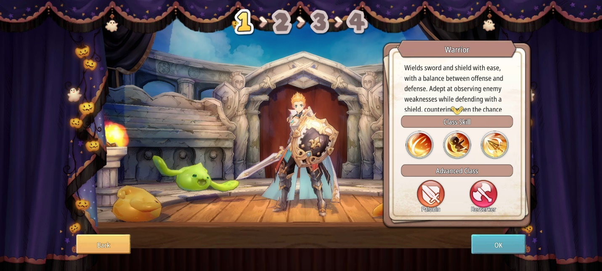{width="6.5in"
height="2.925in"}

2.  Mage

Pengendali kekuatan sihir ini bisa menyerang musuh di satu area
sekaligus. Jarak serang yang luas membuatnya menjadi penyerang belakang
yang ditakuti para musuh, tentunya cocok untuk kamu yang penyabar dan
cerdik melihat segala kemungkinan. Sebagai role mage, karaktermu yang
satu ini akan memiliki skill dengan dominasi jarak serang berupa area.
Advanced class dari mage ini terdiri dari Wizard dan Necromancer. Wizard
akan dengan cepat mengumpulkan power dan melepaskan kekuatan sihir yang
kuat, sedangkan Necromancer yang sesuai dengan namanya, ia bisa
memanggil dan membangkitkan mahluk yang sudah mati untuk membantu di
dalam pertarungan.

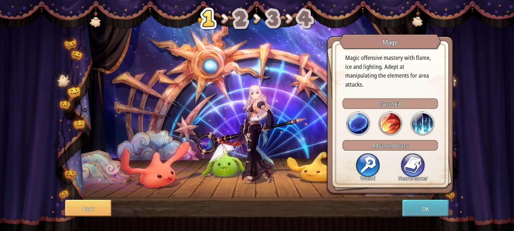{width="6.5in"
height="2.925in"}

3.  Archer

Si pemanah ulung ini memiliki sejuta taktik untuk melancarkan
serangannya terhadap musuh, medan pertarungan seperti apapun akan mudah
ditakluki oleh Archer ini. Skill dari archer ini memiliki area serang
yang didominasi oleh straight line alias garis lurus. Kalau kamu pecinta
karakter dengan serangan yang cepat, Archer bisa menjadi role yang cocok
untuk kamu. Archer juga memiliki advanced class berupa Ranger dan
Assassin. Ranger akan menjadikan Archer sebagai tactical master untuk
bahan peledak, racun, dan asap, sedangkan Assassin memiliki keahlian
untuk mengendap-endap, menunggu musuh dengan sabar dan menyerang saat
mendapat kesempatan.

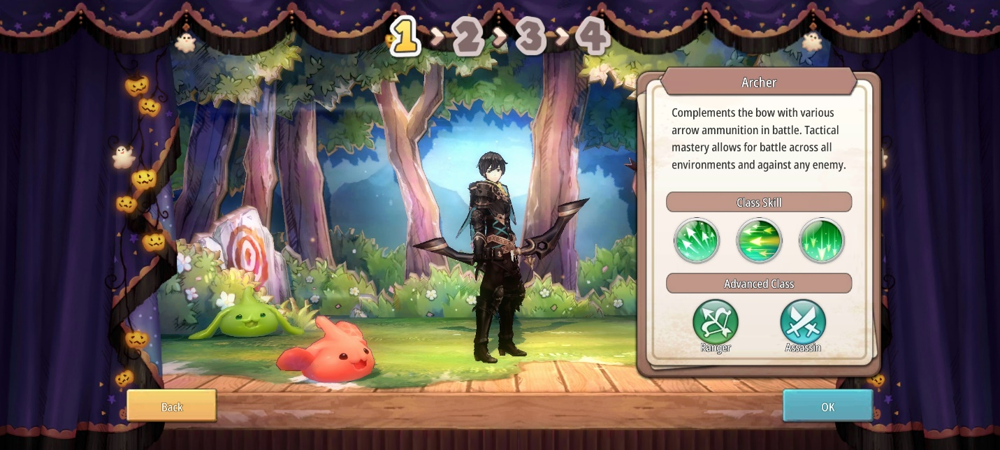{width="6.5in"
height="2.925in"}

4.  Priest

Sebagai support, Priest mengharuskan kamu melindungi party dengan
memberi mereka berbagai buff dan juga heal, selain itu kamu juga harus
membantu menghabisi para musuh. Role ini tidak bisa digunakan sembarang
orang karena kalau kamu tidak cekatan dan tidak perhatian terhadap
karakter kamu apalagi party kamu, bisa-bisa bukannya menjadi support,
kamu malah menjadi beban di game ini. Priest memiliki area serang yang
didominasi oleh buff yang mengelilingi karakter kamu. Advanced class
dari Priest sendiri terdiri dari Cleric dan Sage. Jika Cleric lebih
berfokus pada penambahan mana yang cepat, maka Sage berfokus pada
penambahan power untuk menyerang musuh.

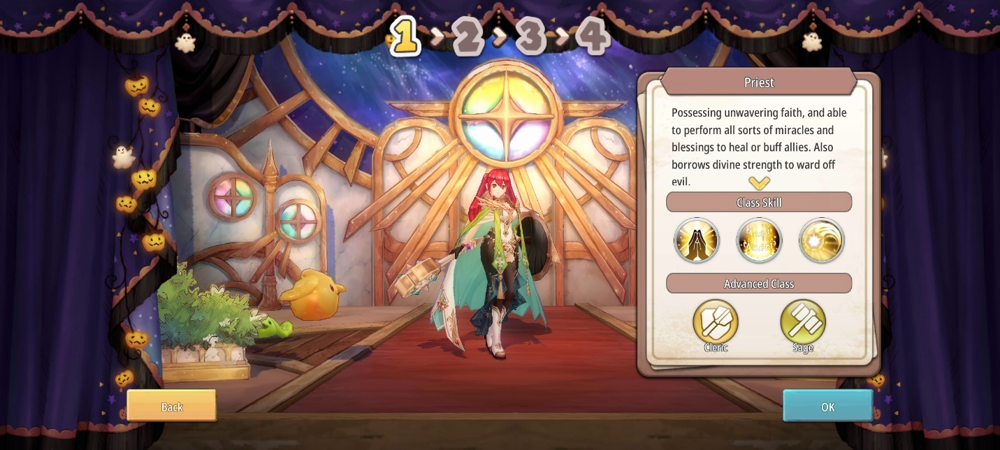{width="6.5in"
height="2.925in"}

Kustomisasi karakter

Setelah kamu selesai memilih role kesukaan kamu, saatnya proses
mendandani mereka untuk menjadi lebih kece. Psst, karakter kamu tidak
gender-locked, loh, jadi kamu bisa memilih ingin menjadikan karaktermu
sebagai laki-laki ataupun perempuan. Nantinya kamu bisa mengubah rambut,
warna rambut, mata, dan warna iris mata karaktermu.

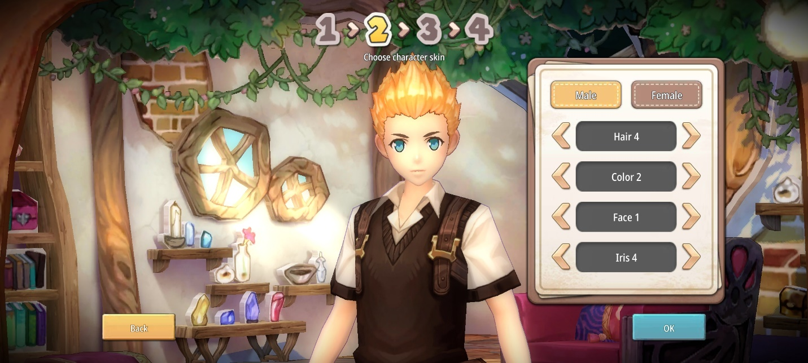{width="6.5in"
height="2.925in"}

Kustomisasi sprite

Kamu nantinya akan ditemani oleh mahluk kecil bernama sprite yang
tentunya bisa kamu beri nama sesuai dengan selera kamu. Selain itu, kamu
bisa memilih bentuk, warna, bahkan wajah dari sprite imut milikmu
tersebut. Kombinasikan semua sampai kamu puas karena bahan kustomisasi
tersebut gratis alias tidak perlu pakai alat bayar apapun.

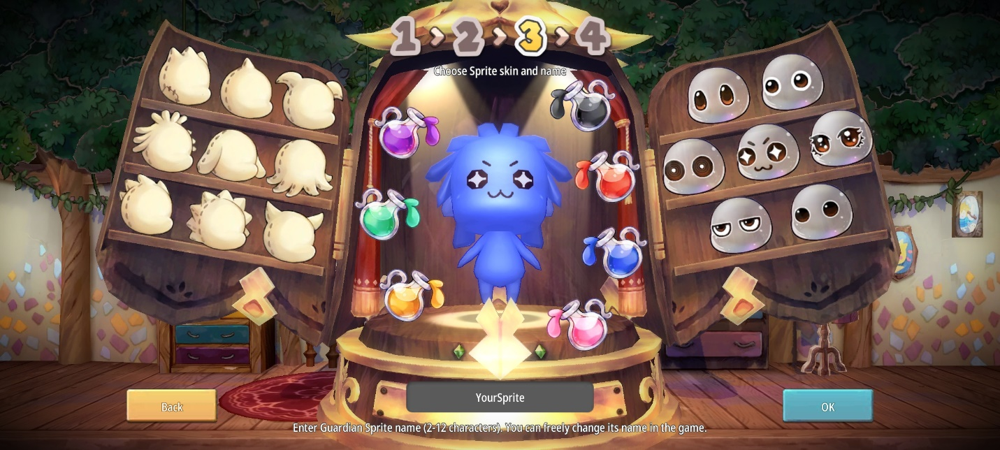{width="6.5in"
height="2.925in"}

Pemilihan aksesoris kepala

Yang terakhir, kamu akan disuruh memilih aksesoris kepala untuk karakter
kamu dan juga sprite imut kamu. Meski pada akhirnya karakter kamu nanti
bisa mendapat aksesoris kepala selama permainan dan tentu saja
menggantikan aksesoris awal yang kamu pilih.

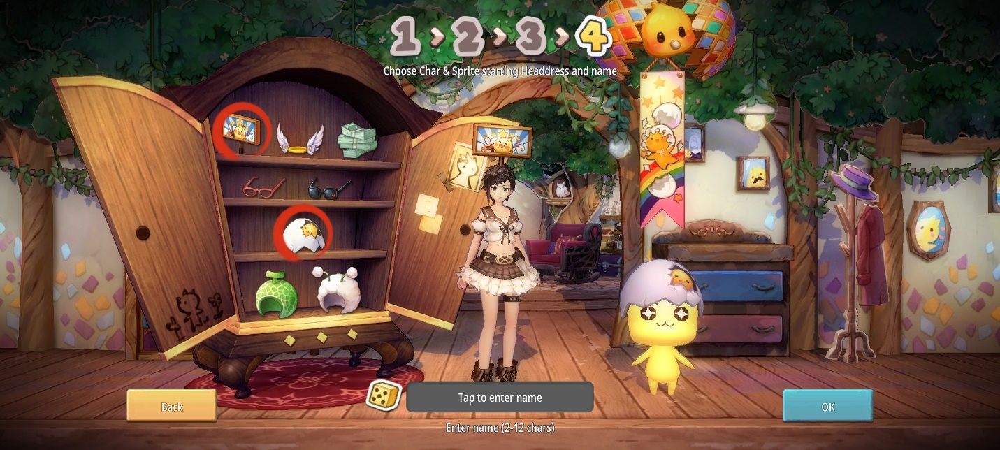{width="6.5in"
height="2.925in"}

Menjalankan quest

Bagian penting dari setiap game bergenre RPG ini selalu berada di bagian
kiri layar. Sebagai pahlawan, tentu saja karakter kamu akan diminta
melakukan ini itu dengan berbagai rewards sebagai imbalannya. Dengan
sistem auto, kamu bisa dengan cepat menyelesaikan quest yang datang
bertubi-tubi tersebut.

Di antara quest, nantinya akan ada cut-scene di mana karakter kamu
berdialog dengan karakter NPC lain ataupun dengan spritenya sendiri.
Tentunya hal ini bisa dibilang baru di dalam dunia MMORPG yang bisa
menyegarkan mata kamu karena dialog yang lucu dan karakter yang
ekspresif.

Akan ada sebuah quest yang akan memberikan kamu mount atau hewan
tunggangan yang bentuknya lucu dan menggemaskan, quest apa itu? Temukan
jawabannya di game ini, ya!

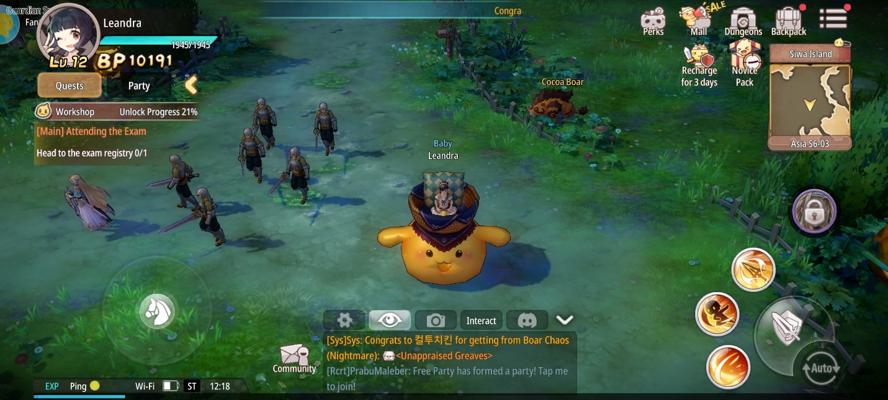{width="6.5in"
height="2.925in"}

Gacha

Wah, MMORPG pakai gacha! Pastinya kamu jadi makin penasaran, kan? Di
sini kamu bisa melakukan gacha kartu sebagai support dari karakter kamu
dan juga gacha outfit. Kartu support yang bernama Guardian Sprite ini
bisa kamu pakai sebagai pengganti skill ultimate dan juga membantu kamu
di arena pertarungan.

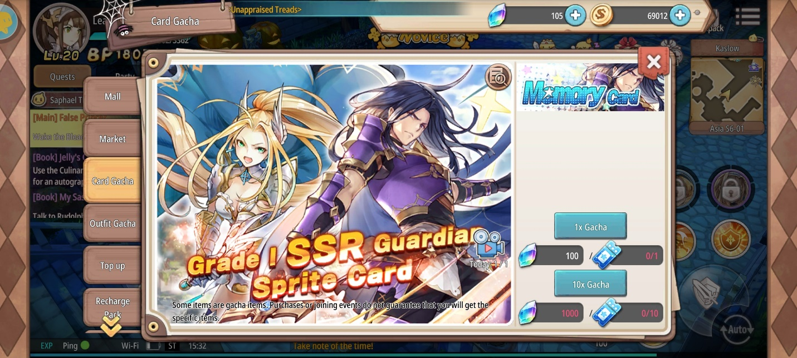{width="6.5in"
height="2.925in"}

Gacha outfit sesuai namanya akan memberi kamu aksesoris seperti senjata
maupun aksesoris tambahan lain seperti sayap, tentunya agar karakter
kamu semakin keren dan gagah, kamu bisa melakukan gacha di outfit gacha
ini.

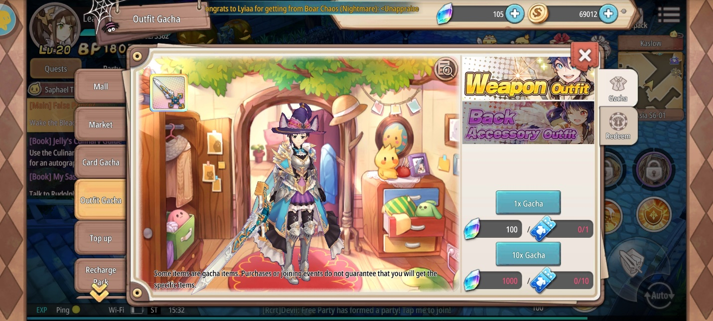{width="6.5in"
height="2.925in"}

Mainkan Sprite Fantasia di PC kamu

Kalau kamu ingin bermain game seru ini di layar yang lebih besar, kamu
bisa, loh, menginstall LDPlayer di PC atau laptop kamu dan unduh game
ini. Pasti pengalaman bermain kamu main seru dan menyenangkan, deh.

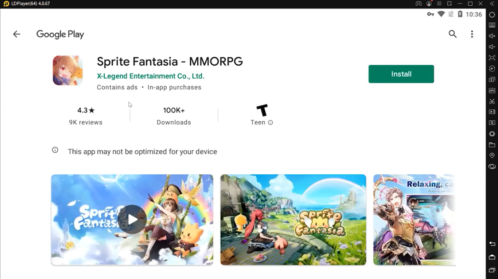{width="6.5in"
height="3.654166666666667in"}

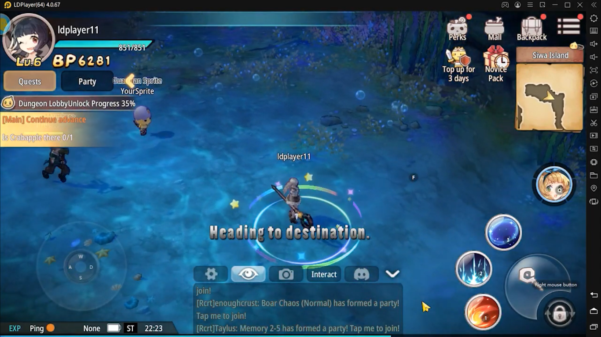{width="6.5in"
height="3.654166666666667in"}

Kesimpulan

Dengan hadirnya banyak game bergenre MMORPG di dua bulan belakangan ini
tentunya jadi surga tersendiri bagi kamu para gamer pecinta MMORPG.
Sprite Fantasia sendiri berusaha untuk tidak menjadi game MMORPG
kebanyakan dengan menambahkan beberapa elemen baru seperti bumbu humor
di dalam narasi dan juga ekspresi-ekspresi lucu yang muncul di dalam
cerita maupun ketika sedang bertarung.

Oh iya, supaya pengalaman seru dari Sprite Fantasia ini menjadi semakin
seru dan mengasyikan, kamu bisa mengunduh game ini di PC atau laptop
kamu dengan menginstall emulator game android LDPlayer, dijamin suasana
dan efek yang menyenangkan dari game ini akan semakin besar dan kamu
semakin senang ketika bermain. Jadi, jangan sampai ketinggalan serunya
game ini, ya! Selamat bermain!
