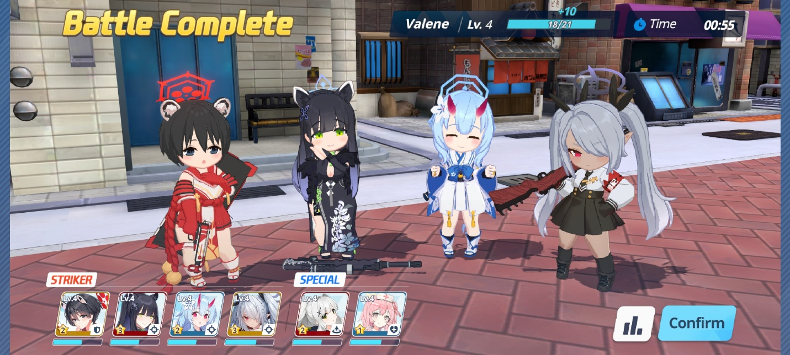
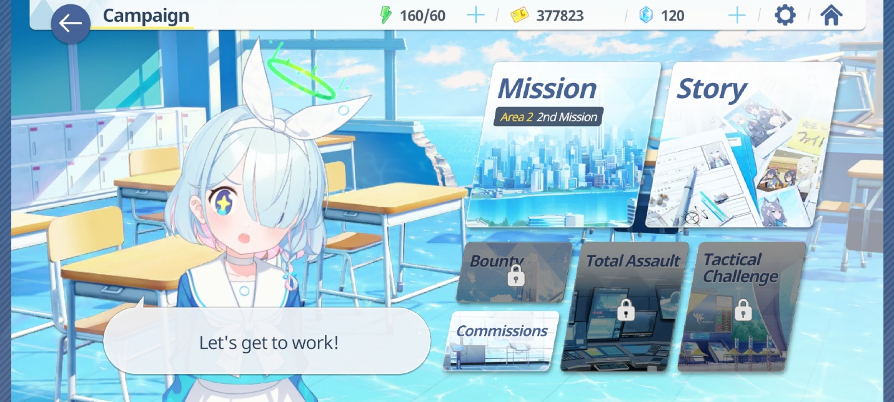
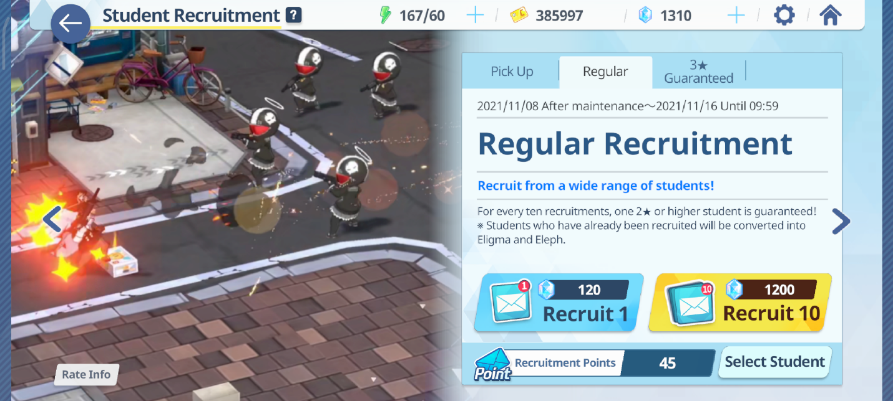
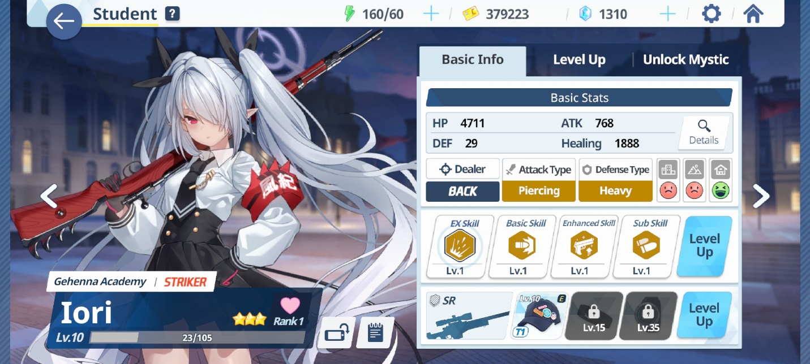
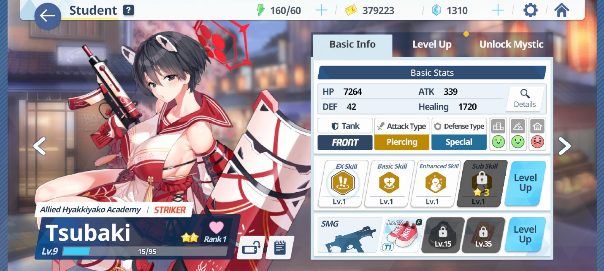
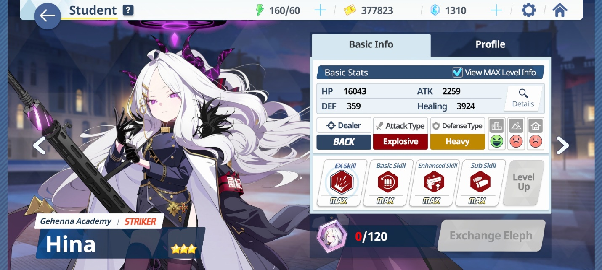
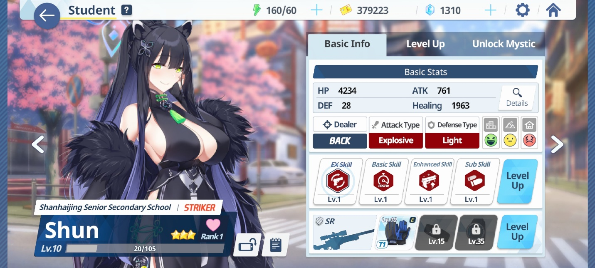
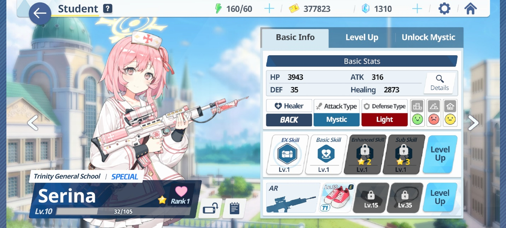
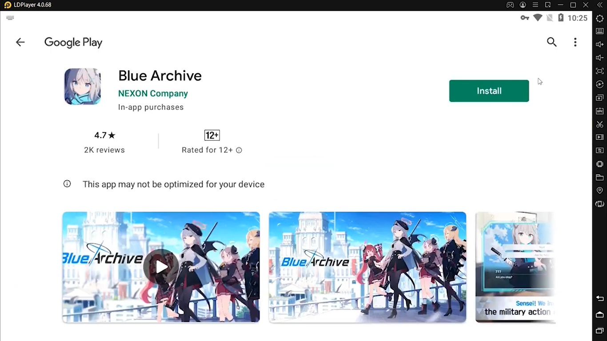
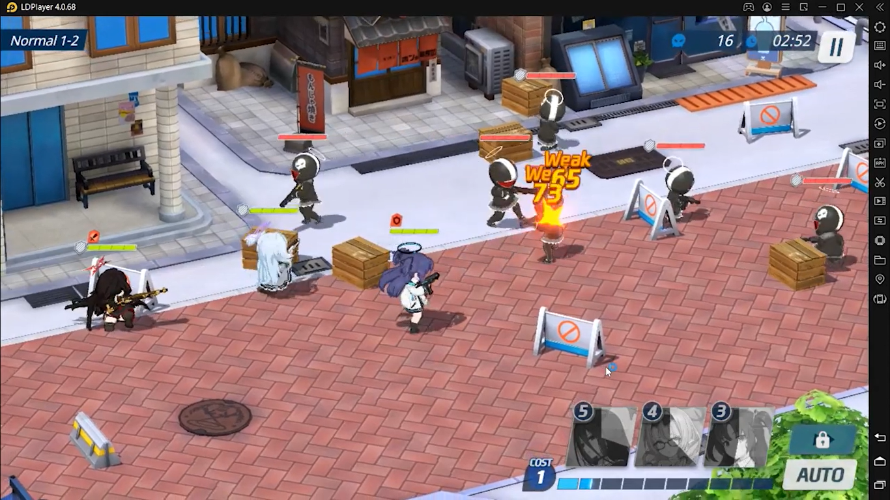

Mainkan Blue Archive di PC : Mengenal Banyak Waifu dan Panduan Reroll

Halo sobat LDPlayer! Game penuh waifu cantik datang lagi, nih. Kali ini
giliran Blue Archive yang memberi kamu bahan untuk cuci mata dengan
melihat para waifu cantik yang siap membantu kamu melawan para musuh.
Setelah sukses di versi bahasa Jepang dan bahasa Korea, akhirnya game
ini pun melebarkan sayapnya ke bahasa Inggris untuk menggaet lebih
banyak pemain. Seperti game RPG penuh waifu lainnya, kamu selaku player
akan menjadi pemimpin yang akan dipanggil Sensei alias guru dan kamu
juga yang mengontrol mereka saat berada di battlefield.

Blue Archive merupakan game buatan developer Nexon yang juga menjadi
publisher bersamaan dengan Yostar Limited. Game ini dirilis secara
global pada 8 November kemarin. Di dalam game ini kamu akan mendapati
waifu-waifu kesayanganmu dalam bentuk chibi yang imut berperang melawan
para musuh. Tentunya untuk mendapatkan para waifu cantik tersebut, kamu
perlu melakukan recruit dengan gacha, ingin tahu waifu mana saja yang
harus kamu miliki? Kita cari tahu, yuk!

Gameplay

{width="6.5in"
height="2.925in"}

Sebelum mengenali para waifu yang ada, kamu akan masuk ke dalam tutorial
skipable di mana Rin sebagai ketua osis mengenali kamu pada anggota
lain. Sebagai Sensei, kamu berperan menjadi pemberi arahan pada waifu
yang berperang di dalam battlefield. Sama seperti Girl Cafe Gun, kamu
juga akan mendapati sudut pandang top-down di game ini. Perbedaannya
adalah waifu kamu akan bergerak otomatis dan kamu hanya perlu memilih
skill dari waifu mana yang ingin kamu hempaskan terhadap lawan. Jika
kamu ingin lebih santai, kamu bisa menyalakan sistem auto dan jika
energi tim kamu sudah terkumpul, maka waifu kamu yang berada di giliran
pertama akan mengeluarkan skill-nya secara otomatis.

Jika kamu memperhatikan tutorial, Rin akan memberitahu kamu kalau waifu
kamu akan otomatis mengambil posisi di belakang cover yang tersedia
untuk menghindari serangan dari musuh. Tapi perlu diingat bahwa ada
beberapa waifu yang tidak akan mengambil cover maka dari itu rawatlah
waifu kesayangan kamu agar mereka tidak mudah mati di dalam battle
field.

Tipe Misi

Misi yang kamu bisa jalankan juga bermacam-macam, ada misi biasa dan ada
juga story. Di misi biasa kamu akan mendapatkan sub dari misi utama yang
sudah kamu jalankan dan akan hilang otomatis setelah kamu selesai
menjalankan misi tersebut. Sedangkan di misi story nanti kamu akan
mendapati main story, sub story, dan juga replay yang menampung setiap
relationship dan task story yang sudah kamu jalankan sebelumnya. Ke
depannya akan event story yang tentu sesuai namanya hanya bisa kamu
jalankan di waktu-waktu tertentu.

{width="6.5in"
height="2.925in"}

Selain dua tipe misi di atas, masih ada misi-misi lain yang akan terbuka
seiring kamu menjalankan banyak stage yang tersedia. Misi lain yang akan
terbuka tersebut bisa memberi kamu bahan-bahan penting untuk menaikkan
statistik dari para waifu milikmu seperti bahan untuk menaikkan level
dari skill mereka.

Gacha dan Reroll

Tentunya bagian yang kamu tunggu-tunggu, tidak lain dan tidak bukan
yaitu, gacha. Tempat di mana kamu bisa mendapatkan para waifu cantik
yang akan menjadi bagian dari tim kamu ini mengharuskan kamu memiliki
alat pembayaran berupa gem yang dinamakan Pyroxene. Pastikan kamu
memiliki Pyroxene berjumlah minimal 1200 buah untuk melakukan sepuluh
kali penarikan gacha.

{width="6.5in"
height="2.925in"}

Saat tutorial, kamu bisa melakukan sepuluh kali gacha secara cuma-cuma.
Namun yang perlu diperhatikan, di game ini kamu hanya punya satu kali
kesempatan mendapat gratis sepuluh kali gacha tersebut dan game ini
tidak menyediakan reroll. Tapi tidak perlu gundah gulana, kamu bisa
mengakalinya dengan masuk menggunakan guest account lalu ikuti
tutorialnya sampai ke gacha gratis tersebut. Jika kamu tidak mendapat
karakter yang kamu inginkan, kamu bisa melakukan uninstall dan unduh
kembali dan kamu otomatis masuk ke guest account yang baru. Ulangi cara
tersebut sampai kamu mendapat karakter yang kamu inginkan.

Rekomendasi waifu

Seperti yang kita ketahui, para waifu yang bisa kamu miliki akan
memiliki bintang untuk menandai kualitas mereka. Bintang tertinggi di
game ini berjumlah tiga bintang, meski begitu, belum tentu waifu
berbintang tiga otomatis menjadi lebih berguna dibanding waifu
berbintang dua maupun satu karena tentu ada beberapa waifu bintang tiga
yang statistiknya justru berada di bawah waifu berbintang dua seperti
Izumi yang dikatakan sebagai waifu bintang tiga terburuk saat ini.

Kalau kamu bukan penganut waifu lebih penting daripada meta dan kamu
bingung waifu mana yang akan kamu masukkan ke dalam tim kamu, kamu bisa
banget baca rekomendasi waifu di bawah ini, nih,

-   Iori

{width="6.5in"
height="2.925in"}

Memiliki range attack yang luas, waifu yang satu ini cocok untuk kamu
bawa di area dengan sedikit cover agar tidak terlalu menghalangi peluru
kencangnya. Selain kuat di dalam PvE, sebagai damage dealer, Iori juga
overpower di dalam PvP. Bahkan skill ultimate Iori bisa membunuh boss
dalam tiga kali tembakan. Untuk itu, bukan hal yang berlebihan jika Iori
termasuk ke dalam waifu dengan tier S.

-   Tsubaki

{width="6.5in"
height="2.925in"}

Sebagai waifu tank berbintang dua, Tsubaki tidak kalah kerennya dengan
waifu yang lain. Bukan hanya bisa melindungi waifu satu timnya, waifu
yang satu ini bahkan bisa melakukan self-healing di saat terdesak. Wuih,
kurang keren apalagi, ya kan? Tak heran, jika waifu tebal ini termasuk
ke dalam tier S.

-   Hina

{width="6.5in"
height="2.925in"}

Digadang-gadang sebagai DPS terbaik di game ini, Hina merupakan waifu
dengan range luas yang tentunya bisa membantu kamu dan tim kamu menumpas
seluruh musuh dengan ledakan senjatanya yang kuat. Otomatis Hina menjadi
waifu yang wajib kamu masukkan ke dalam tim, jika kamu beruntung
mendapatkan dia.

-   Shun

{width="6.5in"
height="2.925in"}

Onee-san yang satu ini bisa membantu kamu di arena PvP karena masa cool
down dari skill-nya yang singkat serta kemampuannya untuk melakukan
self-buff. Shun juga memiliki jarak serang yang luas, hal wajar yang
dimiliki demolisher. Poin plus lainnya adalah suara dari Shun yang
menyejukkan hati, hihihi.

-   Serina

{width="6.5in"
height="2.925in"}

Jangan meremehkan waifu berbintang satu yang kamu dapatkan. Waifu healer
seperti Serina memiliki statistik apik yang tentunya bisa sangat
membantu kamu dan tim kamu di dalam battlefield. Skill ultimate dari
Serina bisa memindahkan posisi waifu di dalam battlefield ke posisi yang
diinginkan dan menaikkan HPnya.

Mainkan Blue Archive di PC

Ingin menikmati keimutan para waifu di layar yang lebih besar dari
android kamu? Kamu bisa lho mengunduh Blue Archive lewat emulator game
android LDPlayer di PC atau laptop kamu. Dengan begitu, keimutan waifu
kesayangan kamu akan semakin terpampang nyata dan kamu bisa merasakan
sensasi bermain yang lebih menyenangkan.

{width="6.5in"
height="3.654166666666667in"}

{width="6.5in"
height="3.654166666666667in"}

Kesimpulan

Adanya tier list untuk para waifu bukan berarti waifu lain yang tidak
disebutkan namanya tidak bagus. Tier list hadir untuk kamu yang bingung
memilih waifu untuk dimasukkan ke dalam tim kamu. Bahkan Izumi yang
dikatakan sebagai waifu bintang tiga terburuk pun bisa menjadi waifu
tier A bagi beberapa pemain sesuai preferensi masing-masing.

Game ini terbukti bisa meningkatkan serotonin bagi kamu yang menyukai
hal-hal imut dan menggemaskan, bentuk chibi 3D para waifu ini bisa
memanjakan mata kamu. Selain itu, jalan cerita yang disajikan juga tak
kalah lucu dan menarik, pastinya akan sayang sekali jika kamu
ketinggalan serunya game RPG yang satu ini. Tunggu apalagi? Ayo, mainkan
Blue Archive dan rasakan serunya berperang bersama waifu kesayangan
kamu!
