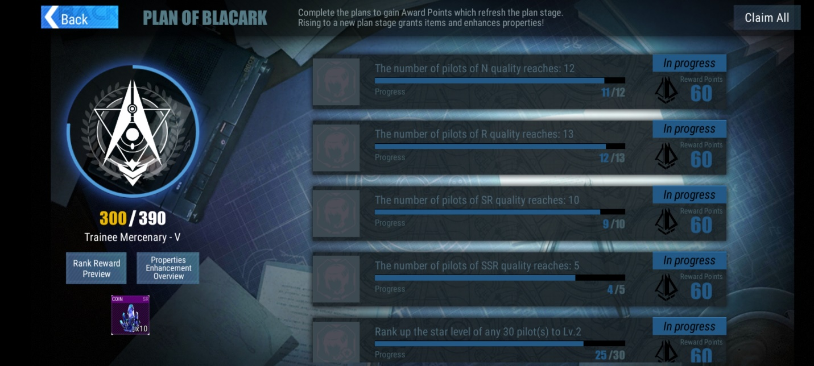
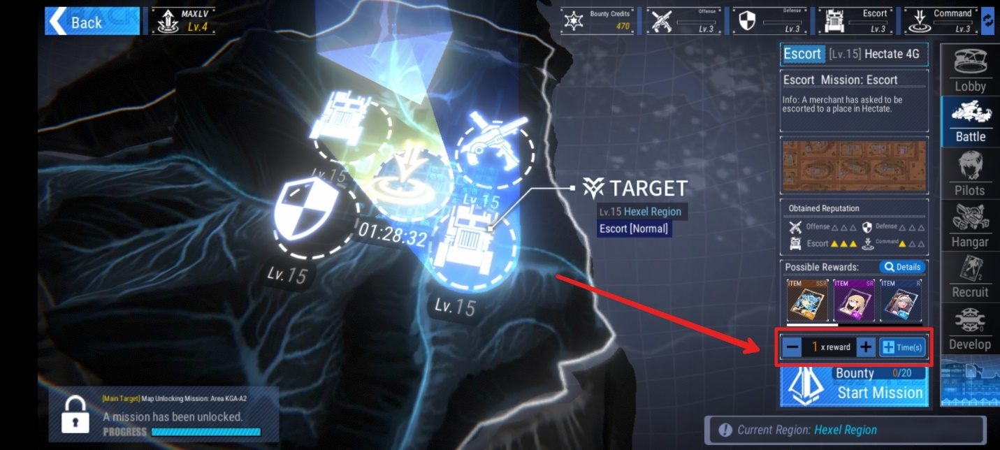
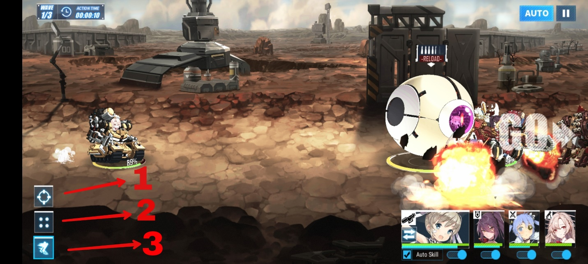
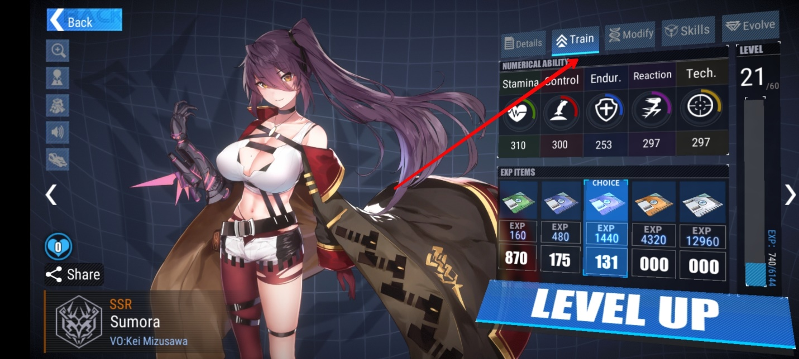
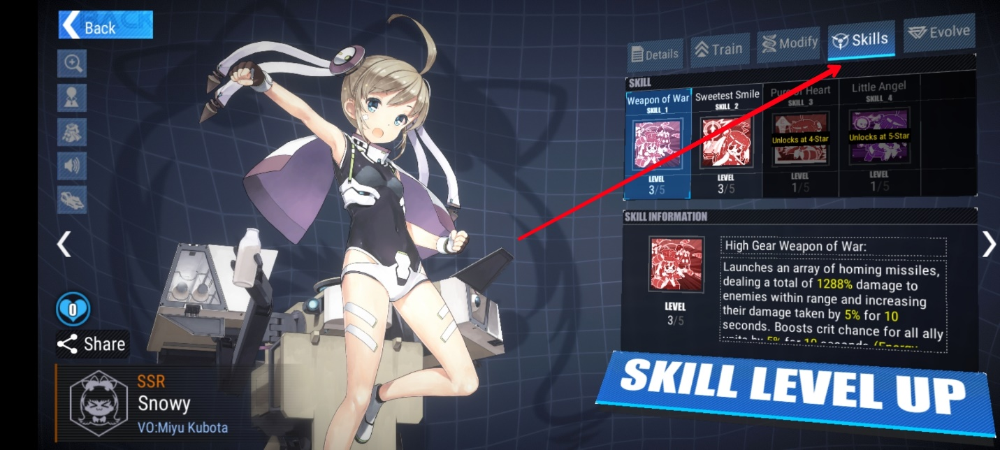
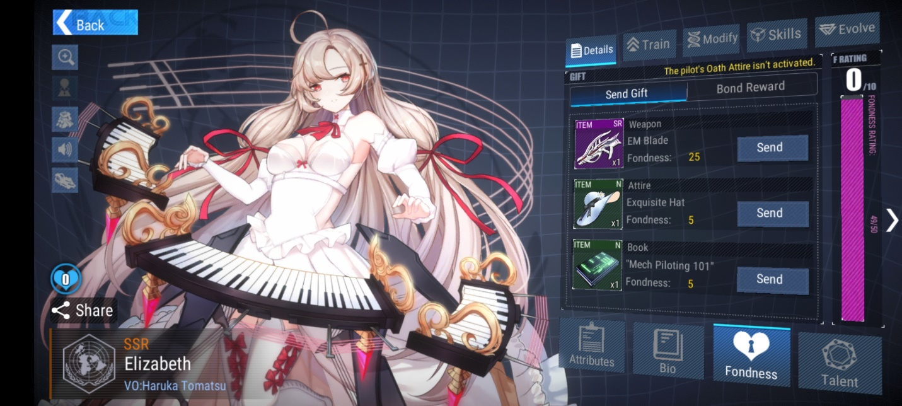
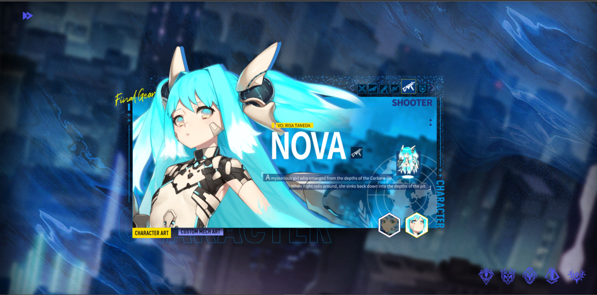
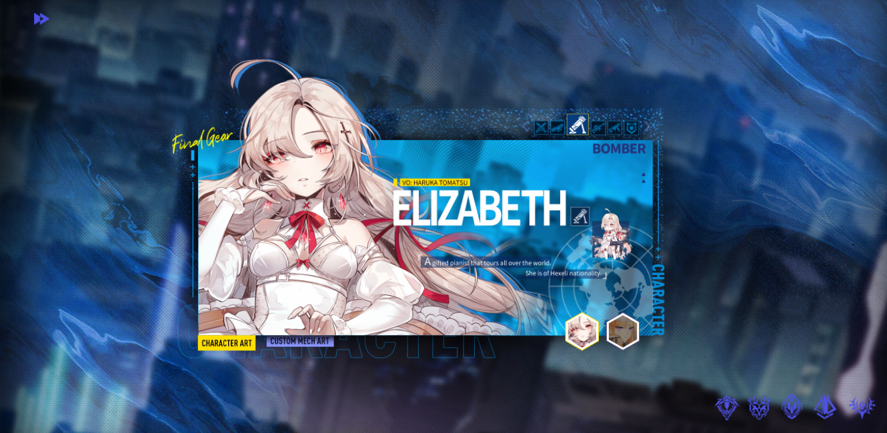
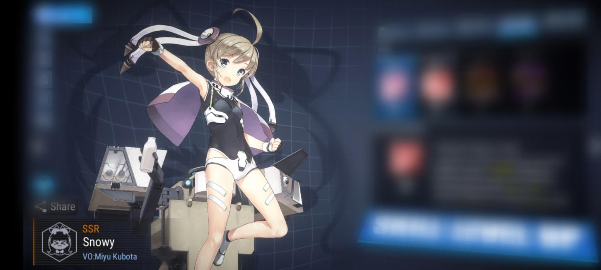
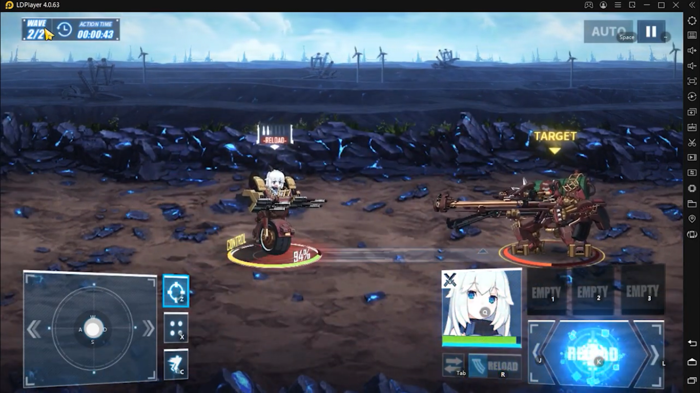

Mainkan Final Gear di PC : Panduan Bermain dan Rekomendasi Waifu Ciamik
untuk Tim Kamu

Wah, makin banyak saja game yang mengandalkan kekuatan para waifu untuk
menyelamatkan dunia. Kali ini giliran game buatan developer Komoe Game
yakni, Final Gear untuk unjuk gigi di depan para gamer. Game yang
menganut aliran Mecha dan Waifu ini dirilis pada tanggal 30 September
kemarin. Dengan genre RPG, tentunya popularitas game ini bergerak cepat,
hal ini bisa dilihat dari jumlah pengguna yang mengunduh game ini, sudah
sampai seratus ribu lebih! Keren banget, kan?

Kalau kamu bagian dari pecinta para waifu di game ini, kami punya
hal-hal menarik yang akan dibahas di artikel ini, nih. Mulai dari
panduan untuk kamu yang baru saja mulai memainkan game ini atau kamu
yang memang masih sangat baru dalam hal bermain game RPG, sampai
rekomendasi waifu alias pilot yang gokil powernya untuk melibas para
musuh. Penasaran? Harus dong. Kalau begitu, langsung saja simak bacaan
di bawah ini, yuk!

Panduan bermain Final Gear

Kamu para pemula pasti ingin cepat-cepat menjadi pro, kan? Dengan rajin
bermain dan juga membaca guide atau panduan, pastinya kamu bisa menjadi
pro dalam waktu singkat. Kira-kira hal penting apa saja yang perlu kamu
ketahui untuk menjadi pro dan tidak kesulitan di early-game? Langsung
saja kita check it out bacaan di bawah ini.

Mengumpulkan crystal demi waifu idaman

Menjadi alat tukar utama untuk melakukan gacha, crystal wajib kamu
tabung demi mendapatkan waifu yang kamu idamkan maupun membeli set gear
untuk mendandani mecha dari waifu kamu tersebut agar semakin sangar di
dalam battlefield. Kamu bisa mendapat crystal dengan rajin menjalankan
story atau menyelesaikan misi yang ada di Blacark, di sana kamu bisa
mendapat banyak crystal dengan jumlah yang bisa bikin kamu tersenyum
senang.

{width="6.5in"
height="2.925in"}

Gacha bisa sangat adiktif, maka dari itu usahakan kamu tidak kalap saat
gacha agar kamu terhindar dari penyesalan karena kamu kehabisan crystal
yang seharusnya bisa kamu gunakan untuk membeli set gear atau hal
penting lainnya.

Farming waifu lewat bounty

Kamu sudah tahu kalau waifu SSR Viorate bisa kamu farm lewat misi bounty
yang ada di battle? Sekarang kamu tahu. Bounty ini bisa kamu lakukan
untuk menaikkan level mercenary kamu dan mendapat banyak reward lainnya.
Dalam sehari, kamu diberi kesempatan melakukan 20 kali bounty.

{width="6.25in"
height="2.925in"}

Pastinya 20 kali melakukan hal yang sama bisa bikin kamu bosan. Untuk
itu kamu bisa langsung mengubah kesempatan bounty kamu tersebut menjadi
stack reward yang kamu dapat di satu stage bounty. Dengan begitu kamu
bisa langsung mendapat reward yang berlipat-lipat dalam sekali libas
musuh di satu stage.

Formasi di dalam battlefield

Seperti halnya bermain sepak bola, di battlefield ini juga empat mecha
dan waifu kamu akan membentuk suatu formasi yang bisa kamu atur dengan
mengeklik salah satu dari tiga tipe formasi yang ada di bagian kiri
bawah layar saat sedang berada di battlefield.

Tiga tipe tersebut terdiri dari tipe satu di mana mecha yang membawa
waifu kamu akan bergerak bebas memilih lawan mana yang akan mereka libas
terlebih dahulu, tipe dua akan membuat mecha berisi waifu tersebut
membentuk formasi yang berdekatan sehingga mereka akan saling
melindungi, dan tipe ke tiga akan membuat tim kamu membentuk barisan
dengan tujuan mempercepat perlawanan.

{width="6.239583333333333in"
height="2.925in"}

Mengatur formasi sangat penting kalau kamu membawa waifu dengan tipe
seperti bomber karena bomber akan selalu berada di baris paling belakang
tim kamu. Meski di paling belakang, posisi ini justru paling fatal jika
ada musuh yang terjun langsung di depan bomber kamu, apalagi bomber
butuh waktu untuk melepaskan bomnya ke lawan. Kalau kamu khawatir akan
kesehatan waifu bomber kamu, kamu bisa pilih tipe dua, di jamin waifu
kamu akan saling melindungi satu sama lain.

Kamu bisa juga membawa Snowy ke dalam battlefield, jika Snowy milik kamu
sudah mendapat set custom mech-nya, enam peluru Snowy akan berkeliling
mencari keberadaan musuh, dengan begitu Snowy secara tidak langsung akan
melindungi waifu kamu yang lainnya.

Merawat waifu kesayangan kamu

Pastinya kamu sudah tahu betapa pentingnya merawat waifu-waifu yang
sudah membantu kamu menyelesaikan banyak stage atau bahkan sampai mati
di dalam battlefield. Jasa-jasa mereka tersebut bisa kamu bayar dengan
cara menaikkan level dan skill dari waifu kamu dan memberi mereka set
gear yang mantap supaya mereka semakin kuat di dalam battlefield.

Kamu bisa menaikkan level waifu kamu dengan masuk ke bagian train dan
beri mereka asupan EXP agar levelnya bisa naik dengan catatan level
tersebut tidak bisa lebih tinggi dari level mercenary kamu, untuk itu
kamu perlu rajin menjalankan story supaya level mercenary kamu semakin
tinggi. Jangan lupa untuk melakukan modify jika bahan yang diperlukan
sudah cukup supaya statistik waifu kamu semakin meningkat.

{width="6.260416666666667in"
height="2.925in"}

Skill dari waifu kamu juga perlu ditingkatkan, sebelum waifu kamu
mencapai empat bintang, hanya dua skill yang bisa kamu naikkan levelnya.
Semakin tinggi level skill waifu kamu, semakin barbar dia di dalam
battlefield.

{width="6.270833333333333in"
height="2.925in"}

Waifu SR kamu juga bisa berevolusi menjadi SSR kalau kamu sudah punya
cukup bahan untuk mencapai tiga bintang yang dibutuhkan. Selain itu kamu
juga bisa memberi mereka hadiah supaya rasa sayang kamu tersampaikan dan
kamu juga bisa mendapat reward-reward tertentu saat rasa sayang mereka
bertambah.

{width="6.239583333333333in"
height="2.925in"}

Rekomendasi waifu untuk menjadi carry

Memiliki carry atau DPS tentu menjadi hal penting saat kamu mengerahkan
tim berisi waifu-waifu yang kamu sayangi untuk memudahkan kamu dalam
menyelesaikan setiap stage yang ada. Berikut kami beri contoh-contoh
waifu yang cocok menjadi carry atau DPS di dalam tim kamu.

Nova

{width="6.5in"
height="3.2111111111111112in"}

Waifu yang satu ini benar-benar bikin ketar-ketir. Bukan cuma
statistiknya saja yang mantul alias mantap betul, pasifnya yang bisa
melepaskan minion-minion untuk menghabisi musuh di sekitarnya membuat
Nova bisa masuk ke dalam battlefield secara solo. Ditambah lagi
staminanya yang berkurang justru membuat Nova menjadi semakin kuat.
Kalau Nova sudah ada di tim kamu, dijamin waifu kamu yang lainnya akan
aman karena Nova bisa dengan cepat melibas para musuh.

Elizabeth

{width="6.5in"
height="3.176388888888889in"}

Onee-san cantik yang satu ini adalah bomber terbaik yang bisa
meningkatkan critical rate dan juga critical damage untuk waifu-waifu
lain yang berada di tim yang sama dengan Elizabeth. Bayangkan paniknya
musuh sudah diserang dengan bom dari Elizabeth ditambah damage dari
waifu lainnya yang ikut meningkat.

Shmily

Menjadi waifu dengan tier SR tidak membuat kualitas Shmily kalah dengan
waifu SSR lainnya. Selain damage yang besar, Shmily juga menjadi healer
yang akan terus menambahkan HP para waifu kamu saat diserang oleh musuh.

Snowy

{width="6.5in"
height="2.925in"}

Si imut ini bisa jadi mimpi buruk untuk para musuh di early-game.
Serangannya berdamage besar dengan area yang luas membuat Snowy bisa
memudahkan pengalaman kamu dalam bermain. Selain itu, custom mech dari
Snowy membuat ultimate-nya berkeliling di dalam battlefield tanpa
melewati satupun musuh yang ada.

Mainkan Final Gear di PC atau laptop kamu

Layar android kamu kurang menampakkan kecantikan dari waifu kesayangan
kamu? Tenang, kamu bisa memandangi waifu kamu di layar yang lebih besar
seperti monitor PC atau laptop kamu lewat emulator game android
LDPlayer. Selain itu kamu bisa merasakan mudahnya mengatur keymap dan
kamu bisa dengan mudah menyelesaikan setiap misinya. Seru banget, kan?
Tunggu apalagi, unduh emulator LDPlayer ini di PC atau laptop kamu!

{width="6.5in"
height="3.654166666666667in"}

Kesimpulan

Game yang penuh strategi ini bisa kamu jadikan sebagai alat untuk
melatih ketajaman berpikir kamu, mulai dari mengatur tim sedemikian rupa
sampai formasi di dalam battlefield supaya tidak ada satupun waifu kamu
yang mati di dalamnya. Hal-hal tersebut tentu sangat mengasyikan karena
kamu juga akan bertemu dengan waifu-waifu cantik yang bisa kamu beri
kasih sayang. Imajinasi kamu pun bisa menjadi obat dari rasa kesepian
kamu.

Kerumitan game RPG juga masih menjadi sumber rasa penasaran banyak
gamer, tidak ada yang tahu pasti titik mana yang bisa membuat kamu
menjadi tidak terkalahkan selain dari seberapa sering kamu bermain
sehingga kamu sudah tahu sendiri lewat pengalaman kamu. Kamu sudah siap
menjadi pro di game ini? Jangan sampai ketinggalan, ya! Selamat bermain!
