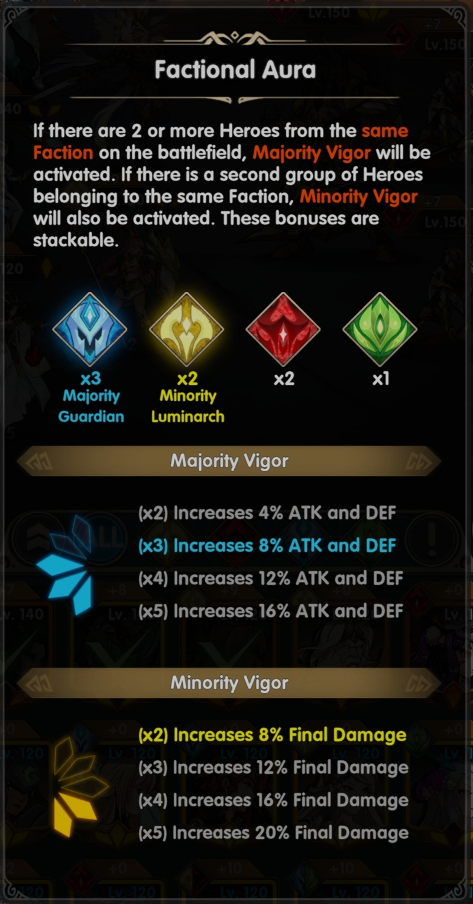

Mainkan Mythic Heroes : Idle RPG di PC : Rahasia Atribut para Hero

Halo sobat setia LDPlayer! Gimana? Seru kan game RPG yang satu ini?
Pastinya, dong! Sejak 4 Oktober kemarin, game Mythic Heroes : Idle RPG
ciptaan developer sekaligus publisher IGG ini berhasil menarik perhatian
lebih dari 500 ribu pengguna untuk memainkan game seru ini. Kalau kamu
suka menyusun strategi di dalam game, tentu game ini sangat
direkomendasikan untuk kamu.

Selain menyusun strategi di dalam battlefield, kamu juga harus
menyiapkan hero-hero keren kamu untuk bertarung di arena pertarungan.
Hero yang kamu dapatkan dari gacha tersebut akan menjadi bagian paling
penting di dalam game, apalagi hero kamu memiliki banyak atribut yang
wajib kamu perhatikan. Penasaran apa saja rahasia yang perlu kamu
perihal atribut para hero untuk persiapan sampai late-game nanti? Yuk,
baca tulisan ini sampai habis!

Level

Pastinya kamu sudah tidak asing dengan yang satu ini, level. Serunya di
game ini kamu tidak perlu takut kekurangan EXP agar kamu bisa menaikkan
level hero kamu, EXP yang kamu dapat bisa sangat banyak hingga yang
menjadi penghalang hero kamu untuk bisa berada di level tinggi adalah
banyaknya star dust yang kamu punya.

Di berapa level nanti hero kamu akan membutuhkan star dust supaya bisa
berlanjut ke level berikutnya. Berbeda dengan EXP, saat star dust kamu
sudah cukup agar hero kamu bisa naik ke level berikutnya, angka
statistik mereka akan bertambah lebih banyak karena star dust dianggap
sebagai limit breaker. Rajin-rajin kumpulkan star dust, ya!

{width="4.05in"
height="9.0in"}

Lima hero dengan level tertinggi akan jadi penentu level dari seluruh
hero milik kamu. Nantinya, semua hero kamu tanpa terkecuali akan
mengikuti salah satu dari lima hero dengan level yang paling rendah.
Misalnya, jika kamu punya Lucifer, Nuwa, Lilith, dan Athena yang sudah
mencapai level 120, lalu kamu juga punya Hades dengan level 100, maka
semua hero yang kamu miliki kecuali Lucifer, Nuwa, Lilith, dan Athena
akan mengikuti level dari Hades. Jika kamu mereset level Hades, maka
semua hero juga akan ikut kembali ke level 1.

Enhance dan Ascend

Siap-siap merelakan beberapa duplikat hero tier SR untuk menjadi tumbal
bagi hero tier SSR dan UR milikmu. Jika kamu memiliki duplikat dari hero
tier SR kamu, jangan gunakan duplikat tersebut sebagai bahan ascend.
Hero tier SR memang sebaiknya tidak kamu ascend karena keterbatasan
atribut mereka meskipun level mereka sudah tinggi sekalipun.

{width="5.3in"
height="9.0in"}

Dengan duplikat hero SR dari faksi yang sama, hero tier SSR dan UR kamu
dapat di-enhance sehingga statistik mereka bertambah. Pilihlah hero yang
menjadi carry kamu dan jadikan dia prioritas untuk mendapatkan enhance
supaya kamu tidak ketar-ketir nantinya.

Jika kamu beruntung, kamu bisa mendapat duplikat dari hero tier SSR
ataupun UR yang kamu miliki sehingga kamu bisa melakukan ascend terhadap
hero tersebut. Apalagi bonus statistik setelah kamu melakukan ascend
sangatlah besar sehingga bisa menguntungkan kamu dan tim kamu di dalam
arena pertarungan.

{width="5.934027777777778in"
height="9.0in"}

Equipment

Hero-hero kece kamu nantinya akan memiliki equipment yang terdiri dari
tiga rune dan satu artefak. Sangat direkomendasikan untuk memasang tiga
rune dengan jenis yang sama supaya hero mendapat bonus yang sesuai
dengan jenis rune tersebut. Untuk saran pemasangan rune dan artefak yang
cocok, kamu bisa membaca di artikel sebelumnya tentang game Mythic
Heroes ini.

Saat kamu mencapai level player tertentu, akan muncul Alchemy Workshop
yang membolehkan kamu memecah rune maupun artefak yang tidak kamu pakai
untuk didaur ulang dan menjadi equipment dengan kualitas yang lebih
baik. Equipment yang berwarna kuning juga bisa kamu tingkatkan lagi
kualitasnya menjadi berwarna oranye jika kamu sudah mempunyai tiga buat
equipment berwarna kuning dengan jenis dan kualitas yang sama.

{width="6.5in"
height="7.425in"}

Divinity

Atribut yang satu ini cukup spesial karena hanya dimiliki oleh hero
dengan tier SSR dan UR. Divinity ini nantinya terbagi menjadi dua yaitu,
primary divinity dan secondary divinity. Di bawah primary divinity akan
ada talent tree di mana hero tersebut bisa memiliki skill baru yang
tidak bisa didapatkan melalui kenaikan level.

{width="4.05in"
height="9.0in"}

Setiap hero SSR dan UR akan memiliki secondary divinity yang perlu
diaktifkan dengan divinity gem. Pilihlah secondary divinity yang kamu
rasa cocok dengan hero kamu di early-game. Jumlah divinity energy nodes
akan menentukan jumlah divinity yang bisa kamu pasang. Saat dua level
divinity hero kamu mencapai level tujuh, kamu akan mendapat tambahan
energy nodes dan tentunya kamu bisa memasang satu lagi divinity dan
statistik hero kamu akan bertambah.

Tactical advantage

Setiap hero kamu akan memiliki faksi, di mana faksi-faksi tersebut akan
saling memiliki advantage satu sama lain. Berbeda dengan game lain yang
bisa mencapai lima faksi atau lebih, di game ini, kamu hanya akan
mendapati empat faksi. Nantinya, faksi Luminarch mendapat bonus attack
saat berhadapan dengan faksi Shadowarch, sedangkan Shadowarch mendapat
bonus attack saat berhadapan dengan faksi Guardian, lalu faksi Guardian
mendapat bonus attack saat berhadapan dengan faksi Verdian, kemudian
faksi Verdian mendapat bonus attack saat menghadapi faksi Luminarch.
Supaya tidak semakin bingung, kamu bisa lihat gambar di bawah ini.

{width="5.355555555555555in"
height="9.0in"}

Seperti yang pernah dibahas di artikel sebelumnya, faksi-faksi tersebut
akan memiliki warna masing-masing supaya kamu mudah mengenalinya. Kuning
untuk faksi Luminarch, merah untuk faksi Shadowarch, biru untuk faksi
Guardian, dan hijau untuk faksi Verdian. Ingat warna-warna ini, ya!

Hero dengan tier UR akan memiliki dua faksi yang tentu saja selain
memberi mereka bonus attack lebih besar, efek damage yang mereka terima
juga ikut menjadi lebih besar. Pastikan juga kamu sudah memasang tim
dengan faksi yang pas saat berhadapan dengan musuh karena bonus attack
yang didapat berjumlah 25% yang tentu saja bukan angka yang kecil
apalagi jika hero kamu adalah hero tipe barbaric yang bisa melibas musuh
dengan sekali skill ultimate.

Factional aura

Perhatikan pula saat kamu memasang hero di dalam arena karena saat ada
minimal dua hero dengan faksi yang sama bersandingan, tim kamu akan
mendapat factional aura di mana nanti faksi yang paling banyak ada di
tim kamu mendapat majority vigor. Banyaknya buff dari majority vigor ini
tergantung dari berapa banyak hero dengan faksi mayoritas yang ada di
tim kamu. Jika kamu memasang full lima hero dengan faksi yang sama, kamu
bisa mendapat 16% ATK dan DEF lebih banyak.

{width="4.715277777777778in"
height="9.0in"}

Apa kalau kamu sudah full memasang lima hero dengan faksi yang sama kamu
tidak bisa mendapat buff tambahan dari minority vigor? Tentu bisa,
kuncinya adalah dengan memasang dua hero UR. Di tujuh hari pertama kamu
nanti, kamu berkesempatan mendapat hero UR Lucifer secara gratis. Uji
keberuntungan kamu untuk mendapat hero UR lainnya di dalam gacha. Kamu
bisa berdoa supaya IGG memberi kamu Lilith atau Iset, dengan begitu akan
ada faksi pendamping yang didapat setelah kamu memasang Lucifer.

Minority vigor ini nantinya akan memberi kamu paling banyak sejumlah 20%
tambahan final damage. Hampir mustahil mengingat kamu perlu lima faksi
yang sama untuk mendapat buff dengan angka sebesar itu, apalagi faksi
tersebut harus yang menjadi minoritas. Mungkin nanti kalau sudah ada
banyak hero UR, angka tersebut baru bisa tercapai.

Weapon

Sebagai persiapan sebelum kamu mencapai stage 11-4 nanti, kamu akan
mendapat beberapa bahan untuk menaikkan level dari setiap statistik
weapon hero kamu. Di weapon, kamu bisa menaikkan statistik yang ingin
kamu fokuskan dari setiap hero, tapi berhati-hatilah karena bahan yang
digunakan jumlahnya akan berkurang meski kamu pakai pada hero yang
berbeda.

{width="4.05in"
height="9.0in"}

Mainkan Mythic Heroes : Idle RPG di PC

Waduh, banyak banget yang harus diurus dari hero-hero kamu, ya? Sudah
hectic begitu, kamu malah misclick? Waduh, makin gawat saja, nih.
Tenang, LDPlayer datang dengan solusi, sebagai emulator game android
tercanggih abad ini, kamu bisa memainkan game seru ini di PC maupun
laptop kamu. Dengan begitu kamu akan terhindar dari misclick ditambah
kamu bisa menikmati indahnya art dari game Mythic Heroes yang keren ini.
Asyik, kan? Langsung saja diunduh, yuk!

Kesimpulan

Hero di setiap game memang sudah didesain memiliki statistik yang sesuai
dengan jenis role masing-masing. Meski sudah kuat, para hero tetap butuh
bantuan kamu sebagai player untuk membuat mereka semakin ganas di dalam
arena pertarungan. Maka dari itu kamu harus perhatikan setiap hero yang
menjadi andalan kamu supaya kamu juga tidak kesulitan saat mencapai
late-game nantinya.

Tetap ingat bahwa kesabaran adalah kunci utama untuk bermain game, jika
kamu gegabah dalam mengambil langkah, maka kamu akan merasakan sendiri
getahnya dan tentu tidak ada hal lain yang bisa kamu lakukan selain
marah. Nikmati segala prosesnya dan jangan takut kalah, tenanglah karena
semua ada waktunya. Semangat dan selamat bermain!
