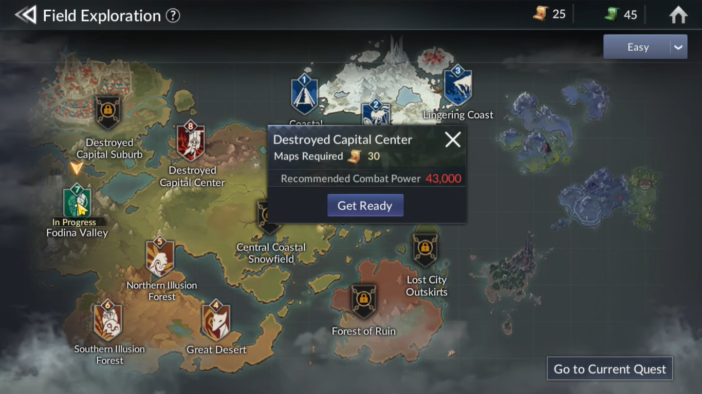
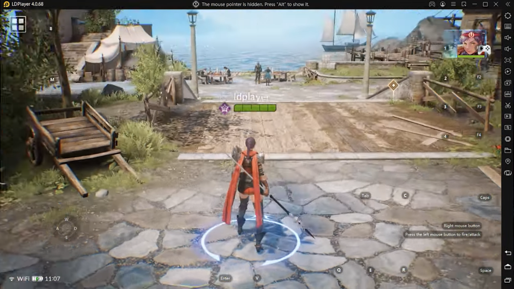

Mainkan Seven Knights 2 di PC : Rekomendasi Hero sampai Tips Menaikkan
Power untuk Pemula

Halo sobat LDPlayer! Game keren dari Netmarble sudah rilis, nih. Sudah
kamu mainkan belum? Parah banget, sih, kalau sampai belum. Sejak 10
November kemarin, game ini sudah resmi rilis secara global dan bisa kamu
mainkan setelah masa pra-registrasi sebelumnya. Bahkan sejak sebelum
perilisan, Netmarble sudah berhasil menarik perhatian lebih dari 500
ribu calon pemain karena saking kerennya game yang satu ini. Masa iya,
sih, kamu mau ketinggalan sama yang lain?

Game ini mengisahkan tentang kesatria muda bernama Lene yang berusaha
memenuhi permintaan terakhir ibunya, Eileene, yang mati di tangan Shane
untuk mencari anggota Seven Knights terakhir bernama Rudy. Sambil
berkelana mencari Rudy, Lene juga berusaha melindungi para warga yang
dirundung ketakutan karena kekuatan jahat mengintai mereka. Sebagai
pemain, kamu perlu membantu Lene dalam petualangannya, ingin tahu
caranya? Mari kita bahas satu persatu.

Pemilihan hero

Di awal game, kamu otomatis akan mendapat starter team yang terdiri dari
Lene, Kade, Cheng Chen, dan Lukey. Meski starter team, ke empat hero
tersebut bisa menjadi tumpuan kamu untuk melakukan grinding demi
mendapat hero lain yang lebih berkualitas. Kamu bisa mendapat hero
dengan cara melakukan gacha di shop.

Seperti game RPG lainnya, setiap hero memiliki role-role tertentu serta
advantage dan disadvantage di arena seperti PvE maupun PvP. Untuk itu,
pemilihan hero yang tepat menjadi keputusan krusial supaya tim kamu bisa
bertahan menjadi pemenang. Pastinya kamu ingin tahu hero mana yang kuat
dan keren untuk kamu pamerkan ke player lain, kan? Kalau begitu simak
list hero keren di bawah ini, ya!

Dellons

Hero role Universal garang yang satu ini bisa jadi mimpi buruk untuk
para lawan yang akan kamu hadapi. Dalam situasi apa saja, Dellons adalah
hero yang cocok untuk kamu cantumkan ke dalam tim kamu karena range
attack-nya yang luas serta statistik criticalnya yang sangat besar. PvP
maupun PvE bukan halangan bagi hero keren ini. Kacau banget, kan?

{width="6.5in"
height="3.654166666666667in"}

Karin

Tidak perlu khawatir kamu tidak bisa mendapat hero cantik ini lewat
gacha. Dengan rajin login selama tujuh hari berturut-turut, kamu bisa
mendapatkan Karin secara cuma-cuma. Karin merupakan hero dengan role
Support yang bisa menjadi pengubah situasi permainan. Tentunya hero yang
wajib kamu masukkan ke dalam tim utama.

{width="6.5in"
height="3.654166666666667in"}

Shane (Nestra's Disciple)

DPS yang satu ini cocok untuk kamu bawa ke arena PvP, group battle, dan
juga single boss dungeon. Hero Shane memiliki dua versi dan tentunya
versi ini jauh lebih superior dibanding versi rare nya.

{width="6.5in"
height="2.925in"}

Rudy (Heyday)

Anggota Seven Knights yang terakhir ini memiliki beberapa versi di
antaranya adalah Heyday. Di versi ini, Rudy merupakan hero dengan role
pure Tank dan hero ini menjalankan role nya dengan sangat baik. Pastinya
tim kamu akan sangat terlindung dari serangan para musuh dengan adanya
hero ini di tim kamu.

{width="6.5in"
height="3.654166666666667in"}

Cossete (Elena's Sword)

Hero dengan single attack type ini merupakan hero dengan role Ranged.
Cossete di versi ini memiliki damage yang tidak main-main karena skill
nya bisa membuat defense musuh diabaikan dan tentu saja menjadi hero
yang cocok untuk masuk ke dalam tim kamu.

{width="6.5in"
height="2.925in"}

Hero gratis

Selain hero di atas yang bisa kamu dapatkan menggunakan keberuntungan di
gacha. Ada beberapa hero lain yang bisa kamu dapatkan lewat hero
selection ticket. Supaya kamu tidak bingung, kami punya rekomendasi hero
kuat di bawah ini, nih. Kalau begitu, mari kita kulik lebih dalam
tentang hero mana yang cocok dengan gaya permainan kamu.

1.  Shay

Masih ragu dengan kekuatan hero dengan role Support? Kali ini si imut
Shay akan menghilangkan keraguan kamu akan role Support karena sebagai
Support, Shay sangat serbaguna. Jika kamu mau menghadapi banyak musuh di
dungeon maupun PvP, Shay bisa menjadi tangan kanan di tim kamu. Support
merupakan jawaban jika kamu merupakan player gegabah yang hobi langsung
menyerang tanpa pikir panjang.

{width="6.5in"
height="3.654166666666667in"}

2.  Shane

Meski kalah superior dengan versi Nestra's Disciple, Shane di versi ini
tetap worth it untuk kamu yang menyukai DPS serba bisa. Bukan hanya itu,
hero ini sangat direkomendasikan untuk dimiliki di early-game, jadi
tidak ada salahnya memiliki versi rare ini sebelum ke versi super rare
nya nanti.

{width="6.5in"
height="3.654166666666667in"}

3.  Serena

Kalau hero yang satu ini adalah hero Universal yang cocok untuk semua
dungeon dan konten PvE. Kalau kamu memang memprioritaskan farming dan
grinding, kamu bisa pilih hero cantik yang satu ini.

{width="6.5in"
height="3.654166666666667in"}

4.  Neo

Nah, kalau kamu butuh hero dengan range attack yang luas, maka Neo bisa
menjadi pilihan kamu. Selain AoE attack type, Neo juga cocok untuk kamu
bawa ke arena PvP dan juga dungeon dengan musuh yang banyak.

{width="6.5in"
height="3.654166666666667in"}

Tips menaikkan power

Sudah tidak kebingungan memilih hero yang akan kamu pakai di dalam game,
saatnya kamu menambah power agar tim kamu semakin tidak terkalahkan di
arena mana pun. Tentunya selain kesabaran ekstra, kamu juga harus teliti
melihat celah mana saja yang bisa kamu gunakan untuk meningkatkan power,
ingin tahu bocorannya? Kita cari tahu, yuk!

Bergabung dengan guild

Sangat dianjurkan untuk kamu yang masih pemula untuk bergabung dengan
guild sesegera mungkin karena banyaknya reward dari achievement yang
bisa membantu kamu dan hero kamu untuk menaikkan power dengan cepat.
Dengan menggunakan guild coin, kamu bisa pergi ke guild shop dan membeli
item-item buff untuk tim kamu.

{width="6.5in"
height="3.654166666666667in"}

Tak hanya item buff, kamu juga bisa mengumpulkan guild coin sebanyak
mungkin sampai kamu bisa membeli legendary pet atau pun item untuk
melakukan gacha hero, equipment, dan juga pet. Kalau guild coin kamu
sudah banyak, tentu banyak pula item di guild shop yang bisa kamu beli
dan power tim kamu pun bertambah.

{width="6.5in"
height="3.654166666666667in"}

Emporium shop

Jika kamu masuk ke shop, ada satu shop di pojok kanan yang dijaga oleh
seekor hewan imut, shop itu bernama emporium. Setiap enam jam sekali,
kamu akan mendapat 100 map gratis dari toko kecil tersebut yang bisa
kamu gunakan untuk farming. Selain map, akan ada juga item-item keren
lainnya yang bisa kamu beli dengan menggunakan koin maupun ruby yang
kamu miliki. Tentu saja item tersebut bisa membantu kamu menaikkan power
tim kamu.

{width="6.5in"
height="3.654166666666667in"}

Field exploration

Nah, setelah kamu mengambil map gratis dari emporium tersebut, pergilah
ke field exploration yang bisa kamu temui di bagian menu yang ada di
bagian kanan atas. Setelah itu pilihlah area mana yang rekomendasi
powernya sesuai dengan tim kamu. Di setiap area tersebut akan boss yang
harus kamu kalahkan dan kamu akan mendapat equipment-equipment
berkualitas untuk hero kamu.

{width="6.5in"
height="3.654166666666667in"}

Perawatan hero

Bukan RPG namanya kalau kamu tidak perlu perawatan yang kompleks untuk
hero-hero kamu. Selain levelling, kamu juga harus menaikkan skill dari
hero tersebut. Perhatikan hero mana yang kamu perlu naikkan dan jangan
asal tekan selama proses penaikkan level karena bahan untuk menaikkan
level hero tersebut sangat penting dan kamu bisa kewalahan jika
kekurangan bahan tersebut.

Mainkan Seven Knights 2 di PC

Bukan rahasia umum kalau kamu sebagai player perlu ketekunan dan
kesabaran dalam memainkan game bergenre RPG. Kamu juga perlu teliti
untuk mencari celah agar tim kamu bisa menjadi lebih kuat. Ditambah lagi
kamu perlu tabah karena besarnya file yang harus diunduh ke android kamu
jika kamu ingin memainkan game ini. Untuk itu kami datang dengan solusi,
caranya dengan menginstall emulator game android LDPlayer ke PC atau
laptop kamu, lalu unduh Seven Knights 2, dan rasakan serunya bermain RPG
dengan grafik yang keren!

{width="6.5in"
height="3.654166666666667in"}{width="6.5in"
height="3.654166666666667in"}

Kesimpulan

Dengan adanya sistem gacha di game ini tentu memberi warna baru dalam
permainan RPG yang super serius seperti Seven Knights 2. Setelah
mendapat hero pun kamu perlu perhatikan statistik apa saja yang bisa
memberi keuntungan untuk tim kamu di beberapa situasi yang berbeda.
Tentunya masih banyak cara lain supaya hero kamu bisa memiliki power
yang besar selain dari cara yang sudah disebutkan di atas.

Tidak perlu risau kalau kamu belum mendapat hero dengan tier legendary,
seiring berjalannya waktu, kamu akan memiliki kesempatan untuk mendapat
hero berkualitas tinggi tersebut. Sambil menunggu kesempatan itu datang,
alangkah baiknya kamu merawat hero-hero yang sudah kamu miliki sekarang
dan naikkan power mereka agar lawan ketar-ketir melihat tim kamu. Jadi,
tunggu apa lagi? Jangan sampai ketinggalan serunya game keren ini, ya!
Selamat mencoba dan selamat bermain!
