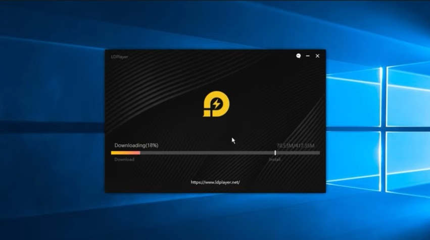
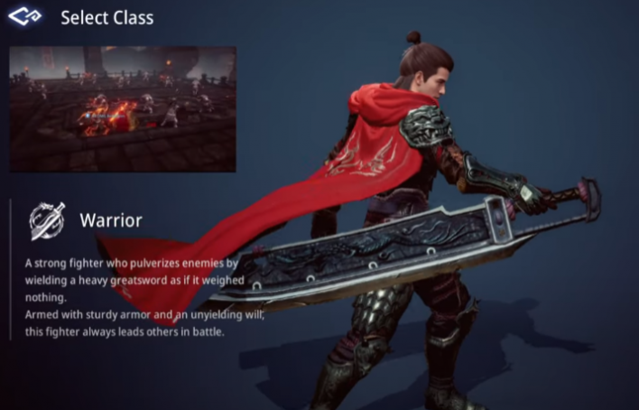
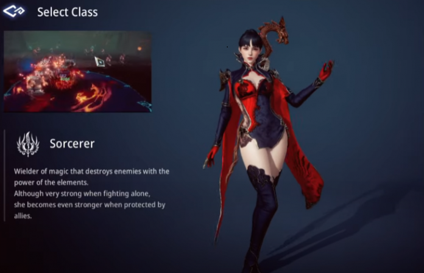
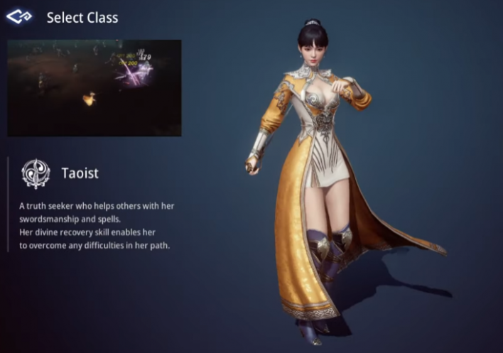
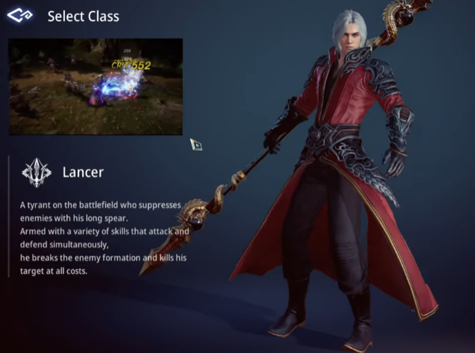
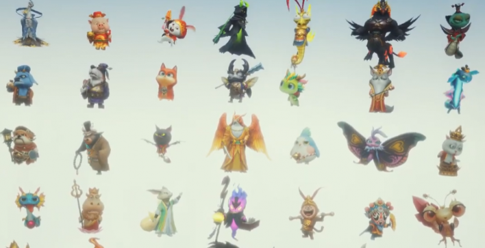
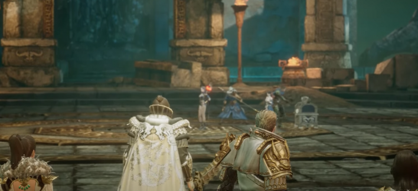
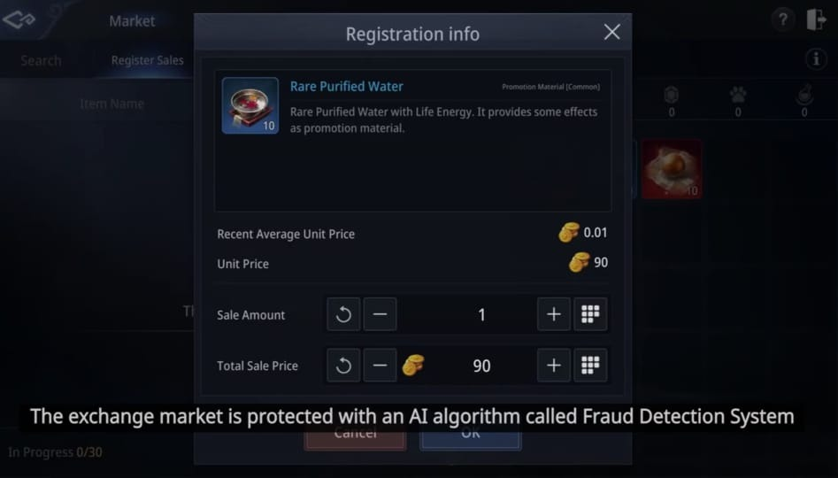

**Mengintip Serunya Open World MMORPG Game MIR4**

Pecinta MMORPG pasti sudah tahu kalau game seru dari Wemade Co., Ltd
sudah sampai tahap pra-registrasi, game apa itu? Ya, betul, game itu
adalah MIR4 yang mengusung tema Open World dan tentu saja MMORPG. Karena
genre MMORPG inilah, nantinya di game ini, kamu tidak cuma bermain
dengan NPC (non-playable character) saja, tetapi juga dengan ratusan
hingga ribuan player dalam satu waktu. Sudah kebayang, kan, gimana
serunya?

Supaya kamu tidak ketinggalan perilisan game ini, kamu bisa melalukan
pra-registrasi di Google Play Store kamu, psst, ada hadiah tersendiri
setelah perilisan game untuk kamu yang sudah melakukan pra-registrasi,
*lho*!. Oh, iya, demi menambah keseruan bermain kamu, kamu juga bisa
mengunduh emulator game Android LDPlayer di PC atau laptop kamu, *lho*!
Pastinya seru banget, deh!

{width="6.5in"
height="3.6354166666666665in"}

**Pilihan *Class***

Sebelum kamu mempelajari mekanisme permainan MIR4 nanti, bagaimana kalau
kita berkenalan dengan *class* keren yang bisa kamu pilih sesuai dengan
keinginan kamu? Yuk, langsung saja kita bahas setiap *class* yang ada di
game MIR4!

**Warrior**

*Class* yang satu ini paling sering dipilih oleh pejuang-pejuang
tangguh, kalau kamu suka menjadi tumpuan dalam tim, *class* yang satu
ini cocok banget untuk kamu pilih. Sebagai Warrior, tugas kamu hanya
memimpin penyerangan, meski begitu, tugas ini cukup berat, *lho*.
Tentunya dengan bantuan senjata yang menyakitkan serta kekokohan armor
menjadikan Warrior sebagai tameng yang sulit ditembus. Meski pergerakan
Warrior tidak segesit *class* lainnya, daya tahan dan *damage* menjadi
alternatif Warrior untuk menghabiskan musuh yang banyak sekaligus maupun
fokus ke satu target.

{width="6.5in"
height="4.168079615048119in"}

**Sorcerer**

Mirip seperti "Mage" di game lain, Sorcerer merupakan pengguna sihir
yang memiliki banyak *damage* dan AoE, AoE sendiri merupakan *area of
effect* yang membebaskan Sorcerer memilih area untuk menyerang musuh
yang berkerumun secara sekaligus. Meski rentang *cooldown* untuk
beberapa kekuatannya cukup lama, tetapi dengan *damage* yang besar
tentunya bukan menjadi masalah bagi kamu yang ingin memilih *class* ini.
Sorcerer sendiri cukup kuat untuk menahan musuh dengan elemen sihirnya,
tetapi Sorcerer akan menjadi lebih kuat lagi ketika dilindungi oleh
*class* lainnya sembari memberi serangan dari garis belakang dengan
sihirnya yang bertubi-tubi dan menyakitkan.

{width="6.5in"
height="4.19375in"}

**Taoist**

Meski memiliki jarak serang yang kecil, kemampuan untuk *recovery* di
saat kritis membuat *class* ini aman dari serangan musuh yang mematikan.
Taoist juga memiliki kemampuan sihir dan fisik yang beragam,
menjadikannya sebagai *support* yang sangat baik. Tak hanya itu, Taoist
juga bisa mengontrol kumpulan musuh dari jarak aman. Jadi, kalau kamu
tertarik dengan *class* yang serba bisa, Taoist bisa jadi pilihan kamu
untuk memulai game ini.

{width="6.5in"
height="4.562853237095363in"}

**Lancer**

Serangannya yang cepat dari jarak yang luar biasa membuat Lancer menjadi
petarung andal dan mematikan. Kalau kamu ingin menjadi ancaman di PvP,
Lancer memiliki potensi yang kamu butuhkan di dalam pertandingan
tersebut. *Critical hit* yang besar juga menjadi poin lebih untuk
*class* ini dan membedakan *class* ini dari Warrior yang menyuguhkan
daya tahan yang lebih besar.

{width="6.5in"
height="4.839622703412074in"}

**Sistem Permainan Unik**

Nah, setelah kamu sudah paham dan sudah menentukan *class* apa yang akan
kamu pilih untuk karakter kamu nanti, kamu bisa langsung pelajari sistem
permainan MIR4 yang unik yang tentunya bisa kamu nikmati seperti spirit,
*free loot*, *fraud detector* dan juga persiapan untuk late-game,
seperti apa, ya? Mari kita bahas satu persatu.

**Spirits**

Seperti *pet* di game MMORPG kebanyakan, spirit merupakan kawan setiamu
yang bisa menambah angka statistik maupun di dalam gameplay­ secara
langsung. Kamu bisa membentuk satu tim spirit yang memiliki sinergi yang
sesuai untuk memperkuat daya karakter kamu, selain itu kamu bisa
menggabungkan mereka agar angka statistiknya semakin besar. Ketika kamu
sudah berhasil mengumpulkan lima spirit ke dalam satu tim, kamu bisa
memilih satu spirit sebagai pemimpin dan akan menemani karaktermu
kemanapun ia pergi.

{width="6.5in"
height="3.332626859142607in"}

**Free Loot**

Ketika kamu dan kawananmu berhasil mengalahkan musuh yang sangat kuat,
akan muncul kotak hadiah yang tentunya berisi benda-benda yang sangat
berharga untuk karakter kamu nantinya. Setelah kotak itu muncul, kamu
punya waktu 30 detik untuk membukanya. Eits, tidak secepat itu, meski
kamu dan kawananmu sudah berhasil mengalahkan musuh dan mendapat kotak
hadiah tersebut, jika kamu belum membukanya, sekawanan player lain masih
bisa merebut hadiah tersebut dari kamu, *lho*! Gawat, kan? Sayang sekali
kalau kamu gagal mengalahkan player yang ingin merebut hadiah kamu. Maka
dari itu kamu harus berjuang sekuat tenaga demi menjaga apa yang sudah
kamu raih dengan susah payah.

{width="6.5in"
height="2.974576771653543in"}

**Fraud Detection System**

Dalam hal jual-beli, kamu bisa mengunjungi *exchange market*, di sana
sudah ada sistem algoritma AI yang disebut *fraud detection system*.
Dengan memonitor barang-barang yang kamu miliki, sistem itu akan
menunjukan adanya penukaran barang yang mencurigakan dan mencegah adanya
kekacauan yang disebabkan oleh pengguna yang tidak bertanggung jawab
maupun bot. Sistem itu akan langsung menghilangkan barang mencurigakan
tersebut dan memberi batasan akses untuk akun yang bersangkutan. Dengan
begitu, kenyaman serta keamanan kamu dalam melakukan tukar menukar
barang akan terjamin dan karakter kamu bisa berkembang dengan baik di
game ini.

{width="6.5in"
height="3.70625in"}

**Late-game**

Karakter kamu yang sudah kuat belum menjamin kesejahteraan kamu secara
finansial di dalam game. Jika kamu ingin bertahan di late-game,
bergabung dengan klan menjadi pilihan yang sangat wajib karena klan bisa
membantu kamu mendapatkan bahan-bahan yang bernilai tinggi seperti *dark
iron* yang bisa kamu dapatkan di *Hidden Valley Capture,* mode di mana
tiap klan akan saling bertarung menjadi yang paling kuat dan menguasai
suplai bahan-bahan yang bernilai tinggi tersebut yang ada di tambang.
Ketika klan sudah berhasil menguasai tambang, mereka bisa menjadikan
tambang itu untuk konsumsi klan sendiri atau membukanya untuk umum dan
mengambil untung melalui sistem perpajakan.

**Kesimpulan**

Selain yang sudah kami sebutkan di atas, tentunya masih banyak hal-hal
lain yang bisa kamu temui ketika kamu sudah bisa mengeksplor game ini.
*Class* yang kamu pilih nantinya menjadi hakmu sendiri, tidak perlu
takut maupun bersedih ketika ada player lain yang mencoba menurunkan
rasa percaya diri kamu atas pilihan kamu sendiri, dengan berkembang dan
menjadi lebih kuat, kamu bisa membuktikan bahwa setiap *class* yang ada
itu unik, kuat, dan sangat penting dalam pertarungan tim. Bermain dengan
banyak player juga mengharuskan kamu untuk bermain secara sportif dan
tidak merugikan diri sendiri maupun player lain.

Sudah siap bergabung dan merasakan langsung keseruan Open World MMORPG
dari MIR4? Jangan lupa untuk pra-registrasi game ini, ya! Kamu bisa
banget, nih, merasakan juga sensasi bermain game ini di PC dan laptop
kamu, emulator game Android LDPlayer sudah menyesuaikan sistemnya dengan
baik, jadi sangat ringan saat dioperasikan. Sudah kebayang dong serunya
main dengan layar yang lebih lebar dan pengoperasian game yang lebih
mudah? Kalau begitu langsung saja, yuk, baca artikel ini untuk panduan
kamu saat pengunduhan emulator game LDPlayer : Selamat mencoba!
