Panduan Bermain Mobile Legends : Bang Bang untuk Pemula

Siapa sih yang tidak kenal game yang satu ini? Game yang ramai ini
bahkan sampai dibuat perlombaannya di beberapa negara di Asia, lho!
Kalau kamu pernah bermain DOTA pasti kamu sudah tidak asing dengan
gameplay dari game keren ini yaitu, Mobile Legends : Bang Bang atau yang
sering pula disebut ML.

Mobile Legends : Bang Bang merupakan game MOBA yang dirilis oleh
developer game Moontoon. MOBA sendiri merupakan singkatan dari
Multiplayer Online Battle Arena atau bisa disebut sebagai game
multiplayer online yang bertema pertarungan di dalam arena. Di dalam
game ini nantinya akan ada sepuluh pemain yang dibagi menjadi dua tim.
Sebelum kamu masuk ke dalam arena pertarungan, kita pelajari dulu lebih
dalam mengenai hero dan role nya, yuk!

Jenis role dan cara memakainya

Seperti game RPG, kamu akan mendapati banyak hero dengan role-role yang
berbeda. Akan ada enam role di antaranya ada assassin, fighter, tank,
marksman, mage, dan support. Supaya kamu bisa lebih jago lagi di dalam
arena pertarungan, simak bacaan ini sampai habis, ya!

Assassin

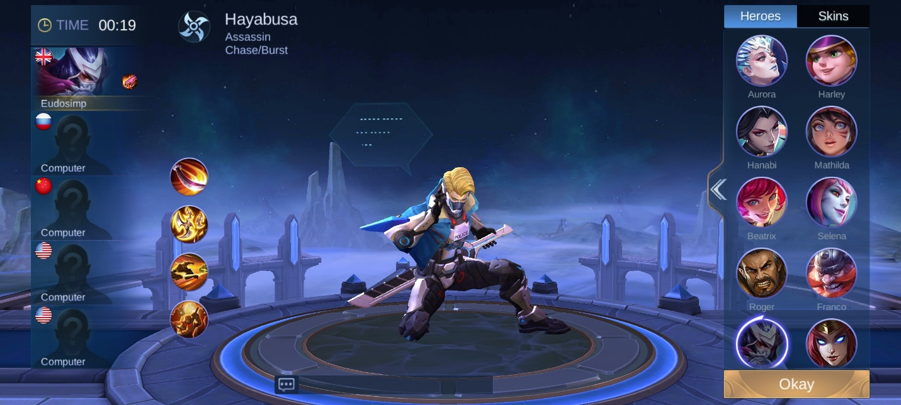{width="6.5in"
height="2.925in"}

Role yang satu ini jelas jadi idaman banyak player karena damage yang
tidak bisa diragukan lagi. Pasti kamu suka banget kalau hero yang kamu
pilih punya damage yang besar, kan? Meski damage yang dimiliki role ini
cukup tinggi, tingkat kesulitannya juga tidak kalah tingginya. Maka dari
itu kamu perlu tahu beberapa kunci saat memainkan hero dengan role
assassin ini.

-   Rajin mengambil buff di jungle

Sebagai assassin, hal terpenting yang kamu butuhkan adalah koin, kamu
bisa mendapat banyak koin dari buff yang ada di jungle. Di early-game,
hero dengan role assassin kamu punya darah yang tidak tebal, maka
usahakan kamu berkomunikasi dengan tim kamu untuk meminta perlindungan.

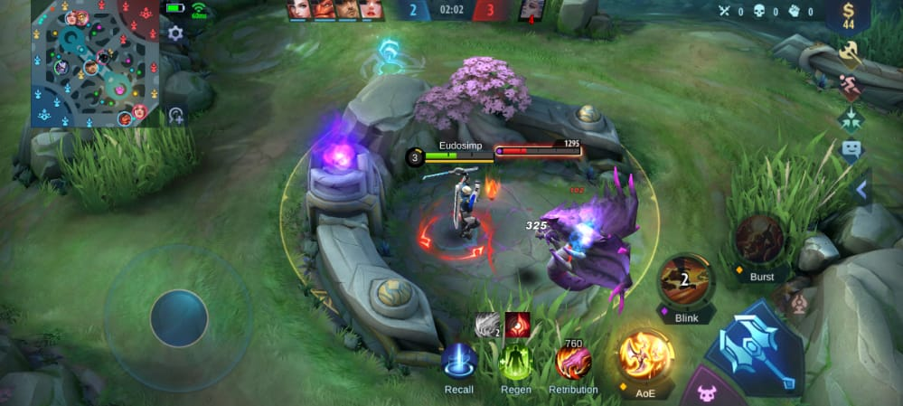{width="6.5in"
height="2.921527777777778in"}

-   Sering berkomunikasi dengan tim

Komunikasi merupakan hal penting saat bertarung bersama tim. Sebagai
assassin kamu harus rajin melakukan quick-chat karena dengan kecepatan
lari dari hero kamu, kamu bisa mengetahui apa saja yang terjadi di
sekitar battlefield dan meminta bantuan kepada tim kamu.

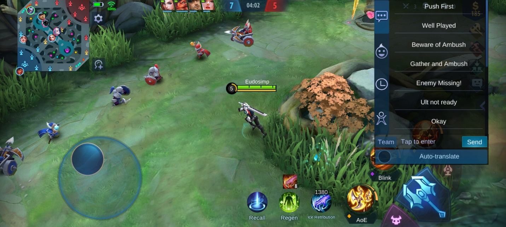{width="6.5in"
height="2.925in"}

-   Pasang item untuk counter lawan

Assassin ini sangat mudah di-counter oleh hero dengan role mage, maka
dari itu kamu harus menyesuaikan item-item yang menjadi build kamu
supaya kamu mendapatkan situasi upperhand.

Fighter

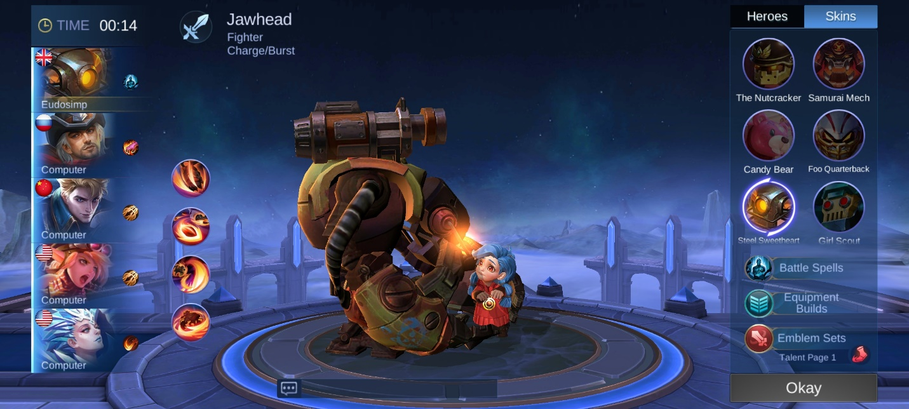{width="6.5in"
height="2.925in"}

Sebagai tumpuan di dalam battlefield, fighter harus cepat-cepat naik
level dengan mengumpulkan EXP. Di early-game usahakan kamu berada di EXP
lane sendirian, minta agar teman setim kamu tidak mengikuti kamu supaya
EXP yang kamu dapat saat mematikan minion tidak berkurang dan kamu tidak
kalah level dengan musuh.

-   Berani menghadapi lawan sendirian

Dengan darah yang tebal tentunya situasi one-on-one bukan masalah,
apalagi dengan build yang pas, damage dari heromu bisa sangat menyakiti
lawan. Berkeliling di battlefield sendirian menjadi ciri khas dari
fighter.

-   Wajib ikut saat terjadi war

War merupakan istilah ketika tiga anggota atau lebih tim bertarung
dengan tiga anggota atau lebih dari tim lawan di satu area yang sama.
Fighter menjadi role penting saat war terjadi agar tim bisa memenangkan
war tersebut dan bisa menyerang tower-tower musuh.

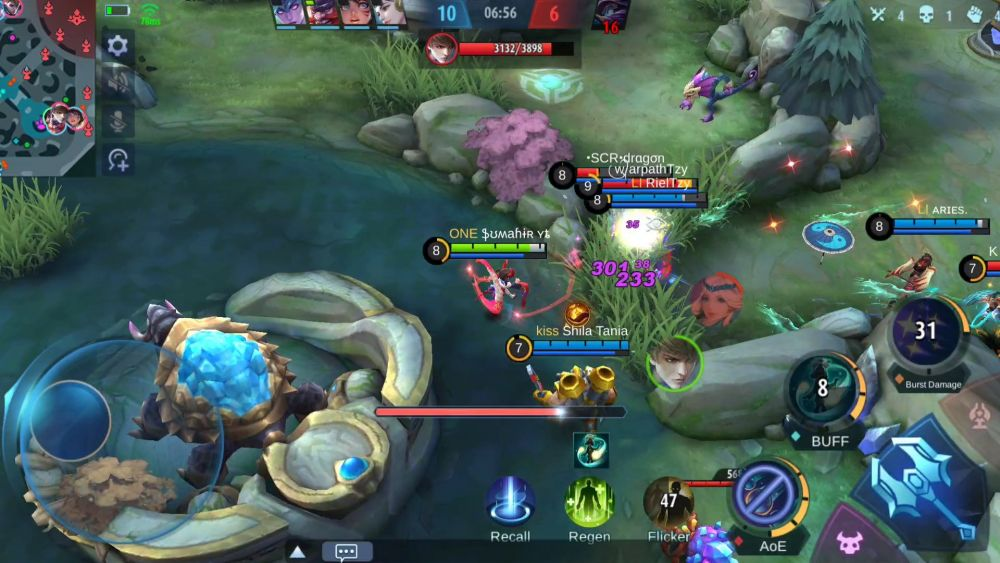{width="6.5in"
height="3.6597222222222223in"}

-   Tidak buta map

Buta map merupakan istilah untuk player yang tidak peduli situasi
sekitar dan melakukan hal semaunya sendiri. Fighter harus paham situasi
di dalam arena pertarungan, maka bukalah map kamu supaya kamu tidak
menyusahkan tim apalagi saat terjadi war.

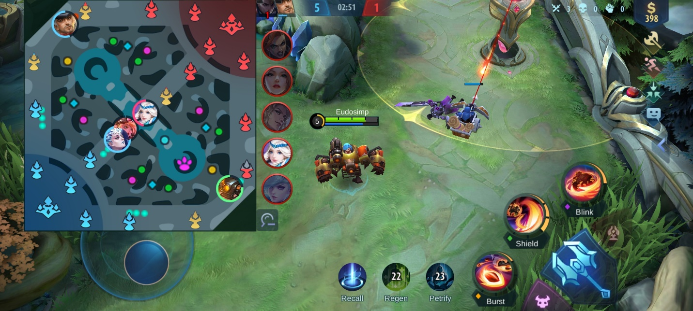{width="6.5in"
height="2.925in"}

Tank

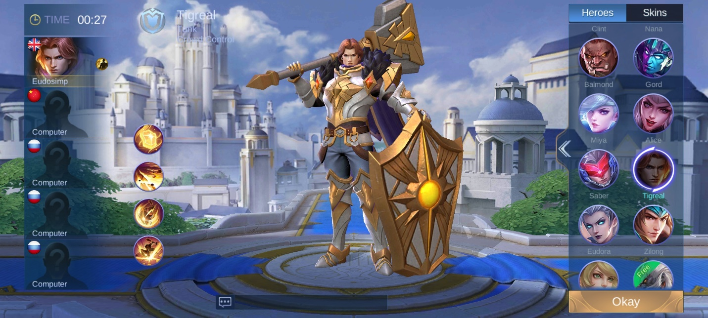{width="6.5in"
height="2.925in"}

Pelindung tim dengan darah yang sangat tebal ini harus selalu berada di
dekat hero dengan role assassin atau marksman karena kedua role tersebut
rentan menjadi target lawan untuk diserang saat sendirian. Selain itu
role ini juga bisa berperan sebagai pencuri buff musuh dengan bantuan
hero dengan role lain.

Sama seperti fighter, tank juga tidak boleh buta map, maka dari itu
rajin-rajinlah membuka map untuk memonitori situasi di dalam arena
pertarungan.

Marksman

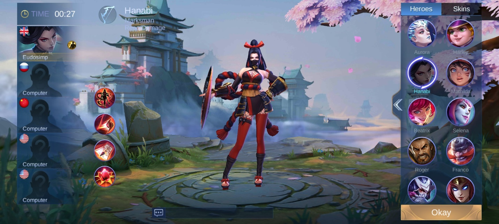{width="6.5in"
height="2.925in"}

Jarak menjadi hal yang sangat penting untuk role ini, lengah sedikit,
hero kamu bisa tewas dalam waktu cepat. Marksman bisa memberi damage
yang sangat besar di late-game dari jarak yang tentunya luar biasa, maka
dari itu mintalah tim kamu untuk melindungi kamu saat berada di dalam
battlefield.

Tidak jauh berbeda dari assassin, role ini juga perlu sering-sering
mengambil buff yang ada di jungle supaya dapat banyak koin. Di
early-game, role ini bukan masalah berarti, namun dengan build yang pas,
di late-game nantinya role ini menjadi mimpi buruk untuk lawan.

Mage

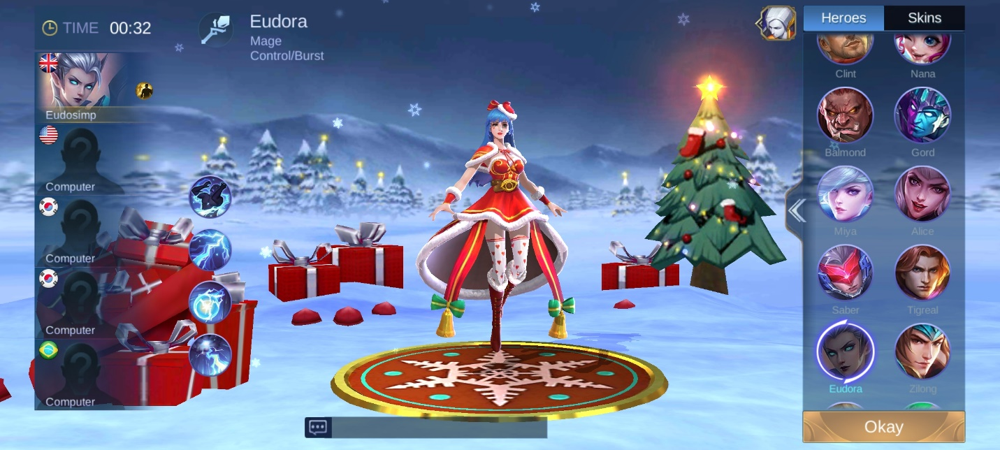{width="6.5in"
height="2.925in"}

Role yang satu ini punya kekuatan damage yang paling stabil di antara
role lainnya. Di early-game saja damage dari mage ini sudah cukup sakit,
apalagi saat berada di late-game, pastinya role yang satu ini akan
dihindari oleh role-role seperti assassin dan marksman.

-   Bersabar

Kunci saat memainkan hero dengan role mage ini adalah kesabaran yang
ekstra karena buka mage namanya kalau kamu bisa gegabah tanpa takut mati
saat berhadapan dengan musuh. Area dari skill mage tidaklah kecil, jadi
usahakan kamu berada di jarak aman saat ingin menyerang musuh. Sangat
direkomendasikan jika kamu punya keahlian untuk bersembunyi di balik
rerumputan. Kalau kamu jago ambush, role ini bisa sangat mengerikan bagi
lawan.

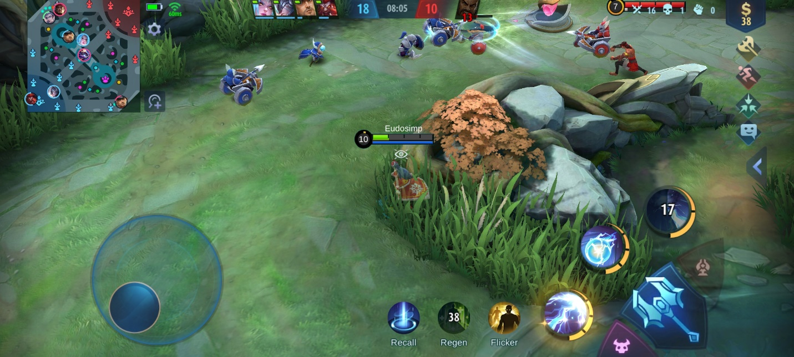{width="6.5in"
height="2.925in"}

-   Perhatikan ketersediaan mana

Mage sangat bergantung pada mana, jika mana kamu habis tentu kamu tidak
bisa menggunakan skill dari heromu tersebut. Kalau heromu memiliki role
yang pure mage, basic attack menjadi pilihan terakhir untuk menyerang
musuh. Jika kamu kehabisan mana, kembalilah ke base dan mana kamu akan
berangsur naik sampai penuh.

Support

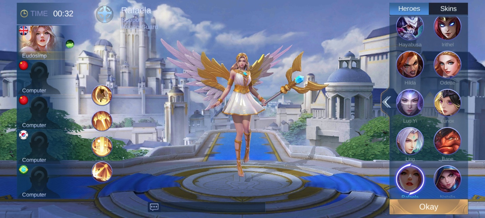{width="6.5in"
height="2.925in"}

Sesuai dengan namanya, support menjadi penyokong dari tiap-tiap anggota
tim. Seperti tank, janganlah berada jauh dari anggota tim kamu,
khususnya assassin dan marksman. Usahakan kamu memilih item yang membuat
kamu tidak mengganggu suplai koin untuk tim. Beberapa support ada yang
bisa menambah darah untuk teman satu tim, pergunakan skill tersebut
dengan baik.

Fitur lain untuk menyokong para hero

Sudah memahami role-role dari para hero, saatnya kamu mempelajari
fitur-fitur yang bisa memperkuat hero kamu saat berada di medan
pertarungan. Apa saja, ya? Kita cari tahu, yuk!

Build

Tentunya build menjadi bagian penting saat kamu berada di arena
pertarungan, dengan memahami build yang cocok dengan hero yang kamu
pilih, tentunya kamu akan bisa dengan mudah melibas para musuh. Kamu
juga bisa mengutip build buatan para player professional, lho.

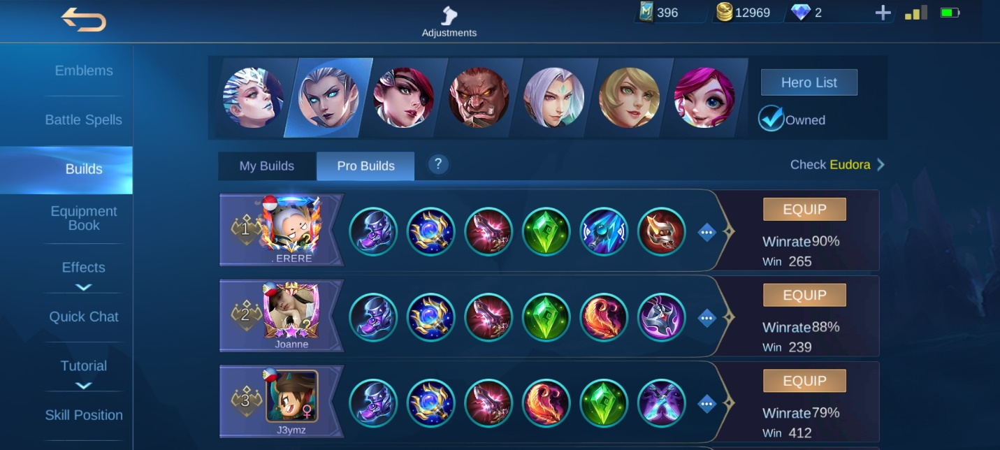{width="6.5in"
height="2.925in"}

Emblem

Emblem merupakan tambahan talent untuk setiap role. Kamu bisa memasang
emblem untuk hero kamu dan cocokan dengan jenisnya. Semakin tinggi level
dari setiap talent yang ada di emblem, semakin kuat pula hero kamu.

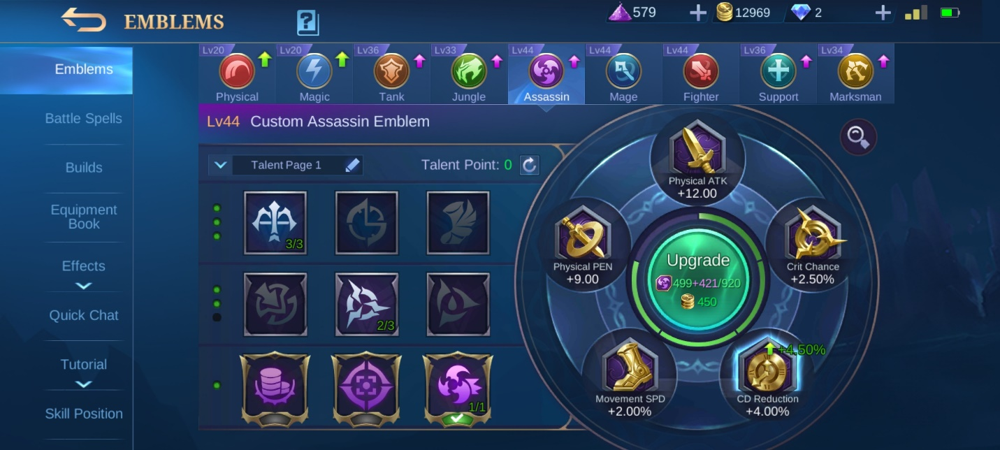{width="6.5in"
height="2.925in"}

Battle spells

Fitur yang satu ini untuk membantu kamu di saat genting seperti dikejar
musuh ketika darah sudah sedikit atau saat kamu ingin mematikan musuh
yang berusaha kabur saat darahnya tinggal sedikit. Cocokkan dengan hero
yang akan kamu pilih, jika kamu ingin menggunakan hero seperti Eudora
yang kecepatannya sangat rendah, kamu bisa menggunakan flicker supaya
kamu bisa dengan cepat kabur dari serangan musuh saat Eudora sudah
sekarat.

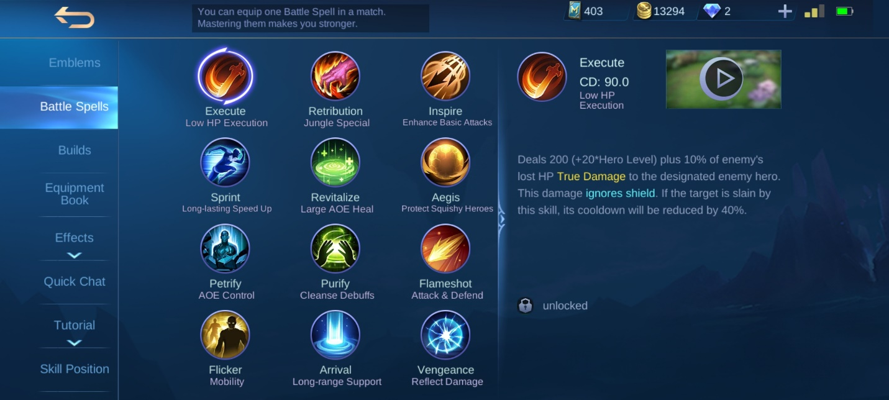{width="6.5in"
height="2.925in"}

Bisa juga kamu memakai flameshot untuk menyerang atau mendorong musuh ke
jarak aman dari hero kamu. Battle spell yang satu ini cocok untuk hero
seperti Nana. Meski Nana memiliki pasif yang membuatnya sulit dimatikan,
flameshot bisa menjadi bantuan saat musuh berusaha mengejar Nana yang
sudah sekarat.

Recall dan regen

Dua fitur ini sudah tersedia sejak kamu pertama kali bermain game ini.
Recall bisa kamu gunakan saat hero kamu sudah sekarat untuk kembali ke
base dan memenuhkan kembali darahnya, tapi pastikan tidak ada musuh yang
akan menyerang kamu karena proses recall akan terhenti dan kamu berada
di situasi yang genting.

Selain itu ada regen yang akan menambah darah hero kamu. Sama seperti
recall, kamu juga perlu memastikan tidak ada musuh yang akan menyerang
karena regen kamu akan terhenti seketika dan kamu perlu menunggu selama
beberapa detik sampai kamu bisa regen lagi.

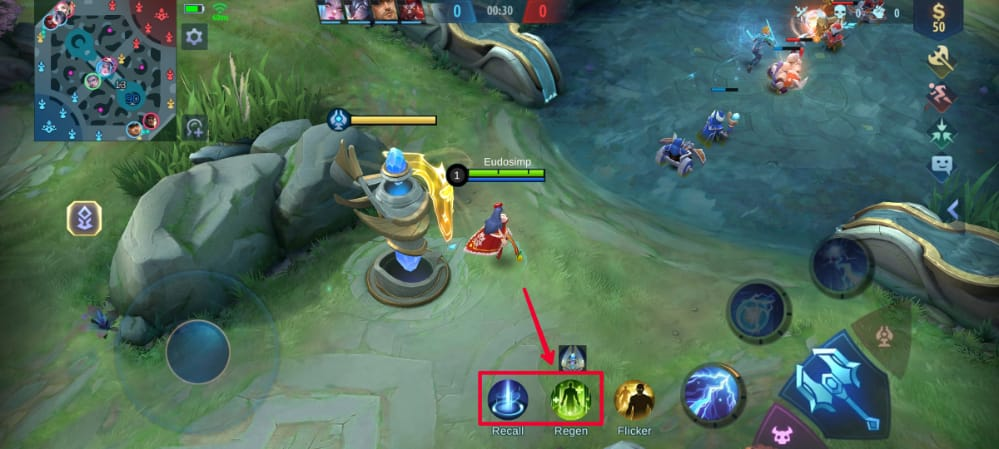{width="6.5in"
height="2.921527777777778in"}

Kesimpulan

Bermain bersama tim tentunya akan berbeda saat kamu bermain sendirian,
kamu harus rajin berkomunikasi dan perhatikan anggota tim jika sedang
butuh bantuan. Kalau kamu bermain dengan player lain secara random,
seringkali kamu bertemu dengan teman satu tim yang egois, di situlah
kesabaran kamu diuji. Fokuslah ke dalam permainan dan berusaha sampai
akhir.

Meski kamu lebih familiar jika game ini dimainkan di android, tapi kamu
penasaran juga, kan, gimana kalau game ini dimainkan di PC atau laptop?
Kamu bisa unduh nih emulator game android LDPlayer di PC atau laptop
kamu dan mainkan Mobile Legends : Bang Bang. Kebayang gimana serunya,
kan? Jangan sampai ketinggalan, yuk! Selamat mencoba dan selamat
bermain!
