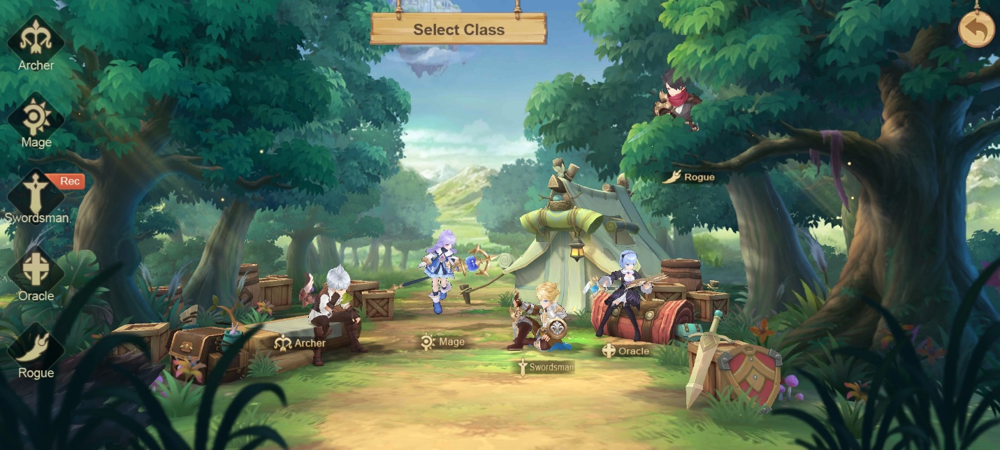
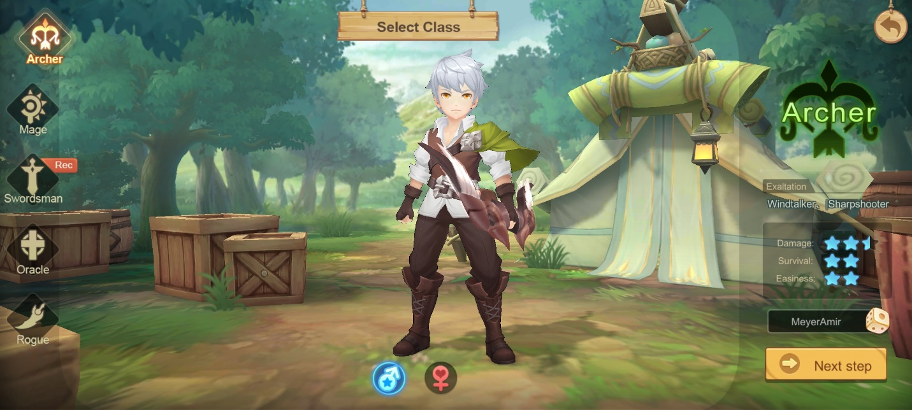
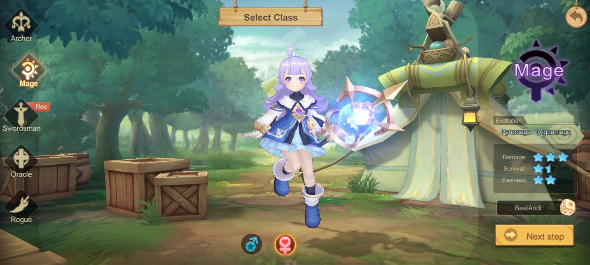
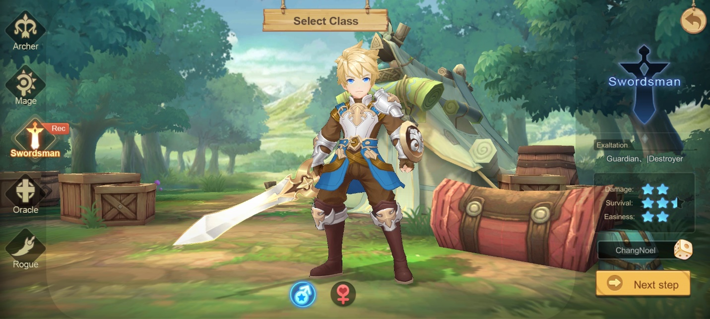
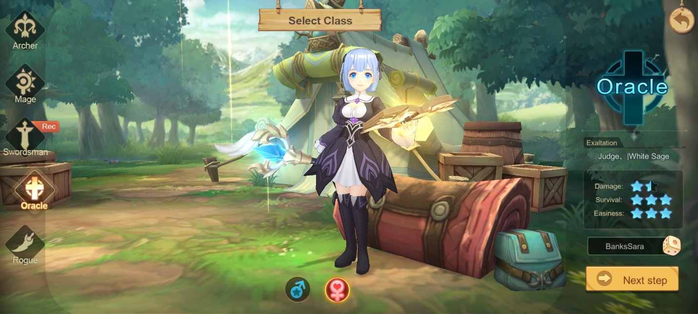
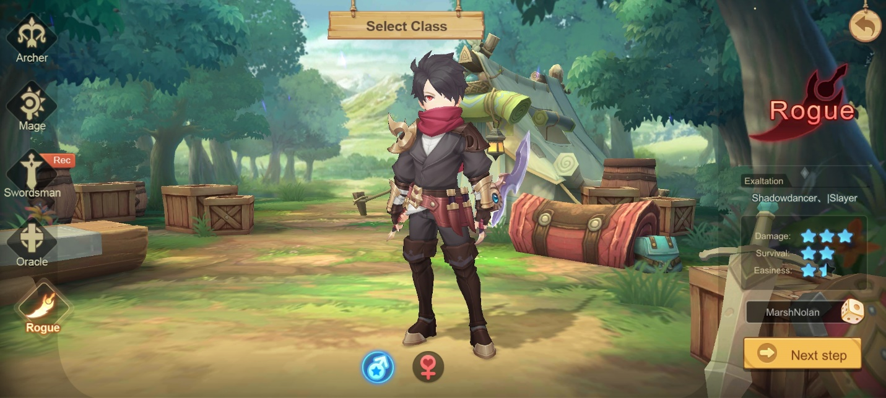
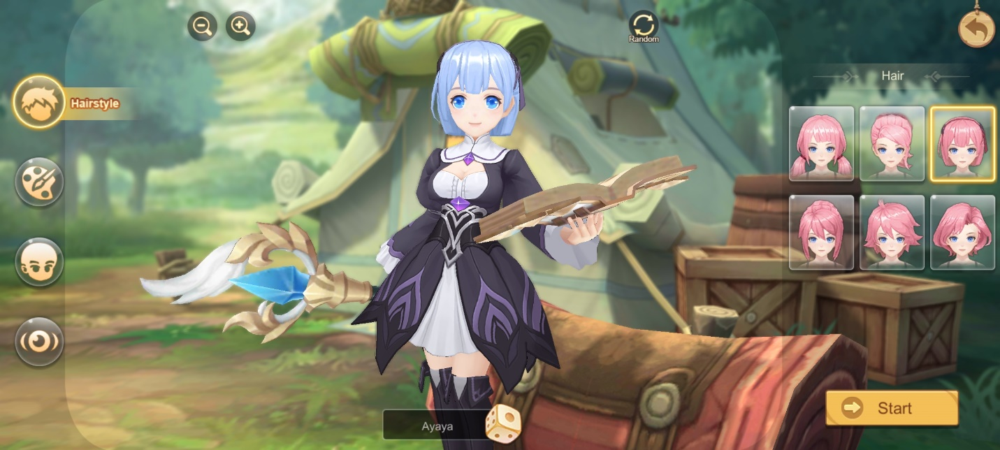
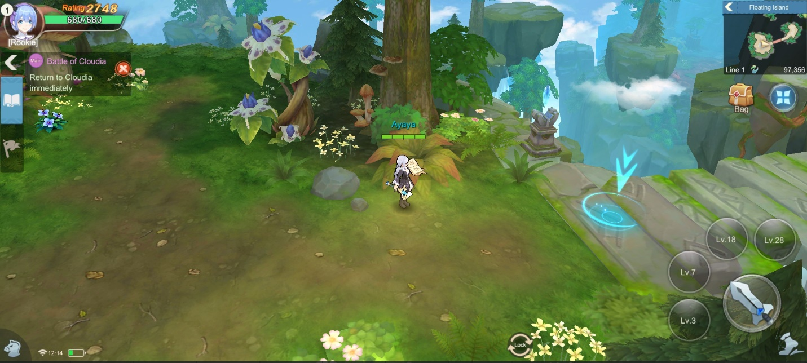
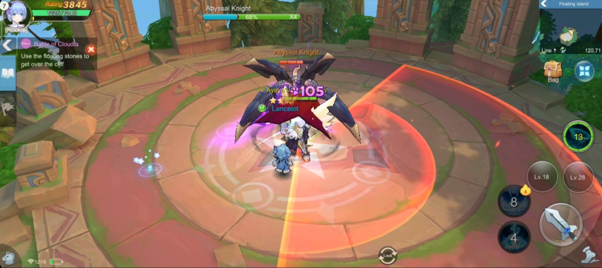

Panduan Cloud Song Saga of Skywalker untuk Pemula

Wow, ada game imut baru yang bergenre MMORPG lagi, nih. Sepertinya bulan
ini menjadi surga bagi pecinta game MMORPG, ya? Kali ini giliran game
berjudul Cloud Song : Saga of Skywalker unjuk gigi. Game ini merupakan
buatan developer VNG Game Publishing yang rilis secara global pada
tanggal 6 September lalu. Meski terhitung baru, game ini berhasil
menggaet hingga 10.000 kali unduhan, lho! Keren banget, kan?

Kalau kamu familiar dengan game seperti The Legend of Neverland,
tentunya suasana di game ini tidak akan membuat kamu kaget karena
tingkat kemiripan yang cukup signifikan bisa kamu lihat bahkan ketika
baru memilih class. Tapi, tentu saja game ini punya keunikan yang
membedakan game ini dengan game lain manapun. Pastinya kamu sudah ingin
tahu apa saja yang bisa kamu lakukan di game ini, kan? Kalau begitu
simak sampai habis, ya!

Tips memilih class

{width="6.5in"
height="2.925in"}

Tentu bukan hal baru jika sebelum memulai game MMORPG kamu perlu memilih
class yang akan menjadi bagian dari karakter kamu dan tidak akan bisa
dipisahkan. Di game ini, setiap class memiliki jumlah bintang yang
menunjukkan kekuatan damage, seberapa tebal pertahanannya, dan yang
terakhir tingkat kesulitan saat kamu mengontrolnya. Karakter yang akan
kamu pilih tidak gender-locked, jadi, kamu bisa mengganti gender untuk
setiap class yang kamu pilih, deh! Kamu juga akan disuguhi dengan lima
pilihan class, apa sajakah itu? Mari kita lihat!

Archer

{width="6.5in"
height="2.925in"}

Kalau kamu pecinta marksman, pastinya class yang satu ini akan menjadi
pilihan favorit kamu, dengan tingkat kesulitan berjumlah dua bintang,
kamu memiliki waktu untuk mempelajari class ini seiring kamu
memainkannya. Damage dari class ini juga tidak bisa diremehkan, dengan
jumlah dua setengah bintang, tentunya musuh bisa lari kocar-kacir saat
berhadapan dengan class ini. Eits, meski begitu kamu sebagai pemilih
class ini harus tetap berhati-hati karena daya tahan dari class ini
berjumlah dua bintang. Kalau kamu lengah, maka karaktermu bisa sirna,
gawat, kan?

Mage

{width="6.5in"
height="2.925in"}

Class satu ini sudah tentu memiliki daya serang atau damage yang tinggi
dan pastinya tidak akan bisa diremehkan. Jumlah tiga bintang penuh untuk
kekuatan damage itu juga menjadi bayaran untuk daya tahan yang sangat
rentan, di mana hanya berjumlah satu bintang setengah. Jadi, kalau kamu
tidak suka menunggu dan kesabaranmu mudah surut, sebaiknya kamu memilih
class lain supaya karakter kamu tidak mudah mati karena gegabah saat
memakai mage. Sebenarnya kunci dari class ini hanyalah kesabaran dan
ketelitian, dengan tingkat kesulitan berjumlah dua bintang, kamu bisa
belajar sabar dan cari celah saat melawan musuh.

Swordsman

{width="6.5in"
height="2.925in"}

Game ini merekomendasikan para pemula untuk memilih class ini, tentu
bukan karena desainnya saja yang keren dan sedap dipandang mata, tapi
karena daya tahan dari class ini paling besar dengan jumlah dua setengah
bintang. Kekuatan damage pun terbilang cukup baik dengan jumlah dua
bintang, ditambah tingkat kesulitan yang hanya dua bintang, pastinya
untuk para pemula yang baru belajar game MMORPG, class ini bisa membantu
peningkatan skill bermain kamu. Meski kamu gegabah sekalipun, class ini
sangat tangguh, jadi tenang saat memainkannya, deh.

Oracle

{width="6.5in"
height="2.925in"}

Menjadi support sepertinya terdengar membosankan karena para player
merasa kurang mendapat tantangan saat menggunakan class ini, ditambah
kekuatan damage yang diberikan hanya sebesar satu setengah bintang,
bisa-bisa waktu yang dibutuhkan akan lama jika ingin menghabiskan musuh,
kan? Tentu saja tidak. Class yang satu ini memiliki tingkat kesulitan
sebanyak tiga bintang penuh, jadi untuk menggunakannya kamu harus paham
fungsi lain dari Oracle selain dari sisi daya serangnya, pastinya bukan
rekomendasi untuk kamu yang masih baru dalam hal bermain game MMORPG.

Sebagai support, Oracle bisa menerapkan crowd control di mana
musuh-musuh yang berjumlah besar bisa terpelanting ke arah yang
diinginkan oleh player. Tak hanya itu, meski terlihat seperti squishy,
daya tahan oracle bisa mencapai tiga bintang penuh karena class ini
merupakan spesialis untuk healing, meskipun darah sudah menipis, bukan
masalah bagi oracle untuk terus menambah darah sampai musuh habis tak
bersisa.

Rogue

{width="6.5in"
height="2.925in"}

Kecepatan adalah kunci, itulah yang menjadi motto dari class Rogue ini.
Sebagai assassin, damage yang diberikan juga tidak main-main yaitu,
sebanyak tiga bintang penuh. Sama seperti Mage, damage besar dari Rogue
ini menjadi bayaran untuk daya tahannya yang hanya sebanyak dua bintang.
Jarak serang dari class ini cukup pendek jadi kalau kamu ingin memilih
class ini harus ekstra hati-hati, ya!

Jika biasanya role assassin sangat sulit untuk di kuasai, di game ini
Rogue hanya diberi satu bintang setengah untuk tingkat kesulitan. Cocok
untuk kamu yang ingin melibas banyak musuh tanpa takut kamu tidak bisa
mengontrol karaktermu dengan mudah.

Kustomisasi yang menggemaskan

Sesi yang mengasyikan ini tentunya tidak bisa kita lewatkan dari
bahasan, kustomisasi karakter! Cihuy! Kamu bisa membuat karakter sesuai
dengan selera kamu, mulai dari mata sampai ukuran tubuh. Memang tidak
berpengaruh pada statistik kamu, sih. Tapi, setidaknya kamu bisa
merasakan kedekatan kamu dengan karakter buatanmu tersebut selama kamu
berada di dalam permainan, jadi kamu tidak akan bosan dan kamu punya
motivasi tinggi saat akan bermain game ini.

{width="6.5in"
height="2.925in"}

Kalau kamu bingung karena pilihan yang banyak, kamu juga bisa mencoba
random di bagian kanan atas layar, lakukan sampai kamu merasa cocok
dengan selera kamu. Jangan lupa bikin karakter milik kamu jadi cantik
dan tampan, ya. Hihihi.

Perawatan karakter

Sudah didandani sampai tampan dan cantik, kamu bisa pelajari lebih dalam
bagaimana supaya karakter kamu menjadi kuat. Kekuatan karakter kamu
diakumulasikan dengan BP yang akan terus bertambah setiap kali kamu
menyelesaikan quest atau mendapat item dengan kualitas yang bagus.
Semakin kuat karakter kamu, semakin mudah kamu melibas para musuh.
Pastinya bikin kamu satisfying saat menghabisi musuh yang banyak itu,
kan?

Pemakaian skill yang optimal

Kamu pasti sudah tahu kalau berbeda class maka berbeda pula skill yang
dimiliki karakter tersebut. Uniknya game ini, skill dari class kamu
sudah ditentukan akan terbuka di level-level tertentu yang sudah
ditentukan. Maka dari itu kamu perlu ikuti tutorial yang ada di game ini
sampai kamu bisa membuka semua skill dari karakter kamu. Semakin rajin
kamu menjalankan quest, semakin banyak EXP yang bisa kamu dapatkan dan
akhirnya kamu bisa mencoba semua skill dari karakter kesayangan kamu.

{width="6.5in"
height="2.925in"}

Tips melawan musuh

Mungkin bukan masalah besar jika musuh yang kamu hadapi merupakan
musuh-musuh kecil dengan jumlah banyak, namun akan lain ceritanya saat
kamu berhadapan dengan boss yang tentu pola serangnya akan jauh berbeda
dari musuh-musuh kecil tersebut. Jika ingin mengalahkan boss tersebut
dengan mudah, kamu cukup perhatikan area di sekitar boss yang lambat
laun akan berubah warna, semakin merah warnanya, maka saat itulah kamu
harus menjauh dari area tersebut. Setelah itu kamu bisa menyerangnya
dengan skill dari karakter kamu dengan memperhatikan jarak serang yang
dimilikinya.

{width="6.5in"
height="2.9in"}

Misi-misi yang unik

Selain misi untuk memberantas para musuh, kamu juga akan dapat misi
untuk menyamar menjadi musuh kamu tersebut, lho. Tujuannya hanya supaya
kamu bisa mengetahui kelemahan musuhmu tersebut. Psst, kalau kamu suka
spoiler, nantinya ada misi di mana kamu menyamar menjadi musuh yang
bentuknya seperti kol dan kamu akan menguping pembicaraan para musuh
tersebut.

Tidak ketinggalan fitur auto-battle yang penuh kritik, kalau kamu tipe
player yang ingin bersantai saat Away From Keyboard alias AFK, gunakan
fitur tersebut sehingga kamu tetap bisa mendapat material-material
penting seperti EXP ataupun item untuk peningkatan BP dari karakter
kesayangan kamu.

Kesimpulan

Game ini bisa menjadi angin segar untuk kamu yang tidak ingin merasa
terancam saat game melakukan render grafik karena game ini ramah dengan
device berspek kentang alias pas-pasan. Supaya pengalaman kamu lebih
bermakna lagi saat bermain game ini, jangan ragu untuk mencoba emulator
game Android LDPlayer, ya! Software yang ringan dari LDPlayer ini bisa
membantu kamu untuk memainkan game khusus android di PC dan laptop kamu,
seru banget, deh, pastinya.

Dari keseluruhan game ini, bisa dibilang sistem permainan yang
diterapkan tidak jauh berbeda dari game The Legend of Neverland. Apalagi
game The Legend of Neverland sendiri pernah dibilang menirukan game
besar sekelas Genshin Impact yang kualitasnya tentu sudah sangat tinggi.
Meski begitu, bukan berarti game ini tidak bagus untuk dimainkan, lho.
Dengan adanya game ini, tentunya bisa jadi alternatif saat ekspektasi
kamu dengan game lain tidak tercapai. Bisa jadi, game inilah jawaban
dari ekspektasi kamu! Maka dari itu, jangan sampai ketinggalan keseruan
dari game ini, ya! Selamat bermain!
