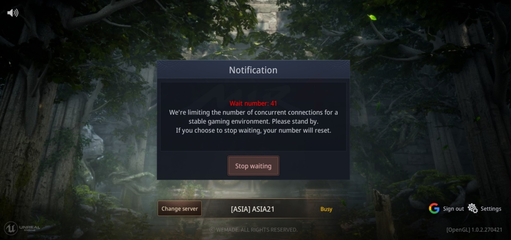
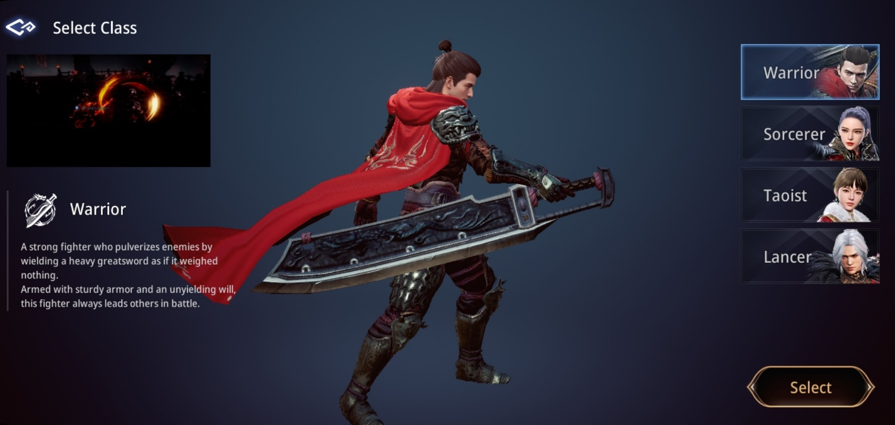
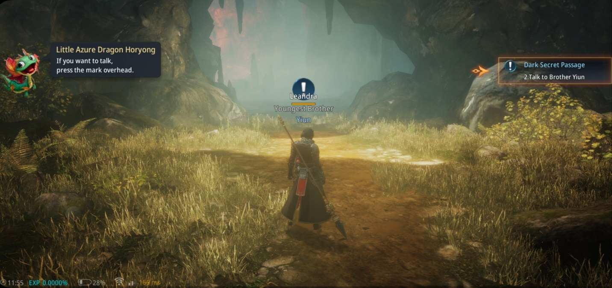
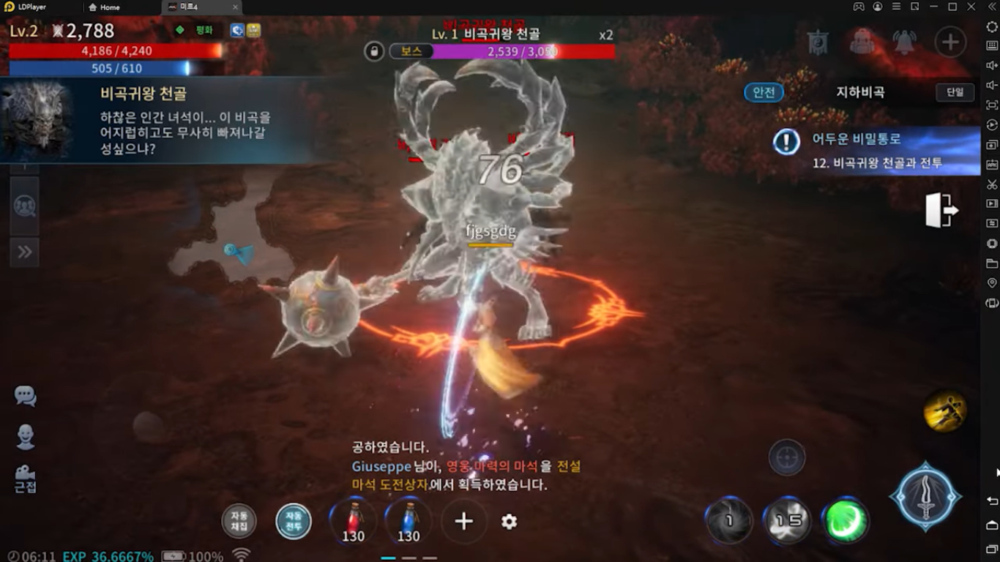
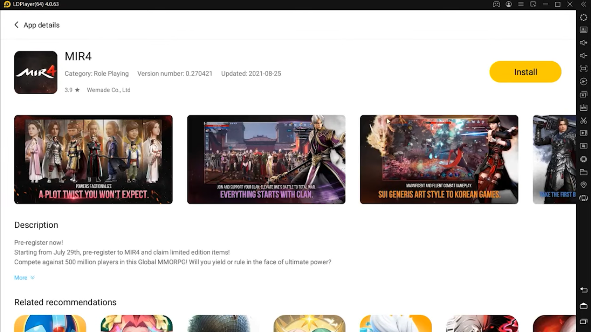

**Panduan MIR4 untuk Pemula : dari Pemilihan Server hingga Medan
Pertarungan**

MIR4 sudah rilis secara global, nih! Pasti kalian para gamer sudah tidak
sabar untuk merasakan serunya berpetualang dan menyelesaikan misi di
game ini, kan? Pastikan juga kamu terbuka dengan informasi yang datang
mengenai game ini karena ada banyak hal yang perlu kamu ketahui supaya
karakter bentukan kamu bisa menjadi lebih kuat. Wemade Co., Ltd sebagai
developer telah menyiapkan sistem-sistem unik di dalam game yang bisa
kalian eksplor.

Pada 26 Agustus 2021 kemarin, MIR4 rilis secara global setelah masa
pra-registrasi yang berlangsung sejak 29 Juli telah selesai. Seperti
game RPG kebanyakan, MIR4 menyediakan empat class untuk kamu pilih
sebelum masuk ke dalam game. Class yang kamu pilih akan menjadi bagian
permanen untuk karakter kamu. Pastinya sudah penasaran banget, kan, apa
saja yang bisa kamu pelajari di MIR4? Kita cari tahu, yuk!

**Proses Sebelum Masuk ke Dalam Game**

Sebelum kamu bergabung dengan player lainnya, kamu akan memilih server
yang telah disediakan. Akan ada server yang penuh dan memasukan kamu ke
dalam antrean. Supaya kamu bisa cepat bergabung ke dalam game,
perhatikan angka berwarna merah, carilah server dengan angka yang paling
kecil di antara server lainnya karena angka tersebut adalah urutan kamu
yang akan semakin kecil jumlahnya, jika kamu sudah berada di angka satu
maka kamu hanya perlu menunggu sepersekian detik untuk bisa langsung
masuk ke dalam game.

{width="6.5in"
height="3.063888888888889in"}

**Memilih Class**

Sudah bergabung, saatnya memilih class apa yang akan menjadi andalan
kamu di dalam game. Kamu akan diberi pilihan class yang terdiri dari
Warrior, Sorcerer, Taoist, dan Lancer. Setiap class memiliki keunikan,
kekurangan, dan kelebihannya masing-masing. Pilihlah class yang sesuai
dengan gaya bermain kamu. Jika kamu masih sangat-sangat baru dalam
bermain MMORPG, kami sarankan untuk memilih Warrior karena memiliki
defense dan damage yang cukup tinggi.

{width="6.5in"
height="3.089583333333333in"}

**Kustomisasi Karakter**

Bagian paling seru bagi kamu yang suka mendandani sebuah karakter, betul
sekali, kustomisasi! Setelah kamu sudah yakin atas pilihan class yang
telah disebutkan, kamu akan langsung dipindahkan ke menu kustomisasi.
Karakter tampan dan cantik kamu bisa kamu "operasi plastik", bahkan kamu
bisa mengganti warna pakaian karaktermu, *lho*. Tapi bagian ini hanya
untuk kecantikan semata, tidak akan berpengaruh pada statistik karakter
kamu. Kalau kamu sudah selesai, zoom out dan lihat betapa mengagumkannya
hasil karya kamu.

**Hapus dan Buat Karakter Baru**

Apa? Kamu bosan dan tidak suka dengan karakter yang kamu miliki
sekarang? Tenang, kamu bisa menghapus karakter kamu dan membuat yang
baru. Kalau kamu sudah bertekad untuk menghapus karaktermu, kamu bisa
buka di bagian pilihan karakter dan menghapusnya. Setelah itu kamu akan
diberi waktu selama 72 jam atau tiga hari jika kamu berubah pikiran dan
ingin menggunakan karakter itu lagi.

Sebenarnya, untuk setiap akun yang ada, MIR4 telah menyediakan lima slot
karakter yang tidak memiliki sinkronisasi antar satu sama lain, jadi
kamu bisa merasakan gaya permainan dari class yang belum pernah kamu
coba sebelumnya.

**Menyelesaikan Misi**

Karaktermu yang sudah didandani itu sudah siap untuk masuk ke dalam
permainan, sambil menunggu loading, kamu akan disuguhi dengan intro yang
memiliki grafik indah. Grafik indah tersebut akan terus bertahan sampai
kamu akhirnya bisa mengontrol karaktermu dan menjalankan misi yang tentu
saja sangat penting jika kamu ingin cepat-cepat naik level dan
mendapatkan gear dengan level tinggi.

**Misi Utama**

Misi ini bisa kamu lakukan dengan cara mengeklik area biru di bagian
kanan. Ketika kamu sudah menyelesaikan misi ini, kamu tidak bisa lagi
melanjutkannya. Misi ini bisa jadi tumpuan kamu untuk menaikkan level
karaktermu dengan cepat karena jumlah EXP yang diberikan dari misi ini
paling banyak di antara misi yang lainnya.

{width="6.5in"
height="3.063888888888889in"}

**Misi Sampingan**

Misi ini merupakan misi tambahan dari misi utama yang akan memberikan
kamu EXP dan berbagai macam item tergantung tingkat kesulitannya. Buka
tab misi dan kamu akan mendapati misi yang terdiri dari Field, Elite,
Labyrinth, dan Feelings. Tergantung dari misinya, kamu bisa melakukan
misi tersebut paling banyak sampai tiga kali.

**Permintaan**

Misi yang satu ini cukup jarang ditemui karena memiliki syarat tertentu
untuk mengaktifkannya. Jika syarat tersebut sudah terpenuhi di misi
utama, kamu hanya perlu mengikuti clue yang akan mengarahkanmu ke misi
permintaan.

**Giyeon**

Misi unik yang satu ini sangat menyenagkan untuk kamu ikuti karena akan
ada kejadian menarik yang tersembunyi dari cerita utama. Buka tab Giyeon
di menu untuk melihat progress kamu di misi ini. Tentunya akan ada
hadiah tambahan setelah kamu menyelesaikan 100% progress dari misi
Giyeon.

**Informasi Karakter**

Supaya kamu lebih dekat dengan karaktermu, kamu bisa rajin melihat
statusnya di bagian informasi karakter yang ada di kiri atas layar. Di
situ kamu bisa melihat berapa skor propensity kamu, semakin kecil
skornya, semakin besar pinalti yang didapat saat berburu EXP atau saat
karaktermu mati.

**Skor Propensity**

Propensity diberlakukan untuk menjaga kenyamanan player satu sama lain,
skor propensity teratas berjumlah setidaknya 5000 poin yang bisa membuat
karaktermu mendapat 100% EXP. Jika skormu berada di -10000 poin atau
propensity terendah, kamu hanya bisa mendapat 30% dari total EXP. Kamu
bisa menambah poin tersebut dengan cara mengalahkan monster yang
levelnya tidak jauh dari level karaktermu, maksimal berbeda lima level,
kalau lebih, kamu tidak akan mendapat tambahan poin untuk skor
propensity.

Selama kamu tidak jahil dengan membunuh karakter lain selain monster.
Skor propensity kamu tidak akan turun, maka dari itu jaga perilaku kamu
di game ini, ya!

**Medan Pertarungan**

Sistem pertarungan di MIR4 yang sulit dipelajari ini tentunya juga sulit
untuk dikuasai. Setiap class memiliki basic attack dan tipe skill yang
berbeda. Ikon attack yang ada di pojok kanan bawah digunakan untuk
menyerang musuh yang berada di dekat karaktermu, kalau kamu menyentuh
skill yang ada di dekat ikon tersebut, maka skill itu akan digunakan si
karakter dan muncul waktu cooldown di dalamnya.

{width="6.5in"
height="3.654166666666667in"}

**Pengaplikasian Skill**

Tentunya hal yang satu ini menjadi bagian penting dari game MMORPG.
Dengan skill, kamu bisa menciptakan kombo-kombo yang berbeda dan
tentunya memiliki damage yang besar ketika disatukan. Setiap skill
memiliki after-effect yang berbeda dan bisa kamu gunakan untuk
menaklukan musuh dengan cepat. Ketika kamu mencapai poin tertentu, musuh
akan mendapat debuff dan kamu bisa langsung menggunakan skill untuk
memberikan damage besar karena efek peningkatan damage yang kamu dapat
setelah musuh debuff.

Efek lain dari skill karaktermu adalah knock down, musuh kamu akan jatuh
dan kesempatan tersebut bisa kamu manfaatkan untuk menyerang ataupun
lari dari arena. Ada juga skill yang bisa mengurangi kecepatan gerak
dari musuh, kamu bisa memanfaatkan waktu yang ada untuk memikirkan
langkah apa yang akan kamu ambil terhadap musuhmu tersebut.

Supaya suasana permainan yang kamu dapatkan semakin seru, kamu bisa
mengunduh LDPlayer di PC atau laptop kamu, di sana kamu bisa mengaturnya
di pengaturan makro dan mengustomisasi keybind atau pengaturan tombol
keyboard dengan menyesuaikan gaya permainan kamu.

{width="6.5in"
height="3.654166666666667in"}

**Pengaturan Target**

Saat bertarung, kamu bisa memilih target mana yang akan kamu serang
terlebih dahulu dengan cara mengeklik ikon untuk mencari daftar target
yang sedang kamu hadapi. Jika kamu sudah memilih target tujuan kamu,
kamu akan otomatis menyerangnya. Kamu bisa menutup tab target dengan
mengeklik tanda X.

Cara lain yang bisa kamu gunakan adalah metode tap, jika kamu sudah
menguasainya, berhadapan dengan musuh menjadi masalah kecil yang tidak
akan kamu takuti sama sekali.

**Auto Battle**

Sistem yang satu ini mendapat banyak sekali kritik dari pecinta game
MMORPG, meski begitu, sistem ini bisa membantu kamu saat kamu menutup
game atau AFK untuk grinding dan mendapatkan EXP, loot, maupun item
penting lainnya. Saat early-game, auto battle memang berguna tapi
usahakan kamu tidak terlalu bergantung terhadap sistem ini, ya. Kalau
kamu terlalu bergantung, bisa-bisa sumber daya yang kamu dapatkan akan
kecil. Semakin kamu berusaha untuk maju di dalam game ini, semakin maju
pula auto battle saat melawan musuh.

Saat kamu akan mengaktifkan auto battle, pastikan skill-skill yang
tertera merupakan skill yang paling kamu andalkan di bagian quick slot
untuk skill.

**Kesimpulan**

MMORPG apapun akan menuntut kamu untuk mengenal lebih dalam setiap
karakter dan sistem permainan yang ada. Sebagai pemula, mempelajari
dengan tekun dan sabar menjadi kunci agar karakter kamu menjadi lebih
kuat. Dengan memadukan sistem PvE dan PvP, kamu perlu memikirkan
terlebih dahulu class yang akan kamu pilih. Pahami gaya bermainmu dengan
class yang tersedia, jika tidak sesuai, kamu bisa kesulitan selama
berada di dalam pertarungan.

Dengar-dengar, akan class baru bernama Archer, *lho*! Wah, makin seru,
kan, kedengarannya? Makanya, jangan sampai ketinggalan untuk bermain
game ini dan merasakan serunya bertarung dengan karakter favoritmu, ya!
Selamat mencoba dan selamat bermain!
