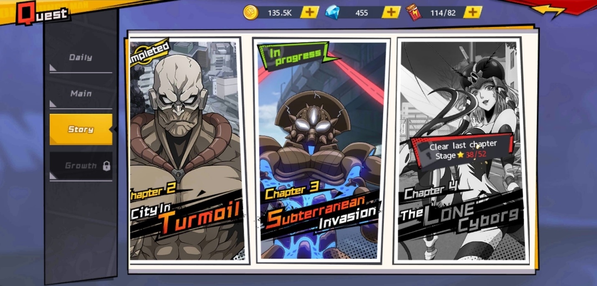
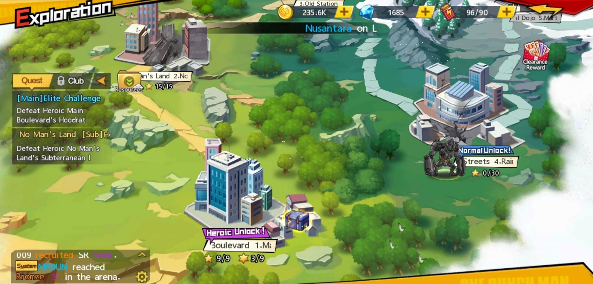
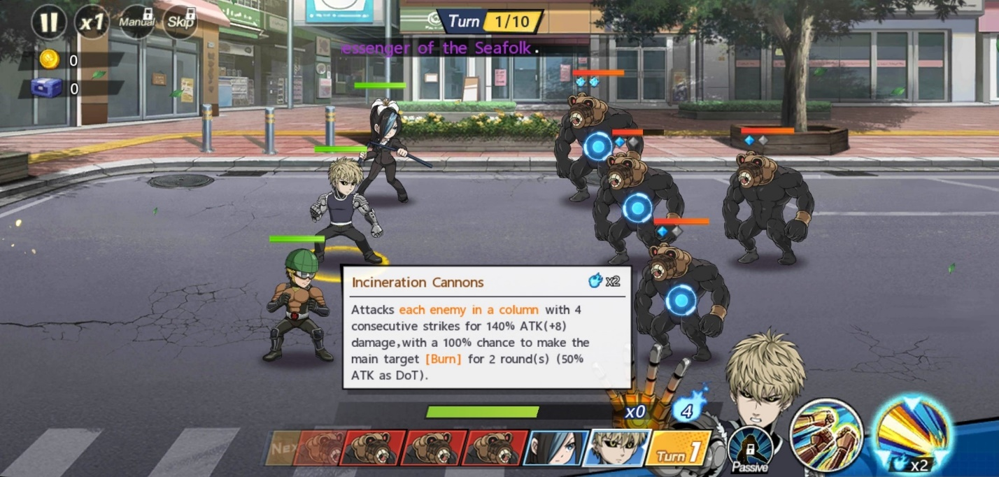
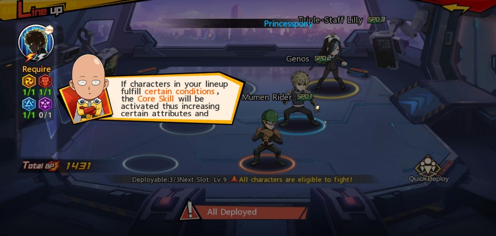
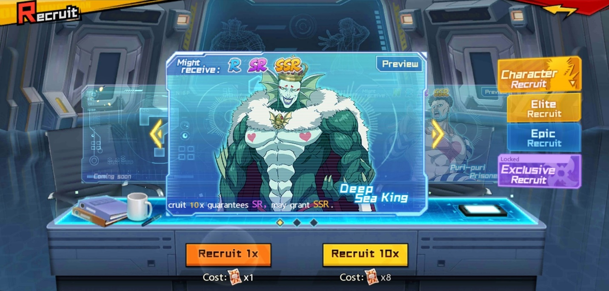
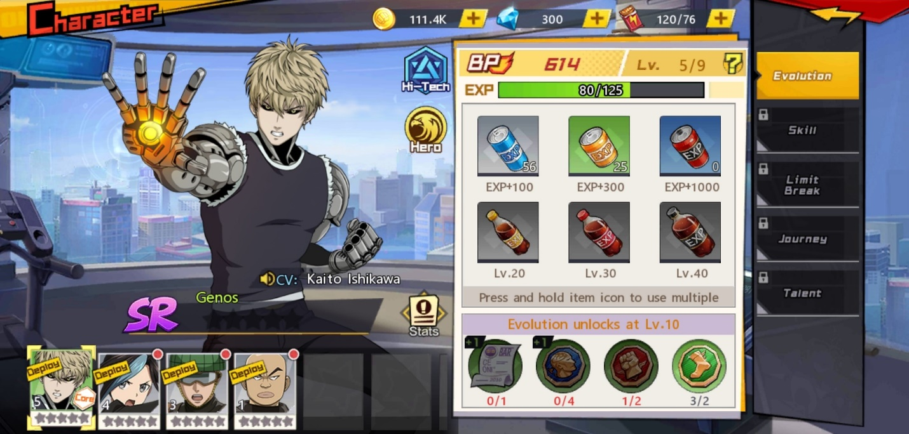

**Panduan Sebelum Beraksi di One Punch Man : The Strongest **

Para otaku pastinya sudah tahu dong kalau anime terkenal One Punch Man
diadopsi ke dalam game? Kalau kamu belum tahu, sesuai judulnya, anime
ini menceritakan tentang pahlawan botak bernama Saitama yang punya
kekuatan sangat besar sampai-sampai ia bisa mengalahkan musuhnya hanya
dengan satu pukulan. Wuih, kira-kira gimana serunya anime ini ketika
dijadikan game, ya?

Game yang dibuat oleh developer GREE, Inc. dan disebarluaskan oleh
Fingerfun Limited ini memiliki jalan cerita yang sesuai dengan animenya,
bahkan ada beberapa *scene* yang diambil dari anime ini secara langsung,
*lho*. Game ini juga memiliki sistem gacha, di mana nanti kamu bisa coba
keberuntungan kamu untuk mendapatkan karakter berkualitas tinggi atau
yang menjadi favorit kamu, seru banget pastinya. Kira-kira seperti apa
ya game-nya? Kita cari tahu, yuk!

**Perjalanan melawan para musuh**

Ketika kamu baru masuk ke dalam game, kamu akan langsung disuguhi dengan
*scene* dari anime One Punch Man yang menggambarkan keadaan kota yang
terkena bencana, usut punya usut, setiap bencana tersebut selalu
diakibatkan oleh satu atau sekelompok mahluk jahat yang ingin mengganggu
keamanan penduduk demi keuntungan sendiri. *Scene* itu nantinya akan
membawa kamu langsung ke dalam pertarungan dengan musuh.

***Story quest***

Pertarungan yang akan kamu lakukan pertama adalah melawan boss yang ada
di *story quest*. Jika kamu memainkan quest ini, kamu bisa mengetahui
jalan cerita dari One Punch Man sedikit demi sedikit karena akan ada
*scene* seru yang diambil langsung dari anime tersebut. Tak hanya itu,
kamu juga bisa dapat banyak *rewards* setelah selesai, *lho*. Tapi
sebelum kamu bisa memulai *story quest* selanjutnya, kamu harus
menyiapkan sejumlah bintang yang diperlukan untuk membuka quest
tersebut. Bintang-bintang itu bisa kamu dapatkan melalui eksplorasi.

{width="6.5in"
height="3.11875in"}

**Eksplorasi**

Eksplorasi ada di bagian kiri bawah layar ketika kamu masih berada di
lobi. Nantinya, kamu akan berpindah dari satu area ke area lain ketika
musuh sudah kamu kalahkan di area sebelumnya. Sebelum melawan boss di
area tersebut, kamu akan ditemukan dengan musuh-musuh kecil yang harus
kamu libas terlebih dahulu, ketika kamu selesai mengalahkan para musuh,
akan tiga bintang yang menyala ketika kamu berhasil mengalahkan seluruh
musuh, di satu tim kamu tidak ada yang mati, dan kamu bisa menyelesaikan
pertarungan tidak lebih dari beberapa putaran yang ditentukan. Jumlah
bintang yang kamu dapat akan diakumulasikan saat kamu ingin membuka
*story quest*, jika kurang, kamu harus kembali ke area yang belum kamu
tuntaskan bintangnya.

{width="6.5in"
height="3.122916666666667in"}

***Tutorial* langsung dari Saitama**

Sebagai karakter utama di anime, otomatis Saitama menjadi maskot di
dalam game ini. Ketika kamu baru memulai game, Saitama akan mengajari
kamu beberapa hal penting yang akan menjadi batu loncatan kamu untuk
berkembang di dalam game ini. Apa saja sih yang diajarkan oleh pahlawan
botak ini?

**Menggunakan kekuatan**

Sebelum kamu mendapat karakter untuk kamu pasangkan di *line-up* kamu,
Saitama akan menunjukkan cara mengalahkan musuh dengan menggunakan skill
yang ada di pojok kanan bawah layar kamu. Selain skill, ada juga
ultimate yang memerlukan energi jika kamu ingin memakainya, jumlah
energi tersebut beragam, tergantung damage yang dihempaskan karakter itu
kepada musuh.

Saitama juga menjelaskan kalau skill dan ultimate setiap karakter
memiliki efek dan gaya serang yang berbeda-beda. Ada yang menyerang
perderet atau perbaris, menyerang satu target, dan juga memberi buff ke
salah satu anggota tim. Kamu bisa lihat efeknya dengan menekan skill
atau ultimate yang ingin kamu ketahui selama beberapa detik, maka akan
muncul deskripsi dari skill atau ultimate tersebut.

{width="6.5in"
height="3.104861111111111in"}

**Menyusun *line­-up***

Sudah mengerti cara menggunakan skill, Saitama akan mengajari kamu
bagaimana menyusun *line­-up* tim kamu, sebelum itu kamu akan disuruh
mencoba gacha terlebih dahulu. Karakter di dalam gacha tersebut akan
memiliki tingkat *rarity* yang ditunjukkan melalui jumlah bintang.
Bintang yang jumlahnya tiga memiliki *rarity* R atau *rare*, lalu yang
berjumlah empat memiliki *rarity* SR atau *super rare*, dan yang
terakhir tentu saja yang paling berkelas dengan jumlah lima bintang
yaitu SSR atau *super super rare* bisa juga *super special rare.*

Karakter SR yang sudah pasti kamu dapatkan adalah Genos, murid dari
Saitama yang merupakan *cyborg*, skill dari Genos adalah pukulan dari
tangan besinya yang bertubi-tubi, sedangkan ultimate-nya adalah tembakan
berdaya hantam besar ke satu deret musuh. *Line-up* kamu nanti akan
memiliki core yang mana jika kamu sesuaikan dengan kebutuhan dari
karakter core kamu tersebut, jika terpenuhi, akan ada buff yang
dihasilkan saat berada di dalam pertarungan.

{width="6.5in"
height="3.0965277777777778in"}

Meski karakter utama, Saitama tidak akan bisa kamu masukan ke dalam
*line*­*-up* kamu, bisa-bisa kamu mudah bosan karena Saitama hanya perlu
satu pukulan ke musuh dan langsung menang. Tapi kamu bisa minta bantuan
Saitama ketika musuh yang kamu hadapi terlalu sulit untuk dikalahkan.

**Mendapatkan karakter yang kuat**

Sebelum bisa membuat tim yang kuat tentunya kamu butuh karakter-karakter
kuat selama perjalanan kamu bertarung melawan para musuh. Dengan sistem
gacha, kamu bisa mendapatkan karakter-karakter unik yang bisa kamu
masukkan ke dalam tim kamu.

**Sistem *gacha***

Seperti undian, kamu butuh tiket sebelum melakukan penarikan karakter
atau gacha ini. kalau kamu beruntung, kamu bisa mendapat karakter
berbintang lima atau SSR. Di game ini, gacha disebut dengan recruit,
akan ada tiga macam recruit yang bisa kamu coba yaitu, elite recruit,
epic recruit, dan exclusive recruit. Sesuai dengan namanya, tentu saja
exclusive recruit memiliki kualitas karakter yang paling tinggi dan
tiket yang sulit didapatkan.

{width="6.5in"
height="3.115972222222222in"}

**Meningkatkan kekuatan karakter**

Setelah kamu mendapat karakter favorit kamu, kamu bisa menambah BP atau
kekuatannya dengan menaikkan level dari karakter tersebut. Di level
tertentu, kamu bisa mendapatkan *limit-breaker* di mana kualitas
karaktermu bisa bertambah seiring bertambahnya BP dari karakter
tersebut. Untuk menaikkan level karaktermu sangatlah mudah, kamu hanya
butuh minuman kaleng pemberi EXP yang bisa kamu dapatkan setelah kamu
menyelesaikan quest-quest tertentu dan pastinya jumlah kaleng EXP
tersebut tidak sedikit.

{width="6.5in"
height="3.109027777777778in"}

**Kesimpulan**

Game dengan nuansa anime ini sangat menarik untuk dimainkan karena bukan
hanya karakternya saja yang digunakan tetapi para pengisi suaranya pun
ikut andil dalam pembuatan game ini dan pastinya membuat suasana game
ini menjadi familiar bagi penggemar One Punch Man. Kamu tetap bisa
bersantai ketika memainkan game ini karena sistem auto bisa membantu
kamu melawan musuh dengan mudah.

Tentunya jika kamu sedang ingin melakukan aktivitas di *handphone* dan
tetap ingin bermain game ini, kamu akan kesulitan melakukannya secara
bersamaan, untuk itu kamu bisa mencoba emulator game android LDPlayer di
laptop atau PC dan unduh game ini ke dalamnya kamu supaya kamu tetap
bisa melakukan ke dua aktivitas tersebut dalam waktu yang bersamaan
tanpa kesulitan apapun. Pastinya seru banget, kan? Makanya, jangan
sampai ketinggalan serunya bermain game ini, ya!
