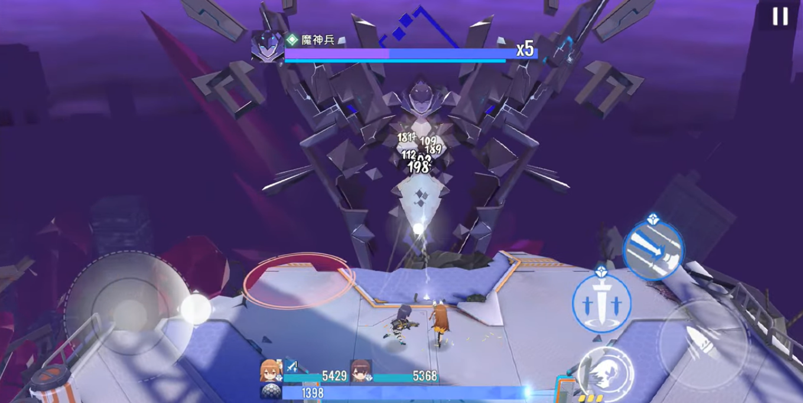
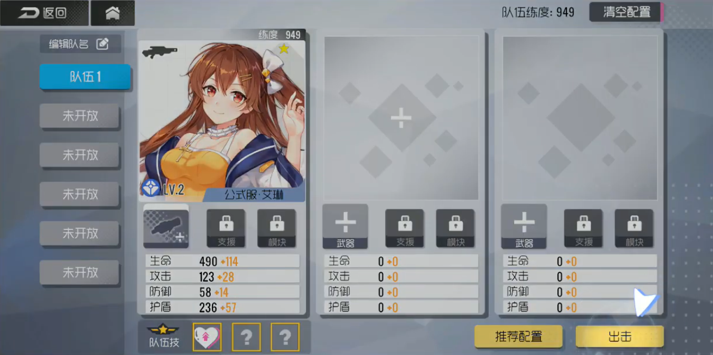
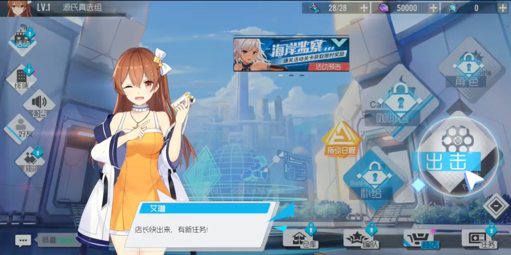
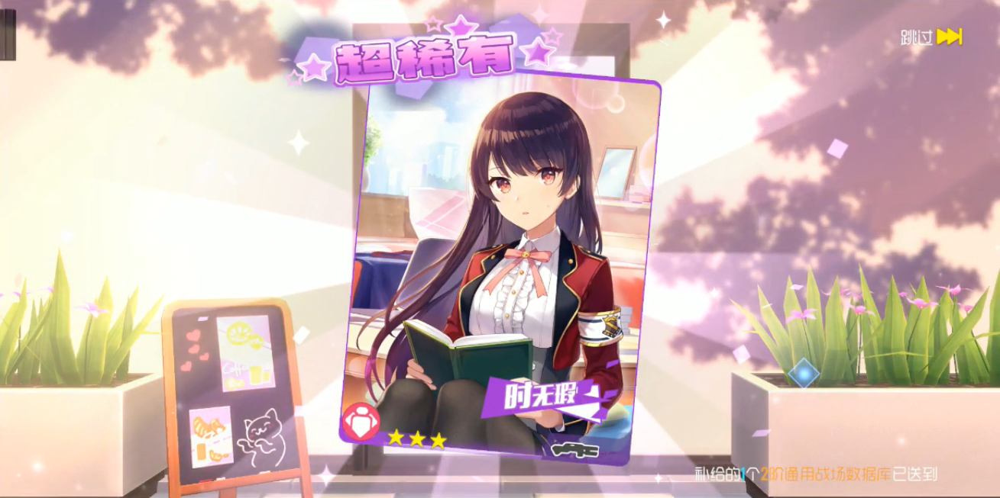

**Persiapkan Diri Kamu untuk Pertarungan Seru di Girl Cafe Gun**

Game dengan nuansa animasi Jepang datang lagi, nih. Kali ini
karakter-karakter imut di Girl Cafe Gun akan mengajak kamu untuk ikut
berperang melawan musuh-musuh demi menyelamatkan kota. BILIBILI sebagai
developer sudah membuka pra-registrasi untuk game ini di Google Play
Store sejak 12 Agustus lalu. Sebenarnya game ini sudah merilis versi
bahasa Jepang dan hanya beberapa negara di Asia Timur yang bisa
mengaksesnya. Akhirnya karena semakin banyak peminat, game ini akan bisa
diakses juga di Indonesia dan negara-negara lainnya.

Kalau kamu pernah bermain Azur Lane, pastinya sudah tidak asing lagi
ketika memainkan game ini karena sistem permainannya tidak jauh berbeda.
Tak lupa juga sistem gacha sebagai pemanis setiap game RPG. Selain itu
kamu juga bisa membangun Cafe yang cocok dengan seleramu, *lho*. Wah,
seru banget, kan? Kita intip apa saja yang akan kita temui di game ini,
yuk!

***Gameplay* yang apik**

Sudut pandang game tembak menembak ini adalah *top-down* di mana kamu
akan mengontrol karakter kamu dari kamera yang berada jauh di atas
karakter tersebut. Setiap permainan, kamu akan mengontrol tiga karakter
sekaligus yang memiliki peran masing-masing. Meski statistik setiap
karakter berbeda, mereka akan berbagi bar *shield* yang akan recover
jika tidak terkena serang musuh, tetapi jika bar tersebut habis maka
darah dari karakter kamu lah yang akan berkurang saat terkena serangan
musuh tersebut. Ketika HP dari karakter kamu sudah ada di titik 0,
karaktermu mati dan tidak bisa dipakai sampai permainan selesai sehingga
akan lebih baik jika mengulang *stage* dari awal.

{width="6.5in"
height="3.2604166666666665in"}

Tak lupa sistem auto yang bisa kamu nyalakan ketika melawan para musuh,
saat melawan boss, sebaiknya kamu lakukan secara manual karena tingkat
kesulitan yang jauh berbeda dengan musuh-musuh kecil lainnya. Meski
begitu, kamu tetap bisa menyalakan auto dengan tetap mengontrol arah
pergerakan karakter-karakter kamu.

**Pembentukan Tim**

Supaya tidak repot, kebanyakan dari kamu lebih memilih untuk membentuk
satu tim yang serba bisa, untuk itu saat kamu akan membentuk tim kamu
nanti, perhatikan setiap statistik yang dimiliki masing-masing karakter
dan sesuaikan dengan keperluan kamu saat bertarung melawan para musuh
nantinya.

{width="6.489583333333333in"
height="3.2395833333333335in"}

Jika kamu ingin meningkatkan statistik karakter kamu, kamu bisa dapat
EXP setelah bertarung melawan para musuh. Limit break untuk meningkatkan
kualitas karakter kamu bisa didapat dari material yang bisa kamu cari di
setiap stage sampai kamu bisa menaikkan level karakter kamu ke level
paling tinggi. Kamu juga bisa melakukan Awaken terhadap karakter kamu
dengan dupe supaya skill dari karakter tersebut meningkat.

Ketika kamu sering memberi hadiah kepada karakter kamu, skor Affinity
dari karakter tersebut bisa bertambah sampai sepuluh. Nah, saat sudah
berada di sepuluh Affinity, kamu bisa pasangkan support untuk karakter
imut kamu tersebut sehingga beberapa statistik dari support itu akan
berpindah ke karakter pilihan kamu.

**Konten-konten seru**

Seperti game RPG kebanyakan, game ini menyediakan main story atau cerita
utama di mana petualanganmu sejak kamu baru memulai game ini dimulai,
resource stage atau bisa juga disebut bounty hunt sebagai tempat kamu
mencari item atau material penting untuk karakter kesayangan kamu, PvE
ranking yang berisi nama dari deretan player-player yang sudah menempati
posisi tinggi di setiap server, dan ada juga Co-op di mana kamu bisa
bermain bersama dengan player lain.

Selain itu kamu akan selalu disuguhi art-art keren selama loading screen
berlangsung, jadi tidak perlu takut bosan ketika kamu menunggu proses
loading yang terdengar membosankan.

{width="6.5in"
height="3.2527777777777778in"}

**Membuat Cafe**

Sudah terpampang nyata dari judulnya, konten yang satu ini tentunya
menjadi daya tarik tersendiri untuk kamu yang ingin sekali bersantai
setelah pertarungan sengit melawan para musuh. Betul sekali, cafe! Kamu
bisa lho membentuk sendiri cafe yang sesuai dengan selera kamu, kamu
juga bisa membiarkan karakter-karakter imut kamu berkeliling di dalam
cafe tersebut, pasti bikin gemas sekali, kan?

Selain untuk cuci mata, cafe ini juga bagian pasif untuk menambah koin
dan affinity untuk karaktermu, kamu jadi bisa bersantai bersama
karakter-karaktermu dan meningkatkan affinity mereka di waktu yang
bersamaan. Psst, kamu juga bisa mengontrol salah satu karakter kamu saat
berada di dalam cafe, *lho*, jadi kamu bisa lihat bagaimana suasana cafe
buatanmu dari sudut pandang karaktermu tersebut. Wah, seru banget, ya!

**Sistem Gacha**

Pasti ada yang kurang rasanya kalau kamu bermain game RPG tanpa
kehadiran gacha. Di game ini, kamu bisa mencoba peruntungan menarik
perhatian karakter favorit kamu melalui sistem gacha ini. Tentunya kamu
sudah familiar dengan tier karakter seperti R, SR, atau UR, kan? Kalau
kamu sedang beruntung sekali, kamu bisa mendapat karakter UR atau Ultra
Rare yang berbintang empat, selain statistiknya yang sudah tidak
diragukan lagi, animasi dan art dari karakter UR tersebut pastinya
sangat menawan dan bisa bikin kamu terpana.

{width="6.489583333333333in"
height="3.1875in"}

Akan ada sebuah sistem bernama pity di mana kamu sudah dipastikan akan
mendapat karakter dengan tier SR atau UR saat jumlah gacha yang sudah
kamu lakukan sudah mencapai angka tertentu. Untuk tier UR, pity yang
kamu butuhkan di game ini berjumlah 50 kali tarikan gacha. Kabar baik
untuk kamu para pemula, game ini menyediakan gacha khusus pemula, kalau
kamu belum dapat karakter yang kamu inginkan, kamu bisa re-roll sampai
dapat karena gacha ini tidak memberi batasan berapa kali kamu bisa
re-roll secara cuma-cuma.

Selain karakter, ada juga gacha khusus senjata. Tapi, tidak seperti
gacha karakter, di gacha senjata ini belum diterapkan sistem pity, jadi
kamu harus yakin kalau kamu punya keberuntungan yang tinggi saat akan
melakukan gacha senjata ini. Semoga setelah rilis, sudah ada sistem
gacha untuk senjata, ya.

**Kesimpulan**

Melihat potensi game ini yang bisa dibilang cukup tinggi pastinya bikin
kamu semua tidak sabar untuk mencobanya, kan? Selain bersitegang dengan
para musuh, kamu tetap bisa bersantai di cafe buatanmu sendiri bersama
dengan karakter-karakter imut bersuara lucu tersebut. Gameplay dari Girl
Cafe Gun juga tak kalah seru, sistem auto yang bisa kamu andalkan
tentunya bisa membantu kamu selama pertarungan.

Karakter-karakter imut kamu tentunya akan semakin menggemaskan jika
dilihat melalui layar yang lebih lebar seperti di PC atau laptop kamu.
Tapi bisa *nggak* ya game android ini dimainkan di PC atau laptop? Bisa,
dong. Caranya kamu tinggal unduh emulator game android LDPlayer di PC
atau laptop kamu, terus kamu unduh game Girl Cafe Gun, deh, gampang,
kan? Pastinya.

Oh iya, supaya kamu tidak ketinggalan saat game ini rilis, kamu bisa
melakukan pra-registrasi lewat Google Play Store. Saat sudah rilis, kamu
akan dapat notifikasi dan kamu bisa langsung unduh untuk merasakan
langsung gimana serunya game ini. Ayo! Jangan sampai ketinggalan, ya!
