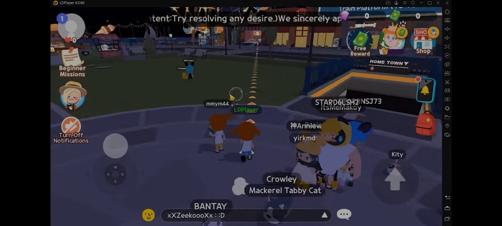

**Play Together, Bermain dan Bertemu Teman Baru di Dunia Game MMO**

Bosan di rumah karena pandemi bikin kamu susah ke luar rumah untuk
bertemu teman-teman? Tenang, developer game Haegin Co., Ltd. punya
jawaban untuk keresahan kamu. Pada tanggal 25 Februari 2021 mereka
merilis game MMO kasual yang bernama Play Together, di sana kamu bisa
bermain dan bertemu teman baru, lo!

Seperti game MMO kebanyakan, kamu akan bermain beriringan dengan banyak
player lain dari berbagai penjuru dunia, kamu juga akan diberi quest
yang kamu bisa selesaikan untuk mendapatkan hadiah, seru banget, kan.
Selain quest, kamu bisa juga bergabung di game party untuk berkompetisi
dengan avatar dari player lain dan menjadi pemenang!

**Pembuatan Avatar**

Sebelum masuk ke dalam game, kamu harus membuat dulu avatar yang kamu
inginkan, bentuk rambut, badan, wajah, serta warna kulit bisa kamu pilih
sesuai keinginan. Dalam pemilihan bentuk avatar nanti, barang-barang
yang bisa kamu pilih tidak akan diberi batasan gender, jadi kamu bisa
bebas memilih tanpa iri melihat barang untuk gender tertentu terlihat
lebih bagus menurut kamu.

Masing-masing bagian tubuh memiliki empat tipe yang bisa kamu pilih dan
satukan di satu avatar. Oh iya, untuk pakaiannya kamu akan diberi kaus
tanpa lengan berwarna putih serta celana pendek berwarna biru, tapi kamu
bisa dapat pakaian yang kamu suka kalau nanti kamu sudah punya cukup
uang untuk membelinya, kok. Setelah selesai membentuk avatar tersebut,
kamu harus memberinya nama yang nantinya jadi nickname kamu di dalam
game.

**Menyelesaikan Quest untuk Pemula**

Nah, sudah punya avatar yang kamu buat, saatnya masuk dan bergabung ke
dunia Play Together, avatar kamu nantinya akan berada di pulau Kaia dan
berdiri membelakangi pintu masuk stasiun kereta bawah tanah, kemudian ia
akan diajak berbicara oleh seseorang yang disebut sebagai Play Together
Manager, ia akan memberi kamu arahan untuk mendatangi nona pemberi
informasi yang setelahnya kamu akan diberi hadiah sebesar 100 stars,
stars ini sendiri merupakan mata uang di dalam game.

Lalu kamu bisa menyentuh note yang ada di bagian kiri atas dan mengecek
tujuh quest untuk pemula, beberapa di antaranya akan melimpahkan kamu
hadiah berupa stars, meski tidak semua quest seperti itu, sih. Kalau
kamu ingin cepat kaya raya, kamu bisa coba menonton iklan dan
mendapatkan hadiahnya sebanyak tiga kali lipat. Selama menjalankan quest
nantinya kamu akan diberi penunjuk jalan agar memudahkan kamu mencari
tujuan yang dimaksud.

{width="4.71875in"
height="2.1795614610673666in"}

Nona Pemberi Informasi. sumber : uptodown

Setelah kamu menyelesaikan quest untuk pemula, kamu akan diberi hadiah
spesial berupa sepeda yang bisa kamu pakai untuk jalan-jalan berkeliling
di pulau Kaia. Lalu, kalau kamu ingin mencari tambahan stars, kamu bisa
rajin-rajin mengumpulkan crowns untuk menambah bar di season pass kamu
agar nantinya kamu mendapat stars atau bahkan gems.

**Bersosialisasi**

Selain menjalankan quest, kamu juga akan diberi rumah secara gratis, lo!
Iya! Rumah kardus kecil itu bisa jadi milik kamu secara cuma-cuma. Eits,
meski di luar nampak kecil, tapi di dalamnya kamu bisa memuat banyak
barang seperti tempat tidur, kursi, lampu, atau barang-barang lainnya
yang nanti kamu beli. Kamu juga bisa membangun rumah yang lebih besar
lagi untuk memuat barang-barang lebih banyak, tentunya jika kamu sudah
punya cukup uang.

Kamu jangan takut kesepian saat berada di area rumah kamu karena di
samping rumah kamu akan ada banyak rumah-rumah lain yang dimiliki oleh
player lainnya, psst, rumah mereka bisa kamu masuki langsung tanpa izin,
lo, tapi jangan ditiru di dunia nyata, ya.

Selain hidup bertetangga, kamu juga bisa main bersama player lain di
game party. Kamu akan berkompetisi dengan player lain untuk menjadi
pemenang teratas. Caranya kamu hanya perlu mengikuti instruksi dan
jangan sampai gagal selama permainan berlangsung. Permainan berlangsung
selama tiga ronde dan kamu akan diberi waktu selama satu sampai dua
menit untuk bertahan menghindari rintangan yang bisa menyebabkan kamu
kalah di dalam game party. Di game party ini kamu juga bisa melihat
berbagai macam bentuk avatar unik yang dimiliki player lain.

Avatar kamu juga bisa bersekolah seperti manusia pada umumnya, bahkan
kamu bisa memilih name tag yang masing-masing terdiri dari principal,
teacher, athlete, cheer leader, student, dan freshman. Jika kamu ingin
memilih name tag principal, kamu harus membayar sebanyak 900 stars.
Selama berada di sekolah, kamu bisa mengikuti setiap pelajaran yang jika
kamu menyelesaikan banyak soal, kamu akan diberi nilai dan mendapatkan
stars.

Jika kamu ingin berinteraksi dengan player lainnya, kamu bisa masuk ke
kolom chat untuk berbincang dengan player secara publik alias semua
player yang ada di dalam server yang sama dengan kamu akan bisa
membacanya dan merespon chat kamu. Kamu jadi bisa saling bertukar
informasi dengan player lain, deh.

Dengan banyaknya fitur-fitur unik di game ini, kamu jadi penasaran
tidak, sih, rasanya bermain di layar yang lebih besar dan tombol-tombol
yang lebih mudah ditekan seperti laptop atau PC kamu? Pastinya
penasaran, dong, bisa tidak, ya? Bisa, kok, caranya kamu cukup mengunduh
emulator LDPlayer ke dalam laptop atau PC kamu, nah, setelah itu kamu
bisa mengunduh langsung game ini dan memainkannya di laptop kamu, seru,
kan? Jangan khawatir, emulator ini cukup ringan sehingga kamu tak perlu
takut laptop kamu terbebani nantinya.

{width="4.6741458880139986in"
height="2.625in"}

Tampilan Play Together di LDPlayer. sumber : Youtube : LDPlayer

**Hewan Peliharaan**

Bukan MMO namanya kalau avatar kamu tidak bisa memiliki pet atau hewan
peliharaan yang setia mengikuti kamu kemanapun kamu pergi. Di Play
Together ini kamu bisa datang ke petshop dan membeli telur yang akan
kamu rawat agar bisa menetas menjadi hewan peliharaan lucu. Penjaga
petshop nantinya akan menawarkan dua jenis telur yaitu, telur biasa yang
bisa kamu dapatkan secara gratis, dan telur premium yang bisa kamu ambil
dengan bayaran sebesar 20 gems.

Sebelum menetas menjadi hewan peliharaan, mereka masih akan berada di
dalam telur yang berjalan mengikuti arah kamu pergi. Jika mereka tidak
berada di samping avatar kamu, kamu bisa memanggil mereka lewat tas
kamu.

Si hewan yang masih berbentuk telur ini nantinya akan meminta kamu
menuruti keinginan mereka seperti mengajak mereka bermain di pantai,
setelah mereka puas bermain, mereka akan memberi kamu hadiah dan mereka
akan menetas ke bentuk asli mereka yang lucu. Kamu juga bisa memberi
mereka nama sesuai dengan keinginan kamu. Selain itu juga, kamu bisa
memberi mereka arahan seperti memanggil mereka untuk menghampiri kamu,
kamu juga bisa mengajarkan mereka trik seperti duduk dan melompat,
tetapi sebelum kamu bisa melakukan itu, kamu harus memberi mereka kasih
sayang sampai level mereka tercukupi yaitu dengan cara menuruti
permintaan mereka, mudah, kan?

{width="5.145833333333333in"
height="2.4375in"}

Hewan yang sudah menetas. sumber : MrGuider

**Konklusi**

Play Together sudah bisa menjadi pengobat rindu kamu yang ingin
bersosialisasi dengan orang banyak secara virtual. Tak hanya sekadar
berbincang-bincang, kamu juga bisa bermain serta belajar di dunia
virtual ini. Kesepian sudah bukan jadi kekhawatiran lagi ketika kamu
sudah berada di dalam game ini. Hari-hari kamu akan terisi dengan
hiburan dari berbagai fitur yang sudah disediakan, kamu bisa bertemu
banyak orang, mengobrol, mencari uang, bermain, dan berbagai macam hal
lain yang mungkin sulit kamu lakukan di masa pandemi seperti ini.
Pengalaman unik yang belum kamu rasakan di game MMO lain tentunya bisa
kamu dapatkan di sini seiring kamu mempelajari dan menyelesaikan quest
yang diberikan, selamat bermain!
