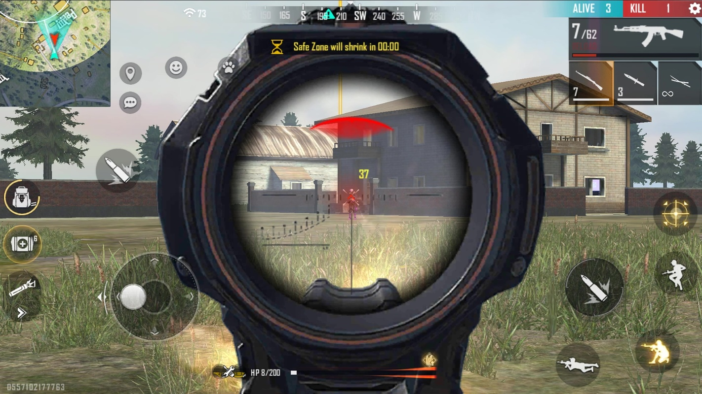
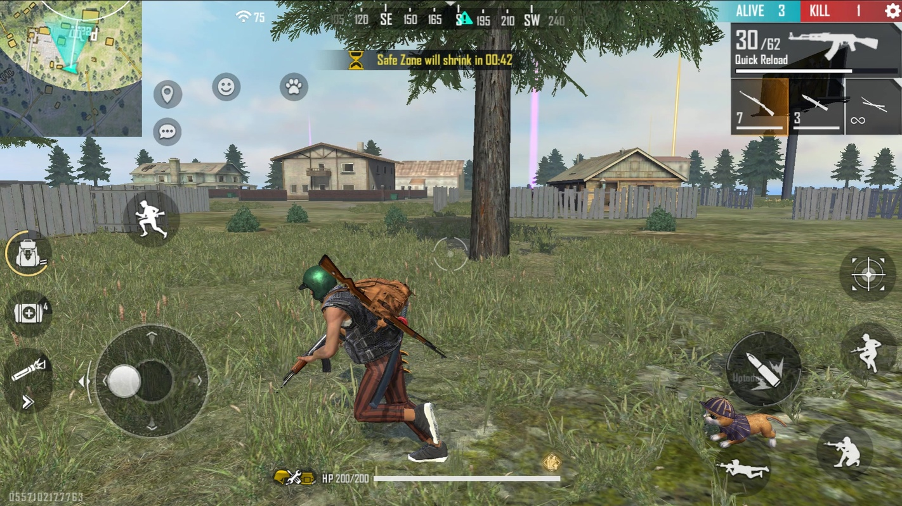
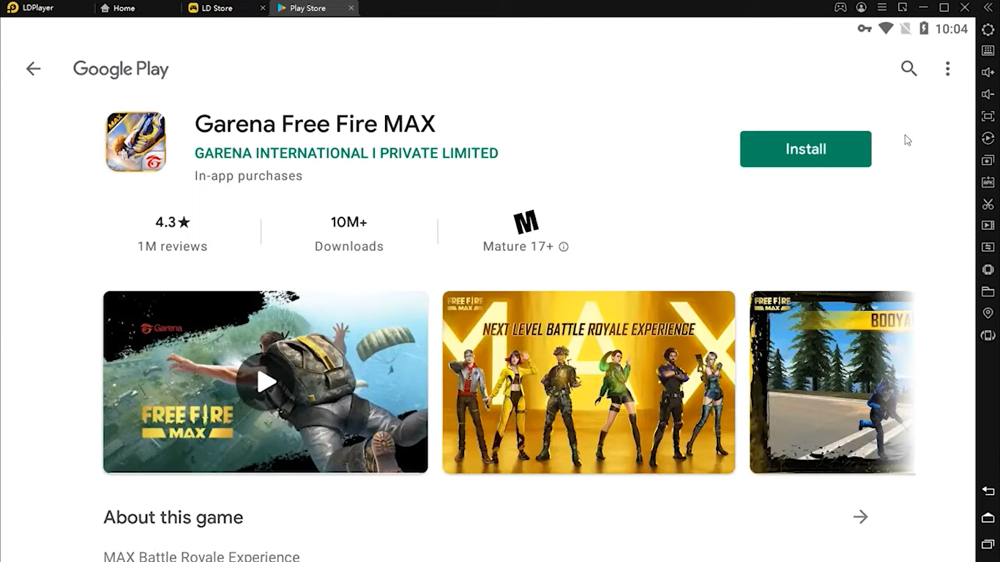
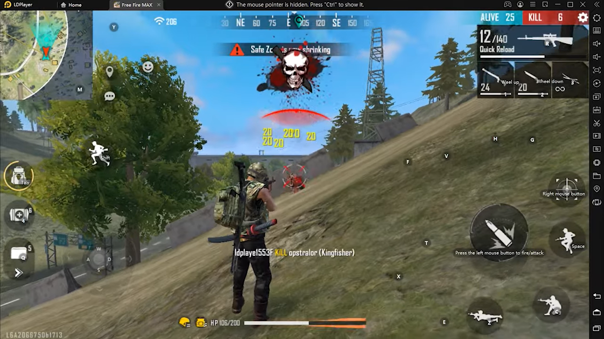

Pro Tips dan Trik Bermain Game Garena Free Fire MAX

Halo sobat LDPlayer yang budiman! Pastinya sudah tidak asing lagi dengan
game yang satu ini, dong, game apa hayo? Game yang kali ini mau kita
bahas adalah game garapan 111Dots Studio dan dirilis oleh Garena, nih,
yaitu Garena Free Fire MAX yang selanjutnya akan kita sebut dengan FF
MAX. Kalau kamu pemain lama, mungkin kamu sudah mengenal Free Fire lewat
versi "orisinil"nya yang bernama Garena Free Fire - New Age yang rilis
terlebih dahulu pada tanggal 27 Agustus 2017 lalu, sedangkan FF MAX baru
dirilis pada 28 September 2021 kemarin.

Mengikuti ketenaran versi "orisinil"nya yang berhasil menggaet lebih
dari satu milyar pengguna untuk memainkan game tersebut bahkan menjadi
salah satu game seluler yang paling banyak diunduh pada tahun 2019, FF
MAX yang masih terhitung baru pun sudah berhasil menarik perhatian lebih
dari 50 juta pengguna sejak perilisan globalnya. Nah, supaya kamu tidak
kalah jago dengan puluhan juta pengguna lain, sekarang kami akan memberi
kamu tips dan trik bermain game FF MAX ini, nih. Sudah tidak sabar
pastinya, kan? Yuk, kita simak bareng-bareng!

Tips dan trik menjadi pro di game FF MAX

Sudah banyak player tentunya yang kamu butuhkan adalah cara menjadi pro
di antara banyaknya player lain. Bagaimana ya kira-kira tips untuk
menjadi pro player? Kita lihat sama-sama, yuk!

Jangan ubah setting custom HUD

Tips ini khusus untuk kamu yang jarang memainkan game ini. Tapi, custom
HUD itu apa, sih? Custom HUD atau heads-up display pada game seperti
Free Fire merupakan antarmuka alias interface grafis yang divisualkan
berupa ikon, angka dan tombol-tombol dengan fungsi yang berbeda.
Singkatnya custom HUD adalah tempat kamu mengatur posisi ikon-ikon untuk
menembak, mengeker, mengendarai kendaraan, dan lain sebagainya.

{width="6.5in"
height="3.1941830708661416in"}

Kenapa tidak boleh diubah? Karena jika kamu jarang memainkan game ini
tapi kamu terlanjur mengubah-ubah setting custom HUD tersebut, kamu bisa
kesulitan dalam mengingat posisi dari ikon-ikon tersebut dan kamu akan
misclick hingga menjadi bulan-bulanan musuh kamu. Sedikit info tentang
ukuran ikon, ukuran ikon tembak tidak terlalu berpengaruh tetapi posisi
adalah yang utama.

Stay calm dan jangan grogi saat bertemu musuh

Bagaikan bermain sebagai Mage di game MOBA seperti Mobile Legends, kamu
tidak perlu panik dan takut saat berhadapan langsung dengan musuh.
Apalagi jika kamu sedang bermain di mode Ranked, di mana kamu
mempertaruhkan rank kamu dengan masuk ke permainan Battle Royale melawan
banyak player.

Meski minus menjadi mimpi buruk kamu sebagai player FF karena bisa
menyebabkan rank kamu turun, kamu tidak perlu terfokus pada rasa takutmu
akan turunnya rank tersebut. Jika kamu terlalu takut, kamu bisa gampang
panik dan tidak fokus saat bermain. Bisa-bisa rank kamu malah terjun
dengan indahnya seperti karakter kamu di awal permainan.

Kuasai beberapa trik menembak

Namanya game tembak menembak tentu kamu harus mempelajari cara aiming
yang baik, tentunya aiming harus bisa dipadukan dengan cara menembak
yang baik. Salah satu teknik menembak yang bisa kamu gunakan dan juga
sedang populer yaitu, drag shot.

Nah, kalau untuk cara melakukan teknik drag shot itu sendiri adalah
dengan melakukan beberapa gerakan seperti aiming ke atas sehingga saat
kamu menembak musuh, aim kamu akan mudah menjadi merah dan peluru pun
tepat mengenai sasaran.

Jika musuh kamu berada di posisi yang cukup dekat, kamu bisa arahkan aim
dari bawah ke atas, tapi jika musuh kamu ada di posisi yang cukup jauh,
kamu bisa langsung arahkan aim ke atas tanpa ragu.

{width="6.5in"
height="3.6568208661417323in"}

Alah bisa karena biasa, itulah kata pepatah. Meski kedengarannya sulit
dan memusingkan karena kamu harus mengggerakan aim ke atas secara cepat,
tapi jika kamu sering melakukan hal tersebut, maka kamu akan terbiasa
dan kesulitan itu bukan jadi masalah lagi untuk kamu.

Trik lain yang bisa kamu kuasai saat memegang senjata damage besar jarak
dekat seperti shotgun adalah jumpshot. Saat kamu berhadapan langsung
dengan musuh, kamu bisa padukan trik melompat sambil menembak, dengan
begitu peluru dari musuh bisa miss dan kamu sudah siap dengan aim tepat
mengarah ke karakter musuh kamu tersebut.

Kenali senjata yang cocok untuk jarak tertentu

Nah, yang tidak kalah pentingnya dari cara menembak adalah mengenali
senjata yang perlu kamu pick saat melihat musuh di jarak tertentu, nih.
Kalau musuh kamu ada di posisi yang jauh, hindari menggunakan senjata
jenis shotgun karena damage yang diberikan tentu menjadi kecil, gunakan
senjata jenis smg atau bisa juga sniper rifle untuk musuh yang lebih
jauh lagi.

Shotgun berdamage besar untuk musuh yang berpapasan langsung dengan
karakter kamu, untuk itu, siapkan shotgun saat kamu ingin rush musuh
dengan jarak yang bikin mereka ketar-ketir.

Jika kamu pecinta senjata jenis smg, pastikan kamu memberi jarak saat
berhadapan dengan lawan. Kamu bisa juga menggunakan trik drag shot saat
menembaki mereka, supaya damage yang diberikan tidak akan bisa dianggap
remeh.

Jangan nafsu

Waduh, nafsu apa nih, Kak? Nafsu di sini maksudnya adalah kamu terlalu
gegabah saat ingin melakukan rush terhadap musuh yang jumlahnya belum
kamu ketahui banyaknya. Pastikan juga kamu memakai Gloo Wall jika
ternyata kamu kalah jumlah dengan musuh yang sedang kamu rush supaya
kamu tidak terkena damage terlalu banyak dari mereka dan sekarat di
tempat.

Pastikan sinyal dan device mumpuni

Nah, tips yang satu ini cukup singkat namun harus sering-sering kalian
perhatikan karena jika kamu sudah menguasai seluruh tips dan trik di
atas tapi di tips yang satu ini justru tidak bisa kamu penuhi, maka
jangan berharap kamu bisa mendapatkan Booyah dengan mudah.

{width="6.5in"
height="3.65625in"}

Perbedaan FF New Era dengan FF MAX

Sedikit informasi saja untuk kamu yang bertanya-tanya, apa sih bedanya
FF yang "orisinal" alias New Era dengan yang ada MAX-nya? Perbedaan yang
paling mencolok dari dua versi untuk game yang sama ini adalah ukuran
file yang harus kamu unduh sebelum bermain dan juga grafiknya.

{width="6.5in"
height="3.6568208661417323in"}

FF New Era hanya mengharuskan kamu mengunduh file sekitar 700 MB,
sedangkan besarnya file dari FF MAX lebih besar yaitu 1 GB. Kenapa
begitu? Karena kualitas grafis dari FF MAX lebih besar dibanding New
Era, apalagi draw distance yang membuat kamu bisa melihat musuh dari
jauh juga ditambah di game ini. Keren banget gak, sih, guys? Parah, sih,
ini.

Fitur-fitur baru yang belum ada di New Era pun sudah ditambah di FF MAX
ini. Wah, ini sih bikin versi aslinya jadi seperti versi lite, ya,
hihihi.

Mainkan Garena Free Fire MAX di PC

Dengan meningkatnya kualitas grafik yang dimiliki game ini, tentunya
baterai handphone kamu bisa cepat lelah dan memilih untuk beristirahat
atau justru memanaskan diri. Untuk itu, kami membawa solusi supaya
handphone kamu tidak cepat habis baterai atau overheat saat bermain FF
MAX yaitu dengan meng-install emulator game android LDPlayer ke PC atau
laptop kamu dan mainkan FF MAX yang keren itu di PC atau laptop kamu.
Dijamin, deh, handphone kamu akan aman, tentram, dan damai tanpa takut
kehabisan baterai atau malah overheat.

{width="6.5in"
height="3.654166666666667in"}

{width="6.5in"
height="3.654166666666667in"}

Kesimpulan

Jika kalian bertanya-tanya kenapa file yang perlu diunduh dari game
Garena Free Fire ini terhitung lebih kecil dibanding game Battle Royale
lainnya seperti PUBG Mobile, jawabannya ada di bagian grafik. Target
market mereka juga pengguna handphone yang memiliki kapasitas rendah,
itulah yang membuat game ini sangat populer sejak beberapa tahun yang
lalu.

Tentu kalian tidak asing lagi dengan jokes tentang player FF yang tidak
mengenal pintu. Ini dikarenakan game Garena Free Fire tersebut tidak
memiliki pintu pada gedung-gedungnya karena jika diberi pintu pada
gedung di dalam game Garena Free Fire, maka akan ada kemungkinan game
tersebut terhambat pada saat rendering, ditambah timbulnya kesulitan
untuk handphone dengan kapasitas rendah. Nah, supaya tidak ada hambatan,
kamu bisa mainkan FF MAX di laptop atau PC kamu dengan emulator game
android LDPlayer! Tunggu apa lagi? Langsung dicoba, yuk! Selamat
bermain!
