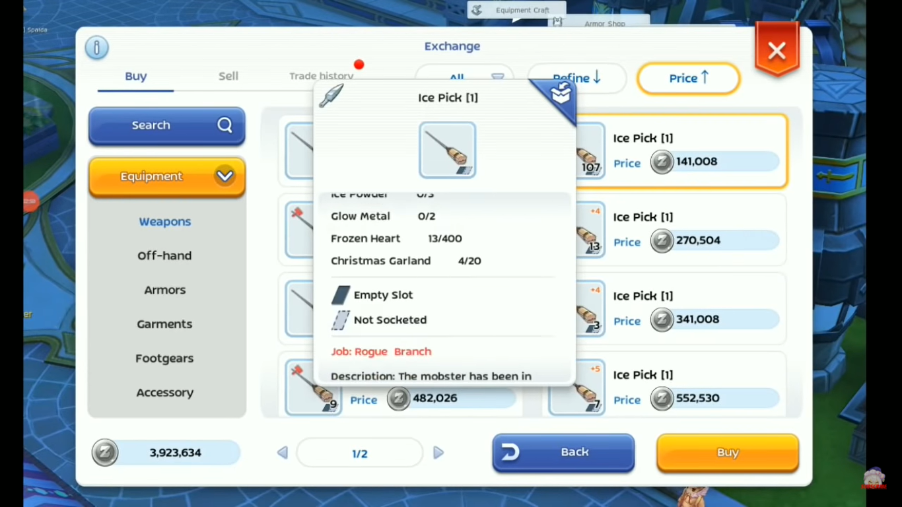

Tips dan Trik Rahasia Ragnarok M : Eternal Love yang Perlu Kamu Ketahui

Halo sobat LDPlayer! Di antara kamu-kamu semua pasti banyak yang sudah
mengetahui game MMORPG legend yang satu ini, benar sekali, Ragnarok!
Sejak game pertamanya, Ragnarok sudah menemani para gamer dari tahun
2002, hingga pada tahun 2018 tepatnya pada tanggal 28 November, Gravity
Interactive merilis Ragnarok M : Eternal Love yang memberi kesempatan
para gamer untuk bernostalgia dengan game online lama.

Dengan usianya yang sudah tiga tahun, tentu menjadi kebanggaan
tersendiri bagi game MMORPG yang telah dirombak habis-habisan di versi
2.0 ini. Buat kamu player lama yang hiatus, tidak ada salahnnya kamu
kembali memainkan game ini, dijamin kamu akan mengira bahwa game ini
adalah game yang baru rilis. Tentu dengan penampilan dari ROM yang
semakin memukau, akan banyak player baru maupun lama yang ingin
memainkannya.

Tips dan Trik Rahasia ROM

Sebagai player lama, tentu tidak ada salahnya untuk kamu tetap mencari
tahu tentang trik bermain sebuah game. Apalagi ROM merupakan game RPG,
sebab itulah kamu tidak hanya akan bertemu dengan sistem game yang
kompleks, tapi juga kreativitas yang harus terus kamu asah saat bermain.
Psst, kalau kamu ingin tahu trik rahasia ROM, kami ada daftarnya di
bawah ini, nih!

Glow Metal Gambling

Kamu pasti tahu dong apa itu Glow Metal? Glow Metal adalah item yang
kamu butuhkan jika kamu ingin mengupgrade equipment kamu. Item tersebut
bisa kamu beli seharga 25.000 Zeny atau dengan melakukan decompose
equipment.

{width="6.5in"
height="3.654166666666667in"}

Decompose equipment akan memberi kamu Glow Metal dengan jumlah tertentu,
hal ini tidak dipengaruhi harga awal equipment. Biasanya satu equipment
akan memberi kamu 4-13 Glow Metal dengan harga yang harus kamu bayarkan
untuk decompose berjumlah 10.000 Zeny. Sebenarnya setelah kamu berhasil
melakukan decompose, Zeny kamu akan dikembalikan sebanyak 1600 Zeny.
Jadi harga bersih dari melakukan decompose adalah 8400 Zeny.

Nah, kalau kamu ingin tahu cara mendapat banyak Zeny dengan trik Glow
Metal Gambling, kamu bisa melakukan langkah-langkah di bawah yang cukup
menghabiskan waktu tetapi worth it ini, nih! Check it out!

1.  Persiapkan Mechanic Job dengan Orideocon Research level 10.

2.  Pastikan kamu memiliki lebih dari 2,1 juta Zeny.

3.  Beli senjata Ice Pick atau equipment lain yang memberi kamu 4-13
    Glow Metal, pastikan juga harganya berkisar dari 135.000 sampai
    140.000 Zeny.

4.  Disarankan membeli sebanyak 15 buah, kira-kira Zeny kamu akan habis
    sebanyak 2.1 juta Zeny.

5.  Decompose semua equipment yang sudah kamu beli. Selesai!

Dengan 15 equipment yang sudah kamu decompose tadi, kamu bisa mendapat
sekitar 60 sampai 195 Glow Metal, tergantung keberuntungan kamu.

{width="6.5in"
height="3.654166666666667in"}

Anggaplah kamu mendapat 117 Glow Metal, maka jumlah Zeny yang bisa kamu
dapatkan dengan menjual semuanya berjumlah 2.925.000, dikurangi pajak
yang mencapai 10% dan biaya decompose yang mencapai 126.000 Zeny. Jika
kita hitung, kamu masih mendapat total 2.479.000 Zeny.

Dengan begitu, kamu bisa mendapat 379.000 Zeny dengan trik simple namun
sedikit memakan waktu ini. Kamu player lama apalagi yang player baru
pasti penasaran ingin mencoba, kan? Hihihi.

Rekomendasi spending Honor Proof

Honor Proof itu apa, ya? Honor Proof adalah mata uang spesial yang bisa
kamu gunakan untuk membeli item yang ada di Guild's Vending Machine.
Jika kamu belum bergabung ke dalam Guild atau tidak sedang ingin membeli
item yang ada di Vending Machine, maka pilihan lainnya adalah kamu pergi
ke Shop dan melihat ada empat item yang bisa kamu beli dengan Honor
Proof tersebut.

{width="6.5in"
height="3.654166666666667in"}

Nah, pernah nggak sih, kamu kebingungan memilih antara empat item yang
ada di Shop dan juga Praying Card? Kalau begitu, kami punya urutan
rekomendasi untuk kamu yang kebingungan, nih.

1.  Contribution

Pilih Contribution jika Gold Medal kamu kurang dari 1000 buah dan
Contribution kurang dari 800.000 buah.

2.  Gold Medal

Sama seperti Contribution, tapi, jadikan Gold Medal sebagai prioritas ke
dua.

3.  Praying Card

Pilih item ini jika Gold Medal kamu lebih dari 1000 buah dan
Contribution lebih dari 800.000 buah.

4.  Mora Coin

Pilih item ini jika kamu punya Honor Proof yang lebih setelah membeli
Praying Card.

5.  Eden Coin

Sangat tidak dianjurkan membeli item yang satu ini meski harganya sangat
murah. Eden Coin tetap bisa kamu dapatkan setelah kamu menyelesaikan
quest. Jika kamu bersikukuh ingin membelinya, bisa-bisa item ini
menumpuk dan memenuhi storage kamu.

Cara membunuh monster elit Smokie

Kamu pasti pernah bertemu monster yang super menyebalkan ini, betul
sekali, Smokie. Berbeda dengan monster lainnya, Smokie yang kamu serang
dan kehabisan HP akan berpindah tempat dan HP-nya menjadi full kembali.

Pastinya kamu akan geram jika harus terus mengulang sampai akhirnya dia
mati permanen. Ada caranya, nih, supaya Smokie tidak kabur-kaburan dari
serangan kamu, penasaran?

Caranya adalah dengan menggunakan Smokie Holder, alat yang satu ini
dijamin bisa membuat Smokie terdiam meskipun kamu serang dia sampai
mati.

{width="6.5in"
height="3.654166666666667in"}

Oh iya, farming Smokie hanya worth it jika kamu berada di server global
ya, sobat. Kalau kamu berada di server Asia, farming Smokie kurang
direkomendasikan.

Trik mentransfer stat enchantment

Kalau kamu datang ke NPC Cat Friend, kamu akan menemui beberapa jenis
enchanting yang bisa kamu coba. Salah satunya adalah Advanced
Enchantments, di mana kamu membutuhkan Mora Coin untuk melakukannya.
Mora Coin bisa kamu beli dari NPC Event dekat Miu di Prontera
masing-masing seharga 50 ribu Zeny .

Di Advanced Enchantment, kamu akan mendapati beberapa item milik kamu
yang tidak memiliki stat meski sedang dalam proses enchanting. Kita akan
ambil contoh item bernama Starfield Poem, meski item ini sangat baik
dalam hal damage builds, namun item ini tidak memiliki enchantment
stat-nya sendiri.

Untuk itu, jika kamu ingin agar item itu memiliki stat, kamu bisa
menggunakan Headwear Magic Extractor. Sesuai dengan deskripsinya, item
tersebut bisa mentransfer magic alias stat dari satu item ke item
lainnya.

{width="6.5in"
height="3.654166666666667in"}

Jadi, kamu tinggal memilih item mana yang sekiranya ingin kamu pindahkan
statnya ke item pilihan kamu melalui Headwear Magic Extractor tersebut
secara praktis.

Tapi, gimana caranya dapat extractor itu, ya? Caranya, kamu pergi ke B
Coin Store, dan di situ ada Headwear Magic Extractor yang bisa kamu
dapatkan dengan menukar sebanyak 128 B Coin yang kamu miliki.
Sabar-sabar menabung, ya! Hihihi.

{width="6.5in"
height="3.654166666666667in"}

Mainkan Ragnarok M : Eternal Love di PC

Dengan meningkatnya kualitas grafik dari game ini, tentu kamu juga ingin
dong bermain di device yang lebih mumpuni. Nah, supaya kamu bisa
memainkan game kece ini di device kamu yang lebih unggul seperti PC atau
laptop, kamu harus install emulator game android LDPlayer ke PC atau
laptop kamu, nih. Setelah itu, kamu unduh, deh, game ROM yang kecenya
super mantap. Dijamin, pengalaman bermain kamu pasti lebih seru dan
menyenangkan.

Kesimpulan

Dengan menyandang predikat sebagai game lama, Ragnarok tentu tetap ingin
menemani kamu dengan mengikuti perkembangan zaman seperti sekarang.
Untungnya, genre MMORPG menjadi genre yang tidak membuat pemainnya
gampang bosan, peminatnya pun justru akan semakin meningkat.

Apalagi dengan hadirnya Ragnarok M : Eternal Love ini, selain menarik
minat pecinta Ragnarok sejak dulu, pendatang baru dalam dunia game
MMORPG juga pasti akan ikut tertarik untuk memainkannya. Kamu termasuk
pemain legend atau pendatang baru, nih? Apapun itu, kamu tentunya tidak
boleh ketinggalan serunya bermain game epic ini! Tunggu apalagi? Ayo
mainkan Ragnarok M : Eternal Love segera, ya!
