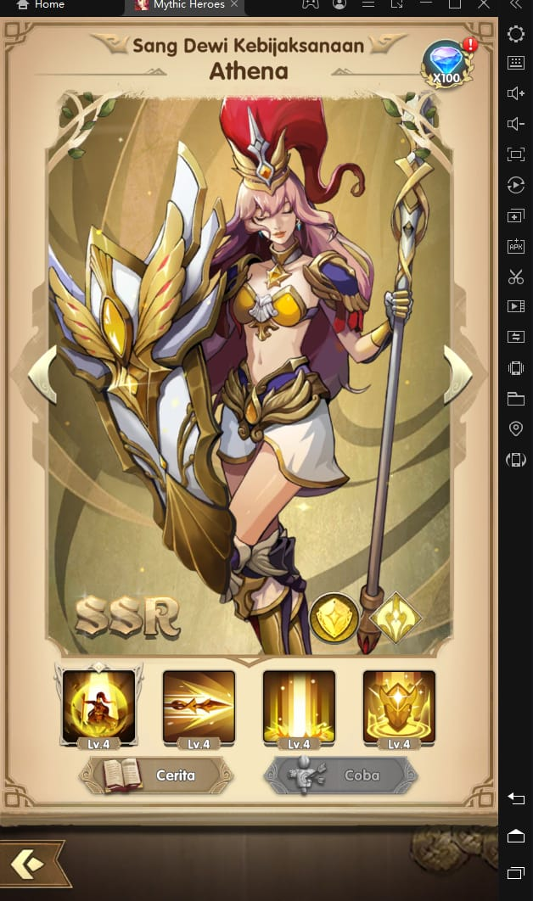

Rasakan Serunya Mythic Heroes : Idle RPG di PC : Panduan Memilih Hero
dan Equipment

Halo para gamer! Sudah tahu belum ada game idle RPG terbaru yang seru
banget? Belum? Waduh, kalau begitu kamu harus cek game Mythic Heroes
yang satu ini. Kamu tentunya tidak akan merasa asing dengan game ini
jika kamu sudah pernah memainkan game seperti Mobile Legends Adventure.
Game buatan developer IGG.COM ini dirilis pada 4 Oktober 2021 di Google
Play Store. Pastikan kamu tidak ketinggalan serunya game ini bersama
dengan 500 ribu pengguna lainnya, ya!

Kalau kamu belum lelah dengan gacha, game ini menawarkan puluhan hero
dengan tampilan kece yang bisa kamu dapatkan lewat sistem gacha
tersebut. Seperti perilisan game baru, pasti developer akan menjadi
sangat murah hati dengan memberi kamu banyak bonus-bonus yang bisa kamu
gunakan demi mendapat hero kece tersayang. Kita intip kerennya hero-hero
di game ini, yuk!

Hero-hero kece

Seperti game gacha kebanyakan, kamu akan mendapati hero-hero yang
memiliki tier seperti UR, SSR, SR, dan N. Di awal game, kamu dijamin
akan langsung memiliki hero berkualitas bagus karena kamu akan diberi
hero tier SSR bernama Zeus secara cuma-cuma. Ingin tahu hero kece
lainnya? Langsung saja kita check it out!

Tips menyusun tim

Kalau kamu membentuk tim yang terdiri dari lima hero nantinya, pastikan
kamu memiliki tank, fighter sebagai carry, mage sebagai magic dps,
support sebagai pemberi buff, dan juga support sebagai healer. Hero-hero
kamu nantinya berada dalam faksi yang terbagi menjadi empat yakni faksi
Luminarch berlogo kuning, Shadowarch berlogo merah, Guardian berlogo
biru, dan Verdian berlogo hijau.

Setiap faksi ini memiliki tactical advantage yang harus kamu
pertimbangkan saat ingin memasuki stage-stage tertentu. Faksi yang
paling banyak di dalam tim kamu akan memberi buff seperti tambahan ATK
dan DEF. Kami sarankan kamu cukup memasukan dua jenis faksi ke dalam
tim, misalnya tiga hero berfaksi Luminarch dan dua hero berfaksi
Shadowarch.

Rekomendasi hero untuk tim kamu

Meski kamu akan mendapati banyak hero-hero keren di dalam game ini, kamu
hanya bisa menggunakan lima hero di dalam satu tim, maka dari itu
pastikan hero-hero tersebut merupakan andalan kamu. Perhatikan statistik
tiap hero dan role-role yang kamu butuhkan supaya setiap hero kesayangan
kamu bisa saling melindungi satu sama lain.

Berikut kami akan beri bocoran hero-hero apik yang bisa kamu masukkan ke
dalam tim kamu, tentunya dengan pertimbangan statistik dan juga tier.
Langsung saja yuk!

-   Lucifer

{width="5.404861111111111in"
height="9.0in"}

Fighter gagah nan sangar yang satu ini cocok menjadi carry untuk tim
kamu. Damage besar yang dihempaskan Lucifer secara berturut-turut
ditambah lifesteal deras membuatnya gagah perkasa di dalam battlefield.
Apalagi skill ultimate dari Lucifer bisa membuat musuh terhentak ke
belakang sekaligus terkena stun selama beberapa detik. Sebagai tier UR,
Lucifer memiliki dua faksi yaitu, Luminarch dan Shadowarch sehingga
Lucifer memiliki tactical advantage yang lebih banyak.

Lucifer memiliki dua skill pasif dan skill aktif. Pasif pertamanya
membuat pedangnya terbakar api setiap dua serangan secara otomatis untuk
menebas target dan memberikan damage hingga mencapai 230% lebih besar
dari damage biasanya. Serangannya dapat mengenai musuh terdekat dengan
jumlah 50% damage. Pasif keduanya meningkatkan pemulihan energi miliknya
hingga 30% dan meningkatkan skill dodge hingga 10% selama lima detik
yang dapat stack sampai tiga kali.

Sedangkan skill aktif Lucifer membuatnya melayang di udara dan menyerang
sebanyak lima kali. Serangannya tersebut menciptakan damage hingga 160%
per serangan dalam waktu hanya 0,5 detik, saat menjadi fallen angel, dia
bisa melakukan stun terhadap targetnya selama 0,5 detik. Ultimate
Lucifer sendiri bisa memundurkan setiap musuh dengan 80% damage setiap
0,5 detik, saat menjadi fallen angel, Lucifer akan terus menerus
memulihkan energinya hingga terkumpul sebanyak 40 energi setiap kali
terkena serangan dari musuh.

Kalau kamu sudah merasa cukup dengan satu hero role tank tetapi tidak
tahu siapa yang bisa mendampingi tank tersebut sebagai tameng tim, kamu
bisa memasang Lucifer di samping tank itu. Sebagai fighter, tentu
Lucifer juga memiliki defense yang besar.

-   Ganjiang dan Moye

{width="5.408333333333333in"
height="9.0in"}

Satu-satunya hero yang jika kamu dapatkan kamu akan mendapat satu paket
pasangan sekaligus. Damage yang mereka keluarkan pun tidak main-main,
bahkan mereka bisa melakukan ultimate dua kali berturut-turut, dijamin
bikin ketar-ketir lawan. Tapi dengan melepas ultimate, kemampuan dodge
mereka akan hilang total selama beberapa detik.

Senjata mereka memungkinkan mereka untuk meningkatkan Kecepatan Serangan
mereka hingga 100% selama lima detik setelah melepaskan ultimate mereka,
yang dapat dilemparkan dua kali setelah peningkatan. Stat senjata mereka
bias terhadap Crit dan Health sambil mengabaikan Attack Speed dan
Attack.

Pasangan sejoli ini memiliki dua skill pasif dan aktif. Skill aktif
mereka memungkinkan mereka untuk melepaskan tiga serangan yang
masing-masing memiliki 80% damage dan menghasilkan tiga serangan kejut
untuk masing-masing 120% damage serta mengurangi defense dari target
sebesar 10%. Pasif pertama mereka memungkinkan Moye untuk memberi damage
sebesar 75% pada musuh terdekat dan Ganjiang menyerang musuh terdekat
hingga 150% damage. Pasif mereka yang lain meningkatkan dodge atau crit
hingga 45%. Ultimate mereka memungkinkan mereka untuk beralih dari Moye
ke Ganjiang dan memulihkan hingga 45% health, selain itu mereka juga
bisa memberikan 225% damage pada semua musuh sebanyak dua kali bahkan
saat level mereka kalah dengan musuh, keren banget!

-   Nuwa

{width="5.415277777777778in"
height="9.0in"}

Nuwa adalah hero support yang serba bisa. Dewi cantik ini bisa memberi
damage, melakukan crowd control, memberi healing, dan juga memberi
banyak buff. Nuwa sangat cocok diberi title sebagai support terbaik
karena skill dan juga statistiknya yang bikin musuh ketar-ketir, memang
tidak salah IGG menjadikan Nuwa sebagai hero dengan tier UR.

Senjatanya memungkinkan dia untuk mengeluarkan skill Pillars of the Sky
di awal pertempuran, batu coklat dari skill Lustrous Land-nya untuk
mentransfer energi yang dikeluarkan dari musuh ke dirinya sendiri dan
memungkinkan hero satu tim untuk kebal terhadap kontrol hingga sepuluh
detik. Setelah melepaskan ultimate-nya, stat senjatanya menjadi fokus
dengan magic resist, health dan crit sembari mengabaikan attack dari
musuh.

Nuwa memiliki dua skill pasif dan aktif. Parahnya, skill Nuwa ini juga
bisa memberikan berbagai macam buff dan debuff yang dapat membantu
seluruh hero di dalam tim. Pasif pertamanya memanggil batu yang
meningkatkan statistiknya tergantung pada warnanya. Kalau kamu memiliki
tingkat keberuntungan yang baik, kamu bisa mendapat Nuwa di standard
banner pada early game yang tentu saja bisa membuat kamu ditakuti pada
musuh.

-   Athena

{width="5.322222222222222in"
height="9.0in"}

Athena adalah tank yang sangat mendukung karena dia dapat melindungi
tim, menyembuhkan sekutu menggunakan perisainya dan memberi mereka buff
untuk melawan lebih jauh. Dia dapat bertindak sebagai stasiun medis
berjalan dengan perisai dan terkadang menyelamatkan carry kamu dari
kematian yang akan datang dengan ultimate-nya. Kegunaannya ditemukan
dalam perlindungan perisainya dan dalam perkelahian yang berlangsung
cukup lama baginya untuk melemparkannya, untuk mengatur lingkaran setan
perisai dan penyembuhan.

Senjatanya memungkinkan pamungkasnya untuk meningkatkan resistensi crit
hero di dalam sebesar 20% dan memulihkan health hingga 30% dari damage
yang di dapat para hero kesayangan kamu. Statistik senjatanya terfokus
pada health dan defense serta mengabaikan crit dan attack dari musuh.

Athena memiliki dua skill aktif dan pasif. Skill aktif pertamanya adalah
menyerang musuh di depannya dengan damage hingga 250% dan memulihkan
hingga 12% health miliknya per-serangan musuh. Skill aktif keduanya
menargetkan musuh yang memiliki serangan tertinggi hingga 160% damage
dan membuat mereka terdiam karena stun hingga tiga detik.

Jika ada hero dengan level yang lebih tinggi, Athena bisa mendapat 50%
akurasi untuk mengenai target lain secara bersamaan. Terakhir, dia
memiliki pasif yang membuatnya tak bisa terkena serangan apapun selama
tiga detik dengan cooldown selama delapan detik, sambil meningkatkan
energinya hingga 75%. Ultimate Athena bisa memberi shield untuk setiap
hero di dalam tim yang bisa menyerap damage hingga 350% dari serangan
musuh dan juga memulihkan health hero-hero tersebut. Saat hero kamu
sekarat di dalam battlefield, berdoalah Athena sudah siap untuk
melakukan ultimate, dengan begitu hero milikmu akan bertahan dengan
shield dari Athena yang overpowered.

Memasang artifact dan rune

Tidak komplit rasanya kalau hero kamu belum diberi tenaga tambahan
dengan benda-benda yang bisa kamu dapat lewat farming seperti artifact
dan rune. Berbeda dengan rune yang bisa dipasang sebanyak tiga buah dan
memberikan tambahan buff jika tiga jenis rune tersebut sama, artifact
hanya bisa kamu pasang satu buah namun tambahan buff-nya jelas jauh
lebih besar.

Kalau kamu bingung bagaimana cara memasang artifact dan rune yang cocok,
kamu bisa baca sedikit arahan di bawah ini agar kamu mudah mendandani
hero-hero kamu :

-   Kalau hero kamu adalah fighter yang menjadi carry, pakaikan rune
    tipe api atau petir dengan tipe artifact seperti axe, staff, atau
    chakra.

-   Untuk hero mage tercinta, berikan mereka rune tipe angin dengan
    artifact tipe yasakani.

-   Hero support bisa kamu beri rune tipe angina dan tumbuhan, untuk
    artifact kamu bisa beri tipe yasakani, excalibur, atau hammer.

-   Untuk tank kamu bisa beri rune tipe tanah, cahaya, atau bayangan,
    bisa juga kamu tambah dengan artifact tipe excalibur, hammer, badge,
    atau shield.

-   Kalau hero kamu bisa melakukan healing dan memberi shield, beri
    mereka rune tipe air.

Pastikan rune dan artifact kamu minimal berwarna kuning karena warna
kuning dan oranye menandakan tingginya statistik dari rune dan artifact
yang kamu miliki.\\

Kesimpulan

Masih banyak lagi yang bisa kamu lakukan di game Mythic Heroes : Idle
RPG ini, meski mungkin kamu akan bosan karena tipe game RPG hampir
semuanya menganut gameplay yang sama, misalnya dalam hal gacha,
pemasangan equipment, pemilihan hero, dan juga menaikkan level. Tapi
kalau kamu senang dengan tipe game seperti ini, tentu Mythic Heroes bisa
jadi rekomendasi terbaik bulan ini.

Tentunya supaya semakin asyik lagi, kamu bisa mencoba memainkan game ini
lewat emulator game android LDPlayer, dengan begitu, kamu bisa bermain
Mythic Heroes maupun game android lainnya di PC ataupun laptop kamu,
seru banget, kan? Tunggu apa lagi? Coba serunya Mythic Heroes : Idle RPG
langsung di PC atau laptop kamu. Selamat bermain!
