Hal-hal yang Perlu Kamu Ketahui sebelum Perilisan Game Seven Knights 2

Halo sobat LDPlayer! Sudah tahu belum nih kalau ada game kece baru yang
akan segera hadir di depan mata kamu? Belum tahu? Waduh, berarti kamu
belum tahu kalau game keren Seven Knights 2 sedang dalam tahap
pra-registrasi, dong. Game buatan developer Netmarble ini sudah dibuka
sejak 7 Oktober lalu untuk kamu yang ingin melakukan pra-registrasi.
Caranya kamu cukup datang ke website resmi game Seven Knights 2 ini yang
tentunya dimiliki Netmarble dan masukkan akun gmail kamu. Ikuti langkah
berikutnya sesuai dengan arahan yang ada.

Kalau kamu rindu bermain game Dynasty Warriors dari PS 2, bisa banget
nih kamu mainkan game Seven Knights 2 nanti untuk bernostalgia dan
merasakan sensasi baru bermain game RPG modern. Apalagi kalau kamu
mendaftarkan akunmu untuk pra-registrasi lewat website game ini, kamu
akan mendapatkan 50 ribu gold secara gratis, lho! Tunggu apalagi? Buruan
daftar pra-registrasi game ini!

Mengintip indahnya wilayah-wilayah di Seven Knights 2

Bukan hal baru kalau RPG menyajikan sistem open world untuk dinikmati
para pemainnya, begitu juga dengan game ini. Yang berbeda dari game ini
adalah sudut pandang orang ke tiga di mana kamera untuk mengontrol
karakter kamu nanti berada tepat di belakang karakter tersebut. Dengan
adanya open world tentu kamu akan bisa mengunjungi banyak tempat keren
di dalamnya, mau tahu apa saja? Mari kita cari tahu!

Terra Kingdom

Wilayah kerajaan yang satu ini akan menjadi tempat pertama yang akan
dikunjungi karakter kamu. Terra Kingdom dibentuk untuk memperbaiki
sejarah mereka yang tentu memotivasi mereka untuk menjadi wilayah yang
berkembang dengan cepat.

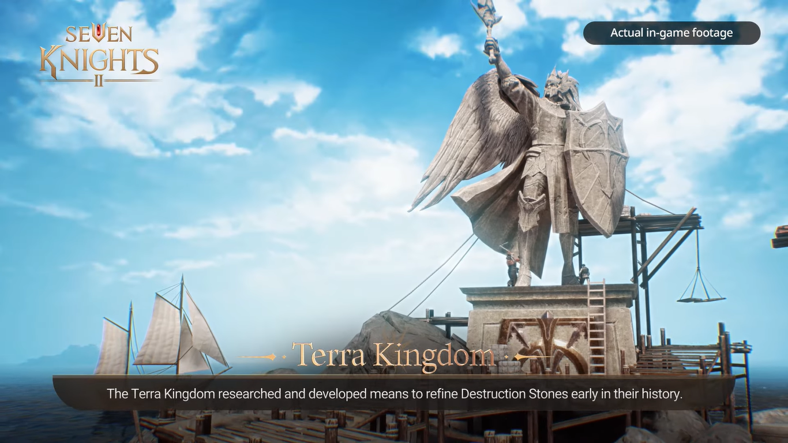{width="6.5in"
height="3.654166666666667in"}

Ice Castle

Area dingin ini dulunya adalah kerajaan indah untuk para elf. Kalau kamu
ke wilayah ini, kamu akan disajikan dengan pemandangan bernuansa biru
yang membuat kamu bisa merasakan betapa dinginnya Ice Castle tersebut.

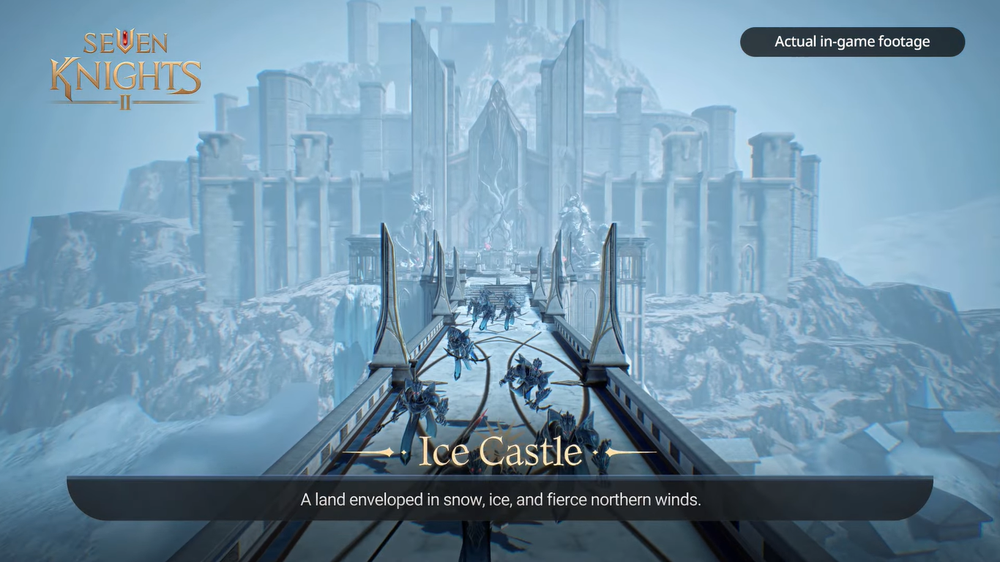{width="6.5in"
height="3.654166666666667in"}

Great Desert

Sesuai dengan namanya, area berpasir ini dulunya dimakmurkan oleh salah
satu Seven Knights bernama Rachel beserta Sandstorm family sehingga bisa
menjadi Great Desert seperti sekarang. Beberapa orang pergi ke tempat
ini untuk mengubah nasib mereka sedangkan yang lainnya mengejar aspirasi
di antara pasir.

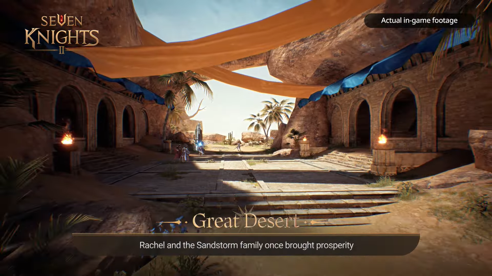{width="6.5in"
height="3.654166666666667in"}

Karnia

Sebagai tempat yang menjadi sumber dari kekuatan rahasia yang tidak ada
habisnya, tempat ini diperebutkan oleh banyak kelompok hingga pada
akhirnya The Saintly Order menempati wilayah ini dan membuat seluruh
penduduk di dalamnya mengikut kepercayaan mereka.

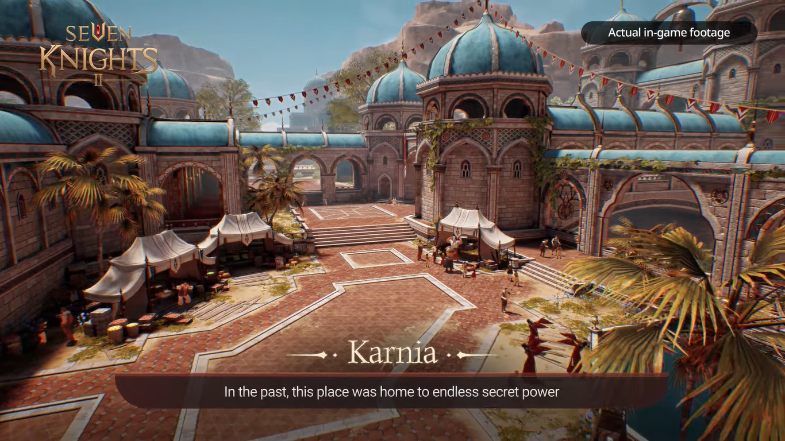{width="6.5in"
height="3.654166666666667in"}

Illusion Forest

Hutan yang indah ini dirumorkan merupakan pemberian dari Elena untuk
para prajurti yang berhasil mengalahkan dewa kehancuran. Illusion
dianggap sebagai area yang sakral dan selalu dijaga oleh Karnia.

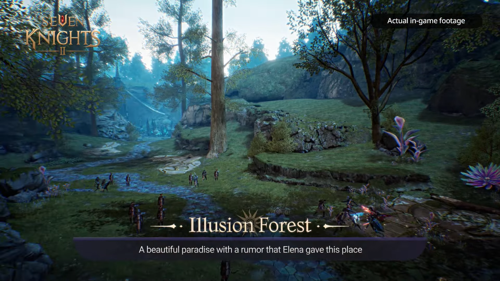{width="6.5in"
height="3.654166666666667in"}

Gameplay

Di game ini nantinya kamu akan mengontrol empat karakter secara
bergantian dan kamu bisa melihat situasi apa yang sedang mereka hadapi.
Kemungkinan visualisasi ini akan mirip dengan GTA 5 di mana setiap kali
kamu mengganti karakter, kamera kamu akan berpindah ke tempat di mana
karaktermu berada.

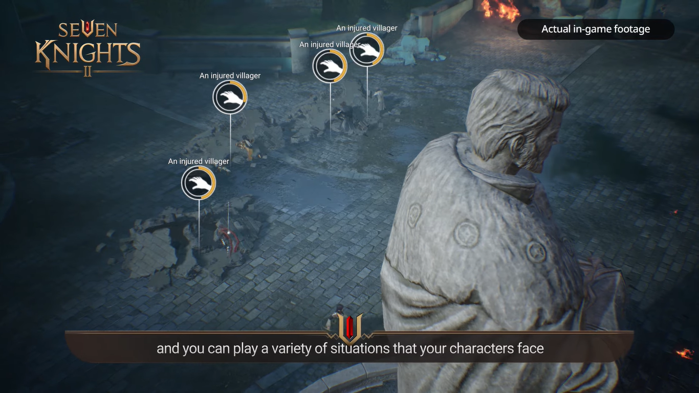{width="6.5in"
height="3.654166666666667in"}

Sama seperti game RPG kebanyakan, kamu akan diberi misi yang harus kamu
selesaikan demi mendapat rewards tertentu. Selain itu, kamu akan menemui
musuh-musuh yang bisa memberi equipment-equipment berkualitas yang
tentunya harus kamu miliki.

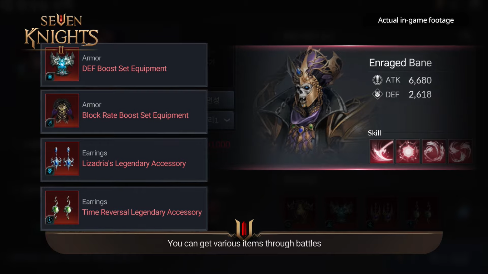{width="6.5in"
height="3.654166666666667in"}

Kamu juga bisa melakukan raid boss dengan cara solo maupun dibantu
player lain. Boss-boss tersebut memiliki pola serang yang ditandai
dengan warna merah, dengan begitu kamu tidak bisa hanya terfokus gaya
serang kamu tetapi juga bagaimana kamu menghindari serangan dari boss
tersebut.

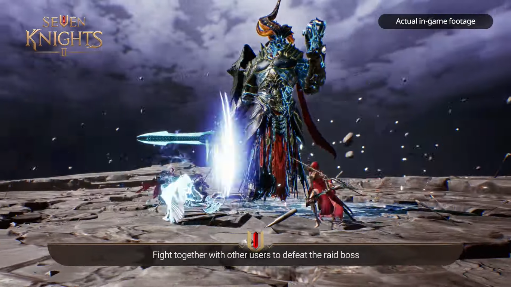{width="6.5in"
height="3.654166666666667in"}

Pengenalan karakter

Selain tempat-tempat dan para musuh yang bisa kamu temui, kamu juga
berkesempatan untuk mendapatkan karakter-karakter keren yang tentunya
playable. Berikut akan kami bahas karakter yang termasuk ke dalam Seven
Knights. Oh iya, meski namanya adalah Seven tetapi karakter yang baru
dikenalkan berjumlah lima. Kalau begitu langsung saja kita intip
bagaimana kerennya para Seven Knights.

Dellons

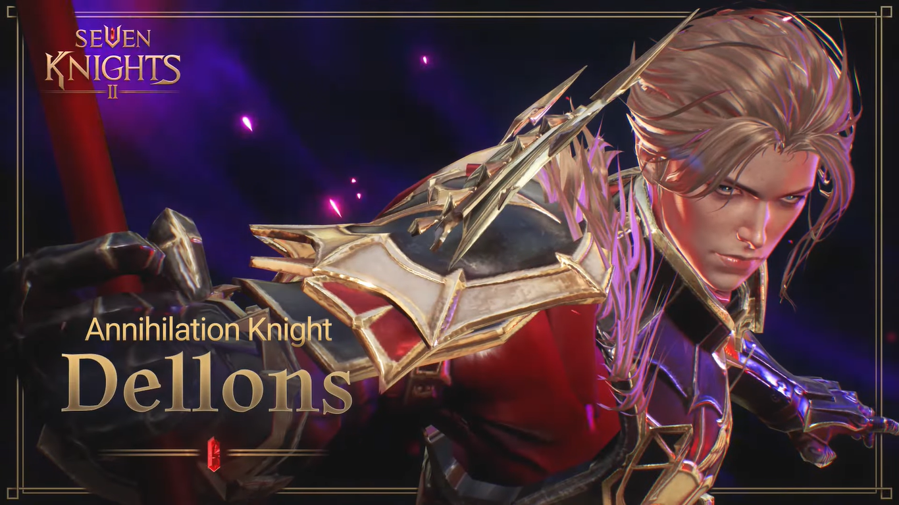{width="6.5in"
height="3.654166666666667in"}

Ksatria gagah yang abadi ini menganut ilmu hitam agar dia bisa terus
bereinkarnasi demi menyelamatkan cinta sejatinya yang terkena kutukan.
Jika dilihat dari teaser-nya, Dellons sepertinya merupakan karakter
dengan role assassin karena gaya serangnya yang cepat dan lincah. Kalau
kamu pecinta karakter yang cool, Dellons bisa menjadi kandidat karakter
favorit kamu.

Rachel

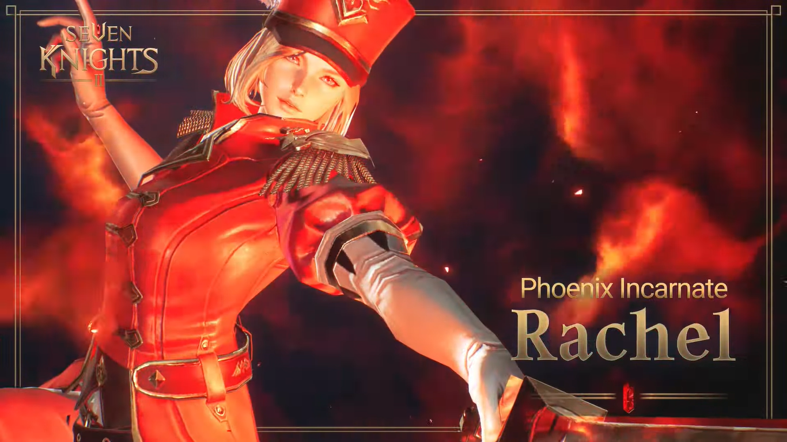{width="6.5in"
height="3.654166666666667in"}

Elf yang menjadi objek necromancy ini dibangkitkan oleh cincin Eileene
dan merupakan pemimpin Agni yang sangat kuat. Rachel membantu Lene dan
prajurit lainnya melawan Lizardia. Diperkirakan role elf cantik ini
adalah assassin dengan paduan mage karena kecepatan serangnya yang cepat
dan juga skill-nya yang bisa memanggil Phoenix api.

Rudy

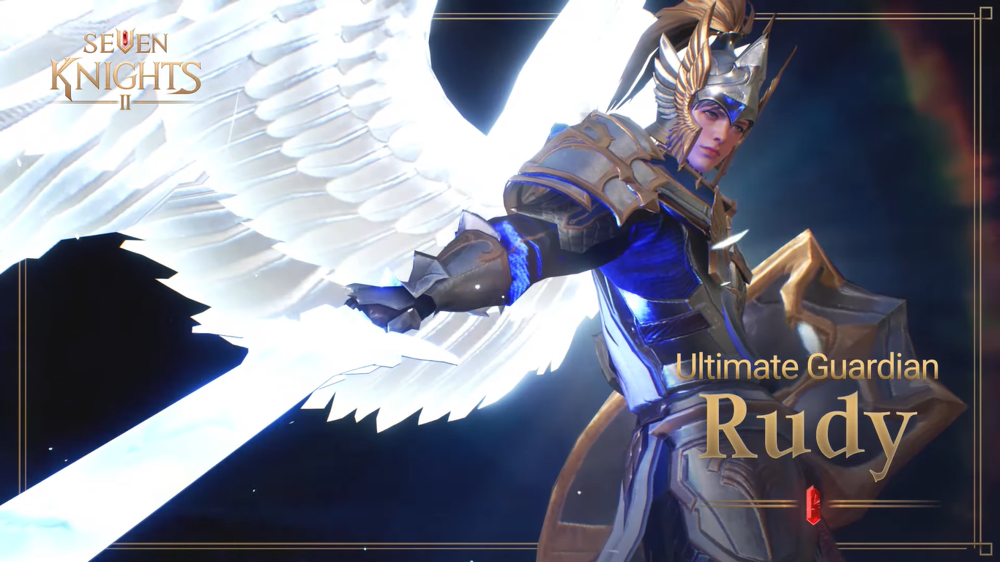{width="6.5in"
height="3.654166666666667in"}

Penjaga Terra Kingdom dan Mystic Woods ini mampu memesona siapapun
berkat kepribadiannya yang tidak macam-macam serta kekuatannya sebagai
prajurit. Kemungkinan besar Rudy akan masuk ke dalam daftar karakter
untuk early game yang wajib kamu build nantinya karena role-nya yang
mirip dengan fighter berpadu tank.

Spike

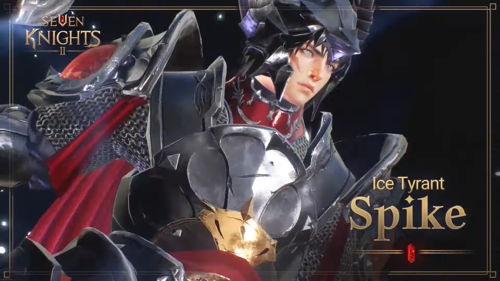{width="6.5in"
height="3.654166666666667in"}

Penguasa Frozen Land yang satu ini terlihat sangat gagah dengan armor
miliknya. Meski dia bertarung dengan dinginnya es, hatinya memiliki
semangat juang sehangat matahari. Spike memiliki gaya serang mirip
dengan role fighter berpadu mage karena skill yang dikeluarkannya
menggunakan elemen es.

Eileene

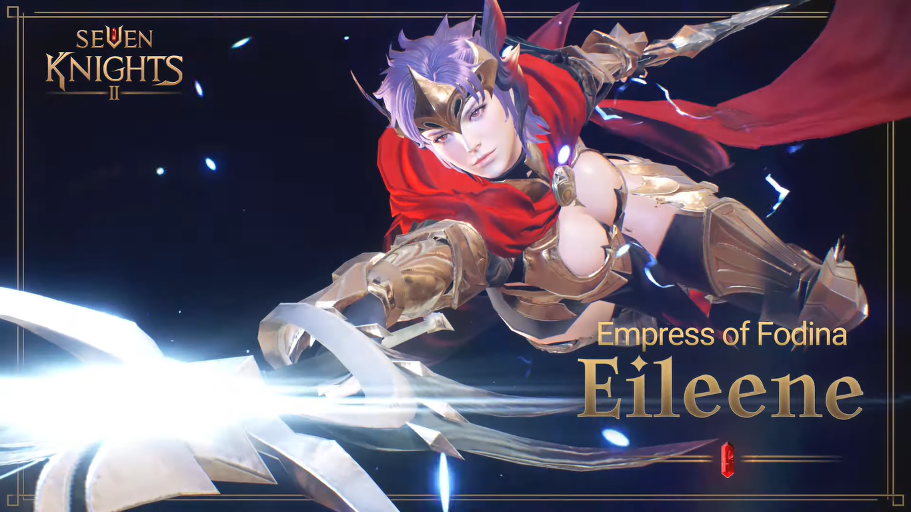{width="6.5in"
height="3.654166666666667in"}

Sang Ratu yang tetap berjuang melindungi pengikutnya ini sangat pantang
menyerah meski selalu dihadapkan dengan berbagai kekacauan yang
mengerikan. Misinya sebagai pemimpin Daybreak Mercenary pun dipenuhinya
dengan baik. Dilihat dari teaser-nya, Eileene memiliki role sebagai mage
dengan paduan assassin karena kecepatannya yang cepat bagaikan kilat
ditambah kekuatan petirnya yang menggelegar.

Mainkan Seven Knights 2 di PC

Wah, jadi makin tidak sabar untuk memainkan game dengan grafik yang
aduhai ini, kan? Apalagi kalau kamu bisa memainkannya di PC atau laptop,
pasti sensasi yang didapat jadi makin mengasyikan. Kamu bisa lho
menginstall emulator game android LDPlayer di PC atau laptop kamu, lalu
kamu unduh Seven Knights 2 yang keren ini, deh. Mudah banget, kan?
Pastinya. Tunggu apalagi? Buruan install LDPlayer di PC atau laptop
kamu!

Kesimpulan

Jika diusut lagi, game ini sebenarnya merupakan sekuel dari game
pertamanya yaitu, Seven Knights yang dirilis pada tahun 2015 lalu. Kalau
kamu pecinta storyline dari sebuah game, kamu bisa mencoba game
pertamanya terlebih dahulu supaya kamu paham kisah seperti apa yang
disajikan oleh Netmarble ke dalam game mereka ini. Dengan begitu, kamu
akan menjadi lebih hanyut ke dalam dunia Seven Knights dan mengenal
karakter-karakternya secara personal.

Mengingat game ini bergenre RPG, kamu harus bersiap-siap menanti panduan
dari banyak sumber supaya kamu tidak kesulitan dari early sampai late
game nantinya. Selain itu, kamu masih punya kesempatan untuk melakukan
pra-registrasi demi 50 ribu koin gratis yang bisa jadi bukan barang yang
mudah didapatkan di dalam game nantinya. Siap bergabung di dalam
kerennya game RPG yang satu ini? Kalau begitu sampai jumpa di perilisan
global yang diperkirakan hadir tanggal 10 November nanti, ya!
