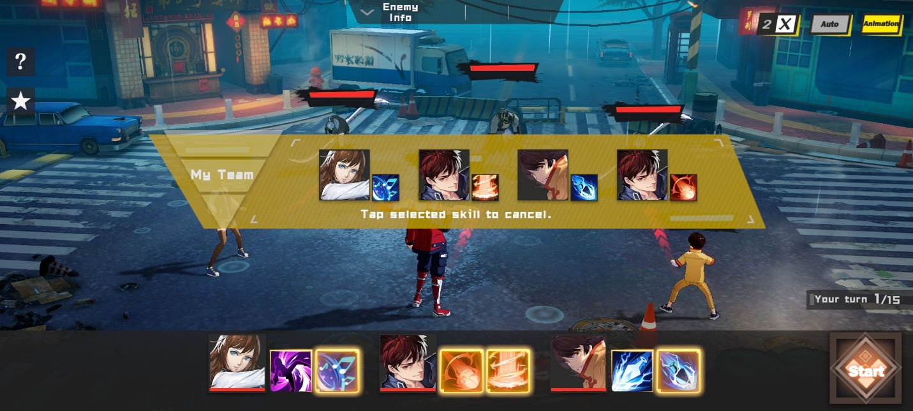
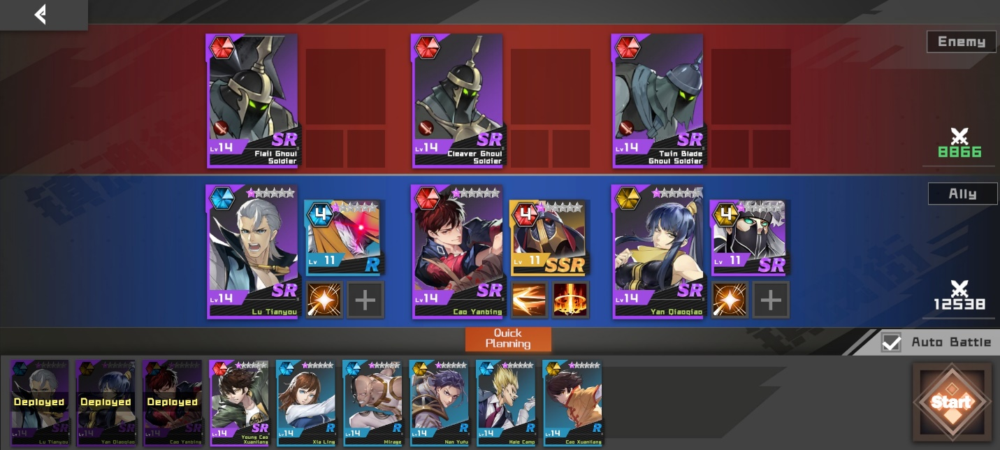
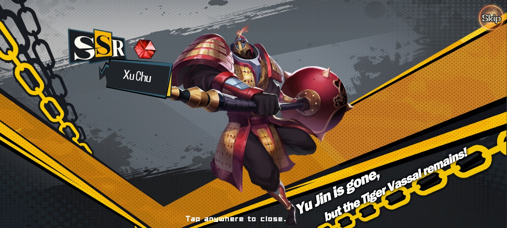
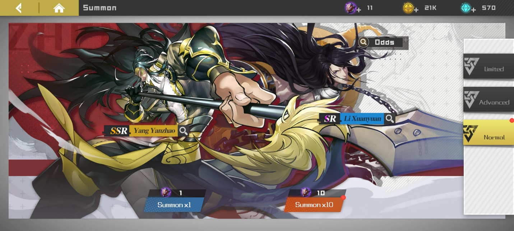
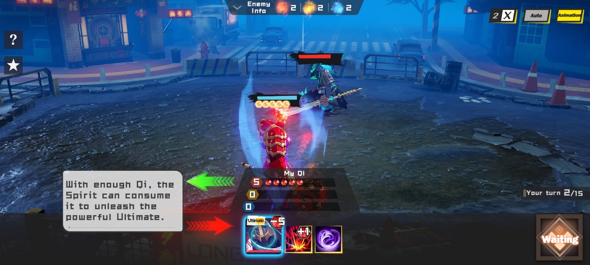
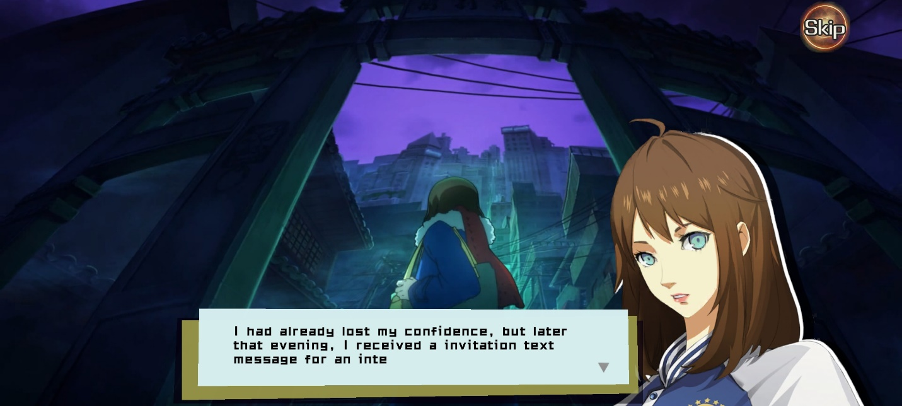
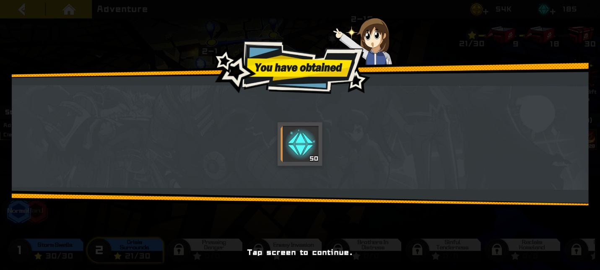
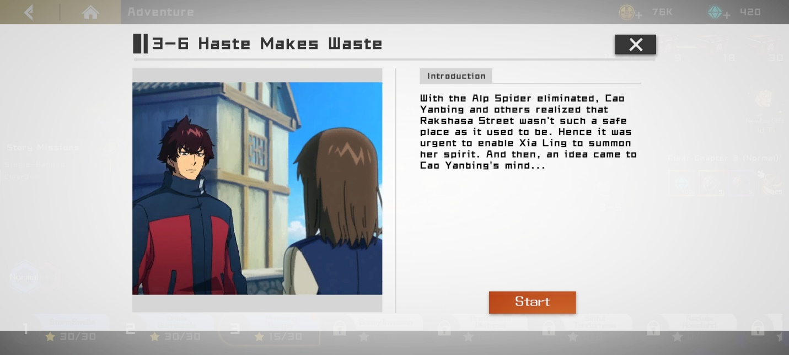

Rasakan Serunya Soft Launch Game Rakshasa Street

Halo sobat LDPlayer! Wuih, sekarang ada game keren baru, nih, namanya
adalah Rakshasa Street. Game ini merupakan adaptasi dari Manhwa alias
penyebutan dari bahasa Korea untuk komik. Nah, sebelum akhirnya soft
lauch di Indonesia, game yang digarap oleh developer Onefun Games ini
sudah pernah rilis di versi China. Soft launch game ini sudah dibuka
sejak 5 Desember lalu dan telah menarik perhatian lebih dari 10 ribu
pengguna untuk mencoba game ini. Apa kamu salah satunya?

Game ini menceritakan tentang sepasang kakak beradik yang diremehkan
oleh orang jahat yang memiliki Guardian Spirit, akhirnya orang jahat
tersebut dikalahkan oleh sang kakak yang memiliki tujuh Guardian Spirit
super kuat nan menyeramkan. Ada beberapa cuplikan scene dari anime-nya
yang dimunculkan sedikit di awal game, kamu penggemar anime Rakshasa
Street pasti senang, deh!

Gameplay

Seperti kebanyakan game lainnya, kamu akan diarahkan dengan berbagai
tutorial, terutama tutorial bagaimana cara kamu mengalahkan musuh saat
berada di arena. Kamu nantinya akan mendapatkan hero yang disebut
sebagai Spirit Master, Spirit Master starter kamu adalah seorang gadis
muda yang terjebak di Gate of Hell, di antara Evil Spirit yang ingin
menguasai Rakshasa Street berkeliaran.

Kamu akan mengarahkan gadis yang bernama Xia Ling itu melawan para Evil
Spirit dengan mengarahkan skill-skill yang dimilikinya.

{width="6.5in"
height="2.925in"}

Selain Xia Ling, kamu juga akan mendapat Cao Yanbing dan Cao Xuanliang
sebagai Spirit Master starter tambahan untuk memperkuat line up tim
kamu. Nah, di sini kamu akan mengetahui bahwa setiap Spirit Master bisa
memasukkan skill mereka maksimal dua skill ke dalam action slot. Untuk
melihat deskripsi skill Spirit Master, kamu perlu menekan skill tersebut
selama beberapa detik dan cocokkan dengan gaya bermain yang kamu
inginkan.

Sebelum masuk ke dalam stage untuk battle, kamu bisa menyusun line up
kamu, lho. Kamu bisa menyusun karakter terbaik kamu ke dalam arena.
Pastikan kamu sudah mencocokkan warna hexagon dari Spirit Master dengan
hexagon dari Guardian Spirit, supaya kamu bisa mendapat summoning skill
dengan damage tinggi.

{width="6.5in"
height="2.925in"}

Gacha

Bagian yang menjadi daya tarik tersendiri di setiap game RPG, apalagi
kalau bukan gacha? Seperti di game lain, kamu akan mendapat guaranteed
SSR, meski kamu hanya diberi kesempatan satu kali tarikan saja di game
ini.

SSR yang sudah pasti kamu dapatkan bernama Xu Chu yang merupakan
Guardian Spirit, Xu Chu tidak akan muncul di dalam arena tanpa summoning
skill dari salah satu Spirit Master. Cao Yanbing sebagai pemeran utama
menjadi rekomendasi dari tutorial untuk menyisipkan Guardian Spirit
tersebut.

{width="6.5in"
height="2.925in"}

Gacha di game ini akan terbagi menjadi dua, gacha untuk Spirit Master
yang dinamakan Recruit, dan gacha untuk Guardian Spirit yang dinamakan
Summon. Di masing-masing gacha tersebut juga akan ada bagian-bagian
gacha yang berbeda. Jika kamu baru dalam urusan gacha, tentu hal ini
akan sedikit membingungkan, tetapi hal ini justru akan memudahkan kamu
untuk memilih karakter mana yang kamu jadikan target.

Bagian-bagian gacha tersebut akan kami sebut banner. Pertama, kita akan
bahas mengenai gacha Summon yang memiliki tiga banner. Di advanced dan
limited banner akan ada yang namanya pity, pity ini akan menguntungkan
kamu apabila jumlah tarikan gacha kamu sudah memenuhi syarat. Meski di
normal banner tidak ada pity, kamu tetap bisa mendapat Guardian Spirit
dengan tier SR di setiap 10 kali tarikan.

{width="6.5in"
height="2.925in"}

Sesuai namanya, advanced dan limited banner memberi kamu kesempatan
mendapat Guardian Spirit dengan tier SSR lebih besar, ditambah jumlahnya
yang juga lebih banyak. Apalagi, Guardian Spirit yang menjadi tampilan
utama di limited banner memiliki persenan yang lebih besar dari beberapa
Guardian Spirit lainnya di banner yang sama.

Mari kita pindah ke bagian gacha Recruit, tidak jauh berbeda dengan
Summon, hanya saja di Recruit kamu hanya disuguhi dua jenis banner.
Banner core menjadi satu-satunya gacha Recruit yang memberi kamu pity,
meski begitu, tidak ada salahnya kamu mencoba banner Ordinary kalau kamu
mendapati Spirit Master favorit kamu. Tidak menutup kemungkinan, ke
depannya akan ada banner limited versi gacha Recruit.

Oh iya, alat gacha untuk Recruit dan Summon saling share ya, jadi kamu
harus bersabar sebelum melakukan gacha, hindari gegabah dan pikirkan
baik-baik, gacha mana yang lebih kamu perlukan. Lalu, berdoalah sebelum
menekan tombol summon! Semoga beruntung!

Guardian Spirit

Seperti yang sudah kita bahas, Guardian Spirit tidak akan muncul tanpa
adanya summoning skill dari salah satu Spirit Master di dalam arena.
Summoning skill bisa didapat saat jumlah Qi yang kamu miliki sudah
terpenuhi. Qi sendiri bisa dibilang mirip seperti mana, jumlah awal Qi
biasanya hanya tiga buah.

Summoning skill biasanya memerlukan lima Qi, tapi kamu tidak perlu takut
kekurangan Qi karena ada biasanya Guardian Spirit akan memberi kamu
tambahan Qi, jika sudah terpenuhi, saatnya kamu memilih Guardian Spirit
mana yang akan kamu lepaskan dari "kandang".

{width="6.5in"
height="2.925in"}

Oh iya, kamu juga akan diberi tahu cara menaikkan power dari Guardian
Spirit tersebut. Di bagian Train, kamu bisa menaikkan level dan juga
limit break dari Guardian Spirit itu.

Psst, sedikit spoiler, nih, kamu bisa juga mengganti skill yang dimiliki
Guardian Spirit, lho! Tapi kamu harus sabar mengikuti tutorial ya!
Hihihi.

Story

Bagian utama dari game ini merupakan hal yang paling mengasyikkan
setelah gacha. Di dalam story, kamu akan disuguhi animasi 3D yang
mengagumkan. Psst, hampir dari keseluruhan animasi di game ini mirip
sekali dengan Persona, lho, jadi kalau kamu penggemar Persona, pasti
akan sedikit terkejut melihat kemiripan game ini dengan game favorit
kamu.

{width="6.5in"
height="2.925in"}

Meski begitu, jalan cerita di game ini sangat menghibur, sangat
recommended untuk kamu nikmati sendiri. Kamu akan melihat betapa lucunya
Xia Ling yang mudah tersulut emosi jika berhadapan dengan Cao Yanbing.

Lewat story juga, kamu akan mendapatkan Spirit Jade, item penting yang
bisa kamu tukar menjadi alat gacha. Pastinya akan memudahkan kamu yang
ingin melakukan farming Spirit Jade saat karakter favorit kamu ada di
banner gacha.

{width="6.5in"
height="2.925in"}

Tidak semua stage Story menyuruh kamu untuk battle di dalam arena,
beberapa di antaranya benar-benar hanya story, tapi kamu tetap mendapat
reward setelahnya. Wih, apalagi kamu bisa skip story-nya, enak banget,
kan? Kalau kamu tidak ingin kebingungan karena tidak tahu game ini
menceritakan apa, tentu tombol skip tidak direkomendasikan untuk kamu
tekan.

{width="6.5in"
height="2.925in"}

Mainkan Rakshasa Street di PC

Masa sih kamu tidak ingin melihat gemasnya Xia Ling yang selalu adu
mulut dengan Cao Yanbing? Apalagi yang justru menjadi penengah adalah
adik dari Cao Yanbing yang bernama Cao Xuanliang, hihihi, pasti
menggemaskan sekali.

Makanya, supaya kamu bisa melihat gemasnya ketiga karakter tersebut dan
kerennya gameplay game ini dengan lebih jelas, kamu bisa install
emulator game android LDPlayer ke PC atau laptop kamu, lho. Setelah itu
kamu bisa unduh game Rakshasa Street ini dan rasakan betapa kerennya
para Guardian Spirit saat beraksi.

Kesimpulan

Bukan hal baru untuk game membuat animasi maupun gameplay yang mirip
dengan game populer lainnya, game Rakshasa Street sendiri bisa dibilang
mengikuti animasi dari game Persona, meski dari gameplay tentu tidak ada
kemiripan sama sekali. Eksekusi dari game ini juga sudah cukup bagus dan
tidak terlihat setengah hati.

Game ini juga cukup aktif memasukkan unsur dari anime-nya, sehingga
kalau kamu kurang paham dengan alur ceritanya, kamu tetap bisa terhibur
dengan animasinya. Kamu sudah tertarik memainkan game ini? Tunggu
apalagi? Ayo unduh dan rasakan serunya bermain game RPG turn-based yang
satu ini! Selamat bermain!
