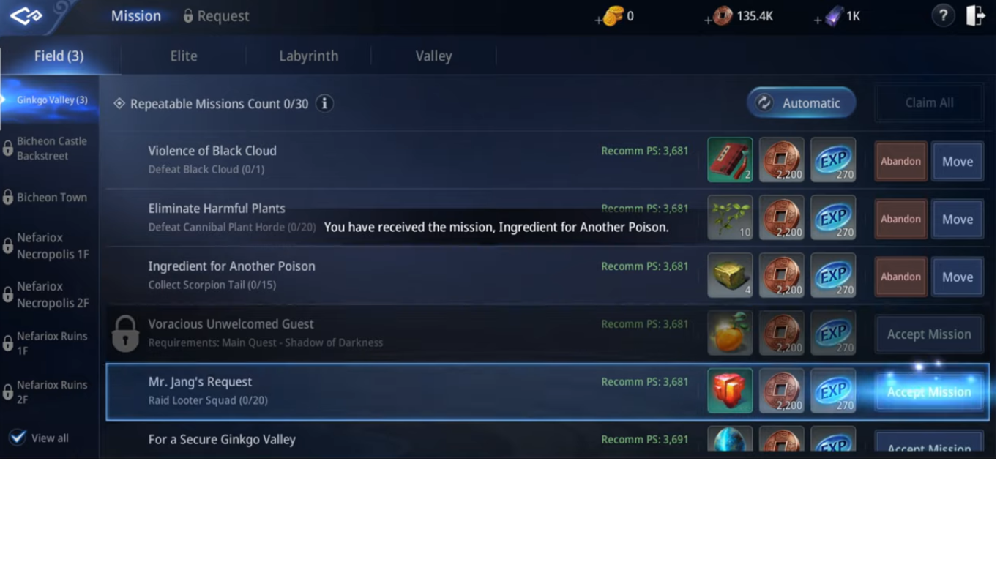
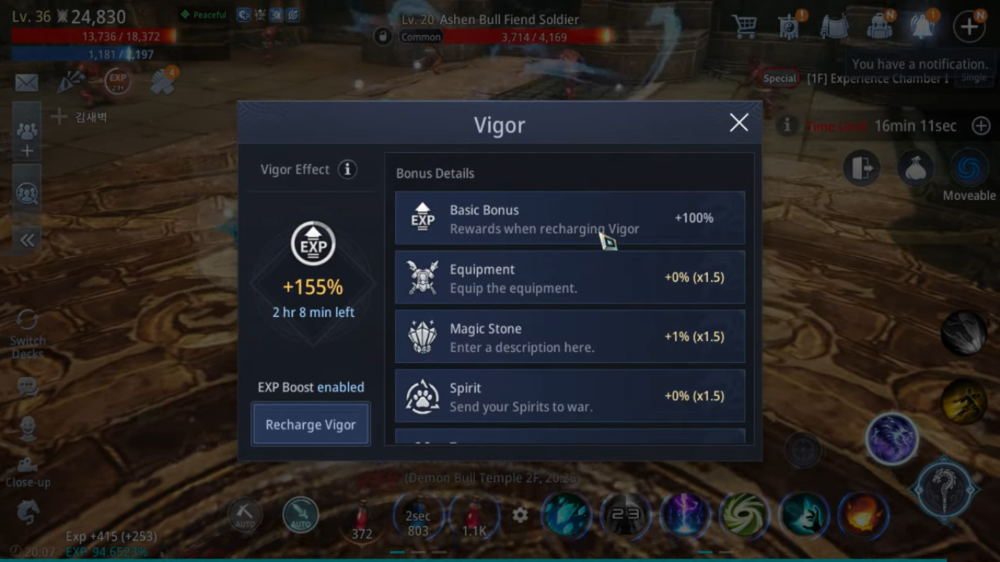
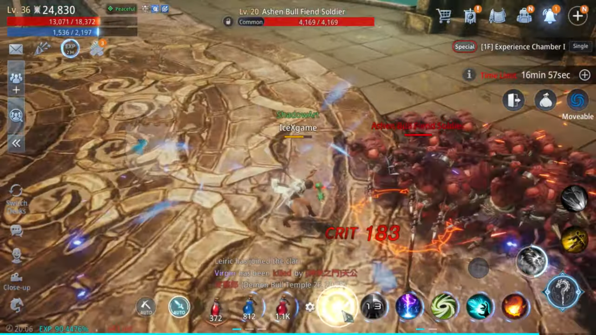

**Tips Cepat Naik Level di MIR4 untuk Pemula**

Gamer seperti kamu pasti sudah memainkan game keren yang satu ini, kan?
Sejak rilis pada 26 Agustus lalu, Wemade Co., Ltd sudah berhasil menarik
perhatian lebih dari 5000 orang untuk mengunduh game MIR4 ini. Dengan
genre MMORPG yang dianut game ini, kamu akan bertemu dengan banyak
player di satu server yang kamu pilih, jadi bisa ketemu teman baru, deh!

Selain asyiknya bermain dengan banyak player, kamu juga disuguhi dengan
jalan cerita yang tidak kalah menarik dan pastinya bikin kamu penasaran
seperti apa ya kelanjutannya? Eits, sebelum kamu melihat cerita
selanjutnya, kamu perlu naik level dulu, nih. Baca tips di bawah ini
supaya level kamu cepat naik, yuk!

**Menjalankan misi**

Hal yang satu ini tentunya wajib kamu lakukan untuk menaikkan level
kamu. Selain dapat EXP, kamu juga bisa dapat item-item penting lainnya
seperti copper atau tembaga, energi, dan sebagainya. Nantinya, kamu bisa
menjalankan banyak misi di antaranya ada misi utama yang tentunya kamu
sudah temui sejak awal, misi sampingan yang terdapat empat misi berbeda
di dalamnya, misi permintaan, dan juga misi giyeon.

Misi sampingan nantinya menjadi misi harian yang akan reset setiap
harinya, kamu juga bisa memilih misi mana yang akan kamu terima dan kamu
selesaikan. Seluruh misi memberi kamu hadiah EXP dan copper. Copper ini
bisa kamu gunakan untuk membeli potion yang memberi kamu buff tertentu
saat akan farming.

{width="6.5in"
height="2.96875in"}

Misi harian yang kamu dapatkan akan sangat banyak, pilihlah minimal
sepuluh misi demi kenaikan level karaktermu. Di level 15 nanti, kamu
bisa mengaktifkan Auto Mission, manfaatkan sistem ini ketika kamu sedang
sibuk sehingga kamu tetap bisa mendapat banyak EXP saat tidak sedang
bermain MIR4.

**Mengaktifkan auto battle**

Sistem yang satu ini memiliki manfaat yang sangat besar ketika kamu
sedang sibuk dan tetap ingin mendapatkan EXP. Kamu bisa mengaktifkan
auto battle ketika kamu akan AFK, karakter kamu akan tetap rajin
menghabisi para monster saat kamu sedang tidak membuka game.

Saat kamu menggunakan auto battle, pastikan kamu memiliki efek vigor
yang bisa menambah persentase pendapatan EXP kamu. Efek vigor memiliki
batasan waktu, jika habis, kamu bisa mengisi ulang dengan menggunakan
vigor pills. Kalau kamu sudah melakukan pra-registrasi game ini, MIR4
akan memberi kamu sepuluh vigor pills yang memberi kamu 60 menit waktu
efek vigor tersebut. Efek vigor bisa kamu buka dengan mengeklik EXP yang
ada di pojok kiri bawah layar kamu.

{width="6.5in"
height="3.654166666666667in"}

**Menjaga skor propensity**

MIR4 memberi kamu kebebasan untuk mengganti mode atau label karakter
kamu. Mode ini bisa kamu gunakan di situasi tertentu yang terdiri dari
Peace yang tidak akan membuat karaktermu bisa menyerang karakter dari
player lain, Good and Evil yang membuat karaktermu bisa menyerang selain
dari anggota klan, teman, moon faction, dan party kamu, Hostility
membuat karaktermu bisa menyerang selain anggota klan, teman, dan party,
terakhir ada label Slaughter yang membuat karaktermu bisa menyerang
siapapun kecuali party kamu.

Kamu harus perhatikan juga setiap kali karaktermu membunuh karakter dari
player lain, skor prospensity kamu lambat laun akan berkurang dan
semakin sedikit skor yang kamu miliki, semakin sedikit pula persentase
EXP yang bisa kamu dapatkan.

Selain mode yang bisa kamu ubah, MIR4 juga menyediakan zona-zona yang
berbeda. Saat karaktermu berada di luar zona aman dan mati, akan ada
hukuman tertentu yang salah satunya mengurangi EXP yang sudah kamu
miliki.

**Menaikkan kualitas equipment**

Semakin bagus kualitas equipment yang kamu miliki, semakin besar
kesempatan kamu untuk mengalahkan monster yang lebih kuat. Equiment yang
kamu miliki bisa kamu leburkan agar efek yang diberikan menjadi lebih
baik.

Selain itu naikkan juga skill-skill dari karaktermu supaya damage yang
dihasilkan menjadi lebih besar. Dengan damage besar yang kamu miliki,
kamu bukan hanya bisa mengalahkan para monster, tapi kamu juga bisa
melindungi diri dari player lain yang berusaha mengalahkan kamu di
situasi tertentu.

Ketika karaktermu sudah memiliki statistik yang cukup, farming EXP
tentunya sudah tidak menjadi hal yang sulit untuk dilakukan lagi karena
kamu bisa mengalahkan banyak monster khususnya yang ada di magic square,
tempat di mana kamu bisa mendapat banyak EXP.

**Mengunjungi magic square**

Tempat yang satu ini bisa kamu temukan di portal yang ada di bagian
menu. Sistem magic square ini mirip dengan tower, jika kamu berhasil
mengalahkan semua monster di satu lantai, maka kamu bisa naik ke lantai
selanjutnya dan tentunya setiap monster yang kamu kalahkan akan memberi
kamu item-item tertentu termasuk EXP.

Sebelum kamu masuk ke magic square, kamu bisa membeli bahan-bahan yang
bisa memberi kamu buff selama berada di magic square supaya karakter
kamu tidak mudah dikalahkan. Ada juga potion mana yang tentunya sangat
penting untuk kamu yang memilih karakter dengan class Sorcerer. Beli lah
item-item tersebut dengan copper yang sudah kamu kumpulkan.

Jika kamu berada di lantai dengan monster berdarah tebal yang sulit kamu
kalahkan, ajak player lain atau bergabunglah dengan party yang tersedia
supaya kamu bisa mengalahkan monster-monster tersebut. Jika sudah
mendapat drop dari monster yang tumbang tersebut, kamu harus cepat-cepat
membukanya karena bisa jadi player lain sudah mengincar hasil jerih
payah kamu tersebut.

Psst, kalau kamu ingin cara mudah mengalahkan monster yang banyak
sekaligus, kamu bisa berkeliling sebentar untuk menarik perhatian para
monster, lakukan hal ini sampai monster-monster tersebut membentuk
barisan yang berdekatan dan kamu bisa langsung menghabisi mereka dalam
waktu singkat.

{width="6.5in"
height="3.654166666666667in"}

**Kesimpulan**

Level menjadi bagian yang sangat penting di dalam game MMORPG ini karena
ada beberapa misi yang tidak bisa dilakukan sebelum menyentuh level
tertentu. Kamu bisa melakukan semua hal-hal yang sudah disebutkan di
atas supaya kamu mudah menaikkan level karakter kamu di MIR4. Semakin
tinggi level kamu, semakin banyak hal yang bisa kamu lakukan seperti
membuka slot untuk Spirit yang tentunya bisa menambah statistik karakter
kamu di MIR4.

Kamu ingin memainkan MIR4 di saat yang bersamaan kamu ingin melakukan
hal lain di HP kamu? Kamu bisa, *lho,* mengunduh game ini di PC atau
laptop kamu supaya kamu bisa memonitori permainan kamu dan tentunya kamu
masih bisa melakukan hal lain di HP kamu tanpa terganggu. Caranya dengan
mengunduh emulator game android LDPlayer di PC dan laptop kamu, kemudian
unduhlah MIR4, dan kamu bisa langsung memainkan game ini di PC dan
laptop kamu. Seru banget, kan? Pastinya dong, makanya kamu jangan sampai
ketinggalan serunya game ini, ya! Selamat bermain!
