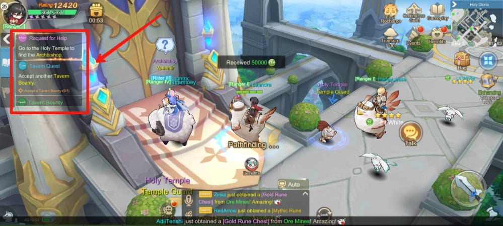
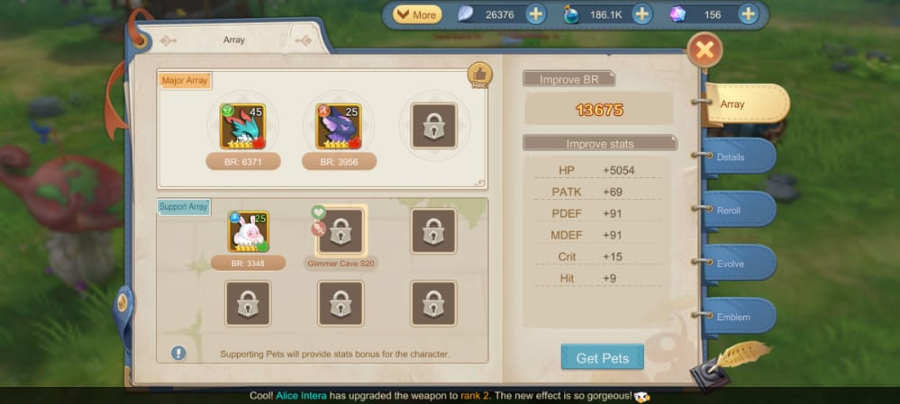
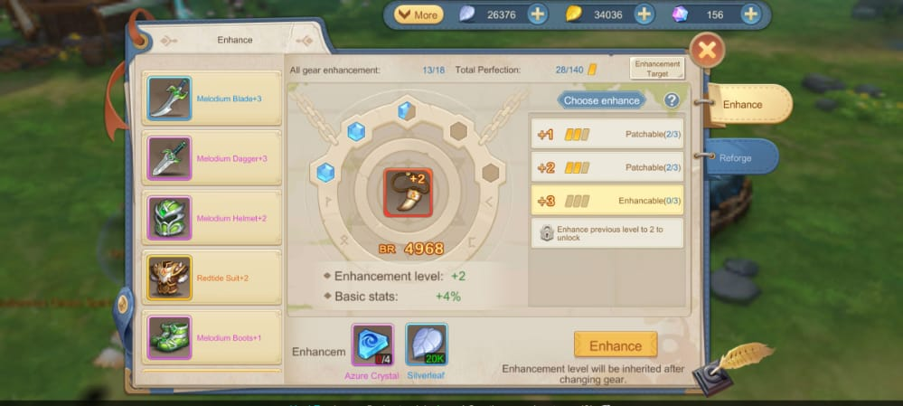
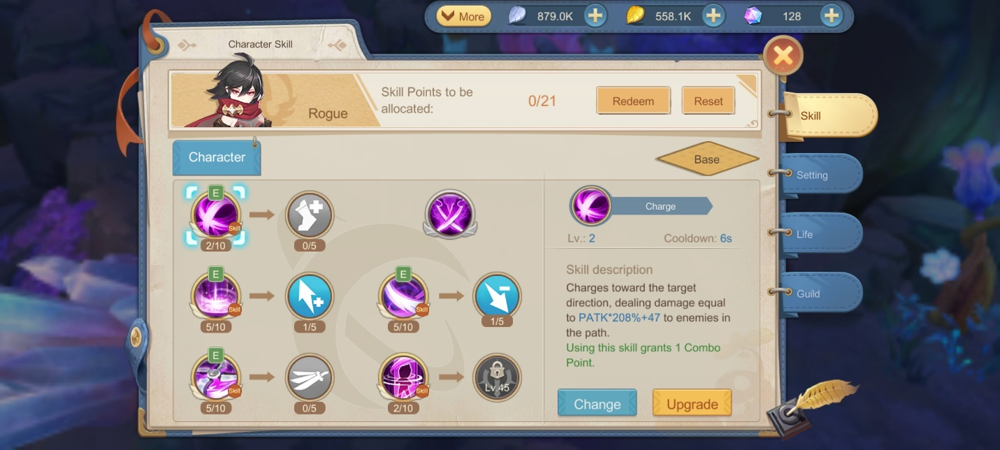
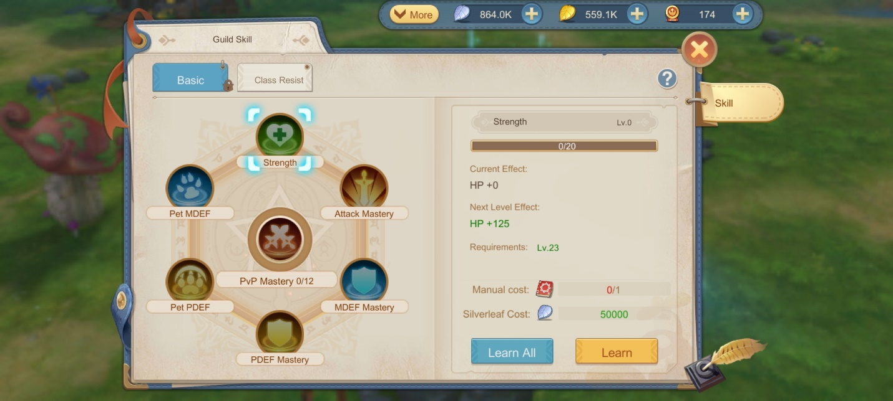
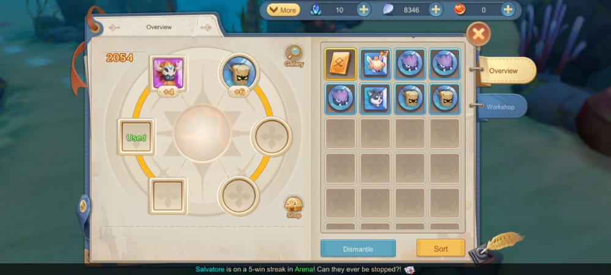
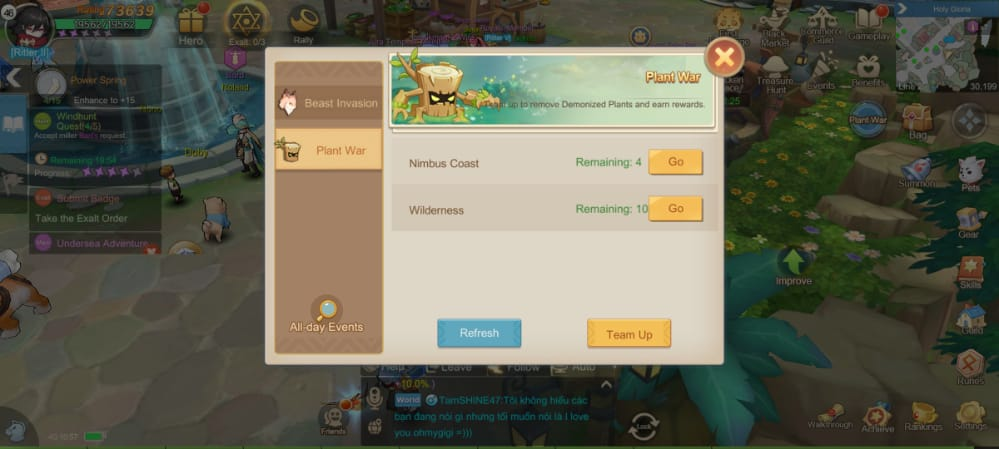
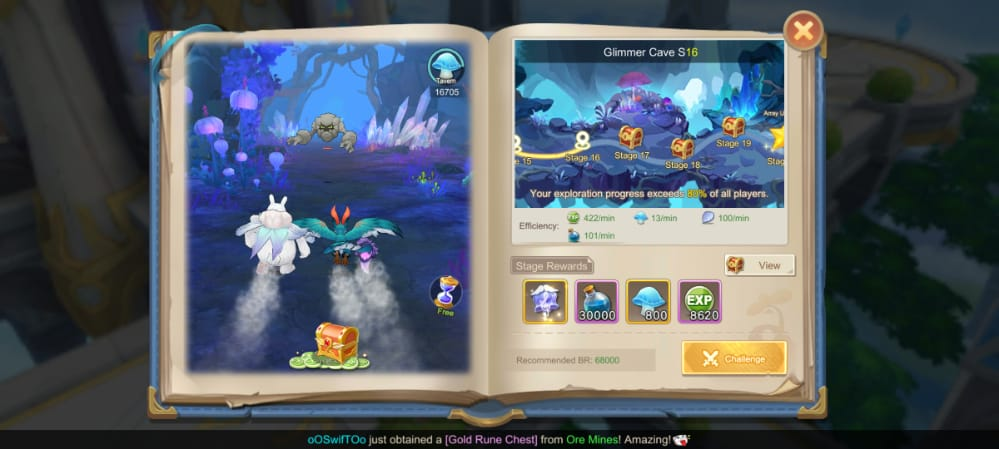

Tips Cepat Menjadi Kuat di Game Cloud Song : Saga of Skywalker

Kamu sudah sering memainkan game MMORPG? Bulan ini sedang
banyak-banyaknya perilisan game MMORPG, lho. Salah satunya ada game seru
seperti Cloud Song : Saga of Skywalker ini yang merupakan buatan
developer VNG Game Publishing. Game yang resmi rilis di Indonesia pada 6
September kemarin sudah berhasil menggaet lebih dari seratus ribu
pengguna.

Mengisahkan tentang pejuang yang dipanggil Skywalker, kamu akan
mengontrol karakter tersebut dan menjalani petualangan yang seru, mulai
dari melawan monster, membantu warga, bahkan menyelamatkan teman dari
gangguan penjahat. Tentunya untuk melakukan semua itu kamu harus menjadi
kuat. Kekuatan kamu ditentukan dengan rating, jumlah rating tersebut
akan menjadi acuan kamu setiap kali ingin menjalankan misi melawan musuh
supaya karaktermu tidak tumbang saat pertarungan. Ingin tahu bagaimana
cara menambah rating dengan cepat? Simak bacaan di bawah ini sampai
habis, ya!

Memenuhi misi

Hal yang wajib kamu lakukan saat ingin memperbanyak rating adalah
menyelesaikan misi. Akan ada beberapa misi yang tersedia di antaranya
main, tavern, dan sub. Kamu bisa melihat misi-misi tersebut di bagian
kiri layar dan pilihlah misi mana yang akan kamu penuhi. Setelah kamu
menyelesaikan misi tersebut, kamu akan mendapat rewards berupa EXP
ataupun item-item lainnya. EXP yang kamu dapat akan diakumulasikan dan
kamu bisa cepat naik level sehingga rating kamu juga bertambah.

{width="6.5in"
height="2.921527777777778in"}

Untuk mempersingkat waktu, kamu bisa menyalakan fitur auto, pastinya
kamu sudah tahu posisi auto di mana, kan? Kalau kamu lupa, fitur auto
dari di bagian kanan atas kolom chat. Sebenarnya sejak awal tutorial
sudah diberitahu, sih. Hihihi.

Kalau misi yang kamu hadapi terlihat sulit, kamu bisa membentuk party
yang maksimal berjumlah lima orang, selain rewards yang tersedia bisa
lebih banyak, rating kamu juga akan bertambah seiring banyaknya EXP yang
kamu dapat.

Menaikkan level

Seperti game MMORPG kebanyakan, bukan hanya karakter kamu yang perlu
dinaikkan levelnya, tetapi juga pet, gear, bahkan skill dari karakter
kamu. Maka dari itu, sangat penting untuk kamu menyelesaikan misi-misi
yang tersedia agar mendapat banyak EXP karena semakin tinggi levelnya,
semakin banyak pula jumlah rating yang akan kamu miliki.

Pet

Hewan-hewan imut ini akan menjadi partner setia kamu. Meski kecil,
mereka sangat pemberani, bahkan saat berhadapan dengan monster yang
sangat kuat sekalipun. Untuk menaikkan levelnya, kamu bisa mengumpulkan
botol EXP khusus untuk pet yang bisa kamu dapatkan melalui cargo quest,
wheel, black market, treasure hunt, dan juga plant war.

Kamu juga bisa melakukan reroll untuk menambah statistik dari pet milik
kamu. Selain itu, jika pet yang kamu miliki tadinya hanya memilik tiga
atau empat bintang, kamu bisa menambah bintang tersebut melalui evolve
dengan catatan kamu harus memiliki jenis pet yang sama dan sejumlah tipe
pet yang dibutuhkan.

{width="6.5in"
height="2.921527777777778in"}

Akan ada juga sistem gacha untuk pet, kamu bisa mengumpulkan pet
sebanyak mungkin. Di dalam galeri pet nanti kamu bisa mengaktifkan pet
yang baru kamu dapatkan tersebut dan rating kamu juga akan bertambah.
Kamu juga bisa memasukkan pet milik kamu ke dalam slot yang berjumlah
tiga dan masing-masing slot bisa kamu buka saat kamu menyentuh level
tertentu, tapi kamu juga harus menyiapkan banyak silverleaf sebelum kamu
bisa benar-benar membuka slot tersebut.

Di bawah tiga slot pet utama ada slot pet support yang levelnya akan
mengikuti level terendah dari pet yang ada di slot utama, tentunya pet
support ini akan memberi statistik kepada karakter kamu dan juga
menambah ratingnya. Slot pet support ini bisa kamu buka setelah kamu
berhasil mengalahkan monster yang ada di Glimmer Cave.

Gear

Item yang satu ini pastinya penting untuk perkembangan karakter
kesayangan kamu. Kamu bisa mendapat gear melalui gear realm atau
membelinya di market alias commerce guild. Akan ada enam jenis gear yang
bisa kamu kumpulkan dan naikkan levelnya. Gear tersebut juga memiliki
kualitas yang ditunjukkan melalui warnanya. Hanya gear berwarna kuning
yang bisa kamu reforge agar statistiknya menjadi lebih baik.

{width="6.5in"
height="2.921527777777778in"}

Gear yang kamu miliki bisa kamu enhance dengan menggunakan azure crystal
dan juga silverleaf. Berbeda dengan silverleaf, azure crystal sedikit
lebih sulit didapat karena hanya di quest tertentu kamu bisa
mendapatkannya secara percuma, kalau kamu memiliki banyak pets yang bisa
kamu kirim ke tavern quest tentunya kamu bisa mendapat azure crystal
tersebut dengan mudah.

Skill

Tentunya sudah bukan rahasia lagi kalau yang satu ini ambil andil
langsung dengan kekuatan rating kamu. Bukan tanpa alasan, damage yang
dikeluarkan dari skill milik karakter kamu akan jadi bagian paling
mencolok. Kamu perlu poin skill untuk bisa meningkatkan level skill dan
juga membuka skill lain yang masih terkunci.

{width="6.5in"
height="2.925in"}

Poin skill bisa kamu dapat setiap kali kamu naik ke level tertentu,
pilihlah skill yang kamu prioritaskan, jangan lupa baca deskripsi dari
skill tersebut supaya damage yang dihasilkan bisa lebih maksimal. Jika
skill karaktermu sudah berdamage tinggi, rating kamu juga akan
mengikuti.

Ada juga buff skill yang hanya bisa kamu dapat setelah kamu bergabung ke
dalam guild. Klik guild yang ada di bagian kiri bawah layar, buka bagian
benefit dan pilih guild skill. Di sana kamu bisa memilih buff untuk
karakter kamu. Kamu butuh buku berwarna merah untuk menaikkan buff
tersebut, buku itu bisa kamu beli di dalam guild shop dengan menggunakan
poin kontribusi. Tentunya setelah buff kamu bertambah, BR kamu juga ikut
meningkat.

{width="6.5in"
height="2.925in"}

Rune

Rune merupakan batuan yang bisa menambah rating dan memberi karaktermu
beberapa statistik dasar yang berguna. Tersedia enam slot yang
masing-masing perlu kamu buka di level tertentu. Sama seperti gear, rune
juga memiliki kualitas yang ditunjukkan dengan warna. Hanya rune dengan
warna mulai dari ungu yang bisa evolve.

{width="6.5in"
height="2.921527777777778in"}

Skill karakter kamu ini masing-masing akan memiliki sub skill yang pasif
dan bisa menambah statistik dari karakter kamu. Sub skill ini juga akan
meminta poin skill jadi kamu perlu lebih teliti saat ingin menaikkan
level dari skill-skill ini. Kalau kamu berubah pikiran, kamu bisa
melakukan reset dan menaikkan level skill karaktermu dari awal.

Farming item-item penting

Selain leveling, farming material juga tidak kalah pentingnya karena
meskipun level dari item sudah tinggi, tetapi jika kualitasnya rendah
akan tetap kalah kuat dengan yang berkualitas tinggi. Maka dari itu,
supaya rating karaktermu semakin tinggi dan kuat, kamu perlu melakukan
farming di area-area seperti gear realm, plant war, dan treasure hunt
agar kamu bisa mendapat item-item keren dan juga EXP tentunya.

Gear realm

Kamu diwajibkan membentuk party minimal berjumlah tiga orang sebelum
kamu bisa masuk ke dalam gear realm ini. Kamu dan party kamu harus
menghabisi seluruh monster-monster di dalamnya sampai kamu berhadapan
langsung dengan boss. Kalau kamu beruntung, kamu bisa mendapat drop
berupa gear dengan kualitas tinggi dan kamu bisa mendapat poin lebih
banyak untuk BR kamu.

Plant war

Sama seperti gear realm, kamu juga perlu membentuk atau bergabung dengan
party yang berjumlah minimal tiga orang. Nantinya party kamu akan
berkeliling dan menghabisi para monster. Akan ada lima sesi yang bisa
kamu lakukan sebelum akhirnya kamu dan party mendapat reward yang
dijanjikan.

{width="6.5in"
height="2.921527777777778in"}

Treasure hunt

Di sini kamu bisa masuk tanpa membentuk party, tetapi pastikan rating
kamu sudah sesuai dengan tingkat kesulitan dari boss yang akan kamu
hadapi di sini. Treasure hunt merupakan sebutan dari glimmer cave yang
bisa kamu tuntaskan untuk membuka slot dari pet support milik kamu.

{width="6.5in"
height="2.921527777777778in"}

Kesimpulan

Memainkan game MMORPG tentulah tidak sulit, adanya fitur auto memudahkan
pemain yang memiliki kesibukan tetapi tetap ingin terhibur dengan game
di saat yang bersamaan. Tentunya agar semakin mudah melakukan dua hal
tersebut, kamu bisa mengunduh emulator game android LDPlayer di PC atau
laptop kamu supaya kamu tetap bisa memonitori game kamu tanpa mengganggu
kesibukan yang kamu lakukan melalui android.

Masih banyak juga hal-hal yang bisa kamu temui ke depannya di dalam game
ini karena pastinya developer akan terus sibuk menambah
fasilitas-fasilitas seru supaya kamu tidak akan merasa bosan selama
bermain. Pastinya kamu tak ingin ketinggalan keseruan lainnya di game
ini, kan? Kalau begitu ayo mainkan Cloud Song : Saga of Skywalker!
Jangan sampai ketinggalan, ya!
