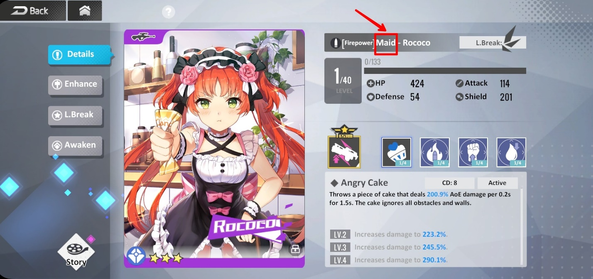
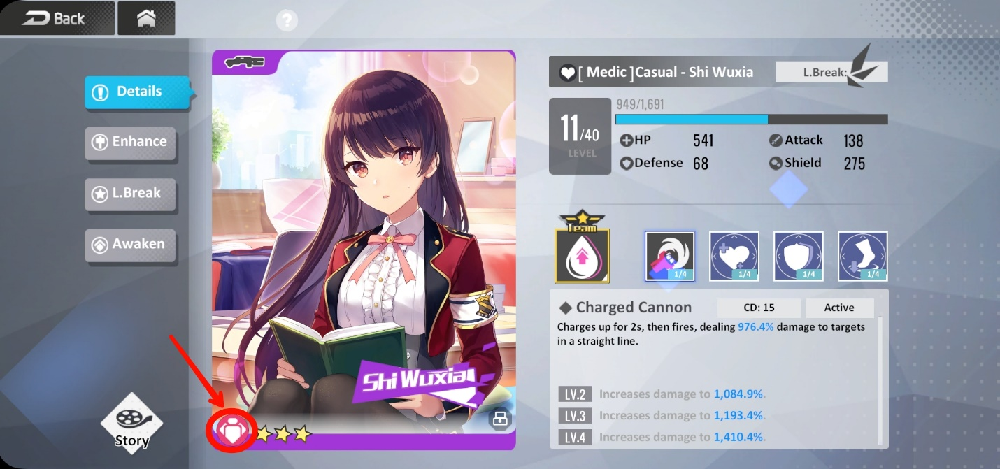
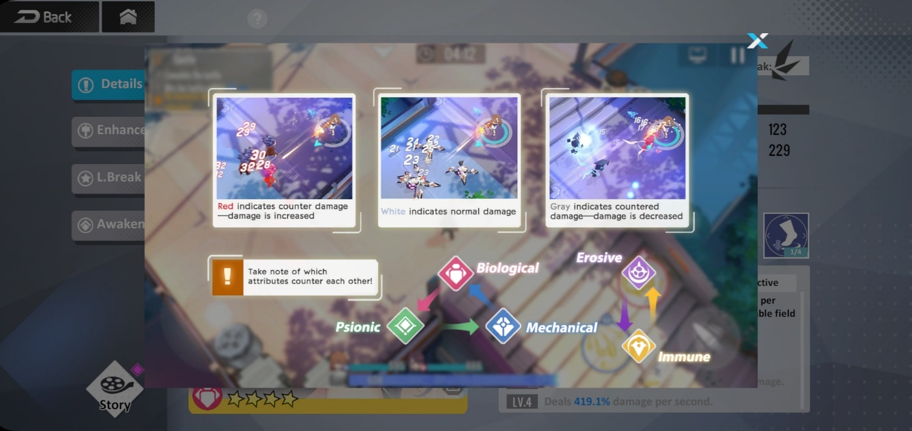
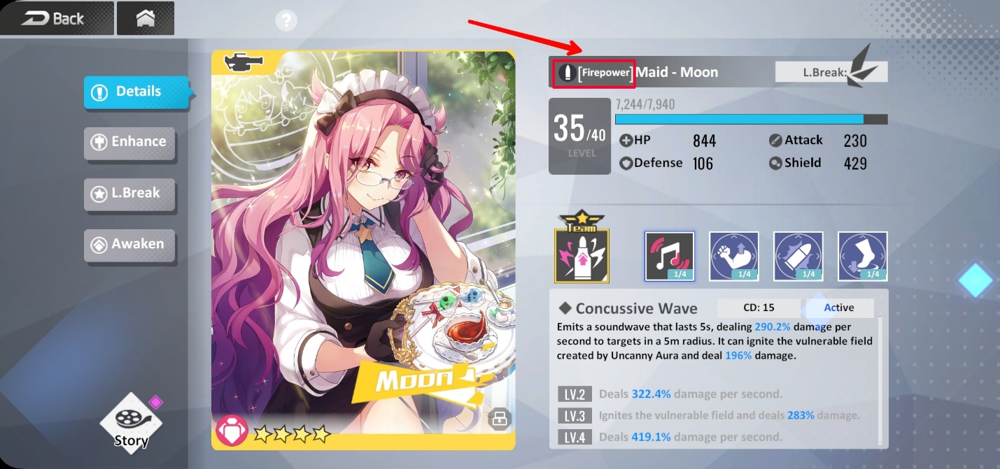
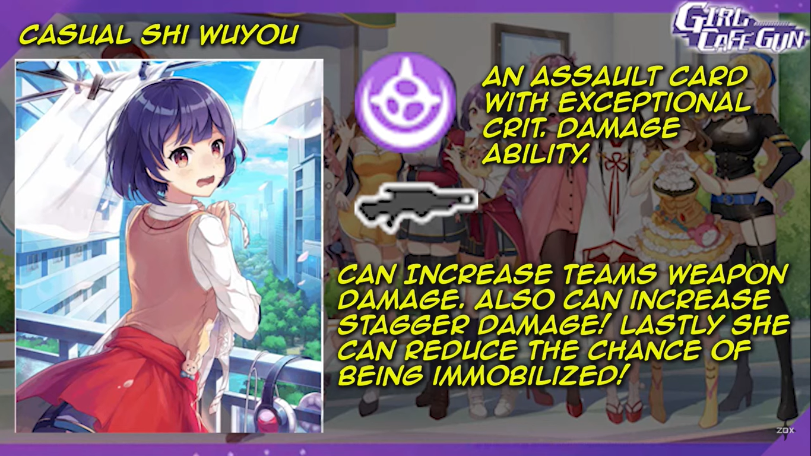
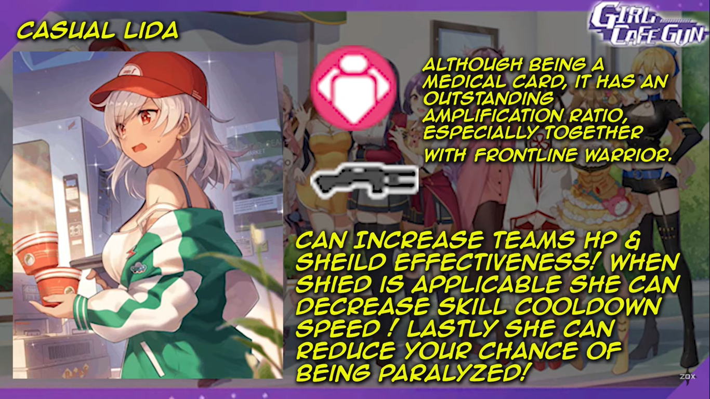
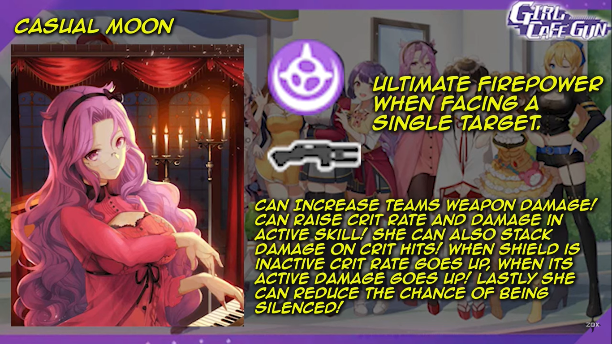
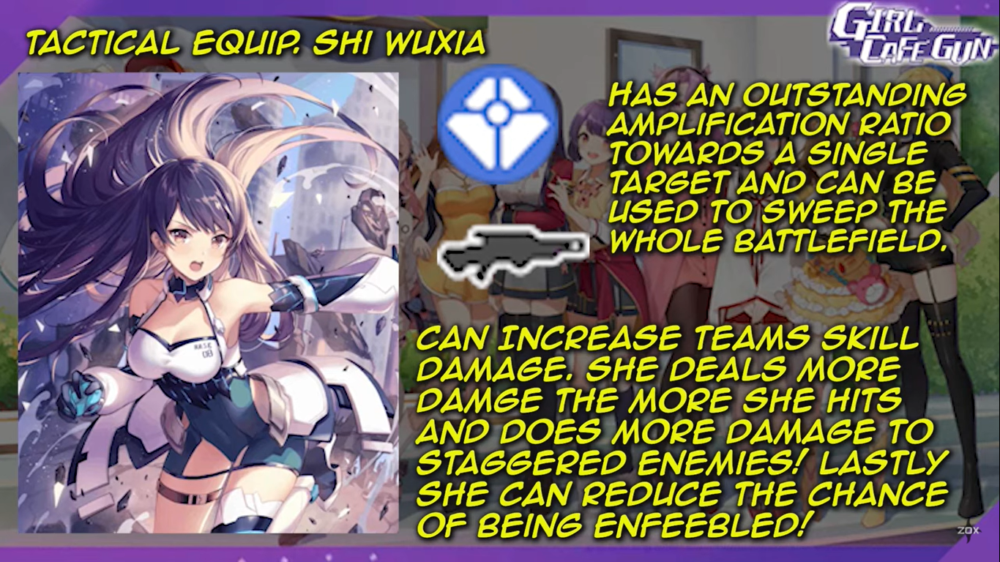
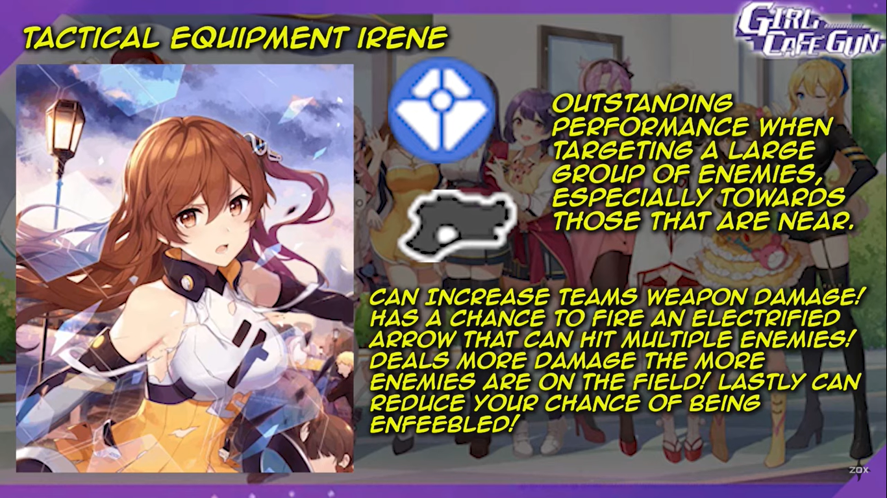
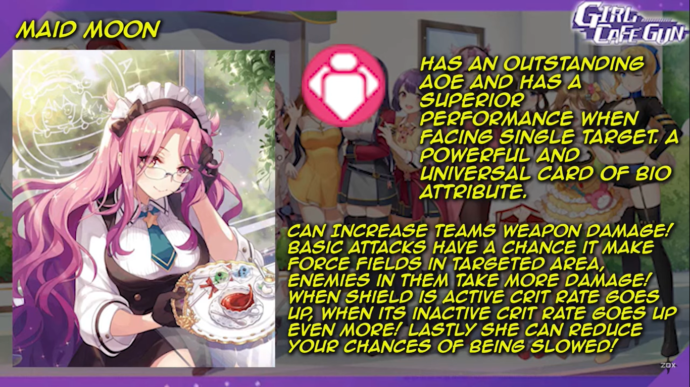

Tips Membentuk Tim yang Kuat di Game Girl Cafe Gun

Girl Cafe Gun sudah resmi rilis di Indonesia, nih! Kamu sudah siap
bertarung bersama para waifu imut yang jago menembak ini belum? Setelah
penantian selama masa pra-registrasi yang panjang akhirnya game ini
rilis pada tanggal 9 September 2021 dan kamu sudah bisa mengunduhnya di
Google Play Store. Developer BILIBILI pun sudah berhasil menarik
perhatian lebih dari seribu pengguna untuk merasakan serunya game ini,
lho. Kamu juga jangan sampai ketinggalan, ya!

Selain beraksi dengan menembak-nembaki musuh, waifu-waifu lucu itu bisa
kamu ajak bersantai juga di dalam cafe buatanmu. Lucu banget, kan?
Sebelum kamu masuk ke dalam permainan nanti, ada banyak hal yang perlu
kamu ketahui, nih! Penasaran, kan? Kita cari tahu, yuk!

Detail para waifu

Daya tarik nomor satu dari game ini tentu saja para waifu cantik nan
imut yang bisa kamu dapatkan lewat keberuntungan gacha kamu. Sebelum
kamu bisa membentuk sebuah tim, kamu perlu tahu dulu kalau waifu kamu
tersebut akan hadir dengan wujud yang berbeda-beda. Bingung, ya? Hihihi.

Singkatnya wujud waifu kamu akan hadir dalam bentuk kartu yang kamu
dapat dari gacha. Di kartu tersebut, waifu kamu akan digambarkan dengan
berbagai rupa dan guna. Supaya tidak makin bingung, simak bacaan di
bawah ini, yuk!

Pakaian

Jangan takut waifu kamu jumlahnya terbatas di game ini, dengan adanya
pakaian, wujud mereka akan terlihat berbeda di setiap kartunya. Kamu
bisa membedakan skill yang mereka miliki lewat pakaian tersebut. Akan
ada pakaian casual, tactical equip, maid, official dress, dan lain
sebagainya.

Setiap pakaian yang dikenakan akan terdapat juga voicelines yang
berbeda, tentunya sesuai dengan sifat dari masing-masing waifu.
Contohnya seperti Wuxia yang akan protes di wujudnya yang memakai
pakaian maid. Bikin gemas, kan? Pastinya.

{width="6.5in"
height="3.0597222222222222in"}

Tipe

Tipe kartu bisa kamu lihat di bagian kiri bawah kartu, bentuknya akan
bulat dengan lambang dan warna yang berbeda. Tipe erosive akan muncul
dengan lambang berwarna ungu, tipe mechanical dengan lambang berwarna
biru, tipe biological yang berwarna merah muda, tipe immune berwarna
kuning, dan tipe psionic dengan warna hijau.

{width="6.5in"
height="3.0506944444444444in"}

Nantinya tipe-tipe ini akan memiliki advantage satu sama lain.
Biological akan mudah melawan psionic, psionic mudah melawan mechanical,
dan mechanical akan mudah melawan biological. Tapi kalau diputar balik
menjadi biological melawan mechanical, mechanical melawan psionic, dan
psionic melawan biological, kamu akan kesulitan dan justru bisa kena
counter, jadi pastikan kamu sudah paham tipe-tipenya, ya.

Untuk tipe erosive dan immune, mereka saling memberi dan memiliki
advantage satu sama lain, sangat direkomendasikan kalau kamu tidak ingin
repot. Supaya kamu tidak semakin bingung, kamu bisa menyimak gambar di
bawah ini.

{width="6.5in"
height="3.0722222222222224in"}

Role

Bagian yang satu ini tentunya sangat penting saat berada di medan
pertarungan. Saat membentuk tim, pastikan kamu memiliki role-role yang
sesuai dan kamu butuhkan untuk setiap stage nantinya. Akan ada role
firepower yang akan menjadi damage dealer, medic sebagai pemulih HP dan
shield, support sebagai pemberi buff, lalu ada assault sebagai crowd
controller dan defense sebagai pelindung tim yang bisa mengurangi damage
dari musuh.

Karena setiap tim hanya bisa menampung tiga waifu, kamu harus mengerti
kebutuhanmu sendiri dan pastikan setiap waifu di dalam tim masing-masing
memiliki role yang akan saling menguntungkan satu sama lain.

{width="6.5in"
height="3.053472222222222in"}

Buff dan debuff

Hal penting lain yang perlu kamu ketahui adalah buff dan debuff karena
kalau kamu sudah paham, kamu tidak akan kesulitan saat menjalankan misi
apapun. Kira-kira isi dari buff dan debuff ada apa saja, ya? Kita lihat,
yuk!

Buff

Setiap kartu dari waifu kamu punya buff masing-masing yang bisa kamu
lihat di bagian detail. Buff ini akan terbagi menjadi tiga macam yaitu,
skill aktif, skill pasif, dan skill dari senjata.

-   Skill aktif

Buff ini bisa didapat saat kamu menyalakan skill dari waifu kamu ini,
meski durasinya sebentar, kamu bisa menyalakannya lagi setelah menunggu
durasi cool down dari skill tersebut.

-   Skill pasif

Karena pasif, kamu tidak perlu melakukan apa-apa selain menunggu untuk
mendapat buff yang satu ini. Bentuk buff dari skill pasif bisa
menguntungkan karakter itu sendiri maupun tim.

-   Skill senjata

Tentunya buff yang satu ini hanya bisa didapatkan saat kamu memberi
senjata kepada waifu kamu untuk bertarung, sama seperti skill pasif,
buff dari skill senjata ini bisa menguntungkan karakter itu sendiri
maupun tim.

Debuff

Saat berada di medan pertarungan nanti, kamu akan dihadapi dengan banyak
debuff, di antaranya :

-   Enfeeble akan menambah damage yang diterima para waifu sebesar 50%

-   Stun, Paralyze, dan Freeze yang akan menghentikan pergerakan waifu
    kamu

-   Bleed, Burn, dan Poison membuat para waifu terus-menerus mendapat
    damage, akan mengurangi shield terlebih dahulu

-   Slow akan mengurangi kecepatan gerak karakter sebesar 50%

-   Silence akan membuat waifu kamu tidak bisa mengaktifkan skill
    ataupun menembak

-   Immobilize membuat waifu kamu tidak bisa bergerak tetapi masih bisa
    menembak ataupun mengaktifkan skill

-   Weaken yang hanya mengurangi daya damage sebesar 50%

-   Disease yang membuat waifu kamu tidak bisa memulihkan HP atau shield

Pastikan kamu memilih tim yang cocok, sehingga saat mendapat buff di
medan pertarungan, kamu tidak kesulitan dan tidak ada satupun waifu kamu
yang mati di dalamnya.

Rekomendasi unit waifu untuk tim kamu

Sebenarnya tidak masalah kalau kamu membuat tim dengan selera waifu
kamu. Apalagi kalau kamu menganut keyakinan di mana waifu lebih baik
daripada meta. Tapi kalau kamu malas membaca deskripsi skill dan tetap
ingin memiliki tim yang kuat, bisa banget, nih, kamu baca rekomendasi
unit di bawah ini.

Casual Shi WuYou

Sebagai damage dealer, kartu ini bisa sangat kuat untuk melibas para
musuh karena critical damage yang dimilikinya. Crit. damage merupakan
besaran damage yang dua kali lipat atau lebih dari damage utama.

{width="6.5in"
height="3.654166666666667in"}

Selain memberi buff aktif seperti skill senjata dan stagger damage.
Casual Shi WuYou juga memiliki skill pasif di mana waifu kamu yang satu
ini akan sulit untuk terkena debuff immobilize.

Casual Lida

Kartu medic yang satu ini tidak hanya efektif untuk menjaga keutuhan HP
dan shield, waifu yang satu ini juga punya daya yang keras saat
dipadukan dengan damage dealer. Selain itu, casual Lida akan mengurangi
durasi cool down dari skill kamu dan juga melindungi tim kamu supaya
tidak mudah terkena debuff paralyze.

{width="6.5in"
height="3.654166666666667in"}

Casual Moon

Spesialis single target yang satu ini cocok menjadi bagian dari tim
kamu. Sebagai damage dealer, waifu yang satu ini bisa meningkatkan
damage dari senjata yang dimiliki tim kamu.

{width="6.5in"
height="3.654166666666667in"}

Casual Moon juga bisa menambah critical rate dan critical damage.
Critical rate merupakan peluang berapa kali critical damage bisa
dihempaskan ke musuh. Hits yang kamu dapat juga bisa ditumpuk hingga
damage yang dihasilkan semakin besar.

Ketika shield kamu habis, waifu ini bisa menambah angka critical rate
dan juga critical damage. Selain itu, tim kamu tidak akan mudah terkena
debuff silence jika ada waifu yang satu ini. Overpowered parah!

Tactical equip Shi Wuxia

Kalau kamu ingin waifu yang bisa melibas musuh di medan pertarungan
dengan mudah, tactical equip Wuxia jawabannya, damage yang besar
terhadap single target bisa membuatnya cepat beralih dari satu musuh ke
musuh yang lain.

{width="6.5in"
height="3.654166666666667in"}

Tactical equip Wuxia juga bisa menambah damage dari skill yang dimiliki
tim. Semakin banyak hits dari waifu ini, semakin besar damage yang
dihasilkan, apalagi jika musuh terkena efek crowd control. Selain itu,
waifu cantik ini bisa melindungi tim agar tidak mudah terkena debuff
enfeeble. Canggih!

Tactical equip Irene

Sebagai pemeran utama, di kartu ini Irene memiliki kelebihan saat
menghadapi musuh yang banyak, apalagi jika posisi mereka berdekatan,
sudah bisa dipastikan musuh itu tidak akan selamat dari serangan Irene.

{width="6.5in"
height="3.654166666666667in"}

Tactical equipment Irene juga sesekali bisa menembakkan panah berlistrik
ke banyak musuh dengan damage yang tidak main-main. Selain bisa menambah
damage dari senjata tim, waifu ini juga bisa melindungi tim kamu dari
debuff enfeeble.

Tactical equip Yuki

Kartu yang satu ini punya angka critical yang bikin musuh ketar-ketir.
Tactical equip Yuki bisa menambah peluang tim kamu dalam memberi damage
stagger ke pada musuh. Selain tim kamu tidak akan mudah terkena debuff
enfeebled, waifu ini juga bisa memberi efek burn ke pada musuh dan
menciptakan zona burn saat musuh itu mati, ditambah efek burn itu akan
membuat musuh mudah terkena damage stagger yang besar saat diserang
olehnya. Keren banget, kan?

{width="6.5in"
height="3.654166666666667in"}

Maid Moon

Selain sedap dipandang mata, maid Moon juga merupakan spesialis AoE
alias Area of Effect, tentu saja single target menjadi masalah kecil
untuk kartu yang satu ini. Ditambah lagi, waifu ini sangat fleksibel
untuk kamu pasang di tim apa saja.

{width="6.5in"
height="3.654166666666667in"}

Maid Moon akan menambah damage senjata tim kamu. Ketika shield masih
tersedia, critical rate akan bertambah, apalagi jika shield tidak
tersedia, tim kamu akan jadi mimpi buruk bagi para musuh saat maid Moon
ada di dalamnya. Waifu ini juga bisa melindungi tim, sehingga tim tidak
mudah terkena debuff slow.

Kesimpulan

Ketika membuat tim, tentunya keputusan tetap ada di tangan kamu.
Pastinya kamu akan memiliki waifu favorit yang akan selalu kamu pakai
meski menurut meta, waifu kamu tidak termasuk ke dalam tier S atau tier
A. Selama kamu menikmati permainan, hal itu bukan masalah. Lagi pula
tujuan bermain game supaya kamu merasa senang, bukan?

Sangat direkomendasikan memakai earphone saat kamu bermain game ini
supaya pengalaman bermain kamu lebih baik karena suara waifu kamu bisa
terdengar lebih jelas di telinga.

Lebih direkomendasikan lagi kamu mengunduh emulator game android
LDPlayer di PC maupun laptop kamu supaya gambar dari waifu kamu ini bisa
terlihat lebih jelas melalui layar yang lebih besar. Sudah siap bertemu
para waifu cantik? Jangan sampai ketinggalan keseruannya, ya! Selamat
bermain!
