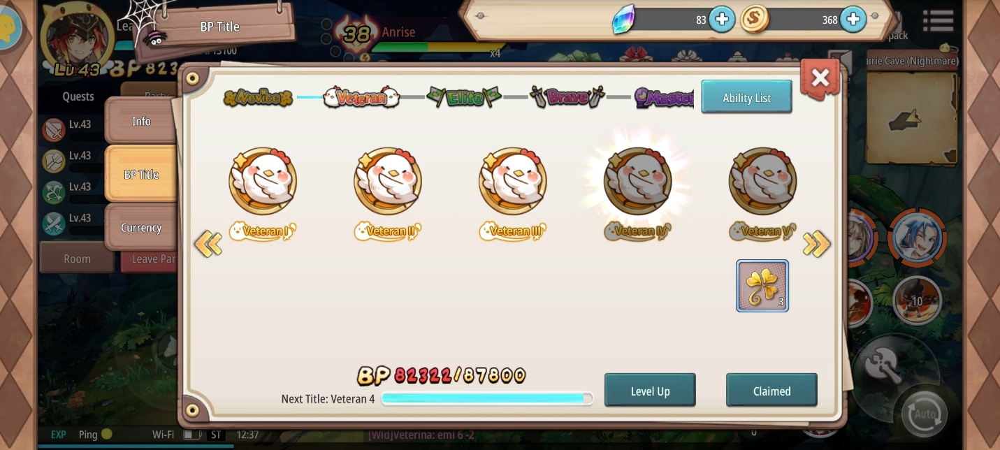

Tips Jitu Menaikkan BP di Game Sprite Fantasia

Halo sobat LDPlayer! Wah, sedang asyik dengan MMORPG yang satu ini, ya?
Sprite Fantasia memang bisa bikin kamu lupa waktu, Apalagi developer
game X-Legend Entertainment menciptakan suasana dari MMORPG ini cukup
fresh karena sisi humoris yang sangat mencuat. Tentu saja tidak
mengejutkan jika sejak perilisannya 19 Oktober lalu, Sprite Fantasia
berhasil menarik perhatian lebih dari 500 ribu pengguna Google Play
Store untuk memainkannya. Kamu juga harus ikutan, ya!

Menganut genre MMORPG, kamu tentunya tahu kalau game ini menerapkan
sistem BP alias Battle Points di mana power dari karaktermu akan
diakumulasikan seluruhnya ke dalam poin BP tersebut, baik dari karakter
kamu sendiri maupun aksesoris-aksesoris lainnya. BP itu juga menjadi
alat ukur untuk kamu yang ingin mencoba dungeon atau yang lainnya. Kalau
kamu ingin jumlah BP kamu melesat dengan cepat, baca tulisan di bawah
ini sampai habis, ya!

Equipment

Bukan MMORPG namanya kalau karaktermu tidak membutuhkan equipment khusus
yang bisa menambah power, untuk itu kamu perlu tahu equipment seperti
apa dan bagaimana cara menambah BP kamu dengan equipment tersebut.
Langsung saja kita ke pembahasan berikut ini.

Tier dan jenis equipment

Karakter kamu nantinya akan memiliki sembilan slot untuk equipment yang
terdiri dari senjata, head gear, body gear, waist gear, hand gear, feet
gear, back gear, necklace, dan juga aksesoris. Setiap equipment memiliki
tear atau kualitas yang ditandai dengan warna frame dari equipment
tersebut. Putih untuk kualitas paling rendah, kemudian ada hijau, biru,
ungu, dan kuning keemasan sebagai penanda equipment kualitas paling
tinggi.

{width="6.5in"
height="2.925in"}

Selain kualitas tier, kamu juga perlu memerhatikan ketentuan level yang
dibutuhkan supaya equipment tersebut bisa karaktermu gunakan. Biasanya
meski warna frame dari equipment tersebut kuning keemasan, jika
ketentuan untuk mengenakannya adalah level satu maka equipment tersebut
hanya cocok digunakan saat early game saja. Contoh dari equipment yang
disebutkan adalah hadiah dari Novice Pack yang bisa kamu beli seharga 16
ribu rupiah.

Kalau kamu ingin mencari equipment lain yang tak kalah berkelas, kamu
bisa farming di dungeon sanctuary adventure. Di sana kamu bisa mengajak
party ataupun solo. Pilihlah tingkat kesulitan paling tinggi agar
semakin tinggi pula kualitas equipment yang kamu dapatkan.

Perawatan equipment

Tentunya tidak cukup hanya mendapat equipment dengan kualitas yang
tinggi. Kamu juga perlu merawatnya dengan menaikkan level alias enhance
equipment yang kamu miliki dengan menggunakan Mana Shard yang bisa kamu
dapatkan lewat dungeon destined skirmish dan juga kamu bisa beli lewat
market.

Selain enhance, kamu juga perlu melakukan refine terhadap equipment
milikmu tersebut supaya statistik dari equipment itu naik, begitu juga
BP kamu. Untuk melakukan refine, kamu membutuhkan Moonfang Augite yang
bisa kamu dapatkan dengan cara melakukan disenchant terhadap equipment
yang tidak kamu gunakan. Perhatikan juga statistik yang akan kamu
dapatkan sebelum melakukan refine karena bisa jadi setelah refine BP
kamu akan berkurang.

{width="6.5in"
height="2.925in"}

Equipment kamu akan berada di dalam road to enhancement di mana setiap
enhance yang kamu lakukan ke setiap equipment akan diakumulasikan dan
bisa meningkatkan RTE tersebut sehingga setiap statistik equipment yang
kamu miliki akan meningkatkan BP karakter kamu.

{width="6.5in"
height="2.925in"}

Perawatan kartu

Selain aksesoris-aksesoris karakter, kamu juga perlu merawat kartu
milikmu, nantinya kartu tersebut akan menjadi ultimate dari Sprite yang
kamu miliki, kamu juga bisa melakukan enhance dan refine terhadap kartu
tersebut. Kartu-kartu yang kamu dapatkan akan menjadi bagian dari setiap
equipment yang kamu miliki, cara kerja mereka sama seperti support yang
menambah statistik dan juga power.

{width="6.5in"
height="2.925in"}

Tidak hanya gear atau equipment karakter kamu saja, gear milik Sprite
dari karakter kamu juga akan mendapat tambahan statistik dan power dari
kartu-kartu ini. Bedanya adalah setiap equipment kamu hanya mendapat
tiga slot untuk kartu, sedangkan untuk Sprite bisa mencapai lima slot
kartu.

Sama seperti equipment, kartu-kartu ini juga punya tier yang
tingkatannya juga ditandai dengan warna. Tentu saja cara merawat
kartu-kartu ini juga tidak jauh berbeda dengan equipment. Lakukan
enhance dan refine untuk kenaikkan BP kamu yang lebih baik.

Skill

Saat karaktermu sudah mencapai level 40, kamu bisa memilih satu dari dua
advanced class yang akan menjadi fokus untuk role karakter kamu. Saat
sudah memilih advanced class, skill yang kamu akan memiliki empat skill
utama, tentunya skill-skill tersebut haruslah menjadi prioritas kamu
untuk dinaikkan levelnya. Maka dari itu, hindari gegabah menaikkan semua
skill yang kamu miliki padahal kamu tidak menggunakan skill itu sama
sekali.

{width="6.5in"
height="2.925in"}

Master skill

Setelah kamu memilih advanced class, kamu bisa membuka master skill
untuk menambah statistik dari skill yang kamu miliki. Kamu akan mendapat
poin distribusi yang tidak bisa kamu dapatkan sekaligus banyak, maka
dari itu kamu perlu perhitungkan skill mana saja yang akan kamu naikkan
master skillnya. Bacalah deskripsi setiap skill agar kamu tidak salah
dan tidak perlu melakukan reset poin distribusi.

{width="6.5in"
height="2.925in"}

Sprite

Sebagai partner setia dari karakter kamu, sprite kamu tentunya juga akan
membantu menambah BP kamu dengan equipment dan kartu mereka. Tapi
dianjurkan untuk fokus ke karakter milikmu terlebih dahulu sebelum kamu
memutuskan untuk menaikkan statistik dari sprite imut tersebut.

{width="6.5in"
height="2.925in"}

Koleksi

Kalau kamu buka bagian menu kamu bisa melihat di bagian collection untuk
mengetahui apa saja yang sudah kamu temui dan dapatkan di dalam game ini
seperti boss, outfit, dan sprite. Semakin banyak koleksi yang kamu buka,
semakin banyak pula statistik tambahan yang bisa kamu dapat.

{width="6.5in"
height="2.925in"}

BP Title

Ketika kamu sudah mencapai sejumlah BP, kamu bisa mendapatkan title
tertentu yang memberi kamu ability list dan juga daily reward. Maka dari
itu setelah kamu melakukan seluruh tips di atas, jangan lupa untuk
mengecek bagian BP title dan dapatkan BP tambahan untuk karakter kamu.

{width="6.5in"
height="2.925in"}

Mainkan Sprite Fantasia di PC

Kalau kamu ingin merasakan serunya game ini di layar monitor yang lebih
besar, kamu bisa menginstall emulator game android LDPlayer di PC atau
laptop kamu, lho. Selain Sprite Fantasia, ada juga game yang
diperkirakan menganut genre MMORPG yaitu, Seven Knights 2. Wuih, jadi
makin seru, kan? Maka dari itu, install LDPlayer di PC atau laptop kamu
dan rasakan sensasi bermain game android yang makin menyenangkan.

{width="6.5in"
height="3.654166666666667in"}

Kesimpulan

Bukan hal yang mudah menaikkan BP di setiap game MMORPG, perlu kesabaran
dan ketekunan supaya karakter milik kamu bisa cepat menjadi kuat dan
mampu menembus setiap tantangan yang ada di dalam game ini. Jika kamu
ingin cara yang instan, kamu hanya perlu menyiapkan sejumlah uang untuk
membeli package dan mendapat equipment maupun kartu tertentu sehingga BP
kamu bisa bertambah dengan cepat.

Meskipun kamu bisa melakukan cara instan, tentu saja hal itu akan kalah
serunya dengan bersabar menaikkan satu demi satu atribut karakter kamu.
Apalagi kalau kamu lebih memilih menjadi pemain F2P alias Free to Play.
Untuk itu, bersabarlah karena hasil yang kamu dapatkan nantinya akan
lebih terasa menyenangkan. Selamat bermain!
