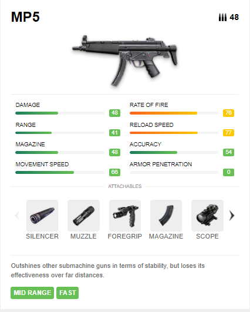
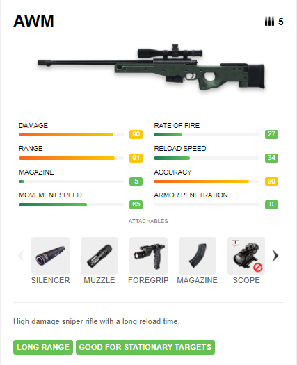
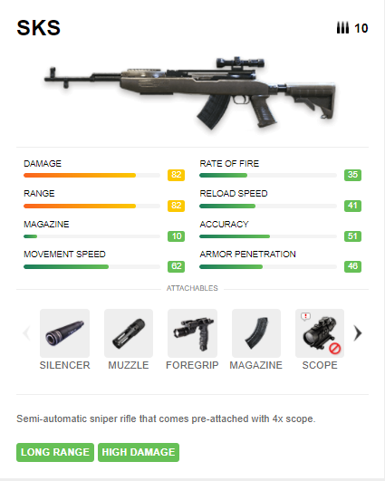
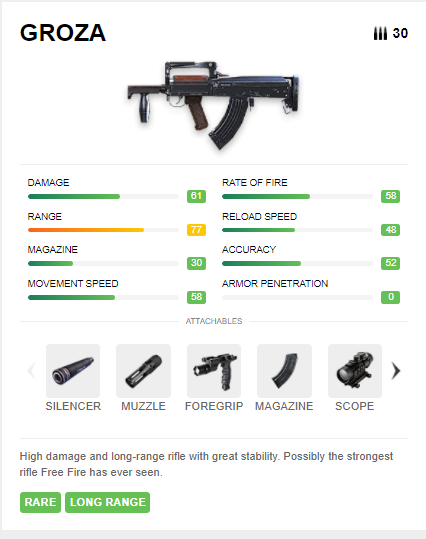
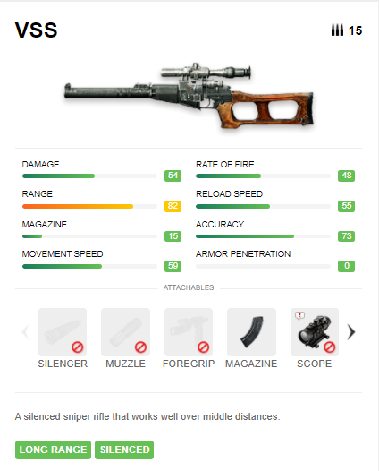
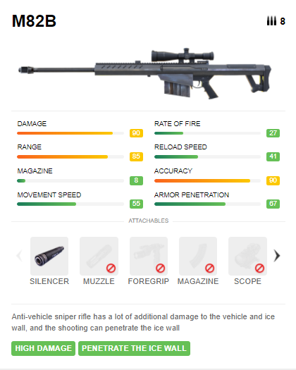
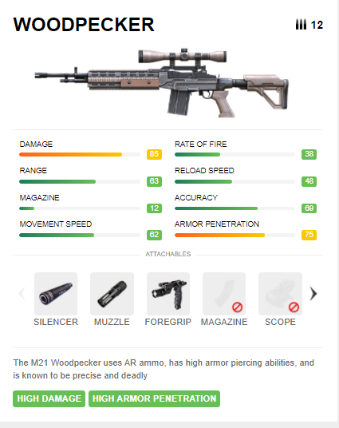
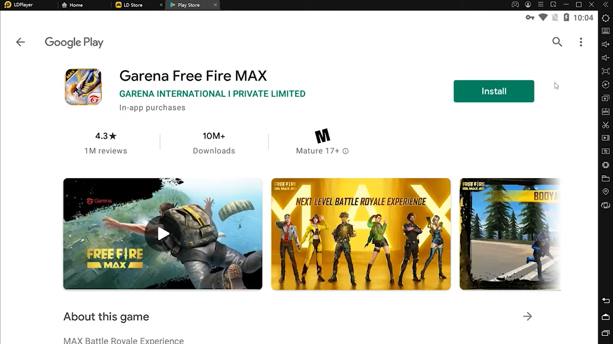
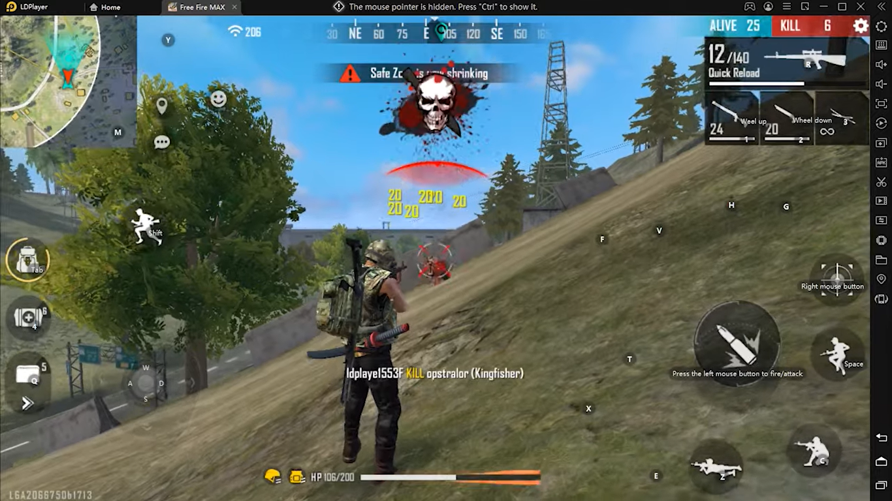

Mainkan Game Garena Free Fire MAX di PC : Pilihan Senjata Epic nan
Menyakitkan Tanpa Skin, Cocokkan dengan Role Kamu, Ya!

Hai sobat LDPlayer! Kamu pasti sudah kenal dengan game yang satu ini,
dong. Hah? Kamu belum kenal Free Fire? Yakin? Game ini sempat menjadi
game seluler yang paling terkenal pada tahun 2019, lho! Masa kamu nggak
kenal, sih? Baiklah, kalau kamu belum tahu, game yang bergenre Battle
Royale ini merupakan hasil kerjasama dari developer 111Dots Studio
sebagai yang memproduksi dan Garena sebagai yang memasarkannya. Nah,
berkat kerjasama tersebutlah, Free Fire menjadi sangat populer dan
disukai banyak kalangan.

Pihak developer pun melebarkan sayap mereka dengan menciptakan game
Garena Free Fire MAX yang memiliki kualitas keren to the max, lho, bikin
penasaran banget, nggak, sih? Kamu para Survivor alias player setia Free
Fire pasti tahu, kan, kalau di dalam game perang ini senjata merupakan
item yang paling penting. Meski begitu, di awal permainan kamu tidak
akan langsung diberi senjata dan harus bergerak cepat mencari item
tersebut karena kalau kamu kalah cepat dan kebetulan ada musuh yang
turun di tempat yang sama, kamu bisa mati cepat alias Too Soon dalam
istilah PUBG.

Senjata-senjata paling sakit di Free Fire

Layaknya game Pay to Win, Free Fire original dan Free Fire MAX memberi
kamu pilihan untuk membeli skin ataupun karakter yang nantinya akan
menambah skill dari senjata tertentu. Untuk kamu pemain F2P sejati, kami
punya solusi, nih. Berikut kami susun daftar senjata yang "sakit" di
game Free Fire MAX, check it out!

MP5

{width="4.438118985126859in"
height="5.532022090988627in"}

Digadang-gadang sebagai rajanya SMG alias Submachine gun, MP5 memiliki
statistik yang tidak bisa diremehkan. Dengan rate of fire mencapai poin
76 dan kecepatan reload mencapai 77, senjata ini sangat mematikan jika
kamu membawanya melawan musuh dari jarak dekat.

Karena statistik range dari MP5 ini hanya 41, senjata ini tidak akan
efektif kamu gunakan melawan musuh dari kejauhan. Jika kamu suka menjadi
rusher, kamu bisa membawa senjata ini melawan banyak musuh dan membuat
mereka ketar-ketir.

AWM

{width="4.448537839020123in"
height="5.46951334208224in"}

Sniper rifle yang satu ini memang sudah tidak bisa diragukan lagi
kekuatannya. Dengan statistik damage dan akurasi yang mencapai 90, AWM
menjadi senjata jarak jauh paling ditakuti di setiap game yang bergenre
Battle Royale, terutama Free Fire ini. Jika kamu tertarik menggunakan
senjata ini, kamu harus pintar-pintar menghemat peluru karena magazine
dari AWM hanya memuat sebanyak lima peluru.

AWM juga bukan senjata yang mudah ditemui karena daya rusaknya yang
besar. Senjata ini hanya bisa kamu dapatkan lewat Airdrop. Psst, ada
tips sedikit nyeleneh untuk kamu yang tidak tertarik dengan AWM tetapi
tetap takut dengan senjata ini, nih. Kalau kamu bertemu dengan Airdrop
yang mengandung AWM di dalamnya, kamu bisa mengambil pelurunya saja.
Kenapa begitu? Supaya pemain selanjutnya yang berniat memakai senjata
tersebut akan kebingungan karena AWM yang mematikan sekalipun tidak akan
berguna tanpa timah panasnya.

Saat menggunakan AWM, kamu perlu menjaga jarak dari musuh yang ingin
kamu bidik. Namanya juga sniper rifle, tentu tidak akan efektif jika
kamu jadikan senjata jarak dekat seperti shotgun. Setelah kamu berhasil
menembak musuh yang masih bisa berdiri karena tidak kena headshot,
sangat disarankan kamu pindah ke posisi lain agar tidak terdeteksi musuh
tersebut dan lanjut menembak.

Meski kamu sudah pro sekalipun dalam menggunakan AWM, kamu tetap harus
membawa senjata lain yang tentunya bukan jarak jauh juga. Saat kamu
ingin rush atau malah kamu yang di-rush oleh musuh, kamu sudah siap
dengan senjata jarak dekat atau menengah yang sama mematikannya seperti
AWM.

SKS

{width="4.427701224846894in"
height="5.532022090988627in"}

Bicara soal senjata jarak menengah, kamu bisa banget, nih, cobain
senjata sakit yang satu ini. Dengan statistik damage dan range yang
mencapai 82, SKS tentu bisa menjadi mimpi buruk untuk musuh yang tidak
mengetahui keberadaan kamu. Apalagi jika kamu menambah attachment
seperti silencer, dijamin musuh makin ketar-ketir.

Meski damage-nya tidak main-main, senjata ini ternyata kurang diminati
para Survivor karena statistik rate of fire atau tingkat kecepatan
peluru yang ditembakkan hanya 33. Tapi, jika kamu senang menjadi support
di dalam squad, kamu bisa pakai senjata ini untuk membantu rusher agar
tidak kesulitan saat menyerang musuh.

Groza

{width="4.438118985126859in"
height="5.615367454068242in"}

Kalau kamu butuh pendamping AWM, Groza bisa menjadi pilihan yang cocok,
nih. Assault Rifle yang satu ini juga cukup versatile untuk dibawa
melawan musuh dari jarak jauh maupun dekat. Statistik range dari Groza
sendiri mencapai angka 77, angka yang mampu menyaingi AR lain dengan
range terjauh di FF, yaitu M14.

Memadukan damage, kecepatan tembak, dan akurasi, senjata yang satu ini
layak disebut sebagai Assault Rifle paling mematikan di dalam game.
Apalagi kecepatan reload Groza ini menjadi yang paling tinggi di antara
AR lainnya, berdampingan dengan AUG.

Karena kengerian yang ditimbulkan dari senjata ini, Groza pun masuk ke
dalam daftar senjata langka yang hanya bisa didapat dari Airdrop. Tanpa
skin pun, Groza sudah hampir sempurna, deh, pokoknya!

VSS

{width="4.417283464566929in"
height="5.479931102362205in"}

VSS merupakan senjata SMG yang memiliki statistik range paling besar
dengan poin mencapai 82, hal ini disebabkan VSS sudah diberi scope
bawaaan yang memudahkan kamu mengincar musuh dari jarak dekat sampai
menengah.

Senjata ini juga memiliki suara yang cukup teredam sehingga musuh tidak
mudah mendeteksi posisi kamu. Oh iya, pastinya kamu sudah tahu kalau
senjata ini punya versi lain yang bernama VSS X, kan?

Buat kamu para Survivor yang hobi bermain di luar zona, senjata ini bisa
banget kamu jadikan andalan, nih. Berbeda dari VSS biasa, VSS X ini
mampu memberi infuse racun terhadap musuh. Racun tersebut akan menguras
darah musuh sedikit demi sedikit selama beberapa detik, sama halnya
dengan luar zona.

Jika kamu mengombinasikan serangan dari VSS X dengan posisi di luar
zona, maka darah musuh akan berangsur-angsur sirna dan mereka bisa mati
atau knockout.

M82B

{width="4.3756102362204725in"
height="5.46951334208224in"}

Kamu tetap bisa merasakan sensasi menggunakan sniper rifle yang
mematikan tanpa AWM, nih, karena ada senjata M82B yang memiliki
statistik nggak kalah mengerikannya dari AWM, lho. Kerennya lagi,
senjata ini bisa kamu dapatkan tanpa harus menunggu Airdrop! Saatnya
kamu bergantung pada kekuatan Dewi Fortuna, nih, Sob!

M82B ini hanya kalah dalam statistik range dan movement speed jika kita
membandingkannya dengan AWM. Bahkan sniper rifle yang satu ini punya
kelebihan khusus yang tidak dimiliki senjata lain yaitu, peluru menembus
Gloo Wall. Kalau senjata ini jatuh ke kamu yang memiliki tangan layaknya
sniper handal, dijamin musuh bakal ketakutan, deh!

Woodpecker

{width="4.427701224846894in"
height="5.584113079615048in"}

Senjata AR yang memiliki scope bawaan ini bisa kamu gunakan sampai
late-game, lho. Statistik armor penetration yang dimiliki Woodpecker
bisa menembus sampai ¾ damage reduction dari helm dan armor musuh! Ngeri
banget, kan?

Sudah memiliki armor penetration terbesar di dalam game yang mencapai
angka 75, Woodpecker dilengkapi pula dengan damage tingginya yang
mencapai 85. Meski senjata ini hanya bisa menampung sebanyak 12 buah,
semua itu sudah diatasi dengan akurasi dan range mumpuni yang pastinya
tidak akan membuat tembakan peluru kamu sia-sia.

Mainkan Garena Free Fire MAX di PC

Sudah memilih senjata keren untuk kamu mainkan di game FF MAX ini? Atau
kamu punya senjata tak kalah mantap lainnya yang sudah menjadi favorit
kamu? Psst, kami punya rahasia supaya kerennya senjata itu makin
terlihat oleh mata kamu, lho? Penasaran? Hihihi.

Caranya adalah dengan menginstall emulator game android LDPlayer di PC
atau laptop kamu, lalu kamu unduh game Battle Royale yang kece ini.
Setelah itu pasti kamu bisa, deh, merasakan sensasi yang lebih "wah"
saat menggunakan senjata-senjata keren itu di dalam game.

{width="6.5in"
height="3.654166666666667in"}

{width="6.5in"
height="3.654166666666667in"}

Kesimpulan

Gimana, nih? Makin nggak sabar pingin nyobain senjata-senjata super
mantap di atas? Selain keberuntungan setelah mendapat senjata yang kamu
inginkan tersebut, kamu bisa memadukannya dengan skill yang kamu miliki,
dengan begitu, kamu akan menjadi mesin pembunuh di dalam game.

Para Survivor sudah tahu, kan, kalau pada tanggal 31 Desember nanti akan
ada pergantian season? Nah, untuk kamu calon Survivor yang sudah mulai
tertarik memainkan game ini, bisa langsung mencoba game ini atau
menunggu season selesai, nih, supaya kamu tidak semakin ketinggalan
serunya game ini dari player yang lainnya, selamat bermain!
