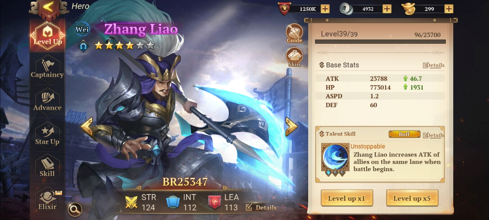

Cara Menaikkan TBR dengan Cepat di Game Dynasty Origins : Conquest

Halo sobat LDPlayer! Apa kamu semua sudah memainkan game kece yang satu
ini? Kalau belum, kamu bisa banget, nih, coba mainkan game yang bernama
Dynasty Origins : Conquest ini. Memangnya game ini menceritakan tentang
apa, sih? Untunglah kamu bertanya, jadi game ini menceritakan tentang
zaman tiga kerajaan yang saling berebut kekuasaan setelah runtuhnya
Dinasti Han. Tiga kekuasaan tersebut masing-masing dipimpin oleh Liu Bei
dari Shu Han, Cao Cao dari Cao Wei, dan Sun Quan dari Dong Wu.

Kamu juga jangan sampai ketinggalan dari seratus ribu lebih pengguna
lain yang sudah mengunduh dan memainkan game ini sejak rilis secara
global pada tanggal 13 Desember kemarin, nih. Game keren ini merupakan
besutan dari developer game Youzu yang mana game ini mengajak kamu untuk
menciptakan strategi dan menyusun formasi perang di dalam game melawan
pemain lainnya. Nah, supaya formasimu tidak terkalahkan, kamu bisa
mengakalinya dengan menaikkan jumlah TBR kamu. Penasaran bagaimana
caranya? Yuk, kita cari tahu bareng-bareng!

Merawat hero dengan telaten

Kalau kamu sudah punya hero, saatnya kamu rawat dan masukkan ke dalam
formasi, nih. Eits, tapi jangan sampai gegabah karena bisa-bisa bahan
yang kamu butuhkan malah habis karena terlalu terburu-buru saat
perawatan hero.

Di bagian hero, nanti kamu bisa melakukan enam cara untuk menaikkan BR
dari hero tersebut. Apa saja kah itu? Langsung saja kita lihat cara-cara
yang bisa kamu lakukan untuk perawatan hero, check this out!

Level up

Cara klasik yang sangat keterlaluan kalau tidak kamu lakukan ini
merupakan hal basic untuk membantu hero kamu menjadi lebih kuat dan
tentunya membantu kamu mendapatkan poin TBR yang lebih besar. Perlu
diingat kalau level hero tidak bisa melampaui level kamu sebagai player,
jadi kamu juga perlu rajin-rajin menyelesaikan stage di Nine Prefecture
dan menuntaskan daily quest supaya EXP kamu bertambah dan level kamu pun
naik.

Kamu nantinya akan diberi pilihan untuk menaikkan level hero kamu
sebanyak lima kali di satu waktu atau menaikkannya satu kali saja. Untuk
bisa menaikkan level hero kamu, kamu membutuhkan feats, semakin tinggi
level hero yang kamu miliki, semakin banyak feats yang dibutuhkan, maka
dari itu kamu perlu perhatikan hero mana saja yang kamu prioritaskan.

{width="6.5in"
height="2.925in"}

Akan ada fitur yang terbuka saat level kamu sudah cukup tinggi, fitur
tersebut bernama Challenge, di dalamnya nanti kamu bisa pilih Armored
Defense. Kalau kamu berhasil membasmi banyak musuh, akan semakin banyak
pula feats yang kamu dapatkan dan kamu bisa menaikkan level hero kamu
dengan lebih leluasa.

Captaincy

Setiap hero kamu akan membawa pasukan yang membantu mereka di medan
perang. Jumlah pasukan setiap class pun bervariasi dan selalu dalam
kelipatan empat. Pasukan tersebut kadang akan tetap menyerang musuh
meski hero kamu sebagai pemimpinnya sudah sirna.

Sama seperti cara level up hero kamu, di captaincy level ini kamu akan
diberi pilihan untuk menaikkan level pasukan kamu sebanyak lima kali di
satu waktu atau menaikkannya satu kali saja dengan koin sebagai alat
untuk menaikkan levelnya.

{width="6.5in"
height="2.925in"}

Dan tidak jauh berbeda dengan melakukan farming feats, kamu bisa
mendapatkan koin lewat fitur Challenge, bedanya adalah kamu bisa pilih
Guard the Lord dan melindungi pangeran Adou yang masih bayi. Banyaknya
musuh yang kamu basmi sebelum pelindung pangeran Adou lenyap akan
diakumulasikan menjadi koin.

Advance

Di bagian ini, kamu bisa memasangkan gear-gear tertentu untuk hero kamu.
Berbeda dengan game RPG lainnya, di sini gear-gear tersebut bukanlah
sesuatu yang bisa kamu farming melainkan kamu perlu crafting dengan
bahan-bahan tertentu. Nah, bahan-bahan itulah yang justru bisa kamu
farming lewat stage di Nine Prefectures.

Setelah empat gear berhasil kamu craft, saatnya kamu craft semua gear
tersebut untuk meningkatkan kualitas hero kamu. Semakin tinggi
kualitasnya tentu semakin besar BR yang dia miliki dan TBR kamu pun akan
semakin meningkat.

Kualitas dari hero kamu akan ditunjukkan dari warna yang ada di namanya.
Dimulai dari warna putih sebagai kualitas terendah, lalu hijau, kemudian
biru, ungu dan yang sejauh ini masih menjadi warna penunjuk kualitas
tertinggi adalah oranye.

{width="6.5in"
height="2.925in"}

Kamu bisa mengumpulkan bahan untuk melakukan craft gear lewat blitz di
beberapa stage yang sudah kamu buka, maka dari itu kembali lagi ke
bagian di mana kamu harus rajin menyelesaikan stage di Nine Prefectures.
Hal yang kamu butuhkan untuk melakukan blitz adalah stamina. Hanya saja
yang agak disayangkan adalah jumlah stamina yang bisa kamu dapatkan
selama recovery hanya 120 buah.

Di early game tentu jumlah tersebut belum menjadi masalah, ditambah
masih akan ada suplai stamina gratis setiap jam 17.30 sampai 23.59 waktu
setempat. Tapi kalau kamu mulai mencapai level 30 ke atas, kamu akan
merasakan betapa kurangnya stamina yang kamu miliki. Apalagi hero yang
kamu miliki tentunya akan semakin banyak, begitu pula gear yang
dibutuhkan. Semoga ke depannya akan ada penambahan jumlah stamina atau
menurut kamu jumlah saat ini sudah cukup bahkan sampai ke late-game
nanti?

Star Up

Tidak perlu takut mendapat hero yang sama ketika kamu melakukan gacha.
Shard dari hero yang sama tersebut bisa kamu gunakan untuk menaikkan
bintang dari hero yang sudah kamu miliki. Tentunya saat berhasil
melakukan star up, statistik dari hero kamu akan meningkat dengan jumlah
yang tidak main-main.

{width="6.5in"
height="2.925in"}

Huang Yueying menjadi hero dengan shard yang paling mudah didapatkan,
tentu bukan hal aneh jika kamu menemui player lain yang memiliki Huang
Yueying dengan jumlah bintang yang banyak.

Bagaimana cara mendapat shard hero? Tentu saja gacha menjadi pilihan
utama, atau kamu bisa juga melakukan blitz di stage tertentu yang bisa
memberi shard dari hero kesayangan kamu.

Skill

Ketika kualitas hero kamu naik, semakin banyak skill yang bisa terbuka
dan tentunya menaikkan BR hero tersebut beserta TBR kamu. Terhitung ada
empat skill hero yang bisa kamu buka jika hero kamu sudah mencapai
kualitas berwarna oranye.

{width="6.5in"
height="2.925in"}

Skill-skill itu juga bisa kamu naikkan levelnya, lho. Kamu bisa
menaikkan level skill dengan skill books atau dengan bahan-bahan yang
bisa kamu dapatkan dari stage di Nine Prefectures. Perlu diingat kamu
harus memilah jika ingin menggunakan bahan selain skill books supaya
kamu tidak kebingungan jika ingin craft gear.

Elixir

Nah, yang satu ini baru bisa kamu buka jika kamu sudah mencapai
late-game atau level 42. Maka dari itu kamu perlu bersabar dan rajin
menyelesaikan stage yang ada di Nine Prefectures.

Koleksi hero

Lho kok jadi tujuh? Betul sekali, yang satu ini merupakan bonus tips
supaya TBR kamu bisa naik lewat hero yang kamu miliki. Kalau kamu
berhasil mengoleksi banyak hero dan menaikkan bintang mereka, maka TBR
dan statistik yang kamu akan dapatkan juga akan banyak jumlahnya. Kamu
bisa buka Index setiap kali kamu mendapat hero baru atau kamu sudah
menaikkan bintang dari hero kamu.

{width="6.5in"
height="2.925in"}

Perawatan Strategist

Berperan sebagai backstager, strategist yang juga memiliki role sebagai
Mage ini bergantung sepenuhnya pada mana dan skill spell. Strategist
juga akan memberi buff pada Archer dengan menaikkan damage mereka.

Tak kalah penting dari hero lainnya, berikut hal-hal yang perlu kamu
lakukan untuk perawatan strategist. Yuk, kita tengok!

Scheme

Di bagian ini, kamu bisa menaikkan setiap skill yang dimiliki strategist
dengan Tome of Magic sebagai bahannya. Dikarenakan jumlah strategist
yang bisa kamu bawa ke medan perang hanya satu orang, maka tentukan
strategist mana yang akan kamu prioritaskan supaya Tome of Magic yang
kamu miliki tidak habis sia-sia karena kamu tidak konsisten memiliki
strategist.

{width="6.5in"
height="2.925in"}

Untungnya Tome of Magic bukanlah item yang sulit untuk didapatkan karena
kamu bisa membelinya di setiap section yang ada di dalam Market, tapi
kamu tetap harus ingat bahwa kamu butuh koin untuk membelinya, jadi kamu
tetap tidak boleh gegabah.

Star Up

Tentunya kamu tidak asing dengan yang satu ini dan cara melakukannya pun
tidak jauh berbeda dengan star up hero yaitu, kamu perlu shard dari
strategist tersebut. Yang berbeda adalah kamu tidak akan mendapat shard
strategist di bagian Recruit karena strategist tidak termasuk hero dan
sebenarnya penyebutan shard untuk strategist adalah soulstone, hihihi.

{width="6.5in"
height="2.925in"}

Tapi kamu tidak perlu risau dan gundah gulana karena kamu masih bisa
mendapat soulstone strategist jika kamu masuk ke bagian PvP dan pilih
fitur Summit, setiap kali kamu melakukan lima kali challenge, kamu bisa
mendapat soulstone untuk strategist tertentu dan juga universal
soulstone yang bisa kamu ubah menjadi strategist apapun yang kamu
inginkan. Oh iya, kamu juga bisa membeli soulstone di Market, lho.

Koleksi relic sebanyak-banyaknya

Nah, kamu bisa menambah TBR sekaligus mencuci mata melihat betapa
kerennya art dari setiap relic yang bisa kamu dapatkan. Sama seperti
hero, kualitas dari relic ditunjukkan lewat warnanya dengan warna merah
menjadi kualitas paling tinggi di antara yang lainnya.

Relic tersebut bisa kamu dapatkan dari Trials dan kamu bisa mendapatkan
relic berwarna ungu secara gratis setelah berhasil menyelesaikan stage
terakhir dari Trials ini.

Kamu juga bisa melakukan gacha relic lewat Treasure, setiap lima kali
tarikan, kamu dipastikan akan mendapat relic berwarna ungu. Kamu juga
diberi pity setiap 20 kali putaran dan kamu dipastikan akan mendapat
relic berwarna oranye. Epic sekali bukan? Apalagi jika kamu mendapat
jenis relic yang sama, kamu bisa forge dan meningkatkan statistik relic
tersebut.

{width="6.5in"
height="2.925in"}

Alliance

Last but not least, kamu bisa bergabung ke dalam alliance atau yang
sering disebut sebagai guild di game lain. Kamu bisa pilih section
Alliance Tech dan di sana kamu bisa meningkatkan statistik untuk hero
kamu dan juga pasukannya.

Delapan tech yang bisa kamu naikkan levelnya itu bisa diakumulasikan
untuk menaikkan level dari Power of Protection. Tentunya semakin tinggi
levelnya, semakin besar TBR yang bisa kamu dapatkan.

{width="6.5in"
height="2.925in"}

Untuk bisa menaikkan level tech, kamu memerlukan koin alliance yang bisa
kamu dapatkan di Throne Hunter dan Alliance Development. Eits, kamu
harus ingat bahwa kamu tidak boleh gegabah dalam menaikkan level.

Mainkan Dynasty Origins : Conquest di PC

Dengan epic-nya art dari game ini, yakin kamu sudah puas hanya dengan
bermain lewat gawai berlayar kecil itu? Apa kamu tidak penasaran
bagaimana cantiknya Diao Chan atau tampannya Zhao Yun di layar PC atau
pun laptop kamu?

Kamu bisa banget, nih, install emulator kece untuk game android di PC
mau pun laptop kamu, lalu kamu download Dynasty Origins : Conquest yang
keren ini, deh. Gampang banget gak, sih, guys? Dengan begitu, pengalaman
bermain kamu akan lebih terasa epic dan menyenangkan.

Kesimpulan

Mengingat game ini merupakan game strategi, kamu tidak bisa sepenuhnya
bergantung pada jumlah TBR kamu karena formasi dan pemilihan hero sangat
berpengaruh pada hasil akhir nanti. Apalagi di PvP kamu tidak bisa hanya
mematok TBR untuk bisa naik ranking. Dalam memasang defense di Arena,
kami sarankan kamu memasang formasi empat Archer di baris paling
belakang dan empat Paviser di baris paling depan, dengan begitu, damage
gila-gilaan dari Archer akan terus dihempaskan dan Paviser yang sulit
ditembus itu bisa menjaga Archer dari serangan musuh.

Guna TBR lainnya adalah untuk taunting, apa itu? Taunting di sini adalah
untuk menakuti player lain supaya berpikir dua kali saat ingin menyerang
kamu, meski bisa saja kamu dikalahkan oleh player lain dengan TBR yang
lebih rendah. Tapi semua itu tidak akan terlalu penting jika kamu senang
saat memainkannya, betul tidak? Kalau begitu, jangan mau kalah dengan
yang lainnya dan mainkan game ini, yuk! Selamat bermain!
