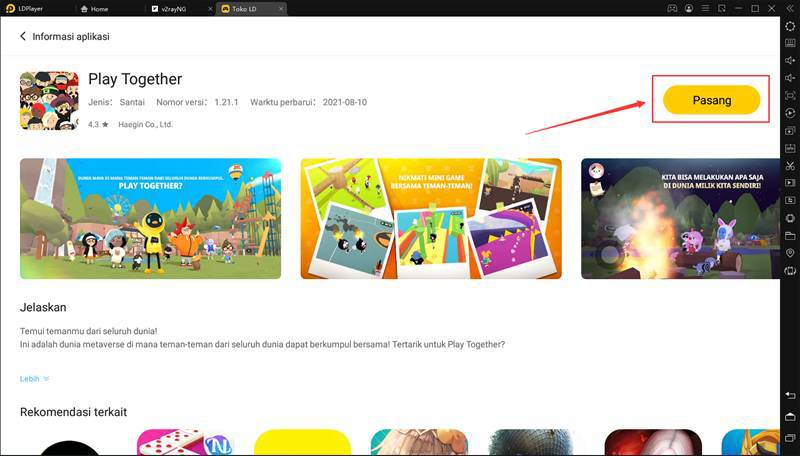
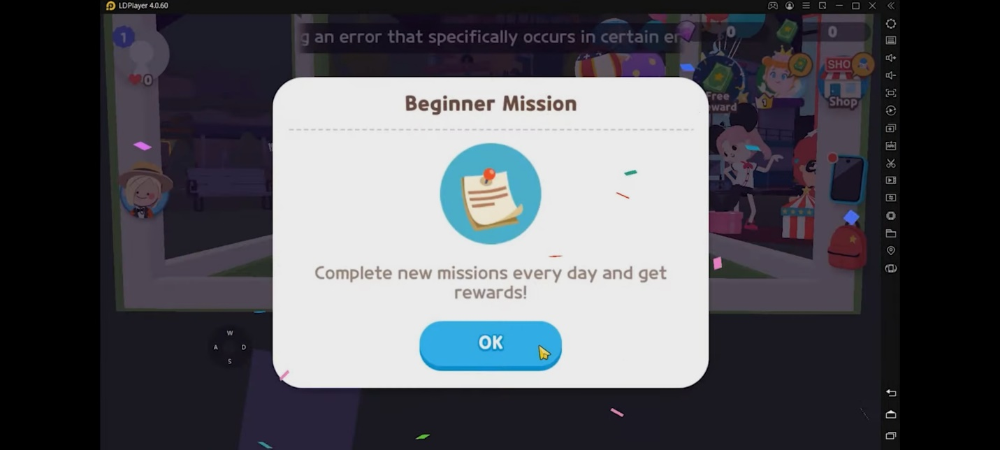
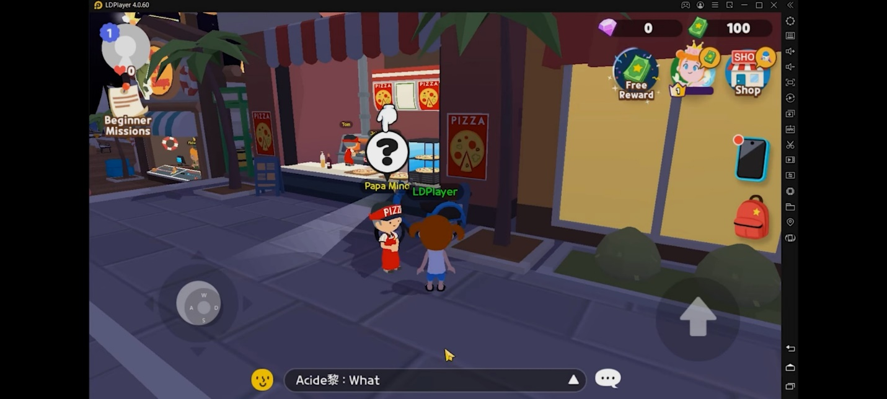
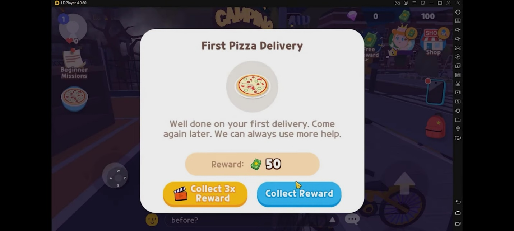

**Tips Mendapatkan Banyak Stars di Play Together**

Siapa sih yang tidak suka mendapatkan banyak uang? Kalau di dunia nyata,
uang memudahkan kehidupan sehari-hari, begitu juga di dunia game seperti
Play Together, semakin banyak uang yang kamu miliki, semakin mudah juga
kamu mendapatkan barang-barang yang kamu inginkan. Play Together
merupakan game buatan studio game Haegin Co., Ltd. yang memperbolehkan
kamu berkeliling sambil bersenang-senang di dalamnya. Selain itu kamu
juga bisa menjalani hari-hari seperti manusia pada umumnya yaitu,
bekerja, membeli barang, memancing, berenang, dan lain sebagainya.

Game ini merupakan game MMO atau *massive multiplayer online* yang tentu
saja membuat kamu bertemu dengan banyak *player* dari berbagai negara.
Kamu akan berkesempatan untuk melakukan banyak aktivitas yang sama
dengan *player* lain, kamu bisa makan bersama, main bersama, dan juga
berbelanja barang di toko yang sama. Ngomong-ngomong soal berbelanja,
kamu harus membeli barang menggunakan stars yang merupakan mata uang di
dalam game ini, stars akan menjadi "isi dompet" kamu di game ini untuk
membeli apapun yang kamu suka. Pastinya pingin dong punya banyak stars
di Play Together? Berikut kami rangkum beberapa tips mendapatkan banyak
stars di Play Together. Psst, game ini kompatibel untuk kamu coba di
emulator LDPlayer, *lho,* seru banget, ya?

{width="6.5in"
height="3.705in"}

**Menyelesaikan Misi Pemula**

Misi pemula atau *beginner quests* merupakan tujuh misi pertama kamu
saat avatar kamu baru menginjakan kakinya di pulau Kaia. Kamu akan
disuruh oleh Manager untuk pergi menemui Ms. Info yang akan memberi kamu
daftar misi pemula yang kamu bisa buka di ikon note di sebelah kiri
layar. Daftar isi pemula itu kamu bisa selesaikan secara instan dengan
menonton video selama beberapa detik, tapi kami tidak
merekomendasikannya kalau kamu baru pertama kali mencoba game ini karena
kamu bisa melewati banyak tutorial-tutorial penting yang bisa memudahkan
kamu untuk bermain game ini ke depannya.

Stars yang kamu dapatkan nantinya akan bervariasi jumlahnya di setiap
misi, akan ada juga misi yang tidak menghadiahi kamu stars, sebagai
gantinya, misi itu memberi kamu hadiah lain yang salah satunya berupa
crowns, crowns bisa kamu pakai untuk mencapai *milestones,* ketika
tercapai, kamu akan mendapatkan hadiah berupa stars atau bahkan gems.
*Milestones* bisa kamu lihat di bagian *Season Pass* yang ikonnya berada
di tengah *free reward* dan *shop*. Selain stars, kamu juga bisa
mendapatkan hadiah *skateboard* saat kamu sudah menyelesaikan seluruh
tujuh misi tersebut, asyik, kan?

{width="6.5in"
height="2.925in"}

Setelah kamu selesai dengan misi pemula, kamu akan mendapatkan misi
harian yang tentunya akan terus berganti setiap harinya, ada sekitar
sebelas misi harian yang bisa kamu selesaikan untuk mendapatkan hadiah
khusus seperti gems. Misi harian memang tidak memberi kamu stars, tetapi
kamu akan mendapat crowns sebanyak 20 buah untuk kamu tukar dengan stars
di *Season Pass* saat kamu sudah mencapai *milestones* nantinya.

**Menolong NPC yang Butuh Bantuan**

NPC atau *non-playable character* menjadi karakter peramai di setiap
game, Play Together menyediakan NPC yang bisa memberi kamu misi khusus
seperti polisi Victor yang meminta bantuan kamu unuk mencari sesuatu
yang hilang seperti anak anjing atau barang, kamu akan diberi hadiah
sebesar 100 stars jika kamu berhasil menemukannya dalam waktu lima
menit.

Kamu juga bisa mendatangi wakil kepala sekolah yang setia berdiri di
depan sekolah setiap hari, wakil kepala sekolah akan meminta kamu
mengantar dokumen yang ada di ruangannya, sebagai imbalannya kamu akan
diberi 50 stars.

Tak hanya itu, kamu juga bisa mendatangi tukang pizza yang sudah pernah
kamu temui saat menjalani tujuh misi pemula, misi tersebut bisa kamu
terus lakukan setiap saat. Kamu diberi waktu lima menit untuk mengantar
tiga pizza ke pelanggan dan kamu akan diberi 50 stars. Kamu bisa
mempercepat laju kamu dengan menggunakan *skateboard* yang sudah kamu
dapatkan setelah menyelesaikan tujuh misi pemula. Semakin cepat, semakin
baik, kan?

{width="6.5in"
height="2.925in"}

Selain tiga NPC yang telah disebutkan, masih banyak lagi NPC lainnya
yang bisa kalian hampiri untuk menyelesaikan masalah yang sedang NPC
tersebut hadapi, selain menolong orang lain, kalian juga dapat stars
yang banyak.

**Menjual Hasil Tangkapan dari Laut**

Kamu sudah tahu belum kalau kamu bisa memancing di dalam game ini? Kamu
bisa, lho, memancing di setiap perairan yang ada di game ini. Sebelum
itu, kamu harus punya dulu alat pancingannya yang bisa kamu beli di toko
milik Fisher yang ada di dekat dermaga di sekitar pulau Kaia. Setiap
alat pancing yang dijual memiliki persentase kesuksesan untuk
mendapatkan tangkapan bervariasi, mulai dari *Feline Rod* yang memiliki
persentase mendapat *uncommon fish* sebesar 50%, *Duck Rod* dengan
persentase kesuksesan sebesar 15% dengan kesempatan mendapat *uncommon
fish* sebesar 100%, dan yang terakhir *Amateur Rod* dengan persentase
kesuksesan sebesar 20%, mendapat ikan yang *rare* sebesar 50%, dan
mendapat *uncommon fish* sebesar 100%.

Setelah memancing dan mendapat hasil tangkapan yang kamu rasa cukup,
kamu bisa langsung menjualkan ke Fisher dengan harga yang bervariasi dan
tentunya menambah stars yang sedang kamu tabung. Penjualan hasil
tangkapan laut itu juga menjadi bagian dari tujuh misi pemula, *lho.*
Sepuluh hasil tangkapan terjual, maka kamu akan mendapatkan hadiah dari
misi pemula tersebut.

**Mengambil Hadiah Bonus**

Sudah menyelesaikan misi yang berikan, saatnya mengambil hadiah, kalau
kamu yang sedang tidak terburu-buru dan ingin mendapat hadiah tambahan,
kamu bisa, *lho*, mendapatkannya dengan cara klik pilihan untuk *claim*
hadiah tiga kali lipat dan kamu hanya perlu menonton iklan selama
beberapa detik.

{width="6.5in"
height="2.925in"}

Biasanya setelah menyelesaikan misi kamu akan mendapat 50 sampai 100
stars, dengan menonton iklan sebentar, kamu bisa mendapatkan 150 sampai
300, *lho*! Dengan begitu tabungan stars kamu akan cepat menggunung dan
kamu bisa membeli banyak barang yang kamu inginkan.

**Mengeklaim Free Reward Setiap Hari**

Buat kamu yang pingin langsung dapat stars tanpa melakukan apa-apa, Play
Together menyediakan juga, nih, hadiah gratis yang bisa langsung kamu
klaim tanpa kamu menjalankan misi atau menjual hasil tangkapan terlebih
dahulu.

Ada total tujuh hadiah gratis setiap harinya yang bisa kamu dapatkan
dengan cara menonton video yang disediakan selama beberapa detik.
Semakin sering kamu memilih untuk menonton video semakin banyak stars
yang bisa kamu ambil. Selain stars, kamu juga bisa dapat gems dan hadiah
misterius, *lho!*

**Kesimpulan**

Stars menjadi benda yang wajib kalian miliki dalam jumlah besar, bukan
tanpa alasan, stars merupakan mata uang dan juga alat tukar yang kalian
pakai untuk mendapatkan barang-barang favorit kalian di Play Together.
Meski nilainya di bawah gems, stars justru menjadi idaman karena mudah
didapatkan. Tips ini bisa menjadi pegangan kalian untuk mendapatkan
stars yang banyak dengan ketekunan dan kerja keras di Play Together.
Bukankah menyenangkan jika bisa mendapatkan uang sambil
bersenang-senang?

Kesenangan kalian tidak berhenti sampai di sini, *lho*! Kalian bisa
menambah lagi kesenangan yang kalian dapatkan dengan memainkan Play
Together di layar yang lebih besar seperti monitor PC dan laptop. Tapi,
ini kan game Android? Tenang, untuk kalian yang pastinya penasaran
banget untuk tahu lebih jauh bagaimana cara mengunduh dan memainkan game
ini di PC atau laptop, kalian bisa mengunjungi artikel kami di halaman
berikut ini : <https://id.ldplayer.net/blog/210.html>. Di artikel itu,
kamu akan mendapat panduan lebih jauh tentang instalasi dan optimasi
game Play Together di LDPlayer. Selamat mencoba!
