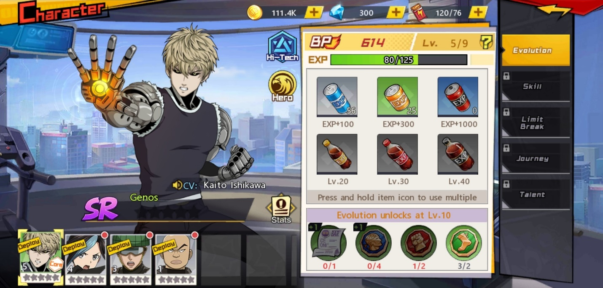
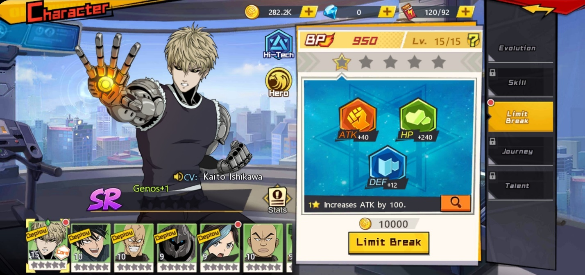
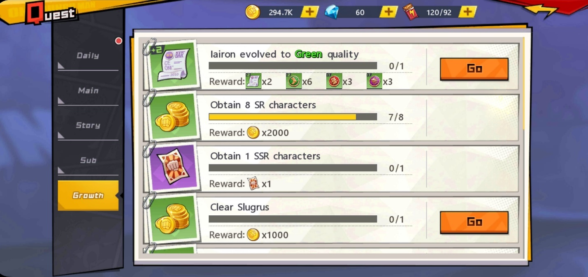
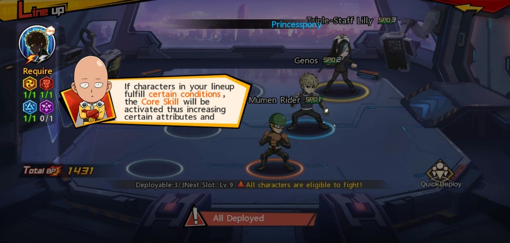
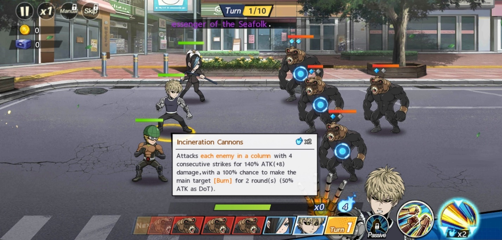

Tips Menjadi Kuat di Game One Punch Man : The Strongest untuk Pemula

Sudah sukses animenya, kali ini One Punch Man menjamah dunia game.
Dibentuk oleh developer PlayCrab dan disebarluaskan oleh FingerFun
Limited, game ini berhasil menarik perhatian lebih dari 180 ribu
pengguna android untuk mengunduhnya. Selain dibantu dengan popularitas
dari animenya sendiri, gameplay dari One Punch Man : The Strongest juga
tidak kalah seru, apalagi suasananya dibuat tidak jauh dari suasanya
yang ada di anime ini.

Dengan eksplorasi sebagai konten utama dari game ini, kamu pasti sudah
melihat akan tiga bintang setelah selesai mengalahkan semua musuh yang
ada di setiap stage-nya. Bintang tersebut akan menyala ketika kamu
berhasil memenuh tiga ketentuan. Nah, jumlah bintang tersebut akan
diakumulasikan supaya kamu bisa membuka stage untuk melawan boss yang
ada di story quest. Pasti kamu tidak ingin kalah dari boss-boss
tersebut, kan? Yuk, baca tips bermain game ini supaya BP kamu bisa cepat
bertambah dan menjadi lebih kuat.

Perawatan Karakter

Kalau kamu belum tahu, kamu bisa dapat karakter lewat gacha yang disebut
recruit di dalam game ini. Sudah dapat karakter yang keren-keren pasti
bikin senang, kan? Tapi kamu jangan sampai lupa kalau karakter kamu
tersebut butuh perhatian, ya. Apalagi karakter-karakter yang kamu miliki
merupakan kunci agar BP kamu bisa bertambah banyak.

Recruit

Kalau kamu ingin mendapat karakter yang kuat, kamu bisa mendapatkannya
di bagian recruit dengan menyiapkan tiket ataupun diamond. SSR tentunya
menjadi idaman para player dan sayangnya kamu tidak akan bisa
mendapatkan sang pemeran utama di dalam anime ini yakni, Saitama. Tapi
tenang saja, kamu masih bisa mendapat karakter kuat lainnya, kok!

Menaikkan level

Kamu harus memastikan karakter kamu memiliki level yang cukup untuk bisa
melawan para musuh, kalau kurang, bisa-bisa karakter tersebut mati dan
kamu kehilangan salah satu dari tiga bintang di akhir stage. Kamu bisa
menambah level karakter-karaktermu tersebut dengan kaleng EXP yang kamu
dapat dari berbagai rewards seperti daily sign-in.

{width="6.5in"
height="3.109027777777778in"}

Perlu diingat kalau karakter yang kamu butuhkan di dalam battlefield
tidak hanya satu, jadi jangan gegabah menaikkan level dari satu karakter
yang menjadi favorit kamu saja. Kamu bisa menakar kira-kira karakter
mana yang memberi damage besar saat levelnya bertambah dan karakter lain
yang menjadi support bisa mengikuti.

Limit breaking

Selain naik level, kamu bisa menambah bintang yang ada di karakter kamu
dengan melakukan limit breaking. Kamu perlu bahan berupa bagian puzzle
dari karakter yang menjadi fokus kamu yang bisa kamu dapatkan saat kamu
menyelesaikan sebuah stage yang ada di challenge bernama extreme
training.

{width="6.5in"
height="3.0597222222222222in"}

Akan ada tiga statistik yang bisa bertambah saat kamu melakukan limit
breaking di antaranya dua attack flat, dua HP flat, dan satu defense
flat, jadi total statistik kamu bisa bertambah sebanyak lima kali,
tentunya dari jenis sub-statistik yang sudah disebutkan tadi.

Melakukan challenge

Supaya karakter kamu semakin kuat, kamu perlu menerapkan training yang
ada di bagian challenge. Setiap stage memiliki rewards yang berbeda dan
tentunya tetap berguna untuk perkembangan karakter kamu karena challenge
ini tidak memberi jumlah EXP sedikit sebagai hadiah.

Selain EXP, kamu juga bisa mendapat item-item penting lainnya seperti
crystal core yang bisa kamu gunakan sebagai bahan ascension untuk gear
dari karakter kamu dan tentunya BP kamu bisa bertambah setelahnya.
Seperti Genos yang selalu ingin berlatih agar semakin kuat, kamu bisa
menerapkan itu ke karakter-karakter yang kamu miliki.

Kalau kamu punya karakter baru yang ingin kamu tingkatkan kualitasnya,
kamu bisa melakukan extreme training di mana bagian puzzle dari karakter
tersebut bisa kamu dapatkan dan bisa kamu tingkatkan kualitas
karakternya saat bagian-bagian tersebut sudah terpenuhi. Kamu tentunya
masih ingat limit breaking, kan? Betul sekali, kamu bisa melakukan
farming bagian puzzle tersebut di sini.

Pemakaian gear

Kamu bisa membeli gear di mall atau supply depot dan memasangkan gear
tersebut ke karakter favorit kamu. Carilah set yang cocok untuk
statistik karaktermu supaya efek yang dihasilkan menjadi lebih baik.
Statistik tersebut bisa dilihat dengan lebih jelas melalui album. Dengan
begitu kamu bisa memahami lebih dalam mengenai karakter-karakter yang
akan kamu pasangkan di line-up.

Gear yang kamu miliki juga perlu naik level seiring level dari karakter
kamu yang terus bertambah. Tak berbeda juga dengan karakter, gear ini
juga perlu ascension saat batas levelnya sudah tercapai agar batas level
tersebut bisa bertambah dan kualitas dari gear itupun semakin tinggi.

Quest

Nah, pasti kamu sudah tahu pentingnya menjalankan quest untuk
perkembangan karakter-karakter kamu, selain untuk menunjukkan kekuatan
dari line-up kamu, EXP kamu dan karakter kamu juga ikut bertambah
setelah menyelesaikan quest maupun stage yang ada di eksplorasi.

{width="6.5in"
height="3.066666666666667in"}

Akan ada lima jenis quest seperti daily quest, main quest, story quest,
sub quest dan growth quest. Pastikan kamu rajin-rajin menyelesaikan
daily dan main ketika levelmu masih kecil supaya kamu mendapat banyak
item-item penting di antaranya adalah diamond yang bisa menjadi
pengganti tiket untuk kamu merekrut karakter baru. Daily quest juga akan
memberi kamu banyak EXP dan juga koin yang tentunya sangat penting saat
kamu ingin menaikkan level karakter kamu.

Eksplorasi

Konten utama dari seluruh fitur yang ada di game ini tentunya menjadi
perhatian para player. Selain untuk mendapat bintang-bintang yang bisa
dipakai memainkan story quest dan juga memberi material-material
penting, eksplorasi juga bisa menjadi area untuk mengetes seberapa kuat
line-up yang sudah kamu bentuk.

Line-up

Kamu yang masih penasaran kenapa Saitama tidak termasuk ke dalam
karakter playable harus tahu kalau di dalam anime, Saitama bisa meninju
musuhnya hanya dengan satu pukulan dan langsung menang. Hal tersebut
diterapkan juga di dalam game RPG yang satu ini, Saitama bisa menjadi
penolong saat musuh yang kamu hadapi terlalu sulit, ia akan datang
membantu dan dengan satu pukulannya sudah cukup membuat lawannya mati
terkapar.

Karena itulah supaya line-up kamu bisa sekuat Saitama, kamu harus
memahami elemen-elemen penting untuk core dari line-up kamu agar
mendapat tambahan statistik saat bertarung nanti. Selain core, karakter
lain juga mendapat statistik tambahan saat ada karakter yang menjadi
bagian dari perk-nya.

{width="6.5in"
height="3.0965277777777778in"}

Battlefield

Posisi dari line-up kamu juga perlu diperhatikan karena mereka akan
bergantian menyerang musuh, jangan sampai karakter kamu mati sebelum
mereka sempat mendapat giliran untuk menyerang. Posisikanlah support
pemberi buff di belakang karena kegunaannya yang krusial dan darah yang
mudah tipis. Setiap karakter akan menyerang musuh yang berada di baris
depan terlebih dahulu atau bisa juga langsung ke baris belakang
tergantung dari skill karakter tersebut.

{width="6.5in"
height="3.104861111111111in"}

Kamu bisa menyalakan fitur auto, kamu hanya perlu mengatur tipe damage
apa yang akan dihempaskan tiap karakter. Misalnya kamu ingin mengatur
damage dari ultimate Genos supaya kamu bisa menyerang dua deret
sekaligus. Kamu bisa membaca deskripsi skill dan ultimate karakter kamu
terlebih dahulu dengan menekannya lingkaran skill dan ultimate tersebut
selama beberapa detik.

Kesimpulan

Seperti yang sudah kita ketahui, game RPG merupakan game dengan sistem
yang cukup rumit untuk dipelajari, namun jika sudah paham, kamu pasti
tidak akan kesulitan untuk seterusnya di dalam game ini. Apalagi game
ini merupakan adopsian dari anime populer One Punch Man, tentunya kalau
kamu fans dari anime ini, kamu pasti sudah paham mengenai
karakter-karakternya. Kunci dalam bermain game RPG adalah sabar, kalau
gegabah sedikit, bisa-bisa kamu akan menyesal ke depannya.

Kamu tim menonton anime lewat handphone atau monitor besar seperti layar
PC dan laptop? Kalau kamu otaku sejati, pasti kamu lebih nyaman menonton
anime lewat layar besar, dong. Dengan suasana asyik yang mirip dengan
anime-nya, tentunya kamu juga akan lebih menikmati saat bisa bermain
game ini di PC atau laptop kamu, kan?

Psst, kami bakal kasih tahu caranya, nih. Kamu cukup menginstall
LDPlayer di PC atau laptop kamu, lalu unduh game One Punch Man : The
Strongest ini ke dalamnya, deh. Gampang, kan? Kamu jadi bisa lebih mudah
mengakses tiap tombolnya, seru banget, deh! Jangan sampai ketinggalan
keseruan game RPG yang satu ini, ya? Selamat bermain!
