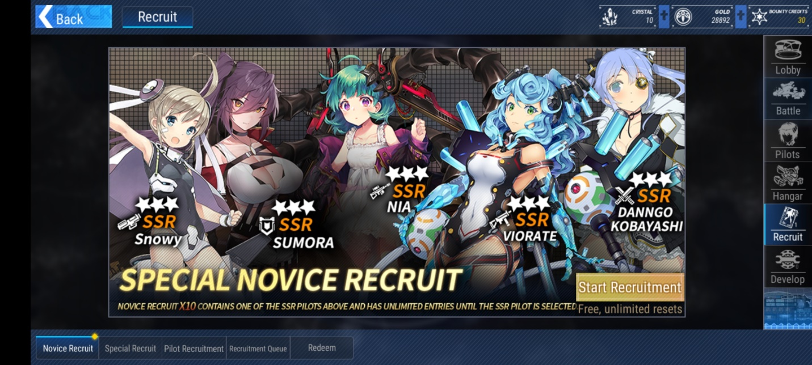
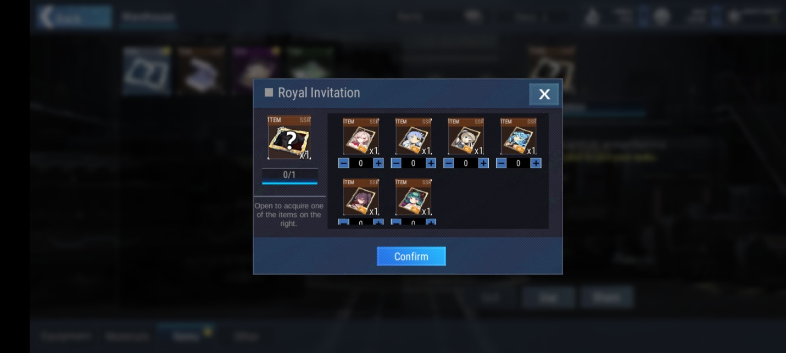
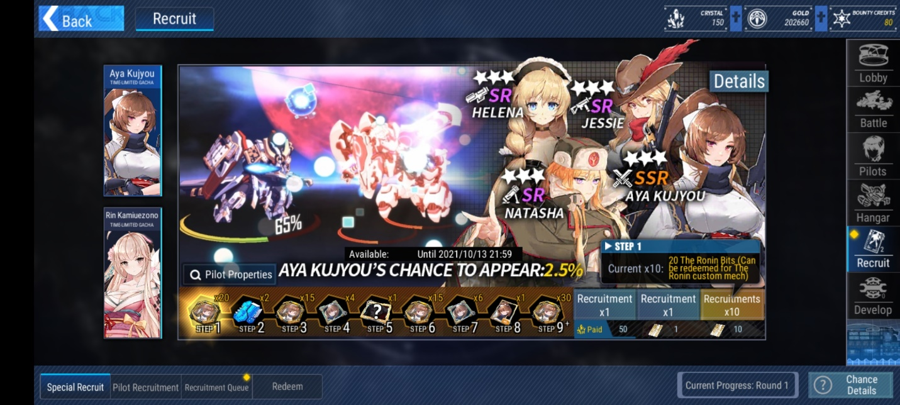
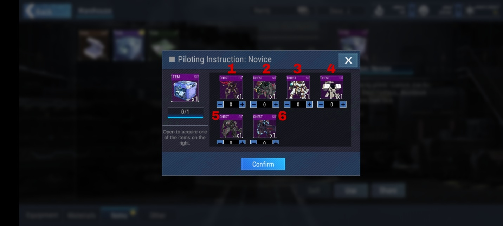
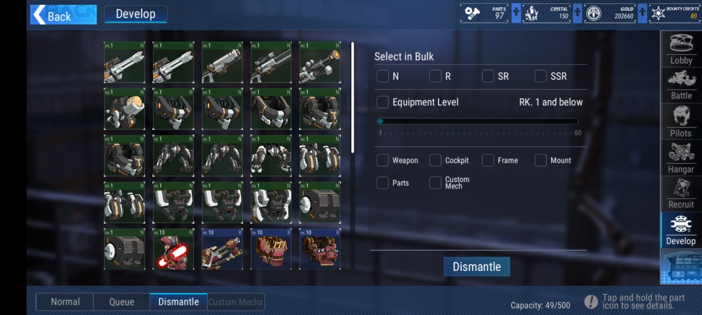
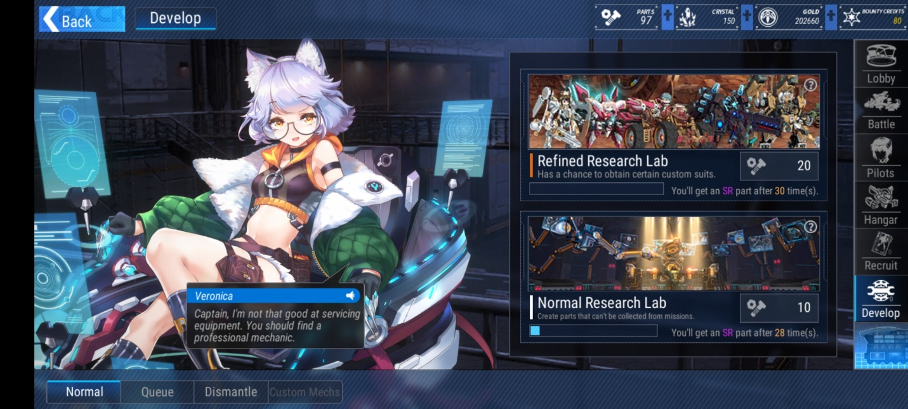
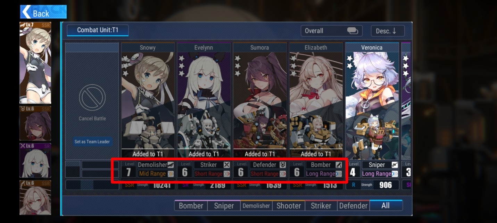
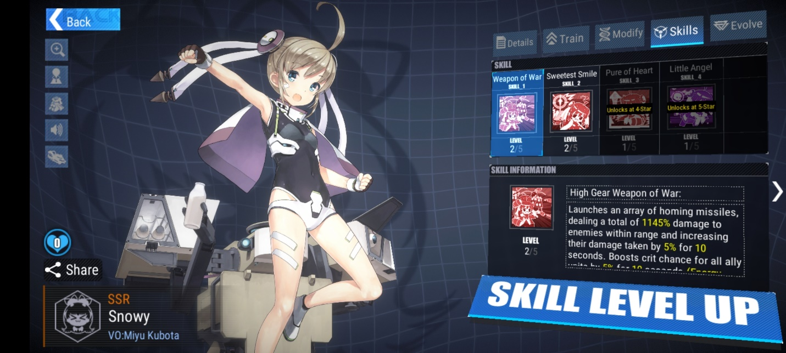
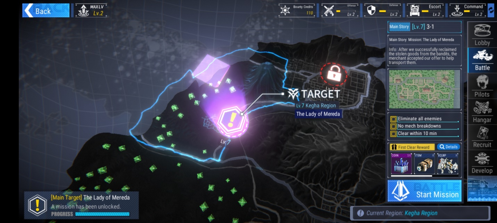

Tips dan Trik Bermain dengan Para Waifu di Game Final Gear yang Wajib
Kamu Tahu

Waifu-waifu cantik datang lagi lewat game baru, nih. Kamu sudah download
gamenya? Game ini menggabungkan mecha alias robot-robotan perang dengan
para waifu yang cantik dan imut. Pastinya kamu pencari dan pecinta waifu
harus coba game buatan KomoeGame yang satu ini. Game ini dirilis secara
publik pada tanggal 30 September 2021 kemarin dan telah menarik
perhatian lebih dari 50 ribu pengguna untuk ikut merasakan seperti apa
sih game yang penuh waifu ini.

Game mecha ini tentunya mengingatkan kamu dengan game Azur Lane, kan?
Hanya saja Azur Lane menyebut para waifunya sebagai kapal perang bukan
pilot. Terlepas dari itu, gameplay dari keduanya tentu bikin kamu yang
pernah memainkan Azur Lane sudah tidak asing lagi dengan sistemnya.
Tanpa basa-basi lagi, kami akan membahas tips dan trik saat kamu
memainkan game penuh waifu ini, penasaran, kan? Langsung saja, nih.
Check it out!

Pemula wajib tahu tips dan trik ini

Betul sekali, para pemula yang penuh rasa penasaran seperti kamu wajib
tahu beberapa tips dan trik di bawah ini supaya kamu tidak menyesal saat
sudah bermain cukup jauh nantinya. Di awal game tentu kamu akan diberi
tutorial, tapi tips dan trik ini tidak akan kamu dapatkan dari tutorial
tersebut. Kalau begitu, langsung saja baca tips dan trik di bawah ini,
yuk!

Saran pemilihan waifu SSR gratis

Setelah kamu menyelesaikan stage 2-2, kamu sudah bisa merekrut
waifu-waifu lewat gacha, nih. Seperti beberapa game lain, gacha ini
disebut dengan recruit. Akan ada lima tipe recruit yang bisa kamu
lakukan, salah satunya adalah novice recruit di mana sebagai pemula kamu
akan diperbolehkan melakukan gacha sebanyak yang kamu mau sampai kamu
dapat salah satu dari lima waifu SSR tersebut. Kalau kamu belum dapat
waifu yang kamu inginkan, kamu bisa mengulangi gacha tersebut sampai
puas.

{width="6.5in"
height="2.925in"}

Kalau kamu bingung ingin waifu yang mana karena semuanya cantik rupawan,
kami sarankan untuk memilih Snowy karena damage yang diberikan dan
defense dari waifu imut yang satu ini sudah bisa kamu bawa solo melawan
boss. Tapi kalau kamu kurang suka desain dari Snowy, semua kembali lagi
kepada selera kamu karena waifu lebih baik daripada meta.

Kamu juga akan dapat rewards lain yaitu royal invitation untuk memilih
satu waifu SSR secara gratis, jadi kamu bisa punya dua waifu SSR secara
cuma-cuma di waktu yang bersamaan, seru banget pastinya punya dua waifu
kuat yang bisa kamu masukkan ke dalam tim. Oh iya, setelah kamu sudah
yakin dengan pilihan waifu SSR kamu tersebut dan konfirmasi, novice
recruit akan otomatis hilang, jadi kamu pikirkan baik-baik sebelum
memilih, ya.

{width="6.5in"
height="2.925in"}

Bersabarlah sebelum gacha

Gacha mengharuskan kamu untuk bersabar baik saat kamu sudah melakukan
gacha maupun sebelum kamu memutuskan untuk gacha. Begitu pula di game
ini, di bagian special recruit, Final Gear menerapkan sistem step up di
mana setiap sepuluh kali kamu menarik gacha, kamu akan mendapat reward.

{width="6.5in"
height="2.925in"}Dengan adanya sistem step up seperti ini, sebaiknya
kamu menunggu sampai kristal kamu sudah ada sebanyak 15 ribu buah.
Apalagi di special recruit ini, kamu akan dihadapkan dengan dua pilihan
waifu yang sama-sama cantik, bisa-bisa kamu malah kesulitan kalau
terlalu gegabah menghambur-hamburkan kristal untuk gacha. Kalau kamu
sabar, waifu kamu pasti terenyuh dan akhirnya dia mau datang saat kamu
gacha.

Beli set untuk waifu SSR tercinta kamu

Setelah kamu memilih waifu SSR gratisan tersebut, kamu sebaiknya
langsung mendandani si cantik dengan set yang dijual secara terbatas.
Caranya kamu buka shop, lalu pilih gift pack dan klik limited-time pack
dan beli piloting instruction : novice di mana di dalamnya terdapat enam
set yang bisa kamu pilih salah satunya.

{width="6.5in"
height="2.925in"}

Set gear tersebut bisa kamu beli dengan harga 2000 kristal, pastikan
kamu tidak salah memilih set dan perhitungkan kristal yang kamu miliki
kalau kamu ingin gacha di special recruit. Setelah set tersebut kamu
pasangkan di waifu kamu, kamu bisa langsung mengaktifkan set itu dan
jadilah waifu kamu berada di dalam badan robot.

{width="6.5in"
height="2.925in"}

Supaya kamu tidak bingung memilih satu di antara enam set yang keren
tersebut, kami sudah menandai set mana saja yang cocok untuk pilihan
kamu, nih. Set nomor satu untuk waifu gagah kamu yang menjadi defender
seperti Nia, set nomor dua untuk waifu bomber seperti Sumora, set nomor
tiga untuk waifu pemberani dengan role striker seperti Danngo Kobayashi,
set nomor empat untuk waifu serba bisa seperti Snowy, set nomor lima
untuk striker merciless sepert Flavia yang bisa kamu dapat setelah
sign-in tujuh hari berturut-turut, dan set terakhir alias nomor enam
untuk waifu kamu yang sekelas dengan Viorate.

Buanglah gear yang tidak diperlukan

Semakin banyak gear yang kamu miliki dengan kualitas yang lebih baik,
tentu gear basic dengan kelas rendah tidak akan kamu pakai lagi bahkan
untuk waifu kelas normal sekalipun. Untuk itu, kamu bisa membuang atau
dismantle gear-gear yang tidak kamu gunakan tersebut agar kamu mendapat
kan standard bit yang nantinya bisa kamu pakai sebagai bahan di research
lab.

{width="6.5in"
height="2.925in"}

Research lab sendiri akan memberi kamu berbagai macam gear dengan kelas
tinggi. Tentunya akan lebih baik kalau kamu memilih refined research
gear, meski bahan standard bit yang dibutuhkan lebih banyak, kesempatan
kamu mendapat custom mecha suit alias set gear yang bisa membuat waifu
kamu berada di dalam robot akan jauh lebih besar.

{width="6.5in"
height="2.925in"}

Tips memasang formasi waifu

Saat berperang nanti, kamu diberi empat slot waifu yang bisa kamu bawa
ke battlefield. Karena kamu hanya bisa membawa empat, tentu kamu perlu
formasi yang pas supaya para waifu kamu tidak ketar-ketir saat melawan
para musuh nantinya. Kamu tak mau dong waifu kamu tewas di medan perang?

{width="6.5in"
height="2.925in"}

Pastikan kamu membawa defender untuk melindungi yang lainnya, tapi
jangan kamu sama ratakan empat slot tersebut diisi oleh defender,
bisa-bisa kamu harus menunggu sampai game ini merilis update versi 3.0
baru waifu kamu bisa menyelesaikan satu stage. Bawalah DPS kesayangan
kamu seperti Snowy atau long-range waifu lainnya. Kamu bisa juga membuat
formasi tanpa defender kalau kamu yakin waifu kamu sudah cukup kuat
menumpas para musuh.

Build waifu yang kamu sayangi

Selain senjata dan robot, waifu kamu juga memiliki sistem leveling dan
skill, pastinya kamu sudah tahu lewat tutorial cara menaikkan level
waifu kamu, dong? Nah, kamu juga perlu menaikkan skill dari waifu kamu
ini, nih. Kamu bisa fokus ke satu waifu yang paling kamu sayangi
misalnya DPS seperti Snowy karena sebagai damage dealer, Snowy memang
harus kuat dan gagah di dalam battlefield. Semakin gagah DPS kamu,
semakin mudah progress kamu di dalam game nantinya.

{width="6.5in"
height="2.925in"}

Rajin menjalankan missions

Tentunya kamu sudah tahu sejak awal tutorial kalau mission adalah bagian
yang sangat penting di game ini, semakin banyak stage yang kamu
tuntaskan di mission, baik itu story, daily, maupun event, semakin
banyak pula reward yang bisa kamu dapatkan. Selain itu juga, empat waifu
yang kamu bawa bisa naik level tanpa kamu memberi kartu EXP. Apalagi di
early-game, resource yang kamu dapat dari reward mission ini sangat
penting untuk perkembangan waifu kamu. Maka dari itu, kamu perlu
rajin-rajin melakukan mission, ya!

{width="6.5in"
height="2.925in"}

Kesimpulan

Kalau kalian kesulitan saat mengunduh file tambahan dari game ini,
tenang, kalian tidak sendirian. Meski layar dari game ini tiba-tiba
freeze saat proses pengunduhan, sebenarnya file tersebut sedang terunduh
tanpa sepengetahuan kalian, sepertinya game ini ingin memberi kalian
kejutan. Dengan begitu, kesabaran kalian sudah terlatih sebelum kalian
dihadapkan dengan hasil gacha di dalam game nantinya.

Kamu pasti pingin melihat waifu kalian dengan resolusi yang lebih baik
di layar yang besar, kan? Kalau begitu, unduhlah emulator game android
LDPlayer supaya kamu bisa memuja waifu kesayangan kamu melalui PC atau
laptop kamu. Oh iya, kalau kamu sudah melakukan pra-registrasi, kamu
akan dapat reward setelah stage 3-4 sudah kamu tuntaskan, jangan sampai
ketinggalan, ya! Selamat bermain!
