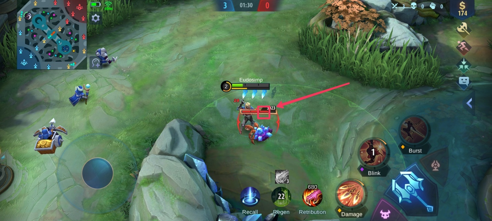
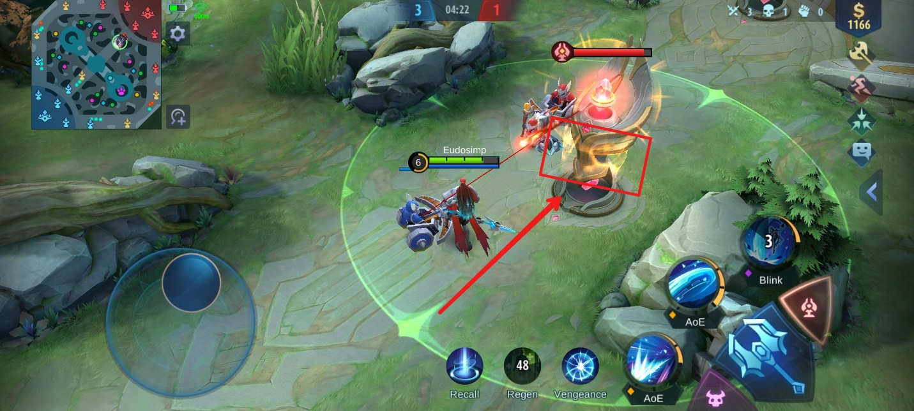

Tips dan Trik Jitu Bermain Mobile Legends : Bang Bang

Sudah update Mobile Legends kamu? Tanggal 21 September 2021 kemarin,
developer Moonton membuat update besar-besaran untuk game yang satu ini.
Dari tampilan baru hingga revamp hero, semua bisa kamu dapatkan setelah
meng-update game ini ke versi terbaru. Selain itu, sudah ada juga
bocoran untuk season 21 mendatang, lho. Pasti kamu sudah tidak sabar,
kan?

Demi memperkecil ketidakseimbangan di dalam game, Moonton memberlakukan
nerf di mana akan ada beberapa hero yang sedikit diturunkan statistiknya
ketika dirasa terlalu OP alias overpowered, dan untuk hero yang kurang
diminati karena statistik yang kecil akan diberi buff. Ngomong-ngomong
soal hero, ingin tahu rahasia para hero dan battlefield yang bisa
menguntungkan kamu di dalam game? Simak bacaan di bawah ini, ya!

Keunikan para hero

Hero menjadi bagian utama yang menunjukkan keahlian kamu dalam bermain
game ini. kamu harus bisa memanfaatkan setiap skill baik aktif maupun
pasif dari hero yang kamu ingin kuasai. Siapapun pasti ingin memiliki
upperhand situation di setiap game, apalagi game dengan mode PvP. Kalau
kamu sudah mengetahui dan memahami rahasia para hero di dalam
battlefield yang bisa kamu manfaatkan di dalam game ini, tentu hal
tersebut akan menjadi mudah.

Selain itu, ada pula keunikan para hero yang seringkali diabaikan oleh
pemain, apa kamu juga sering melewati beberapa keunikan dari para hero?
Mari kita cari tahu.

Sun

{width="6.5in"
height="2.925in"}

Hero yang mirip kera sakti ini bisa menciptakan kloning yang tentu harus
kamu manfaatkan sedemikian rupa. Kami punya tips dan trik untuk kamu
para pengguna Sun. Psst, kami juga sudah punya satu trik untuk counter
hero yang satu ini, lho. Hihihi :

-   Kloning dari Sun bisa mendekati dan menyerang musuh yang tidak
    terlihat seperti Natalia

-   Ulti Sun bisa membatalkan proses ulti dari Harley

-   Kloning Sun dari skill dua bisa membuat Sun kebal dari serangan
    turret. Baik ketika kamu menyerang turret tanpa minion maupun ketika
    kamu menyerang musuh yang berada di sekitar area lindungan turret.

-   Kalau kamu menginjak jebakan Selena lebih dari satu kali dalam waktu
    yang berdekatan, burst atau ulti dari Selena akan meningkat dan
    stack hingga 50% per jebakannya.

-   Hero seperti Claude bisa melakukan counter saat berhadapan langsung
    dengan Sun. Monyet yang ada di pundak Claude akan menjadi kloning
    dan mengecoh kloning dari Sun dan kamu bisa menyerangnya dengan ulti
    Claude. Pastikan kamu sudah buff di jungle terlebih dahulu karena
    darah fighter cukup tebal di early-game untuk kamu serang
    menggunakan marksman.

Ling

{width="6.5in"
height="2.925in"}

Assassin yang bisa meloncati tiap tembok di battlefield ini kadang bikin
kerepotan apalagi kalau darah hero kamu sudah tipis, gerakannya yang
cepat bisa memudahkan Ling untuk mengejar hero kamu yang mencoba kabur.
Berikut tips dan trik untuk kamu pengguna Ling dan kamu yang mencari
celah untuk counter hero ini :

-   Ulti Ling akan mengeluarkan empat pedang yang setiap pedangnya
    memberi reset CD untuk skill dua dan juga tambahan energi, untuk
    bisa menjangkau ke empat pedang yang tersebut dengan mudah, ambil
    satu langkah mundur dari arah pedang yang ingin kamu raih, lalu
    gunakan skill 2 untuk dash ke arah pedang itu dan raih pedang lain
    searah jarum jam maupun berlawanan untuk hasil yang maksimal.

-   Kamu bisa menghindari ulti Ling dengan cara lari menuju rerumputan,
    dengan begitu kamu tidak akan terkena damage dan kamu tidak akan
    terdeteksi oleh auto aim dari Ling.

Hanzo

{width="6.5in"
height="2.925in"}

Sebagai ninja terkuat, Hanzo memiliki ulti yang unik di mana ia bisa
memisahkan nyawa dari raganya untuk menyerang musuh yang berada jauh
darinya. Perlu diingat kalau tubuh Hanzo saat ulti akan terdiam di
tempat dan tidak akan bereaksi sama sekali, maka dari itu perlu
kehati-hatian ekstra saat menggunakan ulti ini. Ternyata ada keunikan
lain dari ulti Hanzo ini, nih. Apa sajakah itu? Mari kita cari tahu.

-   Ulti dari Jawhead akan mengejar nyawa Hanzo sampai ke posisi di mana
    tubuhnya diam, bahkan sampai base sekalipun.

-   Saat ulti, tubuh Hanzo yang diposisikan berada di dekat turret tidak
    akan dilindungi, jadi kamu bisa menyerang tubuhnya tanpa terkena
    serangan turret bahkan sampai Hanzo mati.

Popol dan Kupa

{width="6.5in"
height="2.925in"}

Hero ini mirip seperti Irithel di mana manusia bekerja sama dengan
hewan, bedanya adalah Popol akan bergantung penuh pada Kupa dalam hal
defense maupun offense. Cara mudah mengalahkan hero ini adalah dengan
membunuh Kupa dengan cepat dan mengincar Popol yang tidak akan bisa
memberi damage berarti. Kira-kira hal unik lain apa yang dimiliki hero
yang satu ini, ya?

-   Popol dan Kupa tidak akan bisa diberi damage dari battle spell
    retribution jika battle spell tersebut belum ditingkatkan ke level
    dua

-   Kamu bisa langsung menggunakan ulti dari Popol setelah menggunakan
    skill satu untuk serangan stun yang bisa bikin lawan kamu
    ketar-ketir. Kamu juga bisa gunakan skill dua dan basic attack untuk
    tambahan damage yang lebih besar ke musuhmu tersebut.

Selain tips dan dari hero-hero di atas, ada beberapa tips dan trik lain,
nih, dari hero yang mungkin menjadi favorit kamu di dalam game ini :

-   Gunakan item winter truncheon saat kamu terkena ulti dari Harley,
    perhatikan titik lingkaran yang berputar di antara hero kamu, jangan
    gunakan item sebelum titik itu berputar setidaknya setengah putaran.

-   Ulti Lesley bisa kamu batalkan dengan menggunakan skill dua yang di
    mana damage dari ultinya tersebut akan dua kali lebih besar.

-   Kalau kamu ingin mengejar hero Yu Zhong dan Pharsa yang bisa terbang
    bahkan sampai ke luar map, kamu bisa menunggu di titik yang berada
    tepat di samping hero-hero tersebut terbang, saat waktu mereka untuk
    terbang sudah habis, mereka akan dipaksa kembali ke titik yang sudah
    ditentukan tersebut dan kamu bisa langsung menyerangnya.

-   Ketika kamu berhadapan dengan Aldous saat kamu menggunakan hero
    dengan role tank maupun fighter, gunakan item blade armor dan battle
    spell vengeance di late-game, dengan begitu, damage dari skill satu
    Aldous akan menjadi counter ke dirinya sendiri saat mencoba
    menyerang hero kamu.

> {width="6.5in"
> height="2.925in"}

Tips di dalam arena pertarungan

Sudah mempelajari rahasia dari hero-hero di atas, saatnya untuk kamu
mengetahui tips dan trik yang ada di battlefield alias arena pertarungan
supaya kamu bisa bermain layaknya pro player dalam waktu singkat.

Koneksi internet

Hindari bermain ke mode classic, brawl, apalagi ranked saat koneksi
internetmu sedang tidak stabil. Selain kamu bisa sering mati karena lag
saat war, kamu juga bisa merugikan tim kalau kamu tiba-tiba keluar dari
pertarunga karena sinyal kamu yang buruk itu membuat koneksi terputus.

Pastikan sinyalmu stabil saat berada di lobi, kamu bisa memakai speed
mode yang ada di game ini, tetapi sudah banyak kasus lag yang bertambah
para akibat fitur yang satu itu. Cara klasik lain yang bisa kamu lakukan
adalah pergi ke tempat dengan sinyal yang baik, tak perlu cepat, yang
penting stabil dan tidak putus-putus seperti hubungan kamu dengan dia.
Hihihi.

{width="6.5in"
height="2.997916666666667in"}

Kuasai dua hero atau lebih

Kalau kamu punya hero favorit, pasti kamu akan sering menggunakan hero
yang sama terus-menerus. Tidak masalah jika kamu yakin kamu sudah ahli
bermain hero tersebut, tapi akan jadi masalah jika hero favorit kamu
tersebut sudah dipilih oleh player lain di tim yang sama. Untuk itu,
pelajarilah dua hero atau lebih, selain kamu bisa mengimbangkan role di
dalam tim, kamu juga tidak akan kebingungan saat hero yang biasa kamu
pakai sudah dipilih teman satu tim kamu.

{width="6.5in"
height="2.925in"}

Rekomendasi role

Hero yang memiliki role kombinasi fighter dan assassin seperti Alucard
dan Zilong bisa kamu jadikan pilihan karena selain serangannya yang
cepat, damage yang diberikan hero ini juga cukup besar dari early sampai
mid-game. Sangat direkomendasikan untuk kamu mempelajari hero tank
karena biasanya role ini jarang diminati dan kamu bisa menyokong tim
supaya menang.

Tank/fighter seperti Hilda bisa kamu pilih untuk arena pertarungan,
selain stack damage nya yang semakin besar ketika hero tersebut berhasil
mematikan musuh, Hilda juga bisa healing di dalam rerumputan tanpa
menunggu cool down dari regen. Hilda juga bisa kamu beli dengan 24 ribu
koin saja, lho. Selain itu kamu bisa coba gunakan Ruby yang akan heal
setiap kali ia berhasil menggaet musuh dengan skill maupun ultinya.

Pentingnya mengetahui bar HP jungle creep dan hero

Seperti yang sudah kita ketahui kalau melakukan buff di jungle adalah
sebuah keperluan tersendiri apalagi saat kamu sedang menggunakan hero
dengan role assassin. Kalau kamu perhatikan, tentu semua creep yang ada
di jungle termasuk para hero memiliki bar HP yang setiap bagiannya
menunjukkan 1000 HP.

{width="6.5in"
height="2.925in"}

Berbeda dengan turtle dan lord, keduanya memiliki bar HP dengan setiap
bagiannya yang menunjukkan 2000 HP. Hal ini bisa memudahkan untuk
mengetahui seberapa HP yang tersisa dan kamu bisa menggunakan skill atau
battle spell retribution kamu dengan efektif.

{width="6.5in"
height="2.925in"}

Bersabar

Sabar merupakan kunci keberhasilan, tidak perlu gegabah saat melihat
hero lawan sudah sekarat dengan darah sekali tebas karena banyaknya kill
tidak menentukan kemenangan. Justru hal yang kamu perlu fokuskan adalah
menghancurkan turret musuh. Semakin cepat kamu menghabisi turret,
semakin mudah kamu untuk memenangkan permainan.

Tips memilih battle spell retribution

Jika kamu memilih menggunakan retribution sebagai battle spell, kamu
otomatis akan dianggap sebagai core dan menjadi tumpuan di dalam tim,
kalau kamu lengah sedikit, tim kamu bisa kewalahan menghadapi musuh.
Untuk itu, sangat penting memilih tipe retribution supaya damage kamu
akan menyakiti lawan.

{width="6.5in"
height="2.925in"}

-   Retribution biru

Retribution ini cocok untuk hero jungler yang perlu waktu untuk
meningkatkan damage dan, contohnya seperti Sun, Hanzo, dan Zilong.

-   Retribution merah

Retribution merah ini memberi kamu tambahan damage dari skill hero kamu,
maka dari itu retribution ini cocok untuk hero yang bergantung pada
skill seperti Ling, Lancelot, dan Helcurt.

-   Retribution ungu

Retribution ungu ini memberi tambahan burst damage dan meningkatkan daya
tahan itu hero itu sendiri, maka retribution ini cocok untuk hero
seperti Hayabusa, Harley, Karina, dan Barats.

Menyerang turret

Saat kamu berhasil menghancurkan turret di baris paling depan, turret
yang ada di tengah akan dilindungi oleh cahaya berwarna kuning di
sekitarnya yang membuat damage terhadap turret tersebut menjadi
berkurang. Tunggulah sampai cahaya tersebut hilang supaya turret
tersebut bisa kamu hancurkan dengan mudah.

{width="6.5in"
height="2.925in"}

Perhatikan atribut hero lawan

Kalau kamu sering bermain game ini pastinya sudah tahu kalau para pemain
bisa melihat statistik semua hero yang ada di battlefield dengan cara
mengeklik bagian waktu yang ada di tengah atas dan klik atribut. Dengan
begitu kamu bisa mengetahui titik kelemahan dari setiap hero yang ada.

{width="6.5in"
height="2.925in"}

Hero revamp

Kalau kamu belum tahu, di dalam Project NEXT ada beberapa hero seperti
Lancelot, Odette, Kagura, dan Hayabusa mendapat revamp, lho! Sebelumnya
sudah ada hero-hero yang mendapat revamp di antaranya Eudora, Alpha,
Argus, dan lainnya. Jadi, selain mereka memiliki animasi saat melakukan
recall, efek dari skill mereka juga mendapat perubahan. Apa saja ya
perubahan dari ke empat hero di atas?

Lancelot

Semakin terlihat maskulin di dalam art-nya, serangan dari skill satu
atau puncture Lancelot ini juga akan membuat musuh ditandai dan bisa
dengan mudah membuat hero ini mengincar lawannya dengan cepat.

{width="6.5in"
height="2.925in"}

Odette

Si cantik pujaan Lancelot ini mendapat perubahan efek dari skill dua
atau blue nova miliknya, serangannya memiliki area yang lebih besar.
Selain itu jarak serang dari ultimate atau swan song Odette pun
bertambah, bahkan hero ini bisa melakukan leap untuk mendekati hero
lawan yang ingin diserang, lho.

{width="6.5in"
height="2.925in"}

Hayabusa

Ninja tampan yang satu ini berpenampilan baru dengan tambahan penutup
muka dari hidung sampai dagunya dan kini rambut kerennya sudah bisa kamu
lihat secara langsung. Gerak larinya juga sedikit berubah, begitupun
senjata yang ia keluarkan di skill satu juga berubah, tadinya berupa
shuriken, setelah update menjadi kunai.

{width="6.5in"
height="2.925in"}

Kagura

Si imut yang satu ini semakin terlihat imut dengan pita di rambutnya.
Area serangan dari skill seimei umbrella Kagura pun semakin luas.
Serangan melempar payung dari Kagura juga bertambah cepat. Kalau kamu
jago, bisa saja kamu membuat hero dengan role mage ini malah menjadi
seperti role assassin dengan serangan cepatnya. Pasti keren banget.

{width="6.5in"
height="2.925in"}

Kesimpulan

Game populer yang satu ini memang tidak ada habisnya untuk menjadi
bahasan karena seiring berjalannya waktu akan selalu ada hal baru yang
diberikan dari developernya. Teori tentu bukan hal yang cukup untuk kamu
memahami game seperti Mobile Legends : Bang Bang ini, praktik langsung
dengan sering bermain adalah kunci agar kamu bisa menjadi pro player
dengan cepat.

Sudah tahu belum kalau kamu bisa memainkan game ini layaknya DOTA? Betul
banget, kamu bisa mainkan Mobile Legends : Bang Bang di PC atau laptop
kamu, lho. Caranya mudah banget, kamu cuma perlu mengunduh emulator game
android LDPlayer ke PC atau laptop kamu dan mainkan game ini dengan
setting yang sesuai dengan kenyamanan kamu, mudah banget, kan? Makanya,
tunggu apa lagi? Ayo mainkan game ini di PC atau laptop kamu dan rasakan
keseruannya!
