Ulasan, Tips dan Trik Bermain Blue Archive : Imutnya Para Chibi Penembak
Jitu

Halo, sobat LDPlayer! Akhir-akhir ini banyak sekali game yang menawarkan
sistem gacha untuk menarik perhatian calon player, tidak terkecuali Blue
Archive. Game garapan NAT Games yang dipublikasikan oleh Yostar ini
rilis pada tanggal 4 Februari lalu dan dirilis secara global oleh Nexon
pada tanggal 8 November kemarin.

Tentunya sistem gacha harus dibarengi dengan desain karakter yang
menarik, begitu pula di Blue Archive. Di game bernuansa anime ini, kamu
akan dipertemukan dengan banyak gadis imut nan menggemaskan. Eits, tapi
kamu harus hati-hati karena mayoritas karakter-karakter imut ini masih
usia sekolah alias di bawah umur, salah bicara sedikit, bisa-bisa kamu
dicap yang macam-macam, gawat kan?

Kamu ingin main tapi masih mencari penambah rasa yakin? Sudah bermain
tapi masih bingung cara menuntaskan misinya? Sebuah keputusan yang tepat
untuk membaca artikel kami karena kali ini kami akan membahas tentang
impresi setelah memainkan game imut idaman otaku yang satu ini beserta
tips dan triknya. Kalau begitu langsung saja simak bacaan di bawah ini,
ya!

Pencarian jati diri sang guru

Kalau kamu tahu Arknights, tentu kamu tidak asing dengan plot commander
yang hilang ingatan tetapi dipaksa keadaan untuk memimpin sebuah perang.
Di Blue Archive, kamu akan berperan sebagai guru yang memimpin
murid-muridnya untuk berperang melawan para musuh.

Di awal kisah alias prolog, akan ada gadis misterius yang berbicara pada
kamu mengenai amanat yang dibebankan serta mimpinya melihat dunia yang
lebih baik. Eng ing eng, ternyata semua itu hanya mimpi dan kamu
dibangunkan oleh Nanakami Rin, seorang General Student Council dari
Kivotos, kota akademi.

Singkat cerita, Rin meminta kamu untuk menjadi Sensei pengganti setelah
Sensei sebelumnya hilang entah kemana. Kamu juga akan bertemu dengan si
tsundere Yuuka, si kalem Hasumi, dan Chinatsu si anggota osis yang
meminta Rin bertemu dengan ketua osis mereka untuk mendiskusikan
sesuatu. Selain mereka bertiga, ada perwakilan dari tiap sekolah lainnya
yang datang ke tempat itu.

Usut punya usut, ada sembilan sekolah yang berada di bawah naungan
Kivotos. Kalau kamu beruntung, kamu bisa merekrut para murid dari setiap
sekolah untuk masuk ke dalam tim kamu.

Akan ada satu murid yang membuat kekacauan yang bernama Wakamo. Kamu
sebagai Sensei pun mengambil alih komando untuk memerangi Wakamo beserta
antek-anteknya. Dari sana lah kisahmu sebagai player sekaligus Sensei di
mulai.

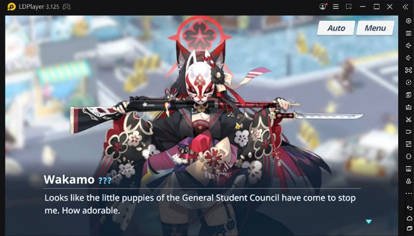{width="6.5in"
height="3.714583333333333in"}

Bertemu dengan asisten yang unik

Dengan jabatan barumu sebagai Sensei, kamu punya akses untuk masuk ke
dalam SCHALE, organisasi rahasia yang ditemukan oleh General Student
Council sebelumnya yang hilang tanpa jejak.

SCHALE bergerak di area tersendiri dan menjadi pencari solusi di setiap
masalah. Kamu juga tidak akan sendirian karena ada Arona, AI yang setia
mendampingi tugasmu sebagai Sensei.

Ada yang unik dari Arona, nih, kamu bisa menuliskan nama kamu yang akan
disebutkan oleh Arona setiap kali dia berbicara kepada kamu, lho, lucu
banget kan? Nama itu juga bisa kamu ganti, tapi dengan catatan kamu
tidak bisa menggantinya lagi selama 72 jam alias tiga hari.

Kamu bisa bertemu dengan Arona di bagian Campaign, di sana sesekali
Arona tidak sadar akan kehadiran kamu dan baru tersadar setelah kamu
klik si AI biru yang lucu ini, bikin gemas sekali, ya sobat LDPlayer.

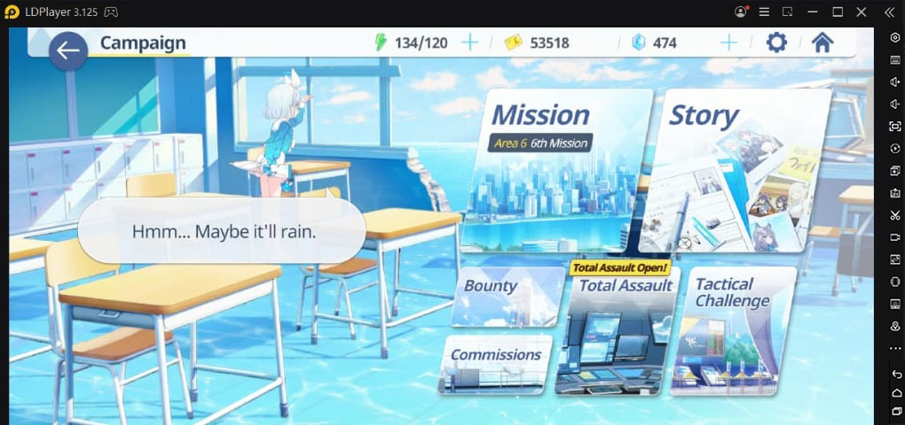{width="6.5in"
height="3.0590277777777777in"}

Gameplay super santai

Blue Archive memiliki gameplay yang lumayan unexpectable karena jika
hanya dilihat dari luar, banyak yang mengira bahwa game ini menggunakan
sistem turn-based seperti Symphogear XD UNLIMITED. Padahal bisa dibilang
Blue Archive merupakan tipe game idle yang mana kamu hanya perlu duduk
manis menunggu hasil peperangan dari para waifu imut kamu.

Versi chibi dari waifu-waifu kamu tersebut akan bergerak mandiri mencari
cover dan menembaki para musuh. Ditambah lagi ada sistem auto yang
membuat mereka mengaktifkan skill secara otomatis saat energinya sudah
terpenuhi.

Eits, meski semi-idle seperti itu kamu tetap perlu mengatur taktik
sedemikian rupa supaya waifu imut kamu tidak ada yang sampai harus
ditarik oleh helikopter karena kehabisan darah. Untuk itu kami ada
sedikit tips dan trik di dalam battlefield, nih. Baca sampai habis, ya!

Perhatikan line-up para waifu

Kamu punya empat slot unit yang bisa kamu pakai untuk menyusun formasi
waifu kamu, tapi kamu hanya perlu menggunakan satu unit saja di
early-game karena kamu masih bisa mengganti formasinya untuk
menyesuaikan tipe musuh yang akan dihadapi. Untuk kamu yang malas
mendengarkan tutorial dari Rin, berikut tipe musuh beserta kelemahannya.

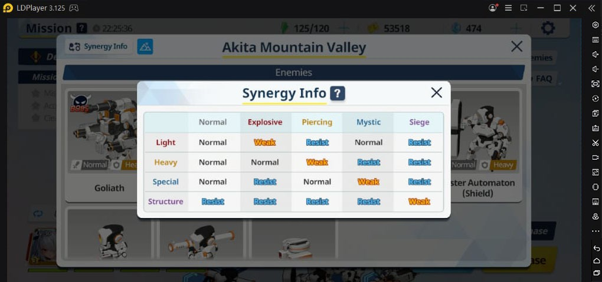{width="6.5in"
height="3.0590277777777777in"}

Kamu juga bisa mengecek tipe defense apa yang dimiliki oleh
musuh-musuhmu di bagian enemies saat kamu sudah masuk ke dalam stage.
Hal ini untuk mengira-ngira rasio tipe waifu yang akan kamu bawa karena
jika ada dua tipe yang berbeda dari musuh tentu kamu tidak bisa hanya
membawa waifu-waifu kamu dengan satu tipe yang sama, betul tidak?

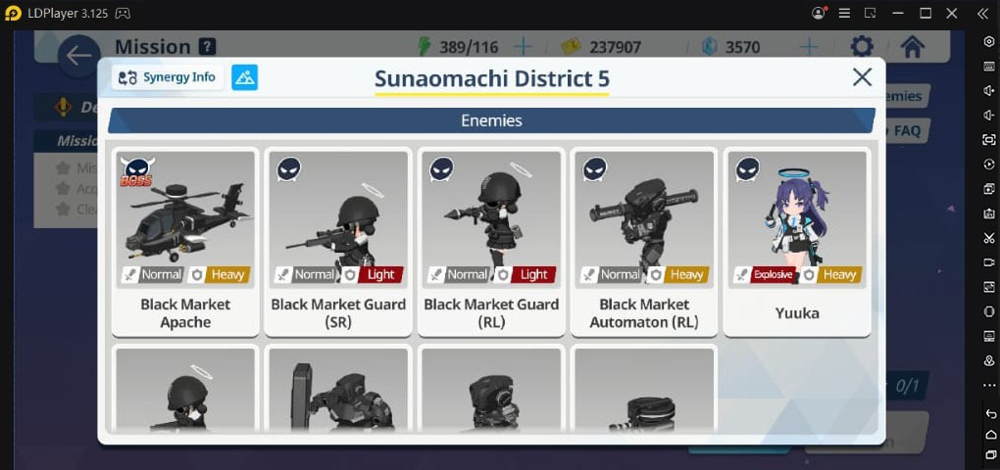{width="6.5in"
height="3.0590277777777777in"}

Di early-game, dua tipe waifu yang wajib kamu bawa adalah yang berwarna
merah alias Explosive dan warna kuning alias Piercing karena musuh yang
kamu hadapi mayoritas masih berdefense Heavy dan Light. Cocokkan unit
yang akan kamu bawa dengan musuh yang akan kamu hadapi.

Tidak perlu takut kamu salah membawa unit, game ini tidak akan
menyulitkan kamu karena jika kamu sudah memilih stage, kamu bisa
langsung menyusun unit waifu kamu dan menyesuaikannya dengan tipe musuh
yang ada. Manfaatkanlah sistem auto yang akan langsung menaruh waifu
dengan tipe tertentu yang sesuai dengan stage-nya.

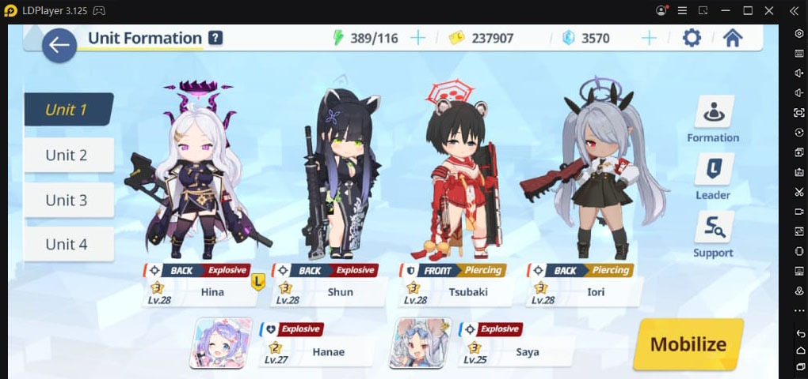{width="6.5in"
height="3.0590277777777777in"}

Berikut tips dan trik supaya tim kamu akan selalu mendapat tiga bintang
di setiap stage :

1.  Cocokkan sinergi, susunlah waifu di dalam tim kamu sedemikian rupa
    agar musuh mudah dikalahkan. Jangan terpaku pada tier list, jika
    keberuntungan kamu memang buruk, pakailah waifu yang kamu sudah
    miliki karena kunci untuk bisa menyelesaikan sebuah stage adalah
    sinergi.

2.  Sangat dianjurkan untuk membawa satu healer, bahkan tank sekalipun
    masih butuh tambahan HP.

3.  Tidak ada kesuksesan tanpa kegagalan, jika kamu gagal di sebuah
    stage, maka cari titik kelemahan kamu, perbaiki, dan coba lagi.

Hindari menyalakan sistem auto

Walau terlihat praktis dan mempersingkat waktu kamu sebagai player untuk
menyelesaikan misi, tapi kami sangat-sangat tidak menganjurkan untuk
menyalakan auto di game ini karena sistem auto tersebut digunakan untuk
mengaktifkan skill dari setiap waifu yang kamu bawa ke dalam
battlefield.

Wahai penulis, bukankah dengan begitu permainan menjadi lebih mudah
karena skill otomatis dilepaskan dan musuh akan terbantai sekaligus?
Tentu saja tidak, wahai pembaca setia LDPlayer sekalian.

Di dalam battlefield nanti hanya akan tiga skill terpampang dari total
enam skill milik para waifu yang kamu bawa tersebut. Skill dari para
waifu tersebut bisa kamu gunakan secara bergantian dengan total energi
yang bervariasi. Jika sistem auto dinyalakan, kamu tidak bisa mengatur
timing dan arah serang dari waifu kamu tersebut karena otomatisnya skill
tersebut menyala tanpa arahan dari kamu.

Lain cerita kalau kamu tidak menyalakan sistem auto, kamu bisa mengatur
skill dari para waifu kamu dengan efisien. Kuncinya adalah mengenali
jenis skill dari setiap waifu kamu, perhatikan jumlah energi, timing,
dan posisi para musuh.

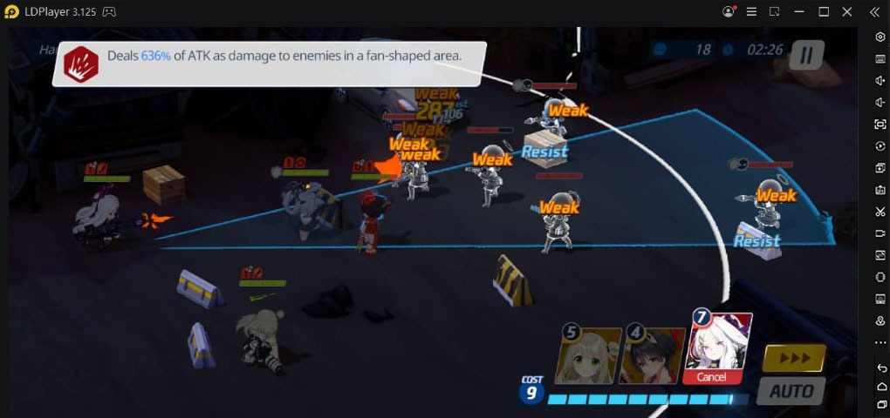{width="6.5in"
height="3.0590277777777777in"}

Yang mengasyikan dari gameplay Blue Archive ini adalah kamu tidak perlu
hold skill untuk mengarahkan serangan waifu kamu seperti ketika kamu
bermain Mobile Legends, jadi kamu bisa terhindar dari misclick dan
membuang-buang energi yang sudah kamu kumpulkan, kecuali kalau kamu
sudah memilih arah tapi kamu berubah pikiran ingin membatalkan skill,
maka kamu harus hold ke arah cancel supaya skill tidak terlepas ke
musuh.

Berikut tips dan trik untuk kamu agar bisa menggunakan skill para waifu
dengan efisien :

1.  Aktifkanlah skill waifu yang menaikkan buff sendiri ataupun buff
    satu tim terlebih dahulu karena biasanya jumlah energi yang
    dibutuhkan tidak terlalu banyak.

2.  Pilihlah timing yang tepat untuk menggunakan skill dengan
    memperhatikan jumlah HP musuh, supaya skill yang mereka hempaskan
    tidak sia-sia karena musuh yang diincar sudah tiada.

3.  Arahkan serangan ke banyak musuh sekaligus, tips yang satu ini cocok
    untuk waifu dengan AoE type attack seperti Hina dan Nonomi.
    Perhatikan arah gerak musuh yang saling berdekatan, musuh-musuh
    tersebutlah yang menjadi mangsa empuk untuk waifu kamu. Jika kamu
    terlanjur menekan skill waifu kamu sebelum musuh tersebut masuk ke
    dalam area serang, tekan cancel dan tunggulah hingga mereka semua
    terkumpul.

4.  Arahkan serangan ke musuh di bagian paling belakang, tips yang satu
    ini cocok untuk waifu dengan single target type attack seperti
    Karin. Musuh paling belakang akan memberi damage paling banyak
    karena waifu kamu akan fokus dengan musuh yang berada di bagian
    paling depan terlebih dahulu, untuk itu seranglah musuh di bagian
    belakang tersebut dengan skill waifu kamu. Sebenarnya, kamu bisa
    menggunakan skill dari waifu dengan AoE type attack untuk tips yang
    satu ini, tapi jika musuh yang berada di belakang hanya sedikit
    tentu tidak worth it untuk dilakukan.

Turn-based sebelum battlefield

Sebelum masuk ke dalam battlefield, leader dari tim waifu kamu akan
berdiri di atas sebuah hexagon, dia juga tidak sendiri karena tak jauh
dari posisi waifu kamu berdiri akan ada beberapa musuh yang menunggu
giliran untuk mendekati waifu kamu.

Kalau musuh sudah tepat berada di hexagon yang sama dengan waifu kamu,
otomatis tim waifu kamu akan terbawa masuk ke dalam battlefield dan
tidak ada sistem turn-based jika tim kamu ingin menyerang musuh.

Kamu harus berpikir secara matang sebelum memutuskan untuk mengeklik
start battle karena kamu tidak bisa mengganti formasi tim sama sekali
dan kamu harus terus melangkah sampai ke boss.

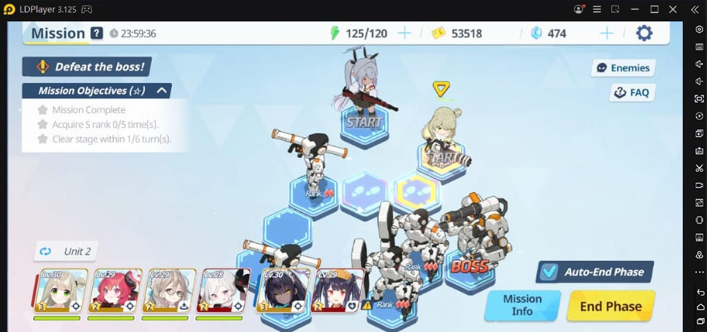{width="6.5in"
height="3.0590277777777777in"}

Setiap stage memiliki tiga bintang yang harus kamu tuntaskan dengan cara
menyelesaikan misi, mendapat S rank tiga kali setelah mengalahkan musuh,
dan menyelesaikan stage tanpa melewati batas giliran yang telah
ditentukan di misi tersebut.

Psst, kamu tidak perlu takut kehilangan seluruh bintang karena kamu
tidak bisa menuntaskan salah satunya. Kamu bisa mencoba stage itu lagi,
fokus menuntaskan satu bintang dengan mengabaikan yang lainnya, dan tiga
bintang tersebut akan tetap menyala. Dengan catatan, kamu harus tuntas
sampai mengalahkan boss.

Biasanya di hard stage akan ada 50 pyroxene tersemat di antara banyak
hexagon, perhatikan langkahmu jika kamu tidak ingin melewati batas
giliran untuk mendapat salah satu dari tiga bintang. Kamu bingung? Kalau
begitu pilih lah pyroxene karena selalu ada kesempatan ke dua jika kamu
ingin menuntaskan tiga bintang di stage tersebut.

Jangan lupa lihat-lihat jika ada buff atau tambahan HP, itu bisa menjadi
alat bantu supaya waifu yang ada di dalam tim kamu tidak mudah tewas dan
kamu jadi gagal menuntaskan stage tersebut.

Sistem gacha yang bikin sedih

Meski dipenuhi dengan "moe moe kyun", masih sangat disayangkan karena
gacha di Blue Archive belum menganut sistem soft pity dan pity kamu
tidak akan berlanjut ke banner setelahnya. Pity yang sudah kamu
kumpulkan saat pergantian banner akan diubah menjadi keystone piece
untuk kamu melakukan crafting.

Sebagai pelajaran dari pengalaman pribadi yang tidak tahan ingin selalu
melakukan gacha, sebaiknya kamu diam saja sampai pyroxene kamu sudah
terkumpul sebanyak 24 ribu buah dan habiskan semuanya untuk gacha.
Dengan begitu, recruitment point kamu bisa terkumpul sampai 200 dan kamu
bisa memilih satu dari dua waifu yang sedang berada di banner rate-up.
Ingat ya, sobat LDPlayer, sabar adalah kunci.

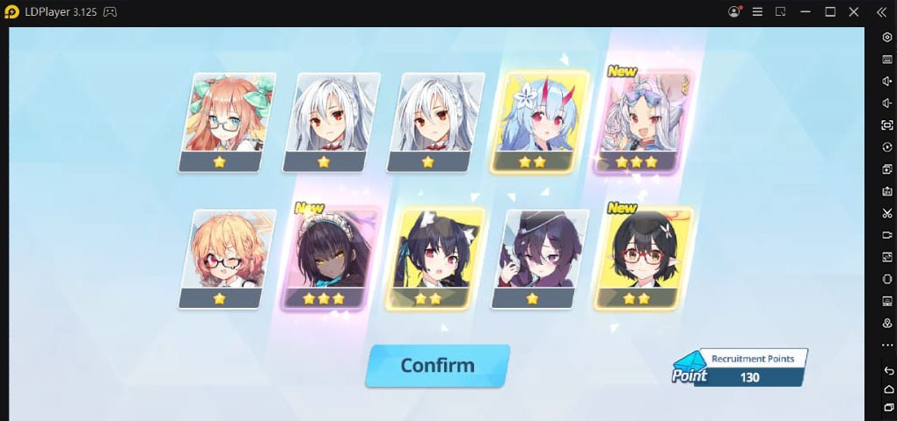{width="6.5in"
height="3.0590277777777777in"}

Developer dermawan

Sebagai pecinta gacha, tentu sangat menyenangkan kalau mendengar ada
developer game yang murah hati seperti developer game Blue Archive ini.
Bagaimana tidak, hampir di semua sisi game ini memberi kamu pyroxene,
mulai dari menuntaskan stage, challenge rewards, story, momo talk,
sampai daily login. Bahkan beberapa hari yang lalu ada tiga coupon
reward yang masing-masing memberi kamu 120 pyroxene, sebagai F2P
tentunya kita bahagia, kan, sobat LDPlayer?

Apalagi kalau kamu sudah mencapai stage 6-1, kamu bisa join ke arena
tactical challenge dan mendapat banyak pyroxene setiap kali tim kamu
berhasil mengalahkan tim dari player lainnya.

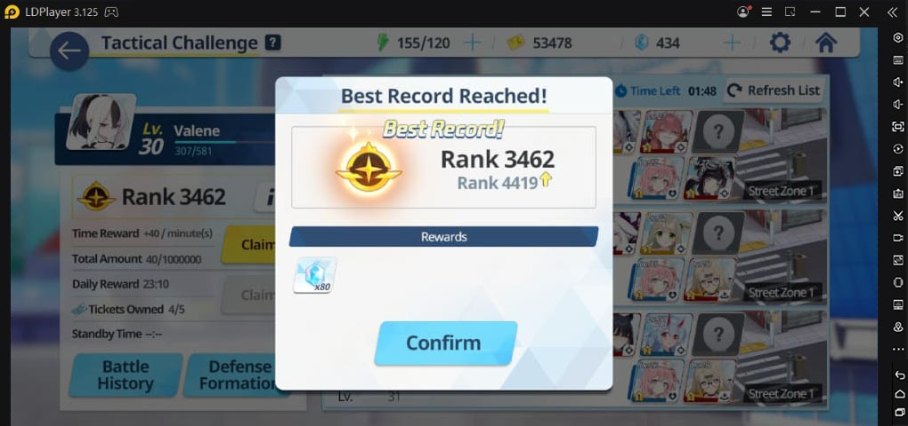{width="6.5in"
height="3.0590277777777777in"}

Oh iya, untuk kamu yang belum tahu caranya, kamu cukup klik kotak-kotak
yang ada di bagian kanan atas layar, pilih Account, setelah itu kamu
scroll sedikit ke bawah, pilih Coupon, dan masukan kodenya. Belum tahu
kodenya? Tenang, kami punya daftar kode untuk kamu copy dan paste,
hehehe.

-   ILUVU2021SENSEI

-   2021ARONACHAN

-   WELCOMETOKIVOTOS2021

Kode ini perlu kamu redeem di bulan ini, jadi jangan sampai kelewatan
supaya kamu tidak menangis karena tidak dapat pyroxene gratis, ya!

Mudahnya farming untuk menaikkan level

Seperti yang kita ketahui, menaikkan level adalah basic knowledge yang
harus kamu sebagai player lakukan agar waifu kamu semakin powerful dan
tidak mudah tewas di dalam battlefield.

Meski menaikkan level akun bukan hal yang mudah, beda ceritanya dengan
menaikkan level waifu, baik level secara umum, skill, maupun equipment.
Dari ke tiga bagian penting tersebut, hanya satu yang perlu kamu takuti
yaitu, habisnya Credit kamu karena keasyikan saat menaikkan level para
waifu tersebut.

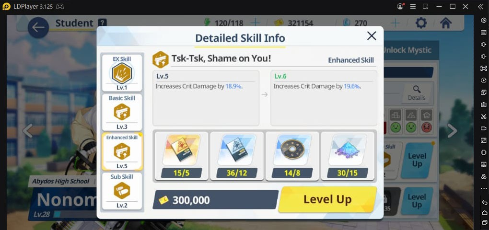{width="6.5in"
height="3.0590277777777777in"}

Untungnya, jika APmu masih banyak, kamu masih bisa masuk ke dalam stage
baru atau jika kamu sedang malas, kamu bisa melakukan sweeping di level
sebelumnya. Selain untuk menambah Credit, equipment yang didapat juga
bisa jadi cukup untuk menaikkan level para waifu imut yang kamu miliki
tersebut. Kamu bisa baca di bawah ini, kenapa kamu tidak boleh
meremehkan Credit dan AP.

Awalnya diragukan, akhirnya dibutuhkan

Memang banyak game yang akan sangat dermawan pada kamu, tidak terkecuali
Blue Archive. Sebagai player baru, kamu akan mendapat banyak AP dan
Credit, bahkan AP yang kamu dapatkan bisa melewati batas sehingga kamu
bingung harus digunakan untuk apa AP dan Credit sebanyak itu di
early-game.

Spending AP

Supaya tidak semakin gundah gulana, berikut kami rangkum beberapa solusi
bagaimana cara spending AP dengan baik berdasarkan pengalaman pribadi.

-   Gunakan untuk sweeping

Eits, hanya gunakan cara ini jika kamu stuck di sebuah stage dan kamu
belum bisa menaikkan level para waifu kamu karena terbatas oleh level
akunmu. Dengan melakukan sweep, kamu bisa mendapat banyak EXP dan
item-item penting lainnya yang bisa kamu gunakan untuk menaikkan level
skill atau equipment dari waifu-waifu imut kamu. Tapi sweep hanya bisa
dilakukan setelah kamu menuntaskan tiga bintang di stage tersebut, ya!

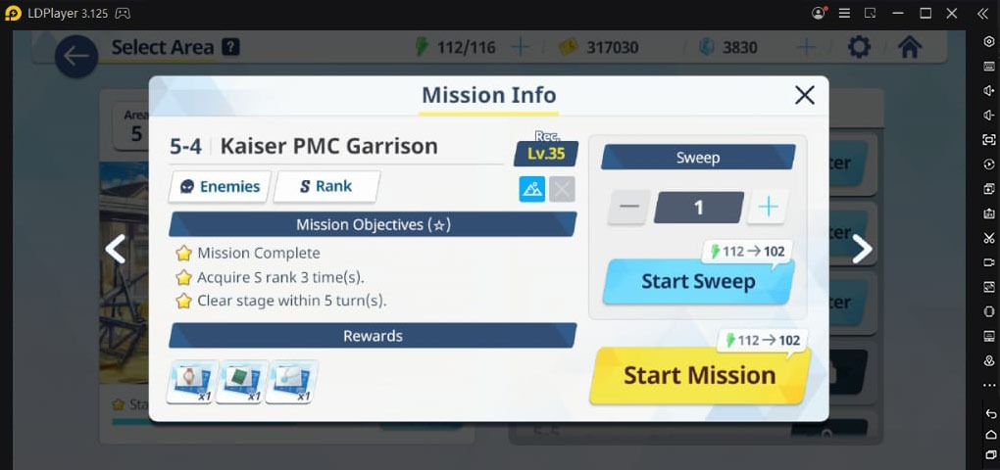{width="6.5in"
height="3.0590277777777777in"}

-   Farming demi kemajuan para waifu

Sama seperti yang di atas, hanya saja cara ini kamu lakukan dengan
memfokuskan item mana yang kamu butuhkan. Kamu bisa pilih shortcut
menuju stage tersebut dan kamu akan dihadapkan dengan dua opsi, sweeping
atau enter stage.

Jika item sudah terkumpul tentu waifu kamu akan semakin kuat dan kamu
juga akan menjadi sumringah melihat kemajuan para waifu kesayangan kamu.

Tabung Credit dengan baik

Berbeda dengan AP yang akan selalu dalam posisi charging jika berada di
bawah batas, Credit sebagai alat pembayaran kamu di game ini tidak akan
bertambah meski kamu offline. Meski di awal game kamu merasa sangat kaya
karena banyaknya credit, tanpa kamu sadara Credit itu akan hilang
sedikit demi sedikit karena semakin banyaknya waifu yang butuh perhatian
kamu.

Untuk itu, perhatikan jumlah Credit yang kamu miliki agar kamu tidak
kewalahan jika ingin menaikkan level waifu kamu. Kamu juga bisa
melakukan beberapa cara sederhana di bawah untuk mendapat Credit,
silakan disimak!

-   Ambil dari cafe

Selain untuk melihat betapa imutnya versi chibi dari waifu kamu, kamu
juga bisa melakukan farming Credit dan AP di dalamnya dengan mengeklik
bagian kanan bawah layar.

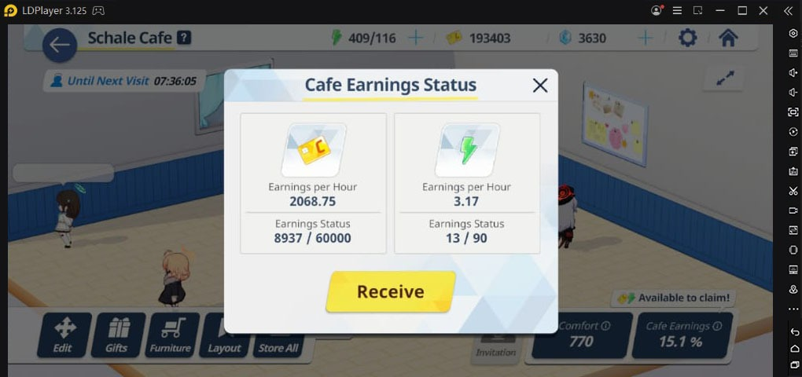{width="6.5in"
height="3.0590277777777777in"}

-   Farming langsung di commission

Cara yang sangat obvious dari awal ini bisa kamu lakukan, jika kamu
malah melanjutkan stage karena terlihat sulit, kamu juga bisa melakukan
sweeping dengan catatan kamu sudah mendapat tiga bintang di stage
tersebut.

-   Menyelesaikan stage dan misi

Tentu saja yang satu ini harusnya kamu sebagai player sudah tahu karena
menyelesaikan stage dan misi untuk mendapat uang di dalam game adalah
basic knowledge.

Club yang entah apa benefitnya

Yang satu ini juga sangat disayangkan karena kalau di game RPG lainnya,
guild, clan, atau club menjadi bagian wajib untuk menaikkan statistik
waifu kamu. Di Blue Archive, setelah kamu bergabung ke dalam club, hal
yang bisa kamu lakukan hanyalah bercengkerama dan mengambil jatah AP
setiap harinya.

Bahkan untuk mengecek profil teman satu club pun kamu tidak bisa,
padahal dengan melihat formasi dari player lain bisa menjadi acuan kamu
untuk mengembangkan power dari waifu kamu atau pun memilih waifu yang
worth it untuk masuk ke sebuah unit. Semoga ke depannya akan ada
perubahan dari fitur yang satu ini.

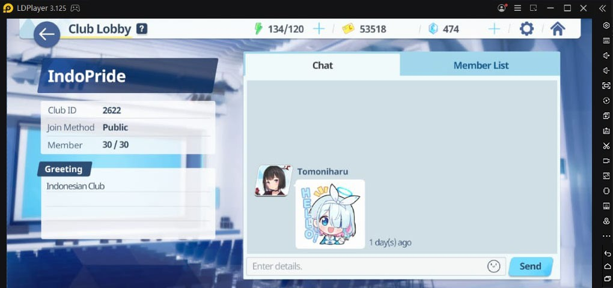{width="6.5in"
height="3.0590277777777777in"}

Sistem relationship yang lucu

Seperti beberapa game RPG yang mengandalkan kelucuan karakternya, Blue
Archive memberi kamu tempat untuk kamu meningkatkan hubungan kamu dengan
para waifu kamu seperti Cafe dan Lesson. Hanya dengan satu klik, kamu
berkesempatan mendapat poin relationship yang bisa juga untuk menaikkan
statistik dari waifu kamu tersebut.

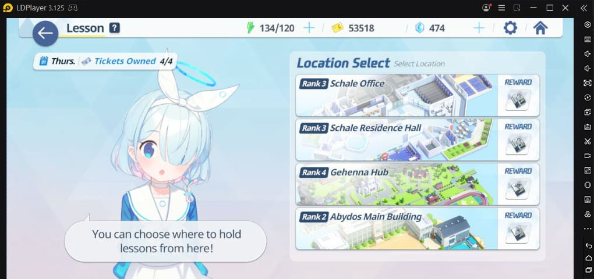{width="6.5in"
height="3.0590277777777777in"}

Saat relationship kamu dengan waifu sudah naik level, kamu bisa pindah
ke momo talk, berbincang dengan waifu kamu, pergi ke scene dengan waifu
tersebut (bisa kamu skip), dan mendapat pyroxene! Hore!

Shop dan penjaganya yang pemalu

Kalau kamu butuh item-item atau pun eligma untuk membuka level mystic
dari waifu kamu, kamu bisa datang ke Angel 24 atau shop untuk
berbelanja.

Kamu akan disambut oleh Sora, penjaga toko imut yang pemalu, sayangnya
dia tidak akan menawarkan diskon harga untuk barang-barang yang ada di
toko tersebut.

Tidak ada hal menarik lain di shop ini selain betapa imutnya Sora saat
ia dengan malu menyambut kedatangan kamu sebagai Sensei yang ingin
berbelanja. Hati-hati, ya, sobat, Sora masih di bawah umur!

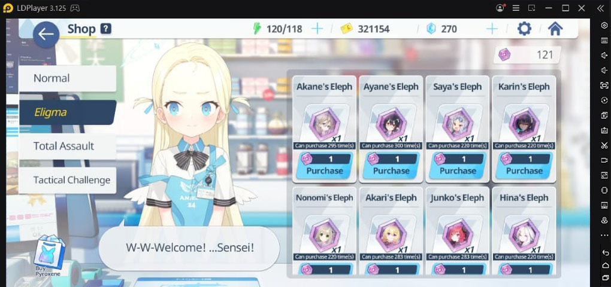{width="6.5in"
height="3.0590277777777777in"}

Mainkan Blue Archive di PC

Kamu ingin video call dengan pasangan sambil bermain game ini di android
kamu? Jangan harap kamu bisa bermain game tersebut dengan lancar karena
layar game ini akan sedikit crash jika kamu memilih melakukan ke dua hal
tersebut secara bersamaan. Apa itu tandanya game ini mencintai kaum
jomblo? Bisa jadi.

Untuk itu, kami datang membawa solusi apik nan menarik untuk kamu coba
yaitu, dengan menginstall emulator game android LDPlayer ke laptop atau
PC kamu dan unduh game Blue Archive ini. Jadi, kamu tetap bisa video
call tanpa terganggu layar yang crash, hal ini tidak menjamin pasangan
kamu tidak akan marah karena kamu terlalu asyik bermain game.
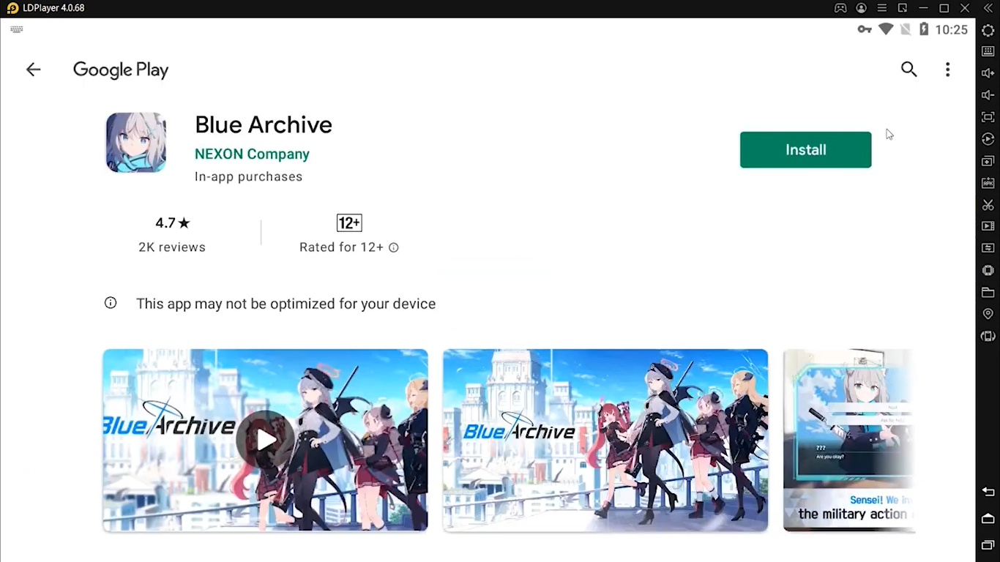{width="6.5in"
height="3.654166666666667in"}

Kesimpulan

Secara keseluruhan, game ini sudah pantas diberi rating 4.8 dari 5.
Kalau kamu tidak setuju, kamu harus lihat betapa lucunya versi chibi
dari waifu-waifu kamu berlari dan mengambil cover saat berada di dalam
battlefield, melihatnya saja sudah bikin hati meleleh. Apalagi setelah
selesai stage kamu akan dihadapkan dengan animasi ke empat waifu striker
kamu yang tak kalah gemasnya dari saat mereka masih di battlefield.
Meski sistem gacha game ini masih perlu sedikit perubahan, sih.

Oh iya, dari semua waifu yang digadang-gadang masuk ke dalam tier S
alias kelas tinggi, hanya Tsubaki yang menurut kami sangat-sangat worth
it untuk kamu miliki. Role tank yang bisa self-healing tentulah sangat
membantu unit kamu. Bukan berarti yang lain tidak bagus, ya. Hanya saja,
kamu harus realistis dengan tingkat keberuntungan kamu dalam melakukan
gacha, tidak perlu memaksakan diri. Apalagi kamu bisa mendapat gratis
1200 pyroxene setiap kali ada maintenance, jadi kamu bisa melakukan
gacha kapan saja, betul tidak?

Sudah tertarik untuk memainkan game ini atau malah sudah memainkannya
dan semakin bersemangat untuk bermain? Apapun itu, jangan sampai kamu
kehilangan kesempatan mendapat banyak pyroxene di bulan ini agar kamu
bisa mendapat waifu idaman kamu di Blue Archive, ya! Selamat bermain!
