Mainkan Magic Chess di PC : Arcade yang Seru dari Mobile Legends : Bang
Bang

Kamu semua pasti sudah merasakan serunya bermain Mobile Legends : Bang
Bang atau ML ini, tapi kamu sudah tahu belum, sih, kalau game ini punya
section yang bernama Arcade di mana kamu bisa bermain menggunakan hero
favorit kamu dengan gaya permainan yang berbeda dari biasanya? Jadi di
bagian Arcade ini kamu bisa melihat ada bermacam tipe permainan yang
akan Moonton ganti di waktu yang tidak ditentukan.

Arcade ini terdiri dari permainan di antaranya, Mayhem, Survival,
Chess-TD, Mirror, dan yang paling lama dipasang oleh Moonton yakni,
Magic Chess. Kalau kamu pernah memainkan game seperti Chess Rush, kamu
tidak akan asing lagi dengan game arcade seperti Magic Chess ini. Dengan
meletakan hero milikmu di arena, kamu hanya perlu menunggu giliran dan
melihat para hero bertarung, jika menang, kamu akan bergerak ke babak
selanjutnya. Tanpa berlama-lama lagi, kami akan memberi ultimate guide
untuk kamu yang ingin bermain Magic Chess ini, yuk!

Tips di arena pertarungan

Sebelum masuk untuk bertarung dengan tujuh player lain, kamu akan
memilih satu tipe hero dari sebelas tipe yang sudah disediakan. Kamu
bisa memilih tipe hero manapun selama tipe itu belum dipilih oleh player
lain. Setelah kamu memilih dan masuk ke arena pertarungan kamu akan
langsung mendapat tiga hero yang kualitasnya berbeda-beda.

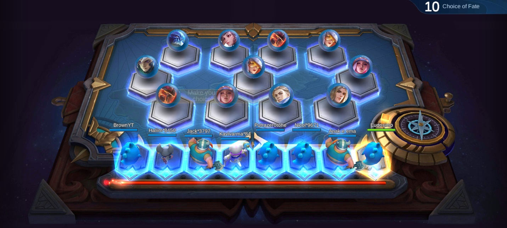{width="6.5in"
height="2.925in"}

Perhatikan kualitas hero

Nantinya akan lima tipe hero dengan kualitas yang dibedakan melalui
jumlah koin yang diperlukan. Hero dengan lima koin memiliki kualitas
tertinggi dengan background warna kuning, hero empat koin memiliki
background warna ungu, hero tiga koin memiliki warna biru, hero dua koin
memiliki background warna hijau, dan hero dengan satu koin memiliki
background berwarna putih. Kalau kamu mendapat hero yang sama sampai
tiga kali, kamu bisa meningkatkan kualitasnya menjadi bintang dua. Untuk
sampai ke bintang tiga, kamu butuh sembilan hero yang sama.

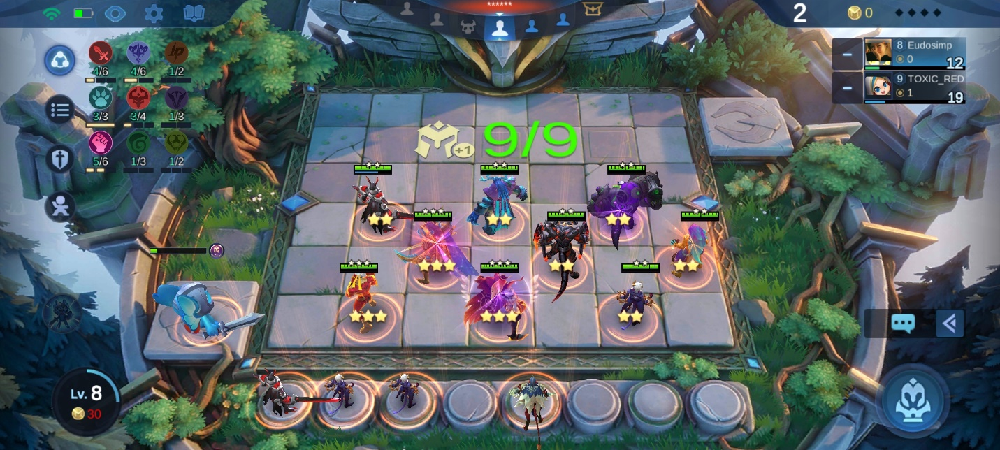{width="6.5in"
height="2.925in"}

Dengan adanya perbedaan kualitas tersebut pastinya ada perbedaan pula
pada daya damage yang diberikan oleh para hero. Perlu diperhatikan kalau
kamu memiliki hero satu koin dengan kualitas bintang dua, hero tersebut
akan tetap kalah ketika berhadapan satu lawan satu dengan hero tiga koin
yang belum berbintang karena daya damage yang diberikan jauh berbeda.
Kamu bisa pilih hero mana yang ingin kamu fokuskan dengan memberi buff
yang kamu dapat ke pada hero tersebut.

Jangan boros koin

Koin menjadi item yang sangat penting di dalam Magic Chess, tanpa koin,
kamu tidak bisa membeli hero, mereset toko untuk mencari hero yang kamu
butuhkan ataupun menambah slot hero di dalam arena. Setiap kamu memiliki
sepuluh koin, interest kamu akan bertambah dan jumlah koin yang kamu
dapatkan di setiap stage juga akan bertambah. Usahakan kamu tidak
gegabah dalam mereset toko, tunggulah sampai babak selanjutnya dan toko
itu bisa reset dengan sendirinya.

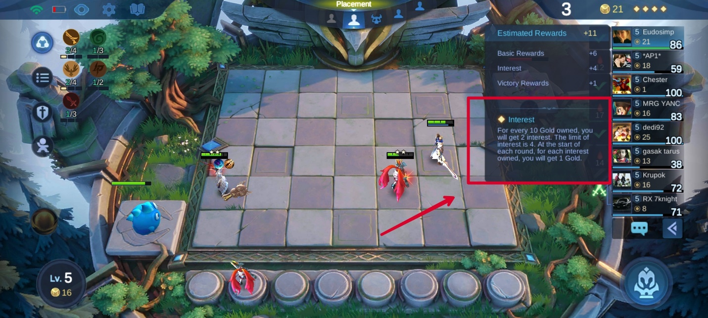{width="6.5in"
height="2.925in"}

Pastikan juga kamu punya cukup slot untuk menyimpan hero, di game ini,
kamu sudah disediakan delapan slot untuk hero yang belum kamu masukkan
ke dalam arena. Kalau kamu membeli hero saat slot kamu sudah penuh, hero
tersebut akan tersimpan di slot tambahan sementara dan akan terjual
otomatis saat babak sudah berganti. Kamu juga bisa mengunci toko supaya
saat babak berganti, toko tersebut tidak akan reset dan kamu tetap bisa
membeli hero yang kamu butuhkan.

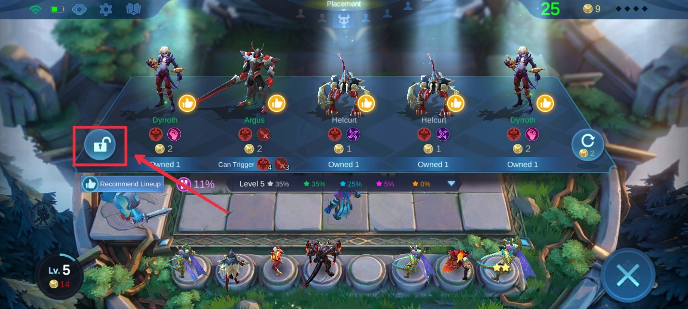{width="6.5in"
height="2.925in"}

Kalau kamu ingin lebih banyak koin, kamu bisa menambahkan sinergi Los
Pecados agar tiap kali hero kamu membunuh hero musuh, kamu akan mendapat
satu koin tambahan dan tentunya meningkatkan kesempatan kamu mendapat
interest.

Membentuk tim dan rekomendasi tipe hero

Sejauh ini belum ada hal bisa memastikan kemenangan kamu hingga akhir,
tapi kamu bisa mengikuti line-up meta yang bisa kamu lihat di bagian
kiri bawah toko. Pilih line-up favorit kamu dan kamu cukup membeli hero
yang diberi tanda ibu jari. Kalau kamu beruntung, kamu akan mendapat
jenis hero yang sama sampai sembilan kali dan kamu akan sangat
mengintimidasi lawan kamu dengan hero berbintang tiga tersebut.

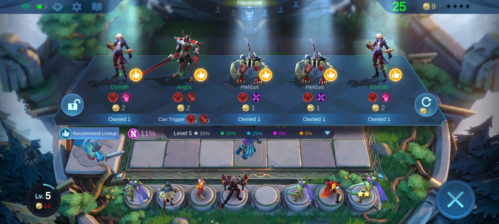{width="6.5in"
height="2.925in"}

Posisikan setiap hero kamu di tempat yang kamu rasa cocok, perhatikan
pula gaya serang dari hero-hero tersebut seperti assassin yang akan
terbang langsung ke garis belakang pertahanan lawan dan menyiksa hero
musuh yang lemah. Untuk defense, kamu bisa meletakkan hero seperti mage
atau marksman di bagian tengah line-up kamu dan lindungi mereka dengan
fighter atau tank supaya tidak cepat mati.

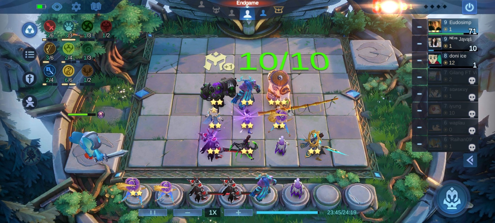{width="6.5in"
height="2.925in"}

Kami merekomendasikan kamu memilih hero dengan tipe wrestler seperti
Aldous, selain karena sinergi wrestler yang memiliki 25% kesempatan stun
terhadap musuh, Aldous juga memiliki damage fisik yang besar saat
melakukan ultimate. Aldous tanpa bintang saja sudah mengancam apalagi
sudah berbintang dua, dan jangan kamu menanyakan lagi seramnya Aldous
saat sudah berbintang tiga.

Kamu bisa membentuk sinergi weapon master supaya HP dari semua hero kamu
bisa bertambah sebanyak 25% dari damage yang diberikan. Hero dengan tipe
weapon master yang sangat direkomendasikan tentunya yang berkoin tiga ke
atas seperti Alucard, Freya, dan Thamuz. Psst, Thamuz tak berbintang
sudah bisa mengalahkan hero koin satu sampai tiga berbintang dua
sendirian, lho.

Perhatikan juga jika hero kamu mendapat blessing saat dinaikkan ke
bintang dua. Manfaatkan sinergi dari blessing tersebut dengan menaruh
hero yang lain dengan tipe yang sama agar kamu mendapat buff dan tim
kamu menjadi semakin kuat.

Kamu harus hati-hati saat memindahkan hero, pengalaman pribadi
mengatakan kamu bisa misclick dan bukannya memindahkan hero, kamu malah
menjual hero tersebut. Tentunya hal tersebut bisa sangat menyakitkan dan
menurunkan mood kamu untuk melanjutkan permainan. Supaya kejadian
seperti ini tidak terjadi pada kamu, kamu bisa mengunduh emulator game
android LDPlayer ke laptop atau PC kamu, dengan begitu kamu akan
terhindar dari misclick karena tombol dari laptop atau PC kamu akan
mempermudah kamu dalam bermain.

Fate box

Saat seluruh stage di sebuah babak sudah kamu lewati, kamu dan player
lain yang masih bertahan akan dipindahkan ke fate box di mana kamu dan
player lain akan mendapat giliran untuk memilih buff atau pun hero koin
empat dan lima. Saran kami di babak pertama atau early-game, biarkan tim
kamu kalah sampai darah dari commander kamu menjadi yang paling kecil
karena semakin sedikit darah commander kamu, semakin duluan kamu
mendapat giliran untuk memilih item di fate box.

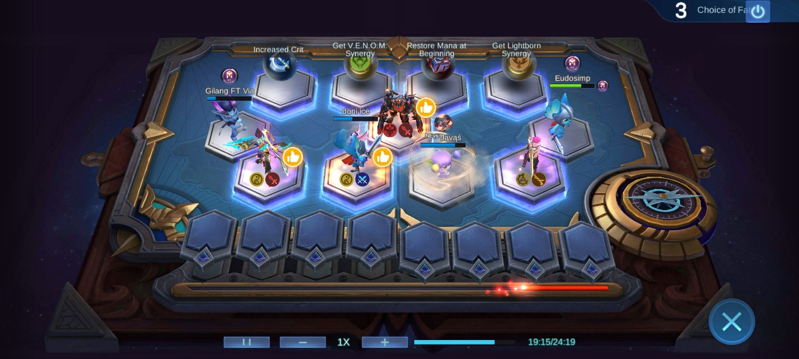{width="6.5in"
height="2.925in"}

Jika kamu masih berada di stage awal, pilihlah buff terlebih dahulu
untuk memperkuat hero yang sudah ada, kalau kamu memilih hero, kamu bisa
kekurangan slot untuk menyimpan hero saat di toko nanti kamu melihat ada
hero yang kamu butuhkan.

Saat sudah dekat dengan end game, kamu bisa memilih untuk menambah slot
hero di arena agar power kamu bertambah setelah menaruh satu hero, tapi
pastikan sinerginya cocok, ya. Kamu juga bisa memilih hero yang kamu
butuhkan di fate box. Hero koin lima dan empat sudah sangat kuat jika
sudah berbintang dua.

Commander

Selain hero yang menjadi pemeran utama di dalam game, kamu juga akan
mempunyai commander yang memiliki tiga tipe buff tersendiri. Commander
gratisan seperti Harper punya buff awal yang bernama warrior's will di
mana Harper akan mengurangi tiga poin damage dari lawan saat tim kamu
kalah.

Setiap buff memiliki efek dan CD yang berbeda-beda. Semua buff dari
commander Harper adalah defense, dengan warrior's will sebagai buff
paling unik karena tidak memiliki CD alias cool down sama sekali.

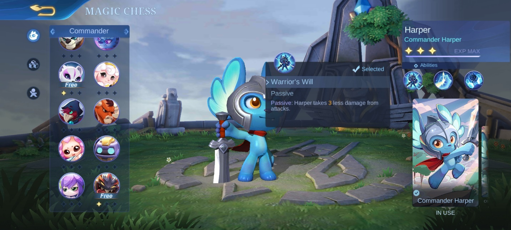{width="6.5in"
height="2.925in"}

Kalau kamu tidak puas dengan fate box yang hanya membolehkan kamu
memilih satu dari sekian banyak item yang ada, kamu bisa memilih
commander Connie yang akan memberi kamu satu kesempatan lagi untuk
memilih setelah semua player mendapat bagian yang mereka inginkan.

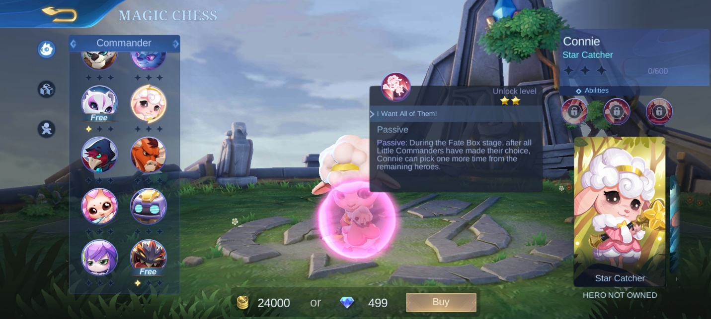{width="6.5in"
height="2.925in"}

Tipe commander tidak akan terlalu berpengaruh ke permainan, pilihlah
yang kamu rasa cocok dengan gaya permainan kamu ataupun yang kamu rasa
lucu saat dilihat agar mood kamu bertambah.

Tipe sinergi

Kamu bisa membuka galeri di magic chess untuk melihat tipe sinergi yang
dibagi menjadi dua yakni, role dan faction. Setiap hero memiliki minimal
dua sinergi. Sinergi ini akan memberi kamu buff untuk semua hero yang
kamu taruh di arena maupun hero dengan tipe yang sama.

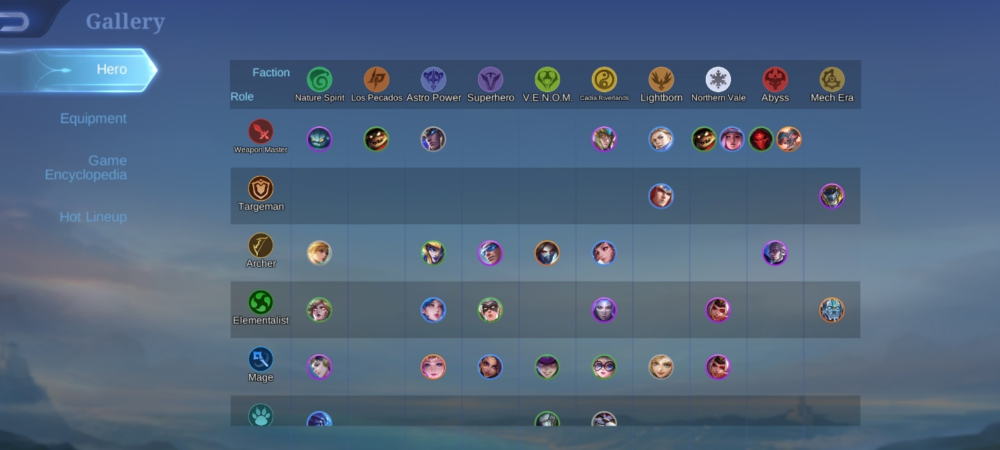{width="6.5in"
height="2.925in"}

Nature spirits akan kami jadikan sinergi yang perlu kamu hindari karena
defense mereka akan bergantung pada satu hero yang paling tebal dan jika
hero itu mati maka semua hero milik kamu ikut mati seketika. Tapi hal
ini bisa kamu akali dengan menambah HP ataupun defense pada hero yang
tebal tersebut.

Role weapon master akan sangat mematikan saat disandingkan dengan
faction Cadia Riverlands, jika kamu memasang Zilong ke dalam arena, efek
dari weapon master yang terus menerus menambah darah sesuai damage dan
efek Cadia Riverlands yang memberi shield serta attack speed tiap kali
ada hero dari tim kamu yang mati tentu akan membuat Zilong menjadi
ancaman besar di dalam permainan.

Equipment

Saat kamu selesai melawan monster, kamu akan mendapat buff dalam bentuk
equipment. Item yang kamu dapat bisa berjumlah dua jika kamu beruntung.
Pilihlah yang kamu rasa cocok dengan hero yang sedang kamu pasang di
arena. Misalnya, jika kamu memasang hero fisikal seperti Aldous, kamu
bisa memilih demon hunter sword, golden staff, ataupun item fisikal
lainnya yang memberi attack speed. Tapi sebaiknya kamu memilih item
defense seperti blade armor di early-game supaya hero kamu tidak mudah
mati.

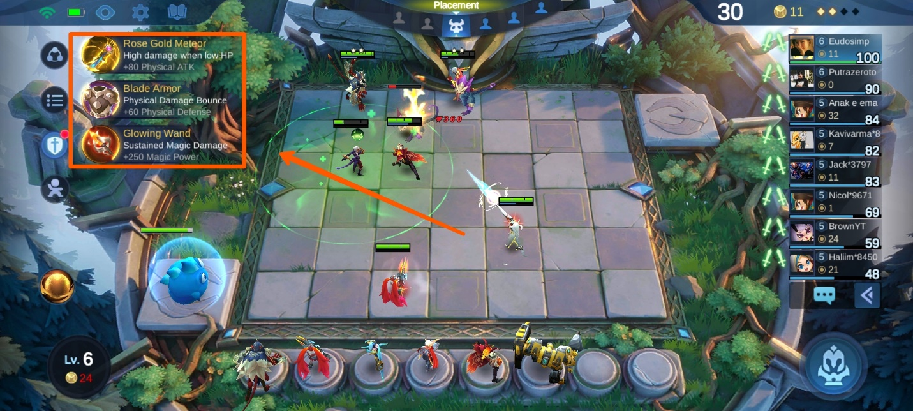{width="6.5in"
height="2.925in"}

Jika kamu sedang membentuk tim dengan sinergi mage, tentu equipment
magic harus menjadi pilihan utama kamu, pasanglah di hero seperti
Chang'e yang damage-nya sangat besar saat ultimate. Enchanted talisman
akan menjadi favorit karena magic power yang diberikan menjadi yang
paling besar di antara equipment magic lainnya.

Di early-game kamu hanya akan mendapat equipment function yang biasanya
terdiri dari revitalize, petrify, inspire, purify, dan flicker. Pilihlah
yang paling cocok dengan hero yang kamu ambil, jika kamu bingung, kamu
bisa pilih revitalize yang memberi darah saat hero kamu sudah sekarat.

Kesimpulan

Bukan hal baru jika game penuh strategi seperti ini menuntut kamu untuk
bersabar dan memperhitungkan pergerakan yang akan kamu ambil. Apalagi
kamu hanya menunggu Dewi Fortuna memberi kasih sayangnya pada kamu agar
kamu mendapatkan hero maupun item yang sangat kamu butuhkan di dalam
permainan. Jika kamu kalah, main lagi adalah kunci untuk menambah
pengalaman dan pengetahuan kamu tentang permainan Arcade dari Mobile
Legends : Bang Bang ini.

Jika rasa penasaran kamu semakin tinggi bagaimana jika kamu menggunakan
sinergi lain, teruslah bermain dan kamu juga bisa menggunakan laptop
maupun PC kamu dengan cara mengunduh emulator game android LDPlayer.
Pengalaman bermain kamu dijamin semakin seru dan kamu akan terhindar
dari misclick. Tunggu apalagi? Ayo rasakan serunya Magic Chess di laptop
atau PC kamu!
